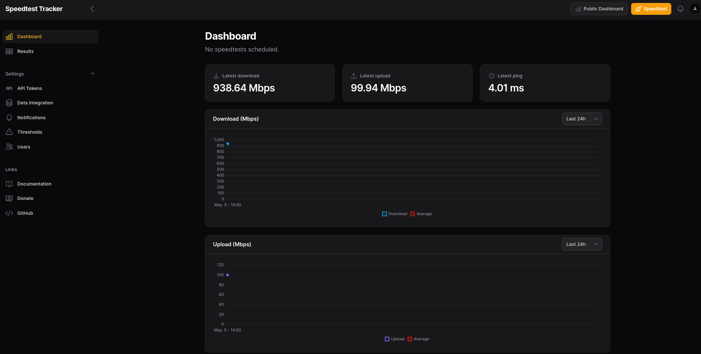
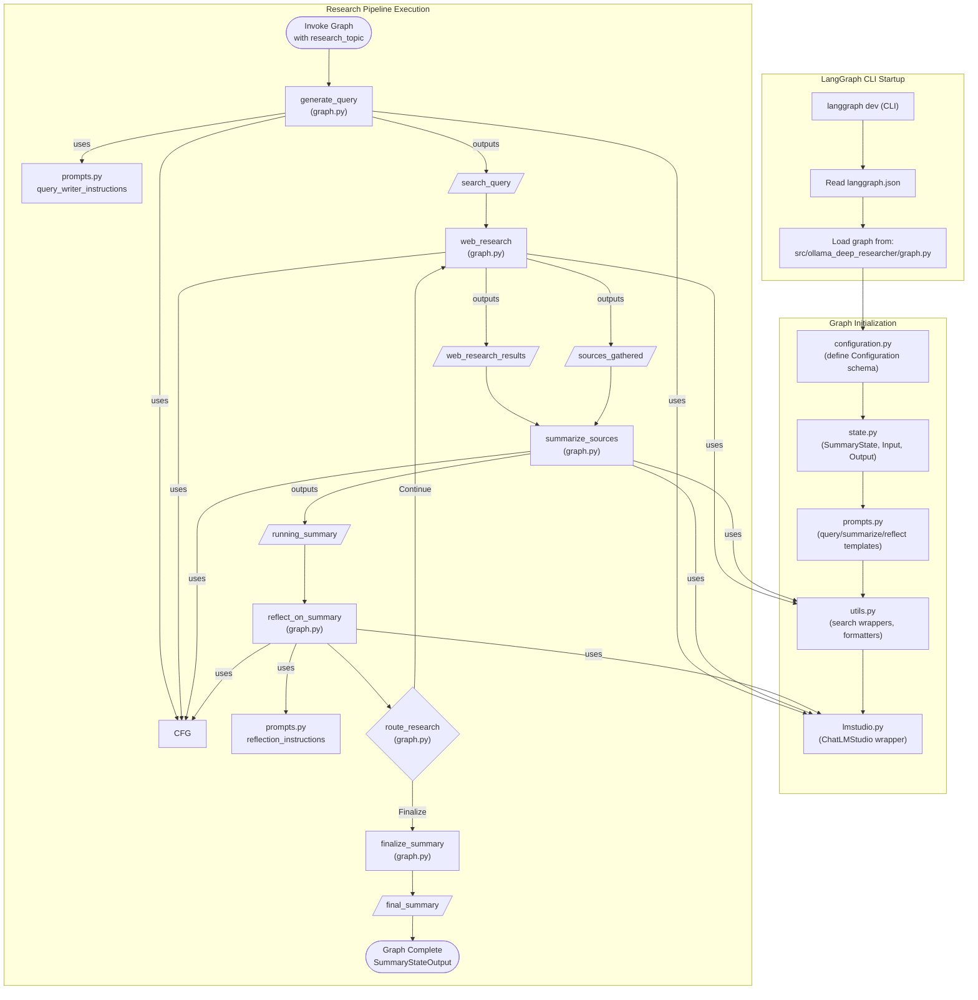

Ive been following closely the newsletter from: https://selfh.st/icons/

And these have taken my attention: 

1. https://github.com/karakeep-app/karakeep

> aGPL |  A self-hostable bookmark-everything app (links, notes and images) with AI-based automatic tagging and full text search 

A replacement for raindrop....

2. https://github.com/vijeeshr/quickretro

> MIT |  A real-time app for conducting a remote sprint retrospective meeting 

Having retrospective is really important when working Agile...

3. https://github.com/formsmd/formsmd

> Apache v2 |  Developer-first, open source Typeform alternative (formerly known as Blocks.md) 

An interesting alternative also to formbricks


  
  


4. https://github.com/donaldzou/WGDashboard?ref=selfh.st

https://jalcocert.github.io/JAlcocerT/travel-router-gl-mt3000-review/
https://jalcocert.github.io/JAlcocerT/how-to-use-wg-easy-with-a-vps/


5. https://github.com/Bubka/2FAuth?ref=selfh.st

As I recently had some trouble with my phone...


6. https://github.com/besoeasy/file-drop?ref=selfh.st


filebrowser alternative!

7. BYOD, I mean bring your own music https://github.com/swingmx/swingmusic?ref=selfh.st

8. https://github.com/tiagorangel1/cap?ref=selfh.st

>  Cap is a lightweight, modern open-source CAPTCHA alternative designed using SHA-256 proof-of-work 

9. Wordpres...but static sites? https://github.com/nityam2007/StaticPress-Docker?ref=selfh.st

## New SelfH Apps


### Termix

Termix, not termux, its being great:

* https://github.com/LukeGus/Termix
  * https://github.com/LukeGus/Termix/wiki/Docker

> MIT |  Clientless web-based SSH terminal emulator that stores and manages your connection details 

<!-- https://www.youtube.com/watch?v=s15a-ysSQE0 -->





  


```yml
services:
  termix:
    image: ghcr.io/lukegus/termix:latest
    container_name: termix
    restart: unless-stopped
    ports:
      - "8090:8080"
    volumes:
      - termix-data:/app/data
    environment:
      # Generate random salt here https://www.lastpass.com/features/password-generator (max 32 characters, include all characters for settings)
      SALT: "something_generated"
      PORT: "8080"

volumes:
  termix-data:
    driver: local
```

You can use it to manage devices on the same local network:

```sh
#arp -a
arp -a | grep "192.168.1" #filtered to avoid containers
#ip neigh
#nmap -sP 192.168.1.1/24 | grep "scan"
```

But also the ones **via tailscale**, even if they are outside your home network:

```sh
sudo tailscale status | grep -v "offline"
```

You can measure the temp of a distant Pi:

```sh
vcgencmd measure_temp pmic
#docker system prune -a #or clean its unused container space
```

### CheckMate

https://github.com/bluewave-labs/checkmate
https://checkmate.so/


> agpl | Checkmate is an open-source, self-hosted tool designed to track and monitor server hardware, uptime, response times, and incidents in real-time with beautiful visualizations.


### Publiteme

* https://github.com/MikeMather/publite.me

https://www.youtube.com/watch?v=yAJvbF-m5FM


### Recap from Spring 2025

I was covering recently nextcloud...


and found out about OpenCloud:

https://www.youtube.com/watch?v=Ud9FEmNOgLs

https://github.com/opencloud-eu/opencloud

> Apache v2 | This is the main repository of the OpenCloud server. It contains the golang codebase for the backend services.


### I needed recently...


* https://speed.cloudflare.com/


Speedtest CLI from Ookla®





  


See that its running with:

```sh
curl 192.168.1.11:8065/api/healthcheck
```


It has influxDB 2.0 integration, inc ase that you want to use this with Grafana. Also integrations with: tg, webhooks, gotify, ntfy,...



## Analytics Stuff

* https://github.com/chartbrew/chartbrew
* https://docs.chartbrew.com/deployment/run-on-docker#run-on-docker
* https://raw.githubusercontent.com/chartbrew/chartbrew/refs/heads/master/docker-compose.yml

>  Open-source web platform used to create live reporting dashboards from APIs, MongoDB, Firestore, MySQL, PostgreSQL, and more 📈📊 

Which resonates with my recent post: https://jalcocert.github.io/JAlcocerT/setup-bi-tools-docker/

## Conclusions

Lately I got to know about couple of new VectorDBs:

* https://github.com/milvus-io/milvus

>  Milvus is a high-performance, cloud-native vector database built for scalable vector ANN search 

* https://github.com/pgvector/pgvector

>  Open-source vector similarity search for Postgres 


  


* https://github.com/hollowpnt92/docker-port-viewer?ref=selfh.st
https://github.com/hollowpnt92/docker-port-viewer/blob/main/docker-compose.yml

```sh
docker run -d --name docker-socket-proxy -e CONTAINERS=1 -e POST=0 -e PUT=0 -e DELETE=0 -v /var/run/docker.sock:/var/run/docker.sock:ro tecnativa/docker-socket-proxy && docker run -d --name docker-port-viewer --link docker-socket-proxy -p 3003:80 hollowpnt/docker-port-viewer:latest
```

### Better WebAnalytics

Lately I tried littlyx, but I saw this cool post: https://jakubwolynko.eu/blog/202505-hosting-umami-on-vercel/

Also, https://github.com/Litlyx/litlyx which i discovered few months back


### Automated Projects Docs

Wouldnt it be great to have a project documentation automatically and AI generated?

<!-- 
https://git.exadel.com/exadel-ai-practice/accelerator/project-documentation-generator
 -->


* OpenAI API Keys - <https://platform.openai.com/api-keys>
* Anthropic - <https://console.anthropic.com/settings/keys>
* Groq - <https://console.groq.com/keys>
* For [Ollama](https://github.com/JAlcocerT/Docker/tree/main/AI_Gen/Ollama), you need [this setup](https://fossengineer.com/selfhosting-llms-ollama/)

1. RepoReader


  
  



```sh
git clone https://github.com/JAlcocerT/RepoReader

python3 -m venv .venv
source .venv/bin/activate

pip install -r requirements.txt
source .env

python3 app.py
#An error occurred: The model `text-davinci-003` has been deprecated, learn more here: https://platform.openai.com/docs/deprecations
```

But...it used davinci model which was deprecated: https://platform.openai.com/docs/deprecations#instructgpt-models

So I had to vibe code a little bit with codex to fix it:


But...I feel its already superseeded few times by other tools.

2. Scrapping with FireCrawl + OpenAI

I also tried with Firecrawl and OpenAI to give me some readme/ [sample posts](https://github.com/JAlcocerT/Scrap_Tools/blob/main/FireCrawl/Z_Scrap_GHRepo/z_sample_post.md) about a given project:


  
  



3. LangChain Web content embedd (to ChromaDB) + ask on that context:

In the meantime I discovered that it is also possible to [ask questions about a Web's content with LangChain](https://jalcocert.github.io/JAlcocerT/comparing-rag-and-use-cases/#web-scrapping), for example, [a repository's readme info](https://github.com/JAlcocerT/Data-Chat/tree/main/LangChain/web):

```py
    ###Change these parameters and lets go###
    ollama_url = "http://192.168.1.5:11434"  # Replace with your Ollama server URL if different
    embedding_model = "all-minilm"
    llm_model = "llama3.2:1b"
    #user_question = "what it is this offer about?"
    user_question = "what it is this repository about?"
    #target_website = "https://justjoin.it/job-offer/link-group-product-manager-warszawa-ai"
    target_website = "https://github.com/JAlcocerT/Streamlit-MultiChat"
    #content_area_class = "MuiBox-root css-rcazos" # Use the same class as in the example
    content_area_class = "markdown-body entry-content container-lg"
```

Its possible to use few LLMs to get the reply, tried with local models via Ollama, OpenAI and Groq APIs.


<!-- https://github.com/JAlcocerT/Data-Chat/blob/main/LangChain/web/langchain-chroma-web.ipynb
https://github.com/JAlcocerT/Data-Chat/blob/main/LangChain/web/langchain-chroma-repo-readme.ipynb
 -->

[](https://github.com/JAlcocerT/Data-Chat/blob/main/LangChain/web/langchain-chroma-repo-readme.ipynb)



It uses a [local ChromaDB](https://pypi.org/project/langchain-chroma/), Local embedding model and the LLM of your taste, via `LangChail.LLM`: [Ollama](https://github.com/JAlcocerT/Docker/tree/main/AI_Gen/Ollama), [OpenAI](https://python.langchain.com/api_reference/openai/llms/langchain_openai.llms.base.OpenAI.html#langchain_openai.llms.base.OpenAI)...





Based on the provided context, this repository is about creating a Streamlit Web App that allows users to chat with multiple large language models (LLMs) simultaneously, including OpenAI, Anthropic, Ollama, and Groq. 

The repository is called `Streamlit-MultiChat` and it features support for several LLMs, including:

- OpenAI (GPT 3.5, GPT4, GPT4o, GPT4o-mini)
- Anthropic (Claude 3, Claude 3.5)
- Ollama (Open Source Models)
- Groq API (LlaMa models using quick LPU inference)

The repository also includes documentation on how to get started, including:

- Cloning the repository and running the Streamlit Web App with API keys
- Exploring the project's features, such as SliDev presentations, ScrapeGraph, DaLLe, Streamlit Auth, and OpenAI as Custom Agents
- Deploying the project using Docker and Portainer

The repository is designed to be used with Python venvs, and it includes instructions on how to set up a venv, install dependencies, and run the Streamlit Web App.

To set up the project, you can follow these steps:

1. Clone the repository using `git clone https://github.com/JAlcocerT/Streamlit-MultiChat`
2. Create a new Python venv using `python3 -m venv multichat_venv` (for Linux) or `python -m venv multichat_venv` (for Windows)
3. Activate the venv using `source multichat_venv/bin/activate` (for Linux) or `multichat_venv\Scripts\activate` (for Windows)
4. Install the dependencies using `pip install -r requirements.txt`
5. Copy the API keys to the `.streamlit/secrets.toml` file
6. Run the Streamlit Web App using `streamlit run Z_multichat.py`

Alternatively, you can use the Docker image by running `docker pull ghcr.io/jalcocert/streamlit-multichat:latest` and then running the container using `docker run -p 8501:8501 ghcr.io/jalcocert/streamlit-multichat:latest




The problem with this approach is that the context is limited to one file only, the `readme.md` and also subject that class changes on the repository website will require a class review for bs4 to work.

We are missing for example the technologies split of the project, which are at `content_area_class = "BorderGrid about-margin"`

Once embedded, it will reply with both context provided: [](https://github.com/JAlcocerT/Data-Chat/blob/main/LangChain/web/langchain-scrap-repo-groq.py)

Whatever API you are using, remember that you can see the available models:

Once embedded, it will reply with both context provided: [](https://github.com/JAlcocerT/Streamlit-MultiChat/blob/main/Z_Tests/Z_API_Models_check.ipynb)


#### Local Deep Researcher

4. https://github.com/langchain-ai/local-deep-researcher


> MIT | Fully local web research and report writing assistant 

You will need to follow these steps and have [**ollama** ready](https://github.com/JAlcocerT/Docker/tree/main/AI_Gen/Ollama):

```sh
git clone https://github.com/JAlcocerT/local-deep-researcher #it was called ollama deep researcher before
```

Adjust the `.env` file with the search engine and local LLM to be used.

By default, duckduckgo dooes not require to have any API associated, and for the LLM you can use:

```sh
docker exec -it ollama sh
ollama pull deepseek-r1:8b
```

Once ready, run the project with UV:

```sh
uvx \
                 --refresh \
                 --from "langgraph-cli[inmem]" \
                 --with-editable . \
                 --python 3.11 \
                 langgraph dev
```

You will get a a firefox browser tab with the following diagram and place to ask questions:


<!-- https://youtu.be/sGUjmyfof4Q?t=568 -->






By default uses **[duckduckgo](https://pypi.org/project/duckduckgo-search/), with no API key required**. You will need one for SearXNG, Tavily or Perplexity


The dependencies are specified [here](https://github.com/JAlcocerT/local-deep-researcher/blob/main/pyproject.toml#L11)



 1. **LangGraph**
    – Declared in `pyproject.toml` (“langgraph>=0.2.55”)
    – Used to build the **research‐pipeline state-machine** in
      [src/ollama_deep_researcher/graph.py](https://github.com/JAlcocerT/local-deep-researcher/blob/main/src/ollama_deep_researcher/graph.py#L50)
    – The Dockerfile / CMD spins up the LangGraph dev server (via `langgraph-cli`)
2. LangChain (and its connectors)
    – Core runtime:   `langchain_core`
    – OpenAI connector, which is used for LMStudio:  `langchain_openai` / `openai`
    – [Ollama connector](https://python.langchain.com/docs/integrations/llms/ollama/):  `langchain_ollama`
    – Community extras:  `langchain-community`
    – You’ll see these imported in:
      • src/ollama_deep_researcher/lmstudio.py
      • src/ollama_deep_researcher/graph.py
3. Pydantic
    – For your typed configuration model (env‐driven settings)
    – Check out src/ollama_deep_researcher/configuration.py
4. Search-and-scraping utilities
    – HTTP clients: `httpx` & `requests`
    – HTML→Markdown: `markdownify`
    – **Search backends**: `duckduckgo-search`, `tavily-python`, `langchain-community`’s `SearxSearchWrapper`
    – All wired up in [src/ollama_deep_researcher/utils.py](https://github.com/JAlcocerT/local-deep-researcher/blob/main/src/ollama_deep_researcher/utils.py#L9)
5. Environment & CLI glue
    – `python-dotenv` for .env loading
    – `uv`/`uvx` (the “uv” package manager) + `langgraph-cli[inmem]` to launch the dev server (Dockerfile)




When you run:

```sh
langgraph dev #coming from the separated langgraph-cli tool
```
   
* https://langchain-ai.github.io/langgraph/cloud/reference/cli/
* https://pypi.org/project/langgraph-cli/
* https://github.com/langchain-ai/langgraph/tree/main/libs/cli/langgraph_cli

It spins up a little ASGI web‐server and opens the browser UI for you. Under the hood, the CLI uses:

* **FastAPI** (built on Starlette)
  – to expose the HTTP (and WebSocket) endpoints
  – serves the static “prebuilt” React app
* **Uvicorn**
  – as the ASGI server to actually run the FastAPI app
* **React** (TypeScript + Vite)
  – the single-page app you see in your browser, bundled into the `langgraph-prebuilt` package


All of your “business­-logic” lives in the `src/ollama_deep_researcher` folder.



The piece that LangGraph is actually serving (and that shows up in Studio as your state‐machine/UI) is the graph object exported from:


* `src/ollama_deep_researcher/graph.py` This is where you build your **StateGraph**:
      – add nodes (generate_query, web_research, summarize_sources, reflect_on_summary, finalize_summary)
      – wire up edges (including the route_research function that loops or finalizes)
      – compile into the graph that LangGraph Studio runs.

To change the flow of your LLM calls (add/remove/branch nodes, change loop logic), this is the file to edit.

Beyond that, there are three supporting “extension points” you’ll almost certainly want to tweak when you customize your LLM‐driven pipeline:

  1. **Prompts** `src/ollama_deep_researcher/prompts.py`
      - All of your JSON templates and instructions live here.
      - Adjust your system messages or output formats.
  2. **LLM‐wrapper classes** `src/ollama_deep_researcher/lmstudio.py` (and the use of `ChatOllama` in graph.py)
      - Swap in new providers or change temperatures, streaming modes, etc.
  3. **Configuration & utilities**
      - `src/ollama_deep_researcher/configuration.py` controls env-vars, defaults for model name, provider, loop count, etc.
      - `src/ollama_deep_researcher/utils.py` web-search implementations; strip tokens, format sources, etc.

If you ever need to go deeper—for example, to completely redesign the LangGraph Studio UI—you’d have to clone and modify the langgraph-cli repo (FastAPI + React/TypeScript).

The `graph.py` for the orchestration logic and `prompts.py` for what you ask the LLM to do.

The purpose of `state.py` is to define the “shape” of the **in‐memory state** that your LangGraph will carry around as it executes your research pipeline.

Concretely [the state file](https://github.com/JAlcocerT/local-deep-researcher/blob/main/src/ollama_deep_researcher/state.py) provides three dataclasses:

1. SummaryState
• This is your running state object.  It has fields for:
  – research_topic: the user’s original topic
  – search_query: the current query you asked the LLM to run
  – web_research_results: a list of the raw text results returned by each web_research node
  – sources_gathered: a list of the formatted source metadata you’ll feed into summaries
  – research_loop_count: how many times you’ve gone through the loop so far
  – running_summary: your accumulated summary text
• Notice that web_research_results and sources_gathered are wrapped with
  Annotated[..., operator.add].  That tells LangGraph that whenever a node returns a new list for one of those fields, it should do `old_list + new_list` (i.e.
append) rather than overwrite.
2. SummaryStateInput
• Defines the very first inputs your graph expects when you call `.invoke(...)`.
• Here it just has `research_topic`.
3. SummaryStateOutput
• Defines what you get back when the graph finishes.
• Here it just exposes `running_summary`.

When you do

```py
StateGraph(
SummaryState,
input=SummaryStateInput,
output=SummaryStateOutput,
config_schema=…
)
```

you’re telling LangGraph:

• “This is the shape of my mutable state and how to merge updates.”
• “This is the payload I start with.”
• “This is the payload I return at the end.”

If you want to track additional bits of data (say timing metrics, alternate summaries, etc.) or change how fields combine between nodes, this is the file you’d edit.

#### Vibe Coded Project Docs

5. Simply Cloning and using...[codex](https://jalcocert.github.io/JAlcocerT/vide-coding/#openai)?

In many of these projects you will see [UV as package manager](https://jalcocert.github.io/JAlcocerT/using-langchain-with-pandas-df/#uv)


https://github.com/qatrackplus/qatrackplus/