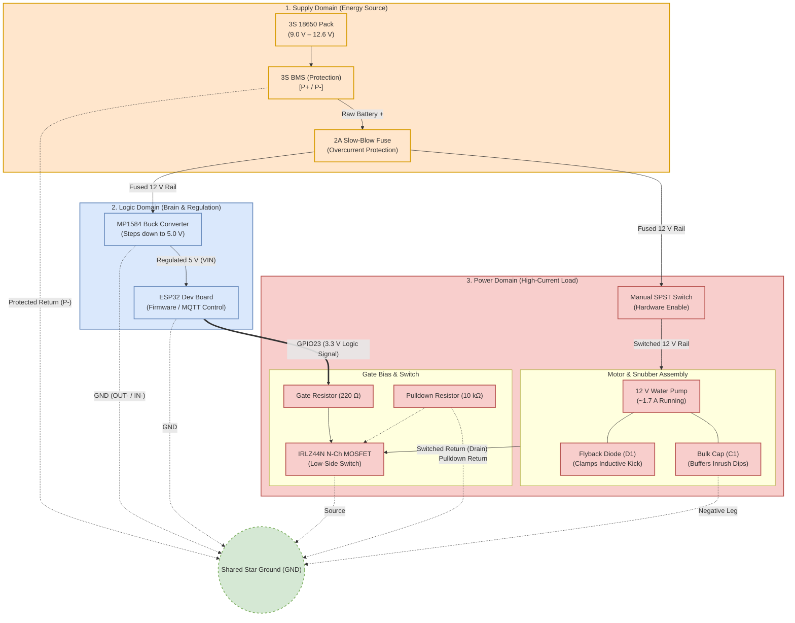
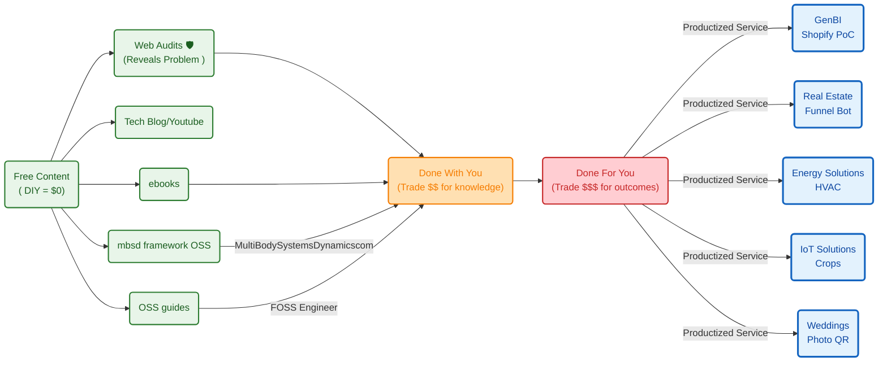

**TL;DR**

Ok, you can [buy this](#conclusions).

Next.

**Intro**

* WHY Im writting this post: *Isnt it time to do some recap to IoT, HA and the solar panel?* 
* What [Ive learnt](#conclusions) with it: *Ive ended up doing [another tech talk](#the-tech-talk)*

Is it just about having few sensors and NFC tags enough?

Automatic plant watering?

Oh no...

will I also have to learn [electronics](https://jalcocert.github.io/JAlcocerT/electronics-101/), take into account [electromagnetism](https://jalcocert.github.io/JAlcocerT/electromagnetism-101/) to avoid EMF  kickbacks

what else will it be?

That plants care [about VPD](https://jalcocert.github.io/JAlcocerT/plants-102-and-iot/#from-t-and-h-to-vpd) and it would be great to know about thermodynamics and heat transfer?

suuuure


  
  


Last year, I was able to put together HA with a DHT connected to the Pico W powered by a solar panel.

But I left some few loose ends while documenting how great that setup was.

In the meantime... Ive made a ~~small~~ comeback to ~~mechanisms~~ [electronics](https://jalcocert.github.io/JAlcocerT/electronics-101/).

> With the opportunity to make both, [the esp32 and picow setups better](https://jalcocert.github.io/JAlcocerT/electronics-101/#quick-iot-samples)

And planted couple of seeds for the first time.

Its time to make that IoT/Selfhosted setup better than I ever had.

Specially as I have also built some poc about how to go solar depending on your latitude, battery size, consumption...

```sh
cd ./poc/go-solar
```

## Protocols

Among all [messaging protocols](https://jalcocert.github.io/JAlcocerT/messaging-protocols/), mqtt has something to say.

Oh...no this is not regarding internet protocols like UDP and TCP.

But about ways to send information

### Connecting to MQTT

1. MqttX
2. Mqtt Explorer
3. MQTTy
4. EMQx

Or simply with this CLI tool:

```sh
mosquitto_sub -h 192.168.1.2 -t "esp32/#" -v
#mosquitto_sub -h 192.168.1.2 -t "esp32/temperature/dht11"
```

### Tools for MQTT

You can get inspired at: `https://selfh.st/apps/?search=mqtt`

Previously, Ive tinkered with:

1. httpie

2. reqable

3. emqx - which i recommend via container, as is a good companion for such [DHT11](https://github.com/JAlcocerT/RPi/blob/main/Z_MicroControllers/ESP32/esp32-c/esp32-dht11-mqtt.cpp) or [DHT22](https://github.com/JAlcocerT/RPi/blob/main/Z_MicroControllers/RPiPicoW/MQTT-DHT22/DHT22.py) scripts

```sh
docker ps | grep emqx
```

> Like done at: https://github.com/JAlcocerT/RPi/tree/main/Z_MicroControllers/dht-webapp combining [fastapi be](https://jalcocert.github.io/JAlcocerT/learnt-while-building-web-apps/#full-stack-web-apps), [websockets](https://jalcocert.github.io/JAlcocerT/web-apps-with-flask/) and [pgsql x timescaledb](https://github.com/JAlcocerT/RPi/tree/main/Z_SelfHosting/pgsql)



  
  



## ESP x MQTT 

For this post, ill be focusing on the ESP32

But the setup is also working for the PicoW.

Make sure that you see data flowing:

```sh
#mosquitto_sub -h 192.168.1.2 -t "pico/#" -v
#docker ps -a --filter "name=timescale"
docker exec -it timescaledb psql -U pico -d sensors -c "SELECT * FROM readings ORDER BY ts DESC LIMIT 5;" 
```

And that there are two terminals active:

```sh
tmux ls
```

> See `http://192.168.1.2:8077`

You can also see whats the latest at the db:

```sh
#cd ./poc/iot-rpi-dht
sqlite3 /home/jalcocert/poc/iot-rpi-dht-insulation/ingester/data/readings.sqlite "SELECT COUNT(*), MAX(received_at) FROM readings;"

sqlite3 /home/jalcocert/poc/iot-rpi-dht-insulation/ingester/data/readings.sqlite "SELECT date(received_at) AS day, COUNT(*) AS rows, AVG(value) AS avg_value FROM readings WHERE device = 'pico' AND metric = 'humidity' GROUP BY day ORDER BY day;"

sqlite3 /home/jalcocert/poc/iot-rpi-dht-insulation/ingester/data/readings.sqlite "
SELECT 
  date(received_at) AS day,
  ROUND(AVG(CASE WHEN device = 'esp32' AND metric = 'humidity' THEN value END), 2) AS esp_humidity,
  ROUND(AVG(CASE WHEN device = 'esp32' AND metric = 'temperature' THEN value END), 2) AS esp_temp,
  ROUND(AVG(CASE WHEN device = 'pico' AND metric = 'humidity' THEN value END), 2) AS pico_humidity,
  ROUND(AVG(CASE WHEN device = 'pico' AND metric = 'temperature' THEN value END), 2) AS pico_temp,
  COUNT(*) AS total_readings
FROM readings 
WHERE device IN ('esp32', 'pico') 
  AND metric IN ('humidity', 'temperature')
GROUP BY day 
ORDER BY day;"


sqlite3 /home/jalcocert/poc/iot-rpi-dht-insulation/ingester/data/readings.sqlite "
WITH RankedReadings AS (
  SELECT 
    device,
    metric,
    value,
    received_at,
    ROW_NUMBER() OVER (
      PARTITION BY device, metric 
      ORDER BY received_at DESC
    ) AS rn
  FROM readings
  WHERE device IN ('esp32', 'pico')
    AND metric IN ('humidity', 'temperature')
)
SELECT 
  device,
  metric,
  value AS latest_value,
  received_at AS last_seen
FROM RankedReadings
WHERE rn = 1
ORDER BY device, metric;"
```

### ESP32 x MQTT x MLX90614

Few years ago, I [wrote this post](https://jalcocert.github.io/RPi/posts/rpi-iot-MLX90614/) explaining how to use the MLX sensor with a Pi4 2GB.

pinout is the correct tool, and it confirms this is a Raspberry Pi 4B.

Use the J8 section:

J8:
3V3    (1) (2)  5V
GPIO2  (3) (4)  5V
GPIO3  (5) (6)  GND

So your MLX90614 should be:

VIN -> 3V3    pin 1
SDA -> GPIO2  pin 3
SCL -> GPIO3  pin 5
GND -> GND    pin 6

Its time to make the setup work with a ESP32 and MQTT.

```sh
#git clone /RPi
cd ./Z_MicroControllers/ESP32/esp32-c #just copy paste this one to Arduino IDE + CTRL U, 
```

then `CTRL+M` to see that it flows...

Or try with:

```sh
mosquitto_sub -h 192.168.1.2 -t "esp32/temperature/mlx/#" -v
```


Mind that Im using a MLX90614 **GY-906**



The "GY-906" part refers to the small blue or purple PCB (breakout board) that the sensor sits on.

As we discussed with the 3-pin DHT11, these breakout boards are designed to be "plug-and-play." 

If you look at the back of a GY-906 module, you will see tiny surface-mount resistors (usually labeled 103 or 472).

These are the I2C Pull-up resistors already soldered in place for you. 

Because they are there, you don't need to add your own on a breadboard.

2. The Raspberry Pi has Built-in Pull-ups

This is a key difference between your previous Raspberry Pi project and your current ESP32 project:

Raspberry Pi: The specific pins you used (SDA/GPIO2 and SCL/GPIO3) have physical 1.8kΩ pull-up resistors hardwired onto the Raspberry Pi board itself.

Even if your sensor module didn't have resistors, the Pi provides them automatically for I2C.

ESP32: Unlike the Pi, the ESP32 does not have physical pull-up resistors on its pins. 

It only has "weak" internal software pull-ups.

### ESP32 x MQTT x HM

How about sensing if some obstacle is present?

You can do it with [this .cpp script](https://github.com/JAlcocerT/RPi/blob/main/Z_MicroControllers/ESP32/esp32-c/esp32-mh-ir-mqtt.cpp), arduino IDE and `CTRl+U`


```sh
mosquitto_sub -h 192.168.1.2 -t "esp32/ir/#" -v
```



<!-- https://youtube.com/shorts/sapuSWokhtU -->

### ESP32 x LCD

Why not displaying the info that is been sent?


### ESP32 x MQTT x HMC5883L

Adding the **HMC5883L** (a 3-axis digital compass/magnetometer) is actually very easy because it uses the exact same "language" as the MLX90614: **I2C**.

> Aka ESP32 x MQTT x Magnetometer

Since you already have the MLX90614 connected to **D21** and **D22**, you don't need to find new data pins.

You can simply "chain" them together.

* https://github.com/JAlcocerT/RPi/blob/main/Z_MicroControllers/ESP32/esp32-c/esp32-hmc5883l-mqtt.cpp


1. The Wiring (The I2C "Bus")

In I2C, multiple sensors share the same two data lines.

The ESP32 tells them apart by their unique internal "address."

| HMC5883L Pin | ESP32 Pin (GPIO) | Note |
| :--- | :--- | :--- |
| **VIN / VCC** | **3V3** | Power (keep everything on 3.3V) |
| **GND** | **GND** | Ground |
| **SDA** | **D21** | Shares this pin with the MLX90614 |
| **SCL** | **D22** | Shares this pin with the MLX90614 |
| **DRDY** | *Leave Empty* | "Data Ready" - usually not needed for basic projects |


2. Is there anything "special" for this one?

Yes, the HMC5883L has one specific quirk you should be aware of:

**The Voltage/Chip Confusion:**
There are two chips that look identical: the original **HMC5883L** and the newer **QMC5883L**. 
* If you bought it recently, it’s likely a **QMC5883L**.
* They look the same, but the code for one won't work for the other because they have different I2C addresses. 
* **Tip:** If your code says "Sensor not found," try a library specifically for the *QMC* version.

3. Does it need a resistor?

Like your other modules, if the HMC5883L is on a small PCB (usually blue), it has the pull-up resistors built-in. 

However, because you are now putting **three** devices on the same power line (DHT11, MLX90614, and HMC5883L), make sure your wires are tight. 

If the power dips, the compass is usually the first thing to give weird readings.

4. Why add a Compass?

While the DHT11 tells you the "environment" and the MLX tells you the "target," the HMC5883L tells you **orientation**. 

* **Orientation:** It measures the Earth's magnetic field.

* **Interference:** Because it's a magnetometer, try to keep it away from magnets, motors, or even the ESP32’s own metal shield, as they can interfere with the "North" reading.

Summary of your "Super-Sensor" ESP32:

* **D4:** DHT11 (Temperature/Humidity)
* **D21:** SDA for **both** MLX90614 and HMC5883L
* **D22:** SCL for **both** MLX90614 and HMC5883L

### ESP32 x Water Pump

Time to put this together:

<!-- 
https://youtube.com/shorts/nqNyRvu7_KM 
-->



Yep, it pushes 1L in ~12 seconds with those 20w consumption!



See it powered via the bluetti:



<!-- https://youtube.com/shorts/U-u5m470h2U -->
<!-- 
https://youtube.com/shorts/kDPNhy8Ep7o -->

This has been a journey with [prep work for the ESP32](https://github.com/JAlcocerT/poc/tree/main/iot-esp-water) to work with the water

1. First this one with the BMS x 3s 18650 working [like so](https://youtube.com/shorts/XrFf6oWHI84)

2. Then, a timed smoke test loaded to the ESP32 to wait 10s, push water for 3, then just keep blinking

3. Wrapping it all together and instead of a hard coded logic, one that I can control via mqtt when the esp32 will move the pump - *This is a good addition to my `./poc/iot-dashboard`

How I did that?

First, recapping the logic of the 3wire fan setup with PWM control over mqtt. [This one](https://github.com/JAlcocerT/poc/blob/main/iot-esp32-motors/3-pin-fan-mosfet-pwm-mqtt/components.json).

The mosfet was not heating and everyone was happy.

But that was only pulling ~0.2A, now, the pump will demand ~1.5A

So...time to test: From the ESP32’s perspective, there are only **three wires** in total connected to its pins:

* **`VIN` (5V):** Power in from the buck converter `OUT+`.
* **`GND`:** Return path to the buck converter `OUT-` (which shares ground with battery negative and the MOSFET source).
* **`GPIO23`:** That single output signal wire going to the 220 $\Omega$ gate resistor going to the MOSFET to control it.

Everything else (the 10k pulldown resistor, the MOSFET, the pump, the diode, and the 12V rails) sits on the power board/breadboard side.

BTW, Thinking of it as **3 sections** is the most accurate and practical mental model for building and troubleshooting it:

* **1. The Supply Domain (Battery & BMS):**
The raw energy source. It delivers unregulated ~9 V–12.6 V on the high side and protects against short-circuit, over-current, and cell under-voltage on the low side (`P-`).
* **2. The Logic Domain (Brain & Regulation):**
The low-power 5 V and 3.3 V system. This includes the MP1584 buck converter and the ESP32. It only handles milliamps of current and needs clean, quiet voltage rails to avoid brownouts and resets.
* **3. The Power/Load Domain (Actuator & Switch):**
The high-current, noisy circuit. This contains the pump, the flyback diode, the fuse, the manual switch, and the MOSFET's drain-to-source channel carrying that 1.7 A.

The domains separate logically, but they touch at two specific crossover points:

* **The Gate Resistor:** The ESP32 (Logic) talks to the MOSFET Gate (Power) via that single wire through the 220 $\Omega$ resistor.
* **The Shared Ground:** All three domains tie their negative reference together at `BMS P-` so the 3.3 V logic signal has a stable baseline against the MOSFET's Source pin.



So i continued, and to make [this timed logic](https://github.com/JAlcocerT/poc/blob/main/iot-esp-water/esp32-bms-prepwork/esp32-bms-mosfet/components.json) work I connected the [components like so](https://github.com/JAlcocerT/poc/blob/main/iot-esp-water/esp32-bms-prepwork/esp32-bms-mosfet/components.json):

Here is the complete point-to-point connection summary for each component on your breadboard:

---

**1. MP1584 Buck Converter (Pre-calibrated to 5.0V)**

* **`IN+`**: Connects to the **fused $+12\text{V}$ rail** (`FUSED_P_PLUS`).
* **`IN-`**: Connects to the **common Ground rail** (`GND` / BMS `P-`).
* **`OUT+`**: Connects to the **ESP32 `VIN` (or `5V`) pin**.
* **`OUT-`**: Connects to the **common Ground rail** (`GND` / ESP32 `GND`).

**2. ESP32 NodeMCU Development Board**

* **`VIN` (or `5V` pin)**: Connects to **MP1584 `OUT+**` ($5.0\text{V}$ input).
* **`GND`**: Connects to the **common Ground rail** (`GND` / BMS `P-`).
* **`GPIO 23`**: Connects to one leg of the **gate resistor ($22\ \Omega$ or $220\ \Omega$)**.

**3. IRLZ44N N-Channel MOSFET**
*(Orientation: Metal tab facing away, flat printed front facing you, pins pointing down)*

* **Pin 1 (Left - Gate)**: Connects to:
* The second leg of the **gate resistor** (from GPIO 23).
* One leg of the **$10\text{ k}\Omega$ pulldown resistor**.


* **Pin 2 (Middle - Drain)**: Connects to:
* **Pump Black wire ($-$)**.
* **1N4007 Diode Anode (plain black end)**.


* **Pin 3 (Right - Source)**: Connects to:
* The **common Ground rail** (`GND` / BMS `P-`).
* The other leg of the **$10\text{ k}\Omega$ pulldown resistor**.


**4. 12V 3.6W Water Pump**

* **Red Wire ($+$)**: Connects to the **switched positive rail** (`SWITCHED_P_PLUS`, after the manual switch).
* **Black Wire ($-$)**: Connects directly to the **MOSFET Drain (Pin 2)**.

**5. 1N4007 Flyback Diode**

* **Cathode (Silver Stripe end)**: Connects to **Pump Red ($+$)** / switched $+12\text{V}$ rail.
* **Anode (Plain black end)**: Connects to **Pump Black ($-$)** / MOSFET Drain (Pin 2).

**6. Resistors**

* **Gate Series Resistor ($22\ \Omega$ or $220\ \Omega$)**: Sits in series between **ESP32 GPIO 23** and **MOSFET Gate (Pin 1)**.
* **$10\text{ k}\Omega$ Pulldown Resistor**: Bridges directly across **MOSFET Gate (Pin 1)** and **MOSFET Source / GND (Pin 3)**.

**7. 470 µF Bulk Electrolytic Capacitor**

* **Positive leg (longer lead)**: Connects to the **fused $+12\text{V}$ rail** (`FUSED_P_PLUS`).
* **Negative leg (shorter lead, white/silver stripe with minus signs)**: Connects to the **common Ground rail** (`GND` / BMS `P-`).

**8. Manual SPST Switch & 2A Fuse**

* **2A Slow-Blow Fuse**: In series between BMS **`P+`** and the breadboard positive rail (`FUSED_P_PLUS`).
* **SPST Switch**: In series between `FUSED_P_PLUS` and `SWITCHED_P_PLUS` (powers only the pump positive lead).

**Pre-Power Quick Check**
Before seating the 18650 cells:

1. Ensure the **manual switch is OPEN (OFF)**.
2. Multimeter in continuity mode: verify that **BMS `P-**`, **MOSFET Source (Pin 3)**, **ESP32 `GND**`, and **MP1584 `OUT-**` all beep together as one continuous ground plane.
3. Verify the **1N4007 silver band** points away from the MOSFET Drain and toward the positive rail.



<!-- https://www.youtube.com/shorts/M231o6d-kqM -->

> I got this one working with the buck converting the 10.5V of the 3s to 5.00v

Then, i [charged the 18650](https://jalcocert.github.io/JAlcocerT/understanding-batteries/#faq) with a `xtar VC4SL`


After this, I made now the buck to go from 4.2x3=12.6v to 5v


And I also prepared the mqtt version for the ESP32.

For the agents to dont be aware of your WIFI credentials nor making it part of the code:

```sh
printf '%s' 'YOUR_WIFI_PASSWORD' > /tmp/iot-fan-wifi-pass
chmod 600 /tmp/iot-fan-wifi-pass
```

Or:

```sh
read -rsp "Wi-Fi password: " WIFI_SECRET
printf '%s' "$WIFI_SECRET" > /tmp/iot-water-wifi-pass
unset WIFI_SECRET
chmod 600 /tmp/iot-water-wifi-pass


# cat /tmp/iot-water-wifi-pass

# Safer verification without revealing the password:

# wc -c < /tmp/iot-water-wifi-pass
# stat -c '%a %n' /tmp/iot-water-wifi-pass
```


After loading [the script](https://github.com/JAlcocerT/poc/blob/main/iot-esp-water/esp32-bms-prepwork/esp32-bms-mosfet/mqtt_pump_control.ino) it is mainly waiting for commands.

```sh
cd ./poc/iot-esp-water/esp32-bms-prepwork/esp32-bms-mosfet
make help
```

The ESP32 will:

- Connects to Wi-Fi
- Connects to MQTT at 192.168.1.2:1883.
- Subscribes to: `esp32/pump/cmd`

- Publishes retained status to:

esp32/pump/availability = online
esp32/pump/state = {"pump":"off","max_runtime_ms":5000}

The five-second maximum is compiled [into the ESP32 firmware](https://github.com/JAlcocerT/poc/blob/main/iot-esp-water/esp32-bms-prepwork/esp32-bms-mosfet/mqtt_pump_control.ino):

const unsigned long MAX_PUMP_RUNTIME_MS = 5000;

Any longer pulse is rejected locally by the ESP32—even if EMQX or another client requests it:

pulse:3000  → accepted
pulse:5000  → accepted
pulse:5001  → rejected

The broker only transports commands; the ESP32 enforces the limit and automatically sets GPIO23 LOW when the accepted pulse expires.

It then waits for one of these commands:

```sh
status
off
pulse:3000
```

When the ESP32 receives an accepted command such as: `pulse:3000`

GPIO23 (D23) goes HIGH at approximately 3.3 V for three seconds. 

Through the 220 Ω resistor, this drives the MOSFET gate and turns the MOSFET on/conducting, allowing pump current to flow.

After three seconds, GPIO23 returns LOW, the 10 kΩ pulldown discharges the gate, and the MOSFET turns
off.

More precisely: the MOSFET is “on/conducting,” rather than electrically “open.” Keep the ESP32 ground
connected to the MOSFET source/BMS P− common ground.

For example, this requests a three-second pulse:

```sh
# #make pub-pulse PULSE_MS=3000
# make pub-status
# make pub-off
docker run --rm --network host eclipse-mosquitto:2 \
  mosquitto_pub -h 192.168.1.2 \
  -t esp32/pump/cmd \
  -m 'pulse:3000'
```



<!-- 
https://youtube.com/shorts/sWO9hesYCjw 
-->

The ESP32 will set GPIO23 HIGH for three seconds, automatically return it LOW, and publish updated
state.

Do not send the pulse until the complete pump circuit is connected and supervised. 

Measuring drain-to-source voltage (VDS) while the 1 A pump runs helps evaluate MOSFET
conduction.

For an IRLZ44N, flat face toward you, legs down:

Pin 2: Drain — red probe
Pin 3: Source — black probe/common GND

During pulse:5000, approximately:

VDS < 0.10 V       Good
VDS 0.10–0.30 V    Usable cautiously; check temperature
VDS > 0.50 V       Poorly enhanced, incorrect wiring, or unsuitable MOSFET

status is safe to test now because it does not activate GPIO23.

On the server, subscribe to all pump topics:

```sh
mosquitto_sub -h localhost -t 'esp32/pump/#' -v
```

If mosquitto_sub is unavailable:

```sh
docker run --rm --network host eclipse-mosquitto:2 \
  mosquitto_sub -h localhost -t 'esp32/pump/#' -v
```

You should immediately see the retained messages:

```md
esp32/pump/availability online
esp32/pump/state {"pump":"off","max_runtime_ms":5000}
```

Leave that terminal running for live updates. 

From another server terminal, safely request status:

```sh
mosquitto_pub -h localhost -t esp32/pump/cmd -m status
```

The subscriber will display the command and the ESP32’s response.

On the server:

```sh
mosquitto_sub -h localhost -p 1883 -t 'esp32/pump/#' -v
```
 
Or use the EMQX web dashboard, commonly:

http://192.168.1.2:18083

In EMQX, use the WebSocket MQTT client or inspect connected clients. Look for:

Client ID: esp32-pump-ef78
Topics:   esp32/pump/#

You should see:

esp32/pump/availability online
esp32/pump/state {"pump":"off","max_runtime_ms":5000}

EMQX is the broker; mosquitto_sub and mosquitto_pub are simply compatible command-line clients for
observing and sending MQTT messages.







#### Voltaje Divider

Battery Voltage Monitoring (Voltage Divider): Add a high-value resistive divider (e.g., $100\text{ k}\Omega$ / $27\text{ k}\Omega$) from the 12V rail to an ESP32 ADC pin so your software knows when the battery is too low to run the pump

#### Could this be a product?


Mind 



I mean...sth more...


#### Adding Solar

A successful manual breadboard test proves only the raw power path; designing a board now almost guarantees you will have to pay for a redesign later.

The recommended progression moves from firmware validation to peripheral expansion, followed by prototyping, and finally custom hardware manufacturing:

**1. Finish the Core Software Cycle First (Immediate Next Step)**

* **Timed Smoke Test:** Run the battery-powered ESP32 through the 3-second cycle using `timed_smoke_test.ino` [script](https://github.com/JAlcocerT/poc/blob/main/iot-esp-water/esp32-bms-prepwork/esp32-bms-mosfet/timed_smoke_test.ino) to verify there are no inductive resets or brownouts.
* **Wi-Fi & MQTT Integration:** Upload your networking firmware (`mqtt_pump_control.ino` [script](https://github.com/JAlcocerT/poc/blob/main/iot-esp-water/esp32-bms-prepwork/esp32-bms-mosfet/mqtt_pump_control.ino)). Confirm the ESP32 can maintain Wi-Fi connection and handle MQTT commands without crashing when the pump starts and stops.
* **Deep Sleep & Power Budgeting:** If this is intended to be off-grid, configure the ESP32 to sleep between waterings. An ESP32 idling at 80–150 mA on Wi-Fi will drain a 3S pack in a couple of days regardless of solar.


**2. Add the Solar & Monitoring Upgrades (Breadboard Stage)**

* **3S Solar Charge Controller:** A 3S pack requires a dedicated charging controller with an MPPT or CC/CV charge profile (such as a **CN3791 or TP5100** board configured for 3S/12.6V, or a proper 12V solar charge controller). You cannot connect a solar panel directly to the BMS.
* **Battery Voltage Monitoring (Voltage Divider):** Add a high-value resistive divider (e.g., $100\text{ k}\Omega$ / $27\text{ k}\Omega$) from the 12V rail to an ESP32 ADC pin so your software knows when the battery is too low to run the pump.

**3. Build a Perforated Board Prototype (Stripboard / Perfboard)**

* Solder your current breadboard layout onto a standard perfboard or proto-shield.
* Breadboard spring clips loosen over time and degrade with temperature shifts and moisture. Soldering the proven components ensures mechanical reliability during field testing.

**4. Move to Custom PCB Design (Final Step)**

* Once the complete system—solar charging, battery sensing, Wi-Fi/MQTT, sleep cycles, and pump switching—has run reliably for several days on the bench, capture the schematic in KiCad or EasyEDA.
* Route wide power traces for the 12V and motor loops, place mounting holes for your enclosure, and send the gerber files to a fabricator.

The main difference comes down to how each board manages solar power conversion, efficiency, and battery configuration:

| Feature | **TP4056 (Linear Charger)** | **MPPT Charger (e.g., CN3791 / MP2467)** |
| --- | --- | --- |
| **Charging Method** | Linear regulation | High-efficiency switch-mode (Buck/Boost) |
| **Solar Voltage Tracking** | None; pulls solar panel voltage down to battery level | Actively matches the panel's Maximum Power Point ($V_{mp}$) |
| **Battery Compatibility** | **Single cell only (1S / 3.7V–4.2V)** | Available for **1S, 2S, 3S, 4S** multi-cell packs |
| **Efficiency in Sub-optimal Light** | Low (~30%–60% of panel rating is wasted as heat) | High (typically **85%–95%** overall energy harvest) |
| **Input Voltage Range** | Narrow (typically 4.5V–6V max) | Wide (often supports 6V to 28V+ panels) |

**Key Takeaways**

* **Voltage Mismatch & Wasted Power:** A standard 12V or 18V solar panel connected to a standard TP4056 will either burn it out due to high input voltage or force the panel to collapse down to 4.2V, throwing away more than half of the usable wattage as heat.
* **Multi-Cell Packs:** A standard TP4056 can only charge a **1S** (single 3.7V cell) setup. To charge a **3S** (12.6V) pack like the one in your schematic directly from solar, an **MPPT step-up/step-down multi-cell board** is required to deliver the proper voltage and CC/CV profile.
* **Cost vs. Performance:** The TP4056 works reliably for small 5V USB panels and single-cell projects, but an MPPT board is necessary to safely and efficiently step solar voltages up or down for a 3S pack.

| Feature | **MPPT (Maximum Power Point Tracking)** | **PWM (Pulse Width Modulation)** |
| --- | --- | --- |
| **Operating Principle** | High-frequency DC-to-DC converter that dynamically adjusts load to match peak panel wattage. | Rapid on/off switch that pulls panel voltage directly down to the battery's voltage level. |
| **Conversion Efficiency** | **90% – 99%** | **70% – 80%** (drops lower in cold or low-light conditions) |
| **Voltage Flexibility** | High input voltage support (e.g., 50V–150V+ panel arrays into a 12V/24V battery). | Panel nominal voltage must strictly match battery voltage (e.g., 18V $V_{mp}$ panel for a 12V battery). |
| **System Scale** | Best for medium-to-large setups (>200W), multi-panel arrays, and residential/commercial solar. | Best for small systems (<150W–200W), single-panel DIY, RVs, and trickle-charging. |
| **Cost** | Significantly higher ($40 to $500+) | Very low ($10 to $30) |

---

**MPPT Pros & Cons**

*Pros:*

* **Maximum Energy Harvest:** Captures up to **30% more energy** than PWM, especially in cloudy, low-light, or cold weather.
* **Higher Panel Voltage Allowed:** Lets you wire panels in series at high DC voltage, allowing for longer cable runs with thinner, cheaper wiring and lower transmission losses.
* **System Expandability:** Easy to add more panels to an existing array without replacing the battery bank voltage configuration.

*Cons:*

* **Higher Price Tag:** Complex internal circuitry and microcontrollers make it 3x–5x more expensive than PWM.
* **Size and Weight:** Larger enclosures, bulkier inductors, and heavier heatsinks.
* **Marginal Value on Tiny Setups:** Overkill for small (<100W) installations where the extra power gained doesn't justify the controller's cost.

---

**PWM Pros & Cons**

*Pros:*

* **Extremely Cheap:** Lowest cost-per-unit solution for basic solar installations.
* **Simple & Reliable:** Fewer active electronic components result in low standby draw and solid long-term durability.
* **Compact Footprint:** Lightweight and easy to fit into tight enclosure boxes.

*Cons:*

* **Wasted Capacity:** Forces the panel to operate at battery voltage; any excess voltage is simply lost rather than converted to current.
* **Strict Voltage Constraints:** Cannot step down high array voltages (e.g., cannot use high-voltage grid-tie panels with a 12V battery bank).
* **Poor Poor-Weather Performance:** Harvest drops sharply when temperatures fall or in overcast lighting conditions.

| Feature | **TP4056** | **TP5100** | **CN3791** | **3S MPPT Charger (e.g., CN3795 / MP2467)** |
| --- | --- | --- | --- | --- |
| **Topology** | Linear regulator | Switching (Buck converter) | Switching (Buck converter) | Switching (Buck/Boost) |
| **Solar MPPT?** | No | No (fixed DC input) | **Yes** (Input voltage tracking) | **Yes** (Input voltage tracking) |
| **Supported Battery** | **1S only** (4.2V) | **1S or 2S** (4.2V / 8.4V) | **1S only** (4.2V) | **3S** (12.6V) |
| **Input Voltage** | 4.5V – 5.5V | 5V – 18V | 4.5V – 28V | 15V – 28V+ |
| **Max Charge Rate** | 1A | Up to 2A | Up to 4A | Typically 2A – 5A+ |

**TP5100: A Switching Upgrade, But Not for Solar or 3S**

* **The Pros:** Unlike the linear TP4056, the TP5100 is an efficient **buck (step-down) switcher**. It handles higher input voltages (up to 18V) without turning excess energy into extreme heat.
* **The Limit:** It only supports **1S (4.2V) or 2S (8.4V)** batteries. It **cannot charge a 3S (12.6V) pack**. Furthermore, it lacks MPPT circuitry, meaning a cloud passing over a solar panel can cause the input voltage to collapse and stall the charge cycle.

**CN3791: Real Solar Tracking, But Built for 1S**

* **The Pros:** The CN3791 has built-in **MPPT** (specifically constant-voltage tracking) designed for solar panels. It monitors panel voltage so it never drags the panel below its peak output ($V_{mp}$).
* **The Limit:** The standard CN3791 IC is hardwired for **single-cell lithium (1S / 4.2V)**. Even though it accepts high solar panel voltages (up to 28V), it only outputs 4.2V.

**What Your Schematic Actually Needs**
Because your circuit uses a **3S pack (~12.6V full charge)**, neither the standard TP5100 nor the CN3791 can charge it.

To charge that 3S pack from solar, look for:

* **CN3795 or CN3722:** The multi-cell siblings of the CN3791, designed specifically for adjustable multi-cell lithium packs (including 3S and 4S) with MPPT.
* **Synchronous Buck-Boost MPPT modules:** Modules using chips like the **LT8490** or **SC8815**, which can take an 18V solar panel and safely step it down to 12.6V CC/CV for your BMS.

Neither—the primary recommended board is a **Synchronous Switching Boost (Step-Up) CC/CV Charger**, not a standard PWM or true MPPT tracker.

| Feature | **Recommended 5V-to-3S Board (e.g., SD35XX / IP2326)** | **Standard Solar PWM** | **Solar MPPT Boost (e.g., SC8815 / LT8490)** |
| --- | --- | --- | --- |
| **Topology** | Switching Boost (DC-DC Step-Up) | Direct Pulse Switch (Step-Down only) | Synchronous Buck-Boost with dynamic tracking |
| **Can it step 5V up to 12.6V?** | **Yes** | **No** (PWM can only pass through or drop voltage) | **Yes** |
| **Tracking Method** | Fixed input adaptive current limiting | None | Dynamic curve sweep ($V_{mp}$ tracking) |
| **Cost** | ~$2 to $5 | ~$10 to $20 | ~$25 to $60+ |

**Why It Is Not Traditional PWM**

A standard PWM solar controller requires the solar panel's voltage to be **higher** than the battery pack (e.g., an 18V panel for a 12V battery). Because your panel outputs only **5V** and the 3S pack reaches **12.6V**, a PWM controller cannot work—it cannot step voltage up.

**Why It Is Not Fully "True MPPT"**

Budget 5V-to-3S boost charger boards use switching regulators with **adaptive input voltage regulation**, not true continuous MPPT tracking.

When a cloud passes over and the 5V panel begins to sag, the chip throttles back charging current to stop the panel from completely collapsing to 0V.

While technically "pseudo-MPPT" or input-voltage limiting, it delivers roughly 85%–90% efficiency without the high cost and complexity of a full MPPT tracking stage.

That works cleanly with the recommended boost charger.

In that setup, the **5V panel slowly charges the 18650 pack**, and the **18650 pack supplies the high current bursts for the pump**.

**How the Energy Flow Operates**

* **Charging Phase (Continuous & Slow):**
* Sun hits the 5V panel $\rightarrow$ 5V-to-3S boost charger steps 5V up to 12.6V $\rightarrow$ feeds current through `BMS P+` and `BMS P-` $\rightarrow$ BMS charges and balances the three 18650 cells.


* **Discharge Phase (On-Demand & Fast):**
* When ESP32 GPIO23 turns ON the MOSFET, the pump draws its full ~1.7A (20W) directly from the 3S battery pack via `BMS P+`, completely bypassing the solar charger.

**How to Wire It to Your Existing JSON Schematic**

The solar charger simply sits in parallel across the BMS main port:

* **Panel to Charger Input:**
* Solar Panel (+) $\rightarrow$ Charger `IN+`
* Solar Panel (-) $\rightarrow$ Charger `IN-`

* **Charger Output to Battery Pack:**
* Charger `OUT+` $\rightarrow$ Connect to **`BMS_P_PLUS`** (before fuse `F1`, so charging the pack does not depend on the pump fuse).
* Charger `OUT-` $\rightarrow$ Connect to **`GND`** (`BMS_P_MINUS`).

**The Sizing Rule: Energy Balance**

Because the pump uses 20W and a 5V panel delivers about 2.5W to 5W:

* A 5V / 1A panel produces roughly **5 Watt-hours** per hour of peak sunlight.
* Running your 20W pump for **3 minutes** consumes only **1 Watt-hour**.
* That means 1 hour of decent sunlight easily banks enough charge in the 18650s to run several multi-minute pump cycles.

As long as the pump duty cycle is intermittent (e.g., watering plants for a few minutes a day), the 3S 18650 pack acts as the energy buffer while the 5V panel trickles power back in.


## SelfHosted IoT Tools

OpenHUB, HA, Node-Red and ESPhome.


  
  


Yea, `https://esphome.io` if you like ESP32 boards!



  
  


<!-- https://github.com/JAlcocerT/Home-Lab/tree/main/
Node-Red -->

### HA

There has been few releases since the last time:

<!-- https://www.youtube.com/watch?v=QwCR0h8_KyE -->




Including the releases of the MCP integrations:

* https://github.com/homeassistant-ai/ha-mcp/
* https://www.home-assistant.io/integrations/mcp_server/

```sh
#git clone https://github.com/JAlcocerT/Home-Lab
#cd ~/Home-Lab/home-assistant
#sudo docker compose up -d

##cd ~/Home-Lab
#git pull
#sudo docker compose -f ./z-homelab-setup/evolution/2601_docker-compose.yml up -d home-assistant

docker ps -a | grep -i home-assistant
#docker stats home-assistant
```


  
  


### Custom IoT Tools

But lately, I just made my own **DIY IoT platform** around MQTT and zigbee:

```sh
cd ./poc/iot-dashboard
```

<!-- https://youtube.com/shorts/WAa7nOc5z9g -->



---

## Conclusions

After writing [about electronics](https://jalcocert.github.io/JAlcocerT/electronics-101/) and the [electro-magnetic foundations](https://jalcocert.github.io/JAlcocerT/electromagnetism-101/), this post was the clear next step.





```sh
#docker system prune -a --volumes
```

How much deflation is enough for you to start doing?

Whatever.

Save you effort or make money?

Deal:


  
  



If anything:




  
  



### The Software for D&A

#### MicroControllers


#### In the server


### HomeLab Updates 0826

What else am I running since last month?

```sh
sudo docker compose -f 2604_docker-compose.yml up -d uptime....pihole nextcloud ncdb.......uptimekuma pocketbase termix lunalytics...littlyx jellyfin
```

Needed a cool `.md` compatible way to keep my daily notes for when im not working with my laptop...


{}

Logseq Web is the wrong model for your specific setup.

If you want to use Logseq from another laptop and have notes write into the repo on your home machine, that won’t happen automatically. Logseq Web in the browser writes to a folder
the browser can access on that same laptop, not to a remote folder on your home server.

So the practical split is:

- Good fit
    - Using Logseq on a machine that has the notes folder locally
    - Or using Logseq on each laptop with its own local clone of the repo
    - Then syncing via git, Syncthing, etc.

- Poor fit
    - Opening Logseq Web from a work laptop and expecting it to write directly into /home/jalcocert/my-logseq-notes on another machine

If your goal is simply “capture daily notes from anywhere and keep them in this repo,” then Logseq is only a good fit if you use it with local storage + sync.

{}

After trying logseq and silverbullet, i went with: 






I needed to **fix nextcloud** after my x300 restarted:

```sh
sudo mount /mnt/data1tb
sudo systemctl daemon-reload
sudo docker restart nextcloud nextclouddb
docker exec nextcloud php /var/www/html/occ status

docker exec nextcloud php /var/www/html/occ config:system:get trusted_domains
docker exec nextcloud-sync php /var/www/html/occ config:system:get trusted_domains
```

You need some clean up?

```sh
#ncdu /
uv cache clean
# docker stop dawarich_app dawarich_sidekiq dawarich_db dawarich_redis
docker rm dawarich_app dawarich_sidekiq dawarich_db dawarich_redis

docker volume rm \
  dawarich_dawarich_shared \
  dawarich_dawarich_public \
  dawarich_dawarich_storage \
  dawarich_dawarich_watched \
  dawarich_dawarich_db_data \
  velxio_arduino-libs

#docker image rm ghcr.io/opengeos/geolibre:latest

docker builder prune
```

* https://jellyfin.org/posts/state-of-the-fin-2026-01-06/
* https://github.com/jellyfin/jellyfin-desktop

I removed the services for my ebooks and consulting subdomains.

They are now...**static**!


  
  


You have one [IoT basics ebook](https://ebooks.jalcocertech.com/books/iot/) waiting  :)

---

## FAQ

### HomeLab Tools I cant live w/o

For the CLI:

```sh
lazydocker
#docker ps --filter "status=running"
#docker ps -a --filter "name=home-assistant"
#docker stats home-assistant

glances #htop btop
#sudo snap install ghostty --classic
#tmux #ghostty #herdr
```


### Interesting Sensors

* `https://sonoff.tech/en-pl/products/sonoff-snzb-02d-zigbee-lcd-smart-temperature-humidity-sensor`

#### Zigbee

If you have been playing with IoT and some home devices, you will [come to know **Zigbee**](https://fossengineer.com/zigbee2mqtt-self-hosted-zigbee-bridge/).

Zigbee devices cannot speak MQTT directly out of the box.

MQTT is an IP-based protocol (it requires Wi-Fi, Ethernet, and a TCP/IP network stack), whereas Zigbee is a low-power RF radio protocol (IEEE 802.15.4) that does not understand Wi-Fi or IP addresses.




To bridge the gap between the two technologies, you need an intermediary coordinator.

A USB Zigbee Coordinator: A ~$15–$25 USB dongle (such as the Sonoff ZBDongle-E or SLZB-06) plugged into whatever computer/server hosts your MQTT broker.

Zigbee2MQTT (Z2M): A lightweight open-source service that pairs with the dongle, handles the device drivers locally, and outputs pure MQTT.

* https://www.zigbee2mqtt.io/supported-devices/
* https://fossengineer.com/zigbee2mqtt-self-hosted-zigbee-bridge/

They are often mentioned in the same breath because they dominate the budget smart home market, but they represent three distinct things: a **protocol**, an **IoT platform**, and a **hardware brand**.

The Three Entities Defined

| Name | What It Actually Is | Primary Role |
| --- | --- | --- |
| **Zigbee** | An open wireless **standard/protocol** (like Wi-Fi or Bluetooth) | The low-power radio language devices use to talk to each other. |
| **Tuya** | A massive IoT **platform / white-label software provider** | Supplies turnkey chips, firmware, and cloud backends to hundreds of OEM factories (Moes, Zemismart, generic brands). |
| **Sonoff** | A specific **hardware manufacturer** (brand owned by ITEAD) | Builds smart home hardware (Wi-Fi and Zigbee relays, sensors, dongles, and switches). |

How They Intersect

```
                    ┌── Zigbee Protocol ──► (Used by both Sonoff & Tuya hardware)
                    │
Smart Home Landscape ┼── Tuya Ecosystem   ──► (White-label firmware/cloud across 1,000s of brands)
                    │
                    └── Sonoff (ITEAD)    ──► (A single manufacturer with its own eWeLink app)
```

1. **Zigbee is the common language:** Both Sonoff and Tuya make devices that speak the Zigbee protocol instead of Wi-Fi.
2. **They make competing ecosystems:**
* A Tuya Zigbee device connects by default to a Tuya hub (Smart Life app).
* A Sonoff Zigbee device connects by default to a Sonoff hub (eWeLink app).

standard Zigbee broadcasts on the same 2.4 GHz frequency band as Wi-Fi and Bluetooth, it uses a different physical layer format (IEEE 802.15.4 instead of 802.11 or BLE). 

A smartphone or standard router cannot decode its beacon signals.

3. **Open-source bridges unite them:** Tools like **Zigbee2MQTT** ignore both the Tuya and Sonoff proprietary clouds. As long as the device speaks Zigbee, a single open USB dongle (often made by Sonoff) can control Tuya sensors, Sonoff switches, Philips Hue bulbs, and IKEA blinds on one unified MQTT network.

* **Zigbee** is the *radio layer*.
* **Tuya** is the *turnkey software/chip ecosystem* behind most generic smart gadgets on AliExpress/Amazon.
* **Sonoff** is a *hardware vendor* famous in the DIY community for making hacker-friendly, flashable ESP8266/ESP32 devices and cheap Zigbee hardware.

**Wi-Fi** is high-bandwidth, high-power, and connects devices directly to your router over standard TCP/IP. **Zigbee** is ultra-low-power, low-bandwidth, and creates a local mesh network designed specifically for tiny sensor packets and battery-operated hardware.

Core Differences: Zigbee vs. Wi-Fi

| Feature | Wi-Fi (802.11) | Zigbee (802.15.4) |
| --- | --- | --- |
| **Topology** | **Star:** Every device connects directly to your main router. | **Mesh:** Mains-powered devices relay signals to extend range and self-heal. |
| **Power Consumption** | **High:** Drains coin/small batteries in days to weeks. | **Extremely Low:** Battery devices sleep and last 1–3+ years on a coin cell. |
| **Addressing / Network** | Full IP stack (MAC, IP, Subnet, DNS, TCP/UDP). | 16-bit short address inside a local PAN (Personal Area Network). No IP. |
| **Bandwidth** | High (54 Mbps to 1+ Gbps) — handles video, web, streaming. | Low (~250 kbps) — sends only tiny command and state payloads. |
| **Router Load** | 30–50+ Wi-Fi smart devices can congest standard home routers. | Handles 100+ devices easily via a dedicated USB coordinator. |
| **Native Protocols** | HTTP, WebSockets, standard TCP MQTT clients. | Zigbee Cluster Library (ZCL) byte commands. |

How Zigbee2MQTT (Z2M) Works

Zigbee devices don't have IP addresses and can't run an MQTT client. 

**Zigbee2MQTT acts as a software/hardware translator** that bridges the physical Zigbee radio network to your local IP network and MQTT broker.

```
 [ Battery Sensor / Blind ] 
             │
             │ (Raw Zigbee RF Packets: IEEE 802.15.4)
             ▼
   [ USB Coordinator ]  (e.g., Sonoff ZBDongle-E / Texas Instruments chip)
             │
             │ (Serial / UART over USB)
             ▼
   [ Zigbee2MQTT Service ] (Runs on Raspberry Pi / Home Server)
             │
             │ (JSON payloads over TCP/IP)
             ▼
   [ MQTT Broker (Mosquitto) ] ◄──► [ ESP32 / Home Assistant / Custom Scripts ]
```




<!-- 
https://youtube.com/shorts/4IGedKLDSFM 
-->



#### One ESP - Few Sensors

For the **MLX90614**, it makes the most sense to use the **default I2C pins** on the ESP32. 

While the ESP32 is flexible and allows you to map I2C to almost any pin, using the defaults ensures that almost every library (like the Adafruit one) will work instantly without you having to write extra lines of code to "remap" the pins.

The Best Choice: GPIO 21 and 22

On your 30-pin ESP-WROOM-32, these are labeled as **D21** and **D22**.

| MLX90614 Pin | ESP32 Pin (GPIO) | Label on Board |
| :--- | :--- | :--- |
| **SDA (Data)** | **GPIO 21** | **D21** |
| **SCL (Clock)** | **GPIO 22** | **D22** |
| **VCC** | **3V3** | **3.3V** |
| **GND** | **GND** | **GND** |

1.  **Hardware Support:** GPIO 21 and 22 are connected to the ESP32's internal I2C hardware peripheral. This means the chip handles the communication timing very efficiently.

2.  **No "Strapping" Conflicts:** Unlike GPIO 15 (which you asked about earlier) or GPIO 0, these pins don't affect how the ESP32 boots up. You can have the sensor plugged in while you upload code, and it won't cause any errors.

3.  **Library Compatibility:** Most code examples you find online for the MLX90614 will assume you are using 21 and 22. It saves you the headache of debugging "Sensor not found" errors.

Can you use the DHT11 and MLX90614 at the same time?

Absolutely!

This is a very common setup.

Since they use different communication methods, they won't interfere with each other. 

Here is your "Master Plan" for wiring both:

| Sensor | Data Pin 1 | Data Pin 2 | Power |
| :--- | :--- | :--- | :--- |
| **DHT11** | **D4** (Digital) | *None* | 3.3V & GND |
| **MLX90614** | **D21** (SDA) | **D22** (SCL) | 3.3V & GND |

> **Pro Tip:** Since the ESP32 only has one `3V3` pin and a couple of `GND` pins, you might need a small **breadboard** to share the power and ground lines between the two sensors. 

Most **MLX90614 modules** (the GY-906 version) come with those 4 pins. 

The "extra" pins you might see on the bare sensor (which has 4 pins in a circle) are usually combined or simplified on the PCB module to make it easy to use with microcontrollers like your ESP32.

Understanding the 4 Pins

Here is what each pin does and where it goes on your **ESP-WROOM-32**:

| Pin Label | Function | ESP32 Connection | Why? |
| :--- | :--- | :--- | :--- |
| **VIN** | Voltage In | **3V3** | Powers the sensor. Even if the module can handle 5V, 3.3V is safer for the ESP32. |
| **GND** | Ground | **GND** | Completes the electrical circuit. |
| **SCL** | Serial Clock | **D22 (GPIO 22)** | This is the "metronome" that keeps the data timing in sync. |
| **SDA** | Serial Data | **D21 (GPIO 21)** | This is the actual pipe where the temperature data travels. |

Why 4 pins instead of 3 (like the DHT11)?

The DHT11 uses a custom **1-wire protocol** where the "clock" and "data" are mashed into a single wire. It’s simple, but a bit slow and error-prone.

The MLX90614 uses **I2C (Inter-Integrated Circuit)**.

This requires two wires for data communication:

1.  **SDA:** Sends the actual bits of temperature data.
2.  **SCL:** Sends a steady pulse (the clock) so the ESP32 knows exactly when to "read" each bit on the SDA line.

This makes I2C much faster and more reliable than the DHT11's method. 

Plus, you can actually hook up **multiple different I2C sensors** to the same two pins (D21 and D22), and the ESP32 can talk to them individually using their "addresses."

A Quick Tip for a `ESP-WROOM-32`

Since you are likely using a breadboard now to connect both sensors:

* **The "Power Rail":** Connect the ESP32's **3V3** pin to the red (+) rail on your breadboard and **GND** to the blue (-) rail. 
* **Shared Power:** Now you can just plug the VIN and GND from both the DHT11 and the MLX90614 into those rails.

### IoT BoM to get started

Getting started?

Get some of these:

1. ESP32 or a PicoW ~5/10$
2. DHT11/22 ~1/5$
3. MLX90614 infrared sensors ~20$
4. TP4056 - to control the battery charge ~10$ with the shield

For your [automatic watering setup](https://jalcocert.github.io/JAlcocerT/plants-103-inspiration/#the-iot-and-controlled-watering):



<!-- 
https://youtube.com/shorts/kDPNhy8Ep7o 
-->

Watering what?




Oh, yep, i planted some tomatoes and thats why this all started.

<!-- https://youtube.com/shorts/cDfu-i_XnIE -->


5. Pump with [a BLDC](https://jalcocert.github.io/JAlcocerT/electromagnetism-for-ac-dc-motors/#dc-vs-bldc-vs-ac-engines) 12v 30W for ~20$ or smaller 19w for 15$
6. A battery: I got [a bluetti](https://jalcocert.github.io/JAlcocerT/understanding-batteries/#testing-the-bluetti-v2) for 200$, but i was considering a Pb battery


#### Other learnings

1. Using a Multimeter / ClampMeter: from [continuity tests](https://www.youtube.com/shorts/q-BlvhkLqcU) / resistance measuring, to wall voltage readings

2. Pumps also go around P/Q: ~~price/quantity~~ Power, Flow *and height, Best Efficiency Point (BEP)...*

3. For the Mosfet i used, the 2nd pin (GDS), the DRAIN, is connected to its top metal plate

### The Tech Talk

The initial draft of the talk is [here](https://github.com/JAlcocerT/poc/blob/main/iot-dashboard/tech-talk.md).

But as the prior one, this [tech talk ppt](https://github.com/JAlcocerT/selfhosted-landing/tree/master/y2026-tech-talks/5-iot-sensors-to-actuators) will be placed somewhere: `https://consulting.jalcocertech.com/presentations/techtalk-from-iot-to-big-data-engineering/ppt`

```sh
#cd ./poc/iot-dashboard
#git clone https://github.com/JAlcocerT/selfhosted-landing
cd ./selfhosted-landing/y2026-tech-talks/5-iot-sensors-to-actuators
```

<!-- https://youtu.be/fk3dq6V5PD8 -->

