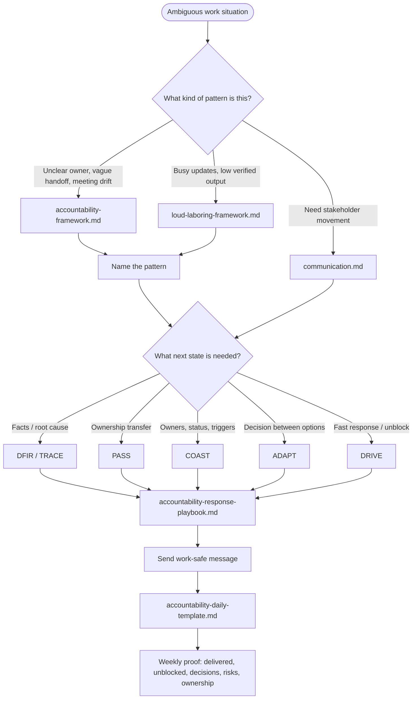

https://mermaid.js.org/syntax/entityRelationshipDiagram.html 

**TL;DR**

You better write daily/weekly notes and work with them

**Intro**

* Why Im writting this post: *bc I want to standardize the way i capture information across my forcely scattered daily flow and create meta-frameworks with it to apply cross-domain*
* [What Ive learnt](#conclusions) with it: When principles/ideas are clear, [apply them harder](https://jalcocert.github.io/JAlcocerT/poc-107/#destilling-read-books) 

## Why you need this

I dont care if you are a director, an IC that ~~moonlights~~ has independent consilting work, or a solo-preneur:


{}


{}


Use when someone asks for a quick call without enough written context:

{}

I cannot jump on a call right now, but we can probably handle it async.

Can you send:

- the exact error or behavior
- what you already tried
- the doc/wiki section you followed
- what result you expected vs what happened

Once I have that, I can point you to the right fix or doc update.

{}


You better [ask questions](https://jalcocert.github.io/JAlcocerT/questions-for-engineers/) on time

{}

{}

Yep, make sure meetings are clear and actionable


Starting with: WHO will do WHAT by WHEN


EOD Accountability Review:

- What did I move forward today?
- What did I make clearer for other people?
- What ambiguity did I convert into owner/action/trigger?
- What is still exposed?
- What should be visible in the weekly summary?

<!-- 
https://youtu.be/6SyqMqIPQiI 
-->



## The Setup

Earlier this year I got my [read books notes distilled](https://jalcocert.github.io/JAlcocerT/poc-107/#destilling-read-books) with very [interesting feedback](https://github.com/JAlcocerT/jalcocertech-services/blob/master/docs/destilled-ebooks/z-read-books-notes/z-hormozi-curated.md)


### Tools

https://github.com/hedgedoc/hedgedoc


### The Indie Way

For some cases, you can consider to just write into [your Forgejo instance](#selfhosted-forgejo), in case that github is non accesible.

Ill assume that you are fine with `.md` files


#### YT Summaries

That's exactly what ive done around this Hormozi video *one more time*

#### Audio Recaps

I was using fireflies, but then I created a setup around google recorder


#### Gold Info for SoloPreneurs


{}

For this I dedicated a full post few weeks ago.

The general idea checklist is as follows:


{}

{}


{}


#### Info to Video

You are already aware, PoC, make a [hyperframe](https://jalcocert.github.io/JAlcocerT/youtube-video-as-a-code/) video [about it, or about yourself](https://github.com/JAlcocerT/poc/tree/main/libg/accountability-communication)



<!-- https://youtu.be/4sSa28Xk5Yw -->

---

## Conclusions

If it was not clear, now has to be.

No more ~~bs~~ hello, accountability laundring, weaponized incompetence, underf...

...Pardon my French, I meant:

- “weaponized incompetence” -> “repeat low-context dependency requests” 
- “cover my ass” -> “maintain an evidence trail”
- “under-filtering manager” -> “unfiltered upstream directive”
- “take off the mask” -> “raise process issues explicitly”

Yep, i apply and got [my information and workflows](https://github.com/JAlcocerT/my-logseq-notes/tree/main/daily-frameworks) in place: *goes pretty handy together with skills `C:/Users/.../.codex/skills/weekly-work-summarizer/references/templates.md`*



### HomeLab Updates 0926

I was trying lately technitium at Omarchy


<!-- 
https://www.youtube.com/watch?v=62crffG6Uw8 -->




### Architect or Principal

Just in case you are preparing for an internal promo / outside CV or how to frame what you do for prospects.

The easiest way to understand the difference is **scope of execution vs. scope of design**:

+------------------------------------+------------------------------------+
| Software Architect                 | Principal Engineer                 |
+------------------------------------+------------------------------------+
| Focuses on the "Blueprint."        | Focuses on the "Execution & Truth."|
| Works with product and business to | Goes deep into complex systems,     |
| map out *what* to build and how    | enforces standards, and writes core|
| systems interact broadly.          | code/infrastructure.               |
+------------------------------------+------------------------------------+

* **The Architect** spends a lot of time in cross-functional stakeholder meetings, drawing system diagrams, analyzing vendor tech, and ensuring the business goals match the technology stack. In many companies, architects rarely touch production code anymore.

* **The Principal Engineer** is usually the **highest-ranking technical hands-on expert** in the room. They design systems too, but they are also expected to build the foundational architecture, debug the most ambiguous, critical outages, and optimize engineering processes.


1. You Own the "Infrastructure of Rules"

As a Principal, you are responsible for defining team standards and dev velocity. This means you have the organizational power to unilaterally destroy accountability laundering and useless meetings.

You can literally write a policy that says: *"No sync calls without a written ticket and log,"* and because you are the Principal, it becomes law.

2. Built-In "Deep Work" Shielding

Principals are expected to tackle complex, ambiguous engineering problems.

Everyone expects you to be offline, heads-down, and writing architecture code or documentation for blocks of 4 to 6 hours at a time. 

Nobody questions why your Slack status is "Away" or "Focusing"—they just assume you are solving a high-level problem.

3. High Leverage, Low Meeting Density

Architects get pulled into endless discovery calls with product managers and clients to figure out "what is possible."

Managers get pulled into HR drama. Principals are insulated from most of that. 

Your value comes from your output, your technical direction, and the documentation (like your wikis) that you build to make the rest of the team self-sufficient.


**So ask honestly**: do you want *status, control, income, or optionality**? 

They are NOT the same game.

What are you optimizing for next?


---

## FAQ

### Useful CLI Tools

https://jalcocert.github.io/JAlcocerT/selfhosted-apps-06-2025/

### Selfhosted Forgejo

I got this ready in my x300 [some time ago to tinker with agents](https://jalcocert.github.io/JAlcocerT/poc-107/):

Having termix ready `http://192.168.1.2:8090/` and Forgejo `http://192.168.1.2:3034/`

```sh
docker ps -a --filter "name=forgejo"
```

The syncing setup to github so that each forgejo repo has a [gh backup in a branch](https://github.com/JAlcocerT/hermesagent/tree/tinker/hermesagent/):

```sh
gh status
```

In this case, what i want is to do: GH <-> Forgejo for [my daily notes](https://github.com/JAlcocerT/my-logseq-notes)

```sh
cd ./Home-Lab/forgejo
make migrate-repo REPO_OWNER=JAlcocerT REPO_NAME=my-logseq-notes #makes a mirror of gh
#make sync-repo REPO_OWNER=JAlcocerT REPO_NAME=my-logseq-notes
```

If you want to expose this:

```sh
docker inspect forgejo --format '{{range $name, $_ := .NetworkSettings.Networks}}{{println $name}}{{end}}'
#docker network connect cloudflared_tunnel forgejo
```

Check that `forgejo:3000` ready:

```sh
#dig fossengineer.com any
```

### Selfhosted Communication

1. https://github.com/simplex-chat/simplex-chat/releases/tag/v7.0.0

2. Matrix with the flavour [conduit](https://fossengineer.com/selfhosting-matrix-conduit-server-with-docker/) or [synapse](https://fossengineer.com/selfhosting-matrix-synapse-docker/)

### Selfhosted Media


qbit and prowlarr at `6011` and `9696`.

```sh
sudo docker compose -f ./z-homelab-setup/evolution/2601_docker-compose.yml up -d qbittorrent prowlarr
```

yt-distil: `http://192.168.1.2:8001`

#### Kodi vs Jellyfin

with kodi adons

* <https://www.youtube.com/@proyectosmicropic/videos>

### How Im using AI to prep for ULM/PPL

* https://github.com/anthropics/claude-cookbooks

* https://ulm-ppl-test.pages.dev/ from `./poc/ulm-ppl`