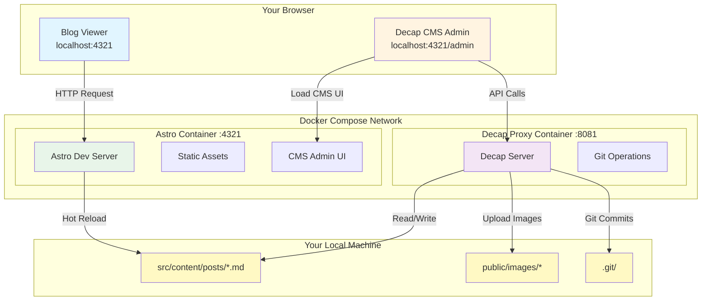
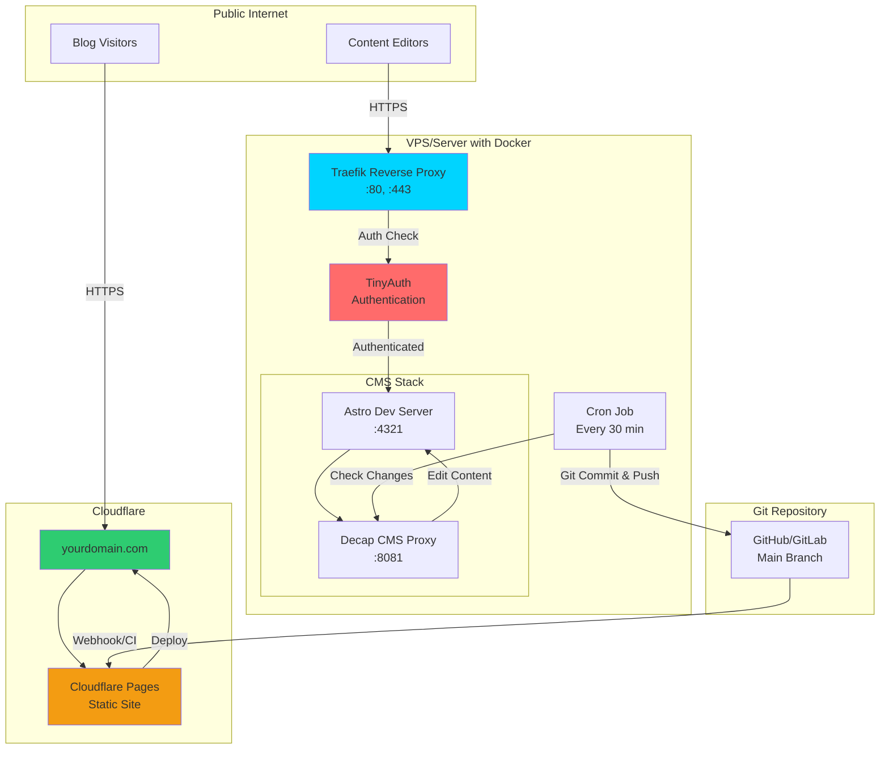

**Tl;DR**

About The minimalist web vs the independent web! 🌐✨

I get very happy when finding out about blog posts on reddit or on self.st newsletter that are **purely human driven**.

> We can still feel that with themes like Paper mod


**Intro**

Do we need that much bloat?

Probably not.

What we probably need is a **Minimalist Webs** where different opinions can coexist.

I really enjoy finding blogs around that are not just a copy paste from the previous one.

Specially if they bring a phogo gallery like [this one](https://brianli.com/photos/)

+++ Lighthouse CI and a DecapCMS cool example

## Some Minimalistic Sites

But some people take it one level higher and do webs veeery minimalistic.

<!-- echo chambers -->

* https://lukesmith.xyz/articles/modern-freedom-means-being-a-slave-to-impulses/
* https://lukesmith.xyz/articles/monero-and-other-privacy-coins/
* https://lukesmith.xyz/articles/politics-matters-most-to-slaves/

* https://danluu.com/


<!-- 
https://ericmurphy.xyz/blog/minimalist-web/
https://ericmurphy.xyz/blog/discoverability/ -->

* https://512kb.club/
* https://erikjohannes.no/ - THis one has a great photo section!


<!-- 
https://www.youtube.com/watch?v=1iOVatAR-bU 
-->



---

## Conclusions

It curious to see how 'old designs' like: https://1999.37signals.com/

Are very easy to read, kind of a book!

Despite not been as minimalistic as the sites above:

```sh
du -sh . # Output: 1.5G! This is far from minimalistic already
```

I really enjoy hugo/astro and static site hosting to publish.

There is not a single time that Ive opened: https://astro.build/themes/1/?search=&price%5B%5D=free and havent found sth interesting.

Whatever you build, make sure to **validate the outcome**:

```sh
#sudo apt-get install dnsutils -y #dns resolution
nslookup github.com 
dig google.com

curl -s -o /dev/null -w "dns_lookup: %{time_namelookup}s connect: %{time_connect}s appconnect: %{time_appconnect}s pretransfer: %{time_pretransfer}s starttransfer: %{time_starttransfer}s ---------- total: %{time_total}s http_code: %{http_code}" https://blog.jalcocertech.com
```


 









### Better Docs

I was considering Astro starlight for a documentation theme with i18n support here.

And doubting if sth like [HUGO congo](https://github.com/jpanther/Congo) would be the way forward.

But then I found this: https://github.com/themefisher/dockit-astro


```sh
git clone https://github.com/JAlcocerT/dockit-astro
#make install && make dev
```



  
  



> This is simple great for F/OSS 

Time for a: Whats working, whats not and whats next?

Well, Google also released https://codewiki.google/ which can potentially get outdated my manual/windsurf/codex way of writing technical docs.

Time well tell.

For now it ,just' works on certain popular repos: https://codewiki.google/github.com/google-gemini/gemini-cli

But what Im sure is that the brand needs an upgrade from blog like to doc+blog like.

Anyways, wherever that might go, I have learnt a lot with it.

And I can see that some people have created couple of brands around them:

* https://flaviocopes.com/count-visits-static-site/
  * https://thevalleyofcode.com/ - THis is basically a doc like website...that reads like a web ebook. Cool idea!
* Even [courses](https://flaviocopes.com/courses/)/ebooks with distilled knowledge: https://flaviocopes.com/access/


### Better Blogs

Im already looking for 2026.

And in there i will keep tinkering on this medium.

But the curated already digested content will go to `blog.jalcocertech.com`



```sh
#https://github.com/oxygenna-themes/foxi-astro-theme/
git clone https://github.com/monakit/monakit
npm install
npm run dev -- --host 0.0.0.0 --port 4321 #http://192.168.1.11:4321/
```

> This theme uses revealJS for the ppts, a candidate for an upcoming `blog.jalcocertech.com`

You can add pretty quick an [n8n embedded chatbot](https://jalcocert.github.io/JAlcocerT/pro-agency-automation/#landing-chatbot-with-kb-knowledge) to these kind of sites.



1. https://github.com/ricocc/ricoui-portfolio

2. Monakit, which I tinkered superficially [here](https://jalcocert.github.io/JAlcocerT/selfhosted-apps-sept-2025/#lately-i) - I liked the ppt integration out of the box

3. https://github.com/nuxt-ui-templates/portfolio/tree/main which is a cool NUXT Theme similar to [Canvas](https://github.com/HugoRCD/canvas)

>  Nuxt Portfolio Template made with Nuxt UI and [Nuxt Content](https://github.com/JAlcocerT/Home-Lab/tree/main/nuxt-content). 

4. https://github.com/konstantinmuenster/gatsby-theme-portfolio-minimal Now that I have covered gatsby?

5. This NextJS Theme also got my attention: https://github.com/edgarlr/magazine?ref=statichunt.com

> MIT |  Next.js Digital Magazine Starter Kit 

> > Kind of a similar feel to the awsome Astro News!


6. https://github.com/bakate/astro-theme-starter

>  A modern and clean Astro theme for personal portfolios and bilingual (French/English) blogs. Built with TypeScript, Tailwind CSS, and MDX, focusing on performance and best practices. Ideal for developers and content creators 

7. https://github.com/8366888C/Ryze

> MIT |  A reader-friendly blog starter with accessibility, SEO and responsiveness out of the box. 

> > This one gave me a presentL the concept of [Lighthouse CI](https://github.com/GoogleChrome/lighthouse-ci)

I have added below a section to [tinker with lighthouse programmatically](#using-lighthouse-programatically) to apply it further.

8. If you liked [fuwari](https://github.com/JAlcocerT/j-models), you'd love this: https://github.com/Spr-Aachen/Twilight


>  **MIT** | A git based CMS integrated static blog template 

> > Uses [DecapCMS](https://github.com/decaporg/decap-cms) and I **forked** it https://github.com/JAlcocerT/Twilight to [tinker further with the CMS](#using-decap-cms)

Thanks to this one, I managed to get a the **MIT** Decap-CMS working: https://github.com/JAlcocerT/decap-cms



[See below](#using-decap-cms) some snapshots and whats next moving forward.

---

## FAQ

**Minimalist Astro Blogs**

* https://github.com/FjellOverflow/nordlys

### Minimalist HUGO 

* https://www.vanwerkhoven.org/blog/2021/setting-up-hugo/
* https://www.vanwerkhoven.org/blog/2019/speeding-up-an-nginx-webserver/
* https://www.vanwerkhoven.org/blog/2021/responsive_images_in_hugo_theme/

* https://github.com/janraasch/hugo-bearblog
* https://github.com/janraasch/hugo-bearblog


* https://github.com/theNewDynamic/awesome-hugo?tab=readme-ov-file

### Making Webs with AI

Probably not the best way to do very small websites unless you know what you are doing:

* https://github.com/rapidpages/rapidpages

> MIT | Generate React and Tailwind components using AI 


### Using lighthouse programatically

Going to Google Lighthouse is one thing.

* https://github.com/GoogleChrome/lighthouse-ci

> **Apache v2.0** | Automate running Lighthouse for every commit, viewing the changes, and preventing regressions 

But having it...programatically...that so cool!

The idea of this section is to pave the way to have a free website audit.

And improve this section:


  
  


So lets get with it:

```sh

```

### Using Decap-CMS

You can install DecapCMS as per their docs: https://decapcms.org/docs/install-decap-cms/

Or just cloning the twilight theme:

```sh
git clone https://github.com/JAlcocerT/Twilight.git
#make help
#lsof -i :4321 #kill -9 <PID> #lsof -i :8081 #kill -9 149769
#kill -9 $(lsof -t -i :8081)
##du -sh . #~1gb
```

| What | Where |
|------|-------|
| Blog posts | `src/content/posts/*.md` |
| Uploaded images | `public/images/` |
| CMS config | `public/admin/config.yml` |
| Site config | `src/config.ts` |

Do the baremetal one:

```sh
# Terminal 1
make dev

# Terminal 2
npx decap-server
```

Or the container approach:

```sh
make docker-dev
#docker logs -f twilight-astro
#docker-compose logs -f
make docker-down
#docker stop $(docker ps -a -q) #stop all

#npm run build
#docker system df
#docker system prune
```

Just go to `localhost:4321` and `localhost:4321/admin` to have Astro and Dev Mode and **DecapCMS to edit the files locally via a cool editor!**

[](https://github.com/JAlcocerT/Twilight/blob/main/z-snaps/decap-post-editor.png)



  
  


What's [next from here](https://github.com/JAlcocerT/Twilight/blob/main/z-next-steps.md)?

How about not building my own CMS, neither editing content for people?



### Twilight x SSG X Encryption

Despite working on SSG mode, the twilight theme brings an interesting feature: [encryption via ssg](https://github.com/JAlcocerT/Twilight/blob/main/z-encrypted-posts.md).

[](https://github.com/JAlcocerT/Twilight/blob/main/z-snaps/astro-ssg-encryption.png)


It can encrypt your posts as pre one pwd that you add on the frontmatter and is **decrypted via CSR**.

| **Technology** | Purpose | Where Used |
|------------|---------|------------|
| **CryptoJS (AES)** | Content encryption/decryption | Build time + Runtime |
| **bcrypt.js** | Password hashing & verification | Build time + Runtime |
| **marked.js** | Markdown rendering (client-side) | Runtime only |
| **highlight.js** | Syntax highlighting | Runtime only |

If you are wondering the differences between the [SSG and SSR](#ssg-ssr-isr) way of doing this:

| Feature | SSG (Current) | SSR (Server-Side) |
|---------|---------------|-------------------|
| **Hosting** | Static (CDN) | Requires server |
| **Performance** | ⚡ Instant load | 🐢 Server processing |
| **Cost** | 💰 Free/cheap | 💰💰 Server costs |
| **Security** | Client-side | Server-side |
| **Rate Limiting** | ❌ Not possible | ✅ Easy to implement |
| **Audit Logs** | ❌ No logging | ✅ Full logging |
| **Scalability** | ✅ Infinite (CDN) | 🔄 Depends on server |
| **Password Changes** | ❌ Requires rebuild | ✅ Dynamic |

#### SSG SSR ISR

Remember, these are **rendering modes** of a web.

SSG (Static Site Generation):

Static Site Generation involves generating HTML pages at build time, typically using a site generator or build tool. 

The generated HTML pages contain all the necessary content and assets, and they are served to clients as-is without the need for server-side processing. This approach offers benefits such as fast loading times, security, and scalability.

SSR (Server-Side Rendering):

Server-Side Rendering involves generating HTML pages dynamically on the server in response to each client request.

With SSR, the server processes the request, renders the page with the necessary data, and sends the fully rendered HTML to the client's browser. 

SSR is commonly used in web applications built with frameworks like Next.js, Nuxt.js, and Angular Universal.

SSR can offer benefits such as improved SEO, faster initial page loads, and better support for dynamic content.

ISR (Incremental Static Regeneration):

Incremental Static Regeneration is a hybrid approach that combines the benefits of static site generation and dynamic content updates.

With ISR, pages are initially generated statically at build time, but they can also be updated dynamically in the background. 

When a user requests a page that has been updated since the last build, the server regenerates the page with fresh data and serves the updated version. 

ISR is a feature available in frameworks like Next.js, enabling developers to pre-render dynamic content while still benefiting from static site performance.

In summary, SSG generates HTML pages at build time, SSR generates HTML pages dynamically on the server in response to requests, and ISR combines static site generation with dynamic content updates for improved performance and flexibility.

Each approach has its strengths and use cases, and the choice depends on the specific requirements of the project. -->


Next.js is a React-based framework for building fast and scalable web applications.
Next.js provides server-side rendering, static site generation, and incremental static regeneration.
Next.js has built-in support for API routes and data fetching strategies.