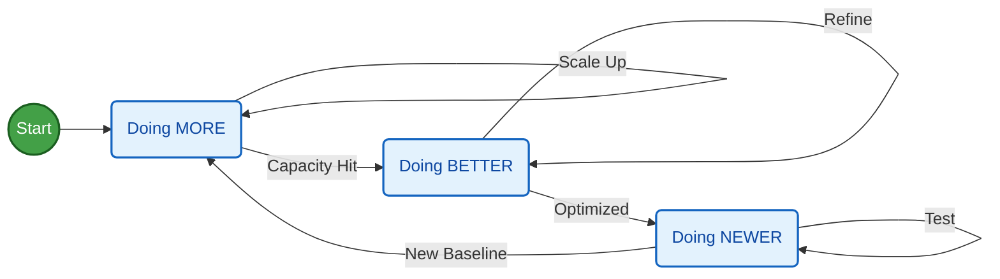

**Tl;DR**

Time to put all those **animations** together.


  


**Intro**

This is going to be a Python master class.

Or a sneek into the future on how cheap*er* information will be.


  
  



## F1


  


```sh
#git clone

```

### Kart On Boards

Uploading you action cam session is nice.


  
  


Specially when you use ffmpeg to join parts and ship fast.

But you can also create **overlay HUDs** with data from GoPro GPS and accelerometer

```sh
#git clone

```



No need to overcomplicate it with PhyPhox as your action cam already detects 3 axis acceleration for estabilization purposes.



You just wont get real time speeds to get the track references right.

### Karts x Optimal Track Models




## Real Estate

This is a snapshot in time of real estate situation in France:

```sh
#git clone

```



When we see something, we form a mental model of why things are the way they are.

Asking questions is important.

Because inside the questions we have implicit hypothesis, not only in the answers.

So: which explanation do we give to the rising housing prices ($/m2)?



Before that, lets look how housing prices are changing per region and time.

Because real estate...kind of relates with population...

right?

```sh
cd dk && uv run animate_dk_pop.py
uv run animate_dk_pop_delta.py
```

Maybe other factors like: *ease of credit have sth to do?*

```sh

```

Specially for those booms?

Just asking: bring your own theory of how the world works here

## Geospatial


## Financial Data x YFinance

Because its too simple and too cool to make such graphs.


  
  


Plus you can get some insights in between the noise: *does it really matter when you start doing sth?*

```sh
#git clone

```


<!-- https://www.youtube.com/watch?v=ctfGunPZwJ4 -->

Or is it just about getting started?

In case you thought the volatility was because of ~2010, let me show you that is just because of the beginnings:

Again: *do we have to just start?*



> If you are finding excuses not to get started with what you always wanted to do, maybe its [time to change that](#conclusions)


1. GWeiss

2. Nominal CAGR vs Real CAGR vs in EUR vs in GOLD

https://youtu.be/ctfGunPZwJ4

3. RSP vs SP500

4. Prices are a reflection of future cashflows corrected by....these:

```
=GOOGLEFINANCE("INDEXCBOE:TYX")/1000
=GOOGLEFINANCE("INDEXCBOE:TNX";"price")/1000
=GOOGLEFINANCE("INDEXCBOE:IRX")/1000
```

5. Whats going on with software? `IGV` tells us

6. There are some interesting indexes: `^VIX`, `^Move`


As someone said: you dont understand stock market if you dont understand first the bonds

## Physics

How about 3 bodies?

```sh
git clone https://github.com/JAlcocerT/ThreeBodies/
```


### Mechanism


```sh
#git clone https://github.com/JAlcocerT/Slider-Crank
git clone https://github.com/JAlcocerT/mechanism

```




  


Synthesis is a thing...

https://youtube.com/shorts/9b19b7SmovU


https://youtube.com/shorts/ipi437M6g5A

https://youtube.com/shorts/r8G3XRBn24s?is=sDOxquD4fxU6yKns

---

## Conclusions

Roo code extension has been interesting to use together with OpenAI API.

So...What if I told you that all this is very cheap to do nowadays?

It is if you have the right knowledge: *part of today's know-how are [prompts](https://jalcocert.github.io/JAlcocerT/ideas-to-execution-with-dao/#for-vibe-coders)* 

Or in other words, how good are you at making questions.

Questions like the ones you can have solved:


  
  



### About Gitlab

I have created all this consolidation in Gitlab.

Mainly bc I wanted to save the French DVF data somwhere and Github just allows for 100mb files.

But as I formatted recently, I needed to do the Gitlab Setup again: *all powered by [sha256](https://jalcocert.github.io/JAlcocerT/encryption-101/#the-sha256-algorithm) under the hood!*

```sh
ssh-keygen -t ed25519 -C "your_email@example.com"
#ssh -T git@gitlab.com #Preferences -> SSH Keys -> Paste public key -> you are in!
sudo apt install glab # For Debian/Ubuntu
glab auth login
glab repo create my-awesome-project --public
#git push --set-upstream git@gitlab.com:fossengineer/unfolding-data.git main
```

> See how to do so with this file

| Protocol | Hashing (SHA-256) | Actual Encryption |
| :--- | :--- | :--- |
| **Purpose** | Verification & Integrity | Privacy & Secrecy |
| **SSH** | Fingerprints & MACs | AES, ChaCha20 |
| **HTTPS** | Certificates & Handshakes | AES |

When doing some scripts, lately I have tried `Roo Code` extension and Zed: `https://zed.dev/pricing`

---

## FAQ

* https://github.com/GPSBabel/gpsbabel

>  GPSBabel: convert, manipulate, and transfer data from GPS programs or GPS receivers. Open Source and supported on MacOS, Windows, Linux, and more. Pointy clicky GUI or a command line version... 


### PhyPhox

* You can also save GPS data thanks to the [F/OSS PhyPhox](https://github.com/phyphox/phyphox-android) - An app that allow us to use phone's sensors for physics experiments:
  * Also available for [ESP32 with micropython](https://github.com/phyphox/phyphox-micropython)
  * And [for the Arduino microcontroller](https://github.com/phyphox/phyphox-arduino)