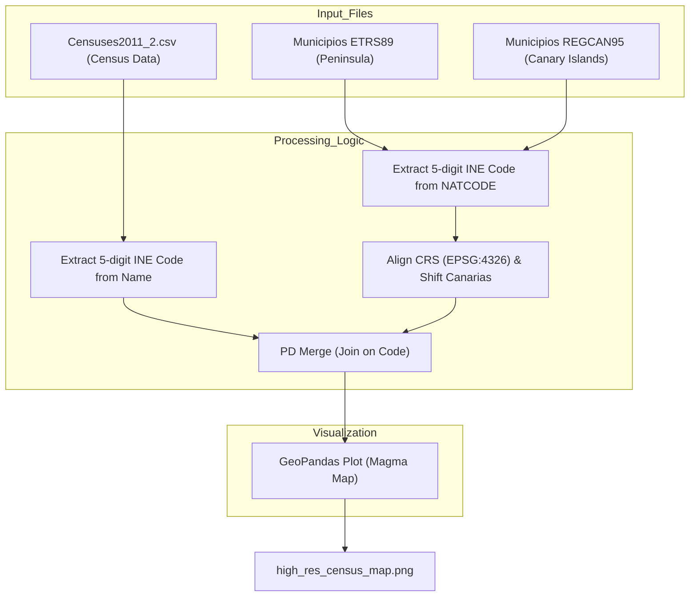
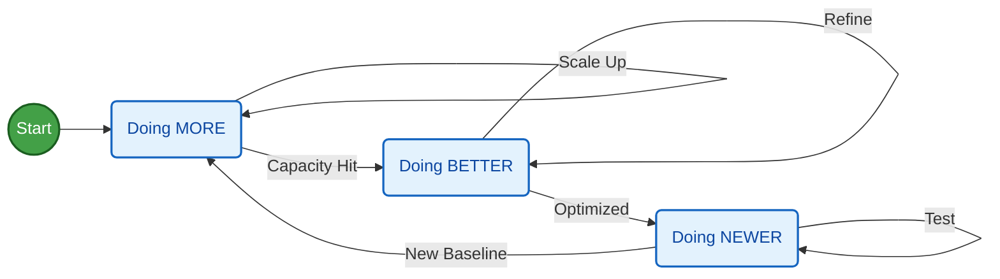

**Tl;DR**

Does this count as one of those things that you do *even if nobody pays you*?


  


**Intro**

This is going to be a Python master class.

Or a sneek into the future on how cheap*er* information will be.

Time to put all those **animations** together.


## F1

Let's continue where I left this at [the previous post](https://jalcocert.github.io/JAlcocerT/f1-data-animated/): `read-wiki.md`


  


This weekend we have a F1 GP going on.

So lets continue the analysis on how the new season regulations manifest.

```sh
#git clone https://github.com/JAlcocerT/eda-f1
make help

uv run f1_head_to_head.py
```

I could not resist to add a **clipping detector**:

```sh
#printf "2026\n1\nR\nA\nRUS,VER,HAM\n" | uv run f1_clipping_session.py
printf "2026\n1\nRUS\n" | uv run f1_clipping_detector.py
#uv run f1_clipping_detector.py
uv run f1_clipping_session.py
uv run f1_clipping_animated.py
```
<!-- 
https://youtu.be/MoP8R_aQrPI 
-->



And...lift and coast?

```sh
uv run f1_lc_session.py
uv run f1_lc_animated.py

printf "file 'lc_trends_2025_1_shorts_6s.mp4'\nfile 'lc_trends_2026_1_shorts_6s.mp4'" | ffmpeg -f concat -safe 0 -protocol_whitelist file,pipe -i - -c copy lc_trends_multi_year.mp4
```

You just [pairdrop this](https://pairdrop.net/):

```sh
make head_to_head ARGS="2026 2 ANT RUS"
#uv run f1_head_to_head.py 2026 2 ANT RUS

#make head_to_head
#make lc_animated
```

<!-- 
https://youtube.com/shorts/u9S50DobDmI 
-->




```sh
make deep analysis
printf "file 'lc_trends_2025_1_shorts_6s.mp4'\nfile 'lc_trends_2026_1_shorts_6s.mp4'" | ffmpeg -f concat -safe 0 -protocol_whitelist file,pipe -i - -c copy lc_trends_multi_year.mp4
```

Or just go an enjoy the race with: https://github.com/slowlydev/f1-dash or https://www.gp-tempo.com/


### Kart On Boards

Uploading you action cam session is nice.


  
  


Specially when you use ffmpeg to join parts and ship fast.

```sh
#git clone https://github.com/JAlcocerT/optimum-path
cd optimum-path/overlay
# pip install uv
#uv --version
uv add opencv-python
sudo apt-get install exiftool
##exiftool -ee ./GH020417.MP4 > output-GH020417.txt
mpv "GH010417.MP4" #get the second where you cross the finish line 
uv run gopro_h9_h13_hud_fastlap.py
#mpv "flying_lap_79.50s.mp4"
#mpv "hud_flying_lap.mp4"
#all looking good? just join them

ffmpeg -i output/flying_lap_79.50s.mp4 \
       -i output/hud_flying_lap.mp4 \
       -filter_complex "[1:v]scale=3840:2160,format=rgba,colorkey=0x000000:0.1:0.1[ck];[0:v][ck]overlay=0:0" \
       -codec:a copy -preset superfast \
       output/flying_lap_with_hud.mp4


mpv "flying_lap_with_hud.mp4"
```

<!-- https://youtu.be/7CakQjcs_vE
https://youtu.be/cta_dY9X8n4
https://youtu.be/Pyk8ZDKaWnc
https://youtu.be/KpkugCOI1rE -->



And another trial run:




Or just join them and ship that, in case you dont have gps:

```sh
rsync -avP *.MP4 /home/jalcocert/Desktop/oa5pro/ #speeds of ~32mb/s
sudo apt install mpv
mpv "DJI_20260308T3031.0002.0.MP4"
```

Trust me that [karting after raining](https://youtu.be/cQULovJU3Uc) is fun. [Trust me :)](https://www.youtube.com/watch?v=0oBr9mLWfL8)

But so much is to embed the telemetry: for gph9 or gph13 you better get the right exif

```sh
wget https://exiftool.org/Image-ExifTool-13.52.tar.gz
tar -xf Image-ExifTool-13.52.tar.gz
cd Image-ExifTool-13.52

perl Makefile.PL
make
sudo make install

exiftool -ver

uv run gopro_h9_h13_hud_fastlap.py #now allows for full session hud creation
─── Composite command (full session) ───────────────────
  (HUD 1920×1080 → scaled to 3840×2160 to match video)
ffmpeg -i ./GX010010.MP4 \
       -i output/hud_full_session.mp4 \
       -filter_complex "[1:v]scale=3840:2160,format=rgba,colorkey=0x000000:0.1:0.1[ck];[0:v][ck]overlay=0:0" \
       -codec:a copy -preset superfast \
       output/full_session_with_hud.mp4
─────────────────────────────────────────────────────────

mpv "full_session_with_hud.mp4"
#mv full_session_with_hud.mp4 p1.mp4
#mv full_session_with_hud.mp4 p2.mp4 #for the second part

# 1. Create a file list
echo -e "file 'p1.mp4'\nfile 'p2.mp4'" > list.txt

# 2. Join them
ffmpeg -f concat -safe 0 -i list.txt -c copy output.mp4
mpv "output.mp4"
```

<!-- https://youtu.be/KpkugCOI1rE -->



Or just the fast lap:

<!--  -->



No need to overcomplicate it with PhyPhox as your action cam already detects 3 axis acceleration for estabilization purposes.

You just wont get real time speeds to get the track references right.

And yep, it works from GPH9 as well as GPH13:


### Karts x Optimal Track Models

From the tinkering around karting sessions, where I extracted GoPro GPS telemtry and play with it

This has been the most practical model among the ones I tried:




## Real Estate

This is a snapshot in time of real estate situation in France:




```sh
#git clone https://github.com/JAlcocerT/eda-geospatial

```



When we see something, we form a mental model of why things are the way they are.

Asking questions is important.

Because inside the questions we have implicit hypothesis, not only in the answers.

So: which explanation do we give to the rising housing prices ($/m2)?



Before that, lets look how housing prices are changing per region and time.

Because real estate...kind of relates with population...


```mermaid
graph TD
    subgraph Input_Files
        CSV["Censuses2011_2.csv (Census Data)"]
        SHP_P["Municipios ETRS89 (Peninsula)"]
        SHP_C["Municipios REGCAN95 (Canary Islands)"]
    end

    subgraph Processing_Logic
        EXT_CSV["Extract 5-digit INE Code from Name"]
        EXT_SHP["Extract 5-digit INE Code from NATCODE"]
        CRS["Align CRS (EPSG:4326) & Shift Canarias"]
        JOIN["PD Merge (Join on Code)"]
    end

    subgraph Visualization
        MAP["GeoPandas Plot (Magma Map)"]
    end

    CSV --> EXT_CSV
    SHP_P --> EXT_SHP
    SHP_C --> EXT_SHP
    
    EXT_CSV --> JOIN
    EXT_SHP --> CRS
    CRS --> JOIN
    
    JOIN --> MAP
    MAP --> PNG["high_res_census_map.png"]
```

right?

```sh
cd dk && uv run animate_dk_pop.py
uv run animate_dk_pop_delta.py
```

Maybe other factors like: *ease of credit have sth to do?*

```sh

```

Specially for those booms?

Just asking: *bring your own theory of how the world works here*

## Geospatial

nuts2 arcgis

https://www.arcgis.com/home/item.html?id=48f0d1a2006c4e89a85712a618fcff89


## Financial Data x YFinance

Because its too simple and too cool to make such graphs.


  
  


Plus you can get some insights in between the noise: *does it really matter when you start doing sth?*

```sh
#git clone DataInMotion

```


<!-- https://www.youtube.com/watch?v=ctfGunPZwJ4 -->

Or is it just about getting started?

In case you thought the volatility was because of ~2010

Let me show you that is just because of beginnings being inherently volatile:

<!-- 
https://youtu.be/8sToNvTpwVQ -->



Again: *do we have to just get started?*

```sh
uv run tests/plot_year_end_close_cagr_to_date_animated_rolling_start.py ^GSPC ^DJI ^IXIC ^N225 ^GDAXI ^FTSE --start 2005-01-01 \
  --num-years 20 --duration-per-year 3 --fps 30 --brand "@UnfoldingData" --preset twitter_hd

  uv run tests/plot_year_end_close_cagr_to_date_table.py ^GSPC ^DJI ^IXIC --start 2010-01-01 --out tests/cagr_stats_test.png
```

<!-- 
https://youtu.be/4zE-mYMefak 
-->





```mermaid
flowchart LR
    %% Styles
    classDef state fill:#E3F2FD,stroke:#1565C0,stroke-width:2px,color:#0D47A1;
    classDef start fill:#43A047,stroke:#1B5E20,stroke-width:2px,color:white;

    %% Nodes
    Start((Start)):::start --> More
    More(Doing MORE):::state
    Better(Doing BETTER):::state
    Newer(Doing NEWER):::state

    %% Internal Feedback Loops (The Grind)
    More -- "Scale Up" --> More
    Better -- "Refine" --> Better
    Newer -- "Test" --> Newer

    %% The Progression Journey
    More -- "Capacity Hit" --> Better
    Better -- "Optimized" --> Newer
    
    %% The Upward Spiral
    Newer -- "New Baseline" --> More
```

> If you are finding excuses not to get started with what you always wanted to do, maybe its [time to change that](#conclusions)


1. GWeiss

```sh
#git clone https://github.com/JAlcocerT/DataInMotion.git
cd DataInMotion && git checkout libreportfolio #git branch -a
#git branch --show-current

curl -LsSf https://astral.sh/uv/install.sh | sh

uv run tests/plot_historical_gweiss.py ADM --start 2000-01-01 --brand "@LibrePortfolio" --warmup-days 400
```

Dividends? no problem

```sh
#uv run tests/plot_historical_yield.py CAT --start 2000-01-01 --brand "@LibrePortfolio" --monthly
uv run tests/plot_historical_yield.py NVO --start 2000-01-01 --brand "@LibrePortfolio" --monthly
uv run tests/plot_historical_gweiss.py NVO --start 2000-01-01 --brand "@LibrePortfolio" --warmup-days 400
```

2. Nominal CAGR vs Real CAGR vs in EUR vs in GOLD

<!-- https://youtu.be/ctfGunPZwJ4 -->




What else does **gold** have to say?



<!-- 
https://youtu.be/xqtzYbHIrMo -->

3. RSP vs SP500

```sh
uv run tests/plot_year_end_close_cagr_to_date_animated_sequential.py ^GSPC RSP --start 2004-01-01 --preset twitter_hd --duration-seconds 60 --fps 30 --brand "@UnfoldingData"
```

<!-- https://youtu.be/Jqr5ADapnfA -->




4. Prices are a reflection of future cashflows corrected by....these:

```
=GOOGLEFINANCE("INDEXCBOE:TYX")/1000
=GOOGLEFINANCE("INDEXCBOE:TNX";"price")/1000
=GOOGLEFINANCE("INDEXCBOE:IRX")/1000
```

You can pull these indexes from yfinance too:

```sh
uv run tests/plot_year_end_close_cagr_to_date_animated_sequential.py ^TNX ^TYX ^IRX --start 2000-01-01 --preset twitter_hd --duration-seconds 60 --fps 30 --brand "@UnfoldingData"
uv run tests/plot_price_change_from_start.py ^TNX ^TYX ^IRX --start 2000-01-01 --brand "@UnfoldingData"
uv run tests/plot_price.py ^TNX --start 2000-01-01 --brand "@UnfoldingData"

uv run tests/plot_price_change_from_start_animated_sequential.py ^TNX ^TYX ^IRX --start 2000-01-01 --brand "@UnfoldingData" --duration-seconds 60 --fps 30

# uv run tests/plot_price_change_from_start.py ^TNX --start 2000-01-01 --brand "@UnfoldingData"
# uv run tests/plot_price_change_from_start.py ^TYX --start 2000-01-01 --brand "@UnfoldingData"
# uv run tests/plot_price_change_from_start.py ^IRX --start 2000-01-01 --brand "@UnfoldingData"
```

As someone said: *you dont understand stock market if you dont understand bonds first*

<!-- https://youtu.be/B_nymykHmE4 -->




5. Whats going on with software? `IGV` tells us

6. There are some interesting indexes: `^VIX`, `^Move` or `^OVX` for oil!


```sh
uv run tests/plot_year_end_close_cagr_to_date_animated_sequential.py ^VIX ^OVX --start 2008-01-01 --preset twitter_hd --duration-seconds 60 --fps 30 --brand "@UnfoldingData"

uv run tests/plot_price_change_from_start_animated_sequential.py ^TNX ^VIX ^OVX --start 2000-01-01 --brand "@UnfoldingData" --duration-seconds 60 --fps 30
```

MOVE (ICE BofA MOVE Index for bond volatility) — not available on Yahoo Finance. It's a proprietary index from ICE/BofA. You'd need a Bloomberg or FRED data source for it.



<!-- https://youtu.be/B_nymykHmE4 -->


7. How about other commodities like `CL.F` oil?

```sh
uv run tests/plot_price_change_from_start_animated_sequential.py CL=F GC=F HG=F --start 2000-01-01 --brand "@UnfoldingData" --duration-seconds 60 --fps 30
```

<!-- 
https://youtu.be/XgFHIrFSvpE
-->




## Physics

How about...3 bodies, mechanism and a double pendulum?

It's always a good time to refresh what [loop equations](#what-are-loop-equations) and the [lagrangian](#what-it-is-the-lagrangian) are.

But lets have some fun:

```sh
git clone https://github.com/JAlcocerT/ThreeBodies/
#cd ThePoincareLab #for the cool new webapp!
./renderer_env/bin/python3 generate_animation.py --vel 0.2 -0.2 0.2 0.2 -0.3 0.0 --duration 300.0 --output simulation3.mp4
```

Initially, I thought about creating a separated repo.

But...what for?

This can be a sub-folder and use one of the latest ways to do [cool greenfield UIs](https://jalcocert.github.io/JAlcocerT/ideas-to-execution-with-dao/#for-vibe-coders) I have got to know:



<!-- https://youtu.be/b35XuJI98kI -->


### Mechanism


[Gabe's mechanism project](https://github.com/gabemorris12/mechanism) was an inspiriration to me to come back at some point to mechanical engineering.

This time with python, not with Matlab:

```sh
#git clone https://github.com/JAlcocerT/Slider-Crank
#git clone https://github.com/JAlcocerT/mechanism #this is my fork of his original project

git clone https://github.com/JAlcocerT/mbsd
cd mbsd/2D-Kinematics
python examples/slider_crank.py

cd examples
echo -e "file 'p1.mp4'\nfile 'p2.mp4'" > list.txt

# 2. Join them
ffmpeg -f concat -safe 0 -i list.txt -c copy output.mp4
mpv "output.mp4"
```

Why to have just positions:

<!-- https://youtu.be/WfgIy6KeZTY -->




When you can have augmented reality with velocities and accelerations:

<!-- https://youtu.be/hCOSqf4dXqc -->



There is no problem to [deploy statically a cool page](https://multibodysystemdynamics.pages.dev/) that uses JS via CSR to solve the slider-crank simple and beautiful loop equations:

The Loop Equation: *there are 2 equations inside here, as these are 2D vectors!*

$$\vec{r}_2 + \vec{r}_3 - \vec{d} = 0$$

The Scalar equivalent Breakdown: *no complex [calculus](https://jalcocert.github.io/JAlcocerT/calculus-101/) nor [algebra](https://jalcocert.github.io/JAlcocerT/algebra-101/) here!*

This \(\sigma(z) = \frac{1}{1 + e^{-z}}\) is an inline expression.

$$F(\omega) = \int_{-\infty}^{\infty} f(t)\, e^{-j \omega t} \, dt$$

$$
\begin{aligned}
  \nabla \cdot \mathbf{E} &= \frac{\rho}{\varepsilon_0} \\
  \nabla \cdot \mathbf{B} &= 0 \\
  \nabla \times \mathbf{E} &= -\frac{\partial \mathbf{B}}{\partial t} \\
  \nabla \times \mathbf{B} &= \mu_0 \left( \mathbf{J} + \varepsilon_0 \frac{\partial \mathbf{E}}{\partial t} \right)
\end{aligned}
$$

Horizontal: $r_2 \cos(\theta_2) + r_3 \cos(\theta_3) - d = 0

$Vertical: $r_2 \sin(\theta_2) + r_3 \sin(\theta_3) = 0$

> Yea, [katex](https://katex.org/docs/supported.html) x [Hugo Hextra](https://imfing.github.io/hextra/docs/guide/latex/) is great





  


Synthesis has always been a thing...

https://youtube.com/shorts/9b19b7SmovU


https://youtube.com/shorts/ipi437M6g5A

https://youtube.com/shorts/r8G3XRBn24s?is=sDOxquD4fxU6yKns

I just have not been focusing on mechanism for long time.

But shortly will be allocating some time to tinker back :)

### Double Pendulum

The double pendulum is the "chaotic cousin" of the slider-crank.

While it looks like a simple linkage, its motion is governed by **energy and dynamics** rather than just static geometry.

Unlike the slider-crank, where you use simple algebraic loop equations, the double pendulum requires **Lagrangian mechanics** to describe how it evolves over time.

The Lagrangian Equations

To find the equations of motion, we define the system by its kinetic energy ($T$) and potential energy ($V$). 

The Lagrangian ($L$) is:


$$L = T - V$$

For two masses ($m_1, m_2$) and two lengths ($l_1, l_2$) at angles ($\theta_1, \theta_2$), the resulting equations of motion are a pair of coupled, non-linear second-order differential equations.

1. Equation for $\theta_1$

This describes the acceleration of the top arm:


$$(m_1 + m_2) l_1 \ddot{\theta}_1 + m_2 l_2 \ddot{\theta}_2 \cos(\theta_1 - \theta_2) + m_2 l_2 \dot{\theta}_2^2 \sin(\theta_1 - \theta_2) + (m_1 + m_2) g \sin \theta_1 = 0$$

2. Equation for $\theta_2$

This describes the acceleration of the bottom arm:


$$l_2 \ddot{\theta}_2 + l_1 \ddot{\theta}_1 \cos(\theta_1 - \theta_2) - l_1 \dot{\theta}_1^2 \sin(\theta_1 - \theta_2) + g \sin \theta_2 = 0$$

Why is it so different from the Slider-Crank?

While both involve links and pins, the double pendulum is a **dynamic system**, not a **kinematic mechanism**:

* **Degrees of Freedom:** In a slider-crank, if you move the crank $1^\circ$, the piston moves a specific, predictable distance. In a double pendulum, the arms are free to swing; their position depends on gravity and momentum, not just the "input" angle.

* **Coupling:** Notice the $\cos(\theta_1 - \theta_2)$ terms. This means the movement of the bottom arm physically "tugs" on the top arm and vice-versa.

* **Chaos:** At high energies, the double pendulum is famously chaotic. A change of $0.001^\circ$ in the starting position will result in a completely different path after just a few swings.

Comparison at a Glance

| Feature | Slider-Crank | Double Pendulum |
| --- | --- | --- |
| **Equation Type** | Algebraic (Trig) | Differential (Calculus) |
| **Input** | Forced (Motor/Crank) | Gravity/Initial Push |
| **Path** | Fixed (Circular/Linear) | Chaotic/Unpredictable |
| **Goal** | Position Mapping | Predicting Motion over Time |

Would you like to see the **State-Space** version of these equations?

### The 3 Body problem

From **3 bodies** you can jump to the 4 bar mechanism quite easily:

<!-- 
https://www.youtube.com/watch?v=b35XuJI98kI 
-->



In fact, for kinematics: you just need geometry and time. 

Forget about forces *at least for now*

The sympy and https://github.com/KmolYuan/Pyslvs-UI will be for another post :)

The "Three-Body Problem" is a massive jump in complexity from the slider-crank. While the slider-crank is a **constrained kinematic chain** (predictable movement), the three-body problem is a **dynamical system** governed by gravity.

In this case, "loop equations" don't apply because the bodies aren't physically linked by rods or joints—they are linked by the invisible force of gravity.

The Equations of Motion

To describe the motion of three masses ($m_1, m_2, m_3$) at positions ($\vec{r}_1, \vec{r}_2, \vec{r}_3$), we use Newton's Second Law combined with the Law of Universal Gravitation.

The acceleration of the first body ($m_1$) is determined by the gravitational pull from the other two:

$$\ddot{\vec{r}}_1 = -G m_2 \frac{\vec{r}_1 - \vec{r}_2}{|\vec{r}_1 - \vec{r}_2|^3} - G m_3 \frac{\vec{r}_1 - \vec{r}_3}{|\vec{r}_1 - \vec{r}_3|^3}$$

The System of Equations

Because each body affects every other body, you have a system of three second-order differential equations:

1. **For Body 1:** $\ddot{\vec{r}}_1 = G \sum_{j \neq 1}^{3} \frac{m_j (\vec{r}_j - \vec{r}_1)}{|\vec{r}_j - \vec{r}_1|^3}$
2. **For Body 2:** $\ddot{\vec{r}}_2 = G \sum_{j \neq 2}^{3} \frac{m_j (\vec{r}_j - \vec{r}_2)}{|\vec{r}_j - \vec{r}_2|^3}$
3. **For Body 3:** $\ddot{\vec{r}}_3 = G \sum_{j \neq 3}^{3} \frac{m_j (\vec{r}_j - \vec{r}_3)}{|\vec{r}_j - \vec{r}_3|^3}$

Why is it so famous?

Unlike the slider-crank, where you can easily solve for the piston's position with basic trig, the Three-Body Problem is **analytically unsolvable** for the general case.

* **Chaos:** Small changes in the starting positions lead to wildly different results (the "Butterfly Effect").
* **No General Solution:** There is no simple formula (like $d = \dots$) that tells you where the bodies will be at any time $t$.
* **Special Cases:** We only have solutions for specific setups, like the **Lagrange Points** or specific periodic orbits (like the "Figure-8" orbit).


| Feature | Slider-Crank | Three-Body Problem |
| --- | --- | --- |
| **Connection** | Physical links/joints | Gravitational fields |
| **Math Tool** | Algebraic Loop Equations | Differential Equations |
| **Predictability** | Deterministic/Periodic | Often Chaotic |
| **Solution** | Closed-form (exact) | Numerical (simulated) |

---

## Conclusions

Any ideas to animate?

Maybe a bicycle?

As I did [here](https://ereding.etsi.us.es/bibing/proyectos/abreproy/90128/) https://github.com/JAlcocerT/Bike_dynamic_simulator


That was a **real time** challenge: https://link.springer.com/book/10.1007/978-1-4612-2600-0






  



  
  



  
  




  
  


### Animations or Dashboards?

[Roo code](https://github.com/RooCodeInc/Roo-Code) extension has been interesting to use together with OpenAI API.

> When doing some scripts, lately I have tried `Roo Code` extension and Zed: `https://zed.dev/pricing`

You guessed it.

Currently making animations is simple.

So is to understand and create dashboards: *including with PBi*

```md
i have made a pbip export and brought to this files 3 files, would those be enough for you to infer all the goodies of the data model, ui, transformations etc? 
```

| File | Contents |
|---|---|
| `model.bim` | Full semantic model — tables, Power Query (M) transformations, DAX measures, calculated columns, relationships, hierarchies |
| `report.json` | Report layout — pages, visuals, positions, filters, slicers, bookmarks, field bindings |
| `diagramlayout.json` | Visual positioning of tables in the model relationship diagram (cosmetic only) |

These three files are sufficient to fully reconstruct the data model, all transformations, all DAX logic, all report visuals, and all relationships.

> Same with [Kilo Code](https://kilo.ai/pricing)!

So...What if I told you that all this is very cheap to do nowadays?

It is if you have the right knowledge: *part of today's know-how are [prompts](https://jalcocert.github.io/JAlcocerT/ideas-to-execution-with-dao/#for-vibe-coders)* 

Or in other words, how good are you at [making questions](https://jalcocert.github.io/JAlcocerT/ideas-to-execution-after-learning/#questions).

### The last time that

I cant reply questions like: *whats the thing that you really love*

But if you have interests, just that are blocked to make them happen:


  
  


### About Gitlab

I have created all this consolidation in Gitlab.

Mainly bc I wanted to save the French DVF data somwhere and Github just allows for 100mb files.

But as I formatted recently, I needed to do the Gitlab Setup again: *all powered by [sha256](https://jalcocert.github.io/JAlcocerT/encryption-101/#the-sha256-algorithm) under the hood!*

```sh
ssh-keygen -t ed25519 -C "your_email@example.com"
#ssh -T git@gitlab.com #Preferences -> SSH Keys -> Paste public key -> you are in!
sudo apt install glab # For Debian/Ubuntu
glab auth login
glab repo create my-awesome-project --public
#git push --set-upstream git@gitlab.com:fossengineer/unfolding-data.git main
```

> See how to do so with this file

| Protocol | Hashing (SHA-256) | Actual Encryption |
| :--- | :--- | :--- |
| **Purpose** | Verification & Integrity | Privacy & Secrecy |
| **SSH** | Fingerprints & MACs | AES, ChaCha20 |
| **HTTPS** | Certificates & Handshakes | AES |


---

## FAQ

### What are Loop Equations?

Loop equations (also known as vector loop equations) are a fundamental tool in kinematics used to analyze the position, velocity, and acceleration of interconnected bodies in a mechanism.

In mechanical engineering, a mechanism is essentially a "closed loop" of links connected by joints. 

If you follow the path from one joint, through all the links, and back to the starting point, the total displacement must be zero.

Mathematically, we represent each link as a **vector** with a specific magnitude (length) and direction (angle). 

The loop equation is the vector sum of these links:

$$\sum_{i=1}^{n} \vec{r}_i = 0$$

To solve these for specific positions, the vector equation is typically broken down into two scalar algebraic equations using trigonometry:

* **X-component:** $\sum r_i \cos(\theta_i) = 0$
* **Y-component:** $\sum r_i \sin(\theta_i) = 0$

Application to the Slider-Crank

**Yes, loop equations apply directly to the slider-crank mechanism.** 

In fact, they are the standard method for determining the piston's position relative to the crank angle.

Why do they apply?

The slider-crank is considered a "closed" kinematic chain.

Even though the slider moves linearly, we can treat the distance from the ground origin to the slider pin as a "link" of varying length.

1. **Geometric Constraint:** The physical connection between the crank, the connecting rod, and the slider creates a fixed geometric relationship.
2. **Solvability:** A standard slider-crank has one degree of freedom (the crank angle $\theta$). By using the loop equations, you can solve for the unknown variables: the angle of the connecting rod and the linear position of the slider.
3. **Vector Closure:** If you define a vector for the crank ($\vec{r}_2$), the connecting rod ($\vec{r}_3$), and the slider position ($\vec{r}_d$), the loop is closed by the "ground" distance.

The Equation for a Slider-Crank

For a typical slider-crank where the crank is $r_2$, the rod is $r_3$, and the slider displacement is $d$, the vector loop looks like this:

$$\vec{r}_2 + \vec{r}_3 - \vec{d} = 0$$

By solving the $y$-component equation ($r_2 \sin \theta_2 + r_3 \sin \theta_3 = 0$), you can find the rod angle. Then, using the $x$-component, you find the exact position of the piston.

### What it is the Lagrangian?

It's a kind of magic.

Only that its not magic, its Physics.