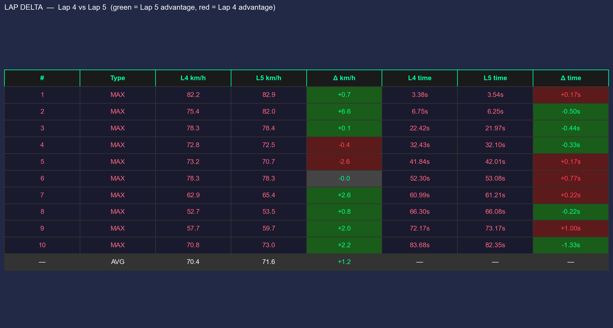

**Tl;DR**

The season has just started: *How much slower cars are*?

How about looking at some data?

**Intro**

Sometime back I wrote [about F1 data APIs](https://jalcocert.github.io/JAlcocerT/interesting-apis/#formula-1): https://docs.fastf1.dev/

https://www.f1-tempo.com/ and https://www.gp-tempo.com/

* https://f1-dash.com/dashboard/track-map

After talking [about geo recently](https://jalcocert.github.io/JAlcocerT/geo-maps-and-data/)

creating HUDs overlays for my action cam videos...

Today, its about F1.

But not the ML f1 score, just...formula 1.


  
  


Particularly, [F1 data](#f1-animated-stories).

## F1 Animated Stories

According to people risking their money in Polymarket: the championship is leaning towards Ferrari and Mercedes.

But how about digging to car telemetry and lap times?

```sh
#sudo apt install gh
gh auth login
#gh repo create eda-f1 --private --source=. --remote=origin --push
    
git init && git add . && git commit -m "Initial commit: simple eda-f1" && gh repo create eda-f1 --private --source=. --remote=origin --push
```

Lets build some data stories that can *potentially* be more interesting than races itself.

### The Data

No data = no fun :)

Its all coming from this awsome project i got to know [a while back](https://jalcocert.github.io/JAlcocerT/interesting-apis/#formula-1):

* https://github.com/IAmTomShaw/f1-race-replay 
    * https://github.com/JAlcocerT/f1-race-replay

> Uses fastf1 package to [source the data via API](https://jalcocert.github.io/JAlcocerT/interesting-apis/#formula-1)

The cool telemetry data is from 2018+, but there is lap timing from 1950 :

```sh
uv init

uv add -r requirements.txt
uv run check_sessions.py
```

```sh
uv run extract_laps.py
uv run plot_laps.py
```

```sh
uv run extract_telemetry.py
uv run plot_telemetry.py
```

### The Animations


```sh
#git clone


uv run f1_head_to_head.py
```

I could not resist to add a **clipping detector**:

```sh
#printf "2026\n1\nR\nA\nRUS,VER,HAM\n" | uv run f1_clipping_session.py
printf "2026\n1\nRUS\n" | uv run f1_clipping_detector.py
#uv run f1_clipping_detector.py
uv run f1_clipping_session.py
uv run f1_clipping_animated.py
```
<!-- 
https://youtu.be/MoP8R_aQrPI 
-->



And...lift and coast?

```sh
uv run f1_lc_session.py
uv run f1_lc_animated.py

printf "file 'lc_trends_2025_1_shorts_6s.mp4'\nfile 'lc_trends_2026_1_shorts_6s.mp4'" | ffmpeg -f concat -safe 0 -protocol_whitelist file,pipe -i - -c copy lc_trends_multi_year.mp4
```

### The Look and Feel

1. With the BRD -> Development plan approach

2. This [enhanced prompt](https://jalcocert.github.io/JAlcocerT/ideas-to-execution-with-dao/#for-vibe-coders) to get amazing UIs

3. Plus, these [CRO tricks](https://www.youtube.com/watch?v=vySA02B8SLE)




  
  



### The Results

Back in the days this would have been enough for me to buy a domain that results in nothing.

Im holding that fake urgency :)

You can enjoy the [kart videos](#more-gopro-gps-telemetry) anyways!

---

## Conclusions

What it started with the [route tracker](https://github.com/JAlcocerT/optimum-path) and continued as:


  
  


Can be shaped as a webapp: *thx to [this cool prompt](https://jalcocert.github.io/JAlcocerT/ideas-to-execution-with-dao/#for-vibe-coders)*

```sh

```

But before going there...

Was there any doubt that new regulations make the ones learning faster be way ahead of the rest?

```sh
uv run check_sessions.py
# [Oldest Data Check]
# Oldest schedule data found for: 1950
# First event of 1950: British Grand Prix (1950-05-13)

# [Current 2026 Season Status]
# ✅ Last Session: Australian Grand Prix - Qualifying (2026-03-07 05:00 UTC)
#    Finished: 0 days, 5 hours ago
# 🚀 Next Session: Australian Grand Prix - Race (2026-03-08 04:00 UTC)
#    Starts in: 0 days, 17 hours
```

<!-- https://www.youtube.com/watch?v=Ujb1Vrjlo8k -->



Ops

I mean, Im came to this post after the geospatial eda and some oa5 x hud...


  
  


This is what reality shows it happens after an aggresive change of rules:

```sh
uv run f1_q3_plots.py
```

Was there any surprise that keeping a rule long enough is what makes teams be closer to each other?

Diminishing returns....anyone?

```sh
uv run f1_q3_short.py
```

<!-- 
https://youtube.com/shorts/BVqQdhvKe5o 
-->




> AUS 2025 Q3 P1 to P10 gap ~1s (+0.835s)

> > AUS 2026 Q3 P1 to P10 gap >1s [(+1.453s)](https://youtube.com/shorts/ERqGNyEpMJk)

And this is not a debate whether making drivers race with less dispair cars is good or not.

Neither if F1 should be similar to e-f1...or just going [closer to the limit](https://www.youtube.com/watch?v=4vstWEvjW18) each lap.

<!-- 
https://youtu.be/DCHhpNX6EYM
 -->




```sh
#printf "2025\n1\nNOR\n2\n" | uv run f1_deep_analysis.py
uv run f1_deep_analysis.py #coasting x2 versus 2025 :)
# ========================================
# 📊 PERFORMANCE SUMMARY: RUS @ Australian Grand Prix
# ========================================
# 🟢 Full Throttle:  63.0% of lap
# 🔴 Braking:       12.5% of lap
# 🟡 Coasting:      4.2% of lap
# 🔵 DRS Active:    0.0% of lap
# ⚡ Max G-Force:   2.75 G (Accel)
# 🛑 Min G-Force:   -4.01 G (De-accel)
# ========================================


# ✅ Analysis complete! Visualization saved as: deep_analysis_2026_1_RUS.png
printf "2026\n1\nRUS\n2\ny\n" | uv run f1_deep_analysis.py
aristotel onassis

#printf "file 'deep_analysis_2026_1_RUS_hud.mp4'\nfile 'deep_analysis_2025_1_1_hud.mp4'" > concat_list.txt && ffmpeg -f concat -safe 0 -i concat_list.txt -c copy deep_analysis_joined.mp4
uv run f1_session_summary.py
printf "file 'deep_analysis_2026_1_RUS_hud.mp4'\nfile 'outro_2026.mp4'\nfile 'deep_analysis_2025_1_NOR_hud.mp4'\nfile 'outro_2025.mp4'" > cinematic_review_list.txt
ffmpeg -f concat -safe 0 -i cinematic_review_list.txt -c copy f1_cinematic_review.mp4
```

With nice [results](https://youtu.be/LUMbYYZOn-g)!



### About Unfolding Data

It was about time to make some use of this fantastic api.

Because, in case you havent realize yet: *shipping is becoming more and more about asking questions*

Do you have questions?


  
  


I had some, and created these:


  
  


Also, thinking about unifying these would be next.

Because IoTrack and Unfolding data need some love and attention.

And yep: making those animated stories of points per seasons is possible thanks to:

```sh
uv run extract_results.py #race classification
#uv run extract_qualifying.py #saturday qualifying results
```

### Sodis Prep?

How much are these kind of analysis useful for an [amateur 3h endurance preparation](https://jalcocert.github.io/JAlcocerT/gopro-telemetry-desktop-python/#about-sodis-series)?

Getting the results post race from the [GoPro GPS](#more-gopro-gps-telemetry) is nice.

But probably a mycrhon 5s (propietary file formats and better for offline analysis)

or RaceCapture for pro data adquisition

that seems to allow mqtt/csv's/wifi out of the box 

<!-- 
https://www.youtube.com/watch?v=8vMJuyT3bo4 
-->



#### More GoPro GPS Telemetry

The kind of thing you do after a karting session: *understanding [this public repo folder](https://github.com/JAlcocerT/Py_RouteTracker/tree/main/overlay)*

```sh
#choco install ffmpeg
git clone https://github.com/JAlcocerT/Py_RouteTracker
time python3.10 ./Py_RouteTracker/overlay/racing_hud_v7.py 
#make sure to tweak the Lap Logic session and your MP4 names accordingly!
deactivate #go out of the python venv and just join the HUD with the original video
# ffmpeg -f concat -safe 0 \
#   -i <(printf "file '$PWD/GX010411.MP4'\nfile '$PWD/GX020411.MP4'") \
#   -c copy \
#   racing_session2.mp4
  
#for linux
# ffmpeg -i ./GX010009.MP4 \
#        -i ./output/HUD_v7_Session.mp4 \
#        -filter_complex "[1:v]format=rgba,colorkey=0x000000:0.1:0.1[ckout];[0:v][ckout]overlay=W-w-50:H-h-50" \
#        -codec:a copy \
#        -preset superfast \
#        racing_v7_output.mp4
ffmpeg -i ./GX010009.MP4 `
       -i ./output/HUD_v7_Session.mp4 `
       -filter_complex "[1:v]format=rgba,colorkey=0x000000:0.1:0.1[ckout];[0:v][ckout]overlay=W-w-50:H-h-50" `
       -codec:a copy `
       -preset superfast `
       racing_v7_output.mp4
```

Get inspired to create or schedule a [consultation](#conclusions): *bc this is not OSS :)*

```sh
git clone https://github.com/JAlcocerT/optimum-path #
#rsync -avP *.MP4 /home/jalcocert/Desktop/optimum-path/overlay
cd optimum-path
python -m venv venv
#python3 -m venv venv
#pip install -r requirements.txt
.\venv\Scripts\activate
#source venv/bin/activate
pip install opencv-python numpy pandas
python gopro_racing_hud.py
#python gopro_racing_hud_simple.py --t=2
#deactivate
```

And generating some **magic**: *and without [race chrono](https://jalcocert.github.io/JAlcocerT/blog/tinker-racing/) pro :)*

<!-- https://youtu.be/rW-E9L5bQdw -->



Make sure you do this before deleting the original MP4 files, it wont work with the joined files, neither with what you upload to youtube


It’s a classic "Convenience vs. Freedom" trade-off

| Feature | **AiM MyChron 5S / 6** | **RaceCapture/Track MK4** |
| --- | --- | --- |
| **Out-of-the-Box** | **All-in-one.** Screen, battery, and GPS are one physical unit. | **Brain only.** You need a separate phone/tablet to see data while driving. |
| **Data Format** | **Proprietary.** Uses `.XRK` files; requires AiM software to "unlock" them. | **Open.** Logs directly to `.CSV`. You can open it in Excel or Python instantly. |
| **Live Data** | **No.** Pit crew only sees data *after* you finish and download it via Wi-Fi. | **Yes.** Streams live to the web (Podium.live) via your phone's hotspot. |
| **Software** | **Industrial.** Powerful but looks like Windows 95; very rigid ecosystem. | **Modern/Hacker.** Cross-platform app; Lua scripting; community-driven. |
| **Setup for Rental** | Mount 1 device. Done. | Mount the "brain" + Mount a phone + Connect power bank. |

Is the "Separate Dashboard" a Dealbreaker?

For many rental racers, the MK4's lack of a screen is the biggest hurdle. Here is how people usually handle it:

* **The "Cheap" Screen:** You use your existing smartphone. You mount it to the steering wheel or windshield using a RAM mount and run the RaceCapture App. It connects to the MK4 via Bluetooth/Wi-Fi and becomes your dashboard.
* **The "Clean" Way:** You buy a cheap, ruggedized Android tablet ($80) and leave it dedicated to the car.
* **The "Invisible" Way:** If you don't care about seeing your lap times while driving (and only care that your **colleagues** see the data and you get the CSV later), you can just tuck the MK4 and a power bank into a seat pocket or velcro it to the frame. It will log everything silently.


Since you're trying to solve a physical handling issue:

* **MyChron 5S:** You’ll be looking at "wobbly" lines in Race Studio 3. It’s effective, but you’re stuck in their interface.
* **RaceCapture:** You can take that CSV, head over to a Jupyter Notebook or even a Google Sheet, and overlay the $Z$-axis (vertical) vibration against your $X/Y$ (lateral/longitudinal) G-forces. If you like "making the download yourself," this is the only one that won't make you pull your hair out.

* **Choose MyChron 5S** if you want the "Standard." Every kart shop knows how to fix it, and you don't want to mess with phone mounts and power banks before a race.
* **Choose RaceCapture MK4** if you want to **stream to your friends** and want to own your data without "permission" from a manufacturer. It is the superior tool for a "hacker" mindset, especially for diagnosing that lateral jump.

But hey...im not leaving yet.

```md
 thats amazing, could you take some ideas from gopro_racing_hud.py? particularly, the possibility to     bring the map with the position of the kart in the circuit (it would be great to have that on the top     right) Also id like that when the flying lap finishes it will write the lap time, we have a section       already in that script that made it indicating BEST and DELTA (id like that to appear in the middle of    the screen when crossing the finish line and until the end of the 5 seconds remaining (because we are     taking 5s before and after right?) also, make some tweaks so that this is implemented to the _fastlap.py script and that we can choose via parameters which of the 4 elements we want to be            displayed (velocimeter, g force, map and lap time info) 
```

```sh
#python gopro_racing_hud_fastlap.py --t=10
#python gopro_racing_hud_fastlap.py --png=5 
python gopro_racing_hud_fastlap.py

ffmpeg -i flying_lap_82_40s.mp4 \
       -i output\hud_simple_flying_lap.mp4 \
       -filter_complex "[1:v]format=rgba,colorkey=0x000000:0.1:0.1[ck];[0:v][ck]overlay=W-w-10:H-h-10" \  
       -codec:a copy -preset superfast \
       output\fast_output_with_hud.mp4
```

<!-- https://youtu.be/0OShcnJFGSY -->



Luckily i write about what I do.

Or I would have forgot about:

```sh
python3.10 ./overlay/lap-analysis/lap_timer_v7.py #possibility to compare 2 laps
```


Which I have integrated the fast lap thingy: *how could I doubt that claude will [make it happen](https://youtu.be/UG2Sn0gzaS8)*

```sh
python gopro_racing_hud_fastlap.py --extrema --t=10
```



```sh
python gopro_racing_hud_fastlap.py --delta
python gopro_racing_hud_fastlap.py --extrema --delta #to bring all the goodies
```

So, after all this tinkering...

If you got a GoProH9 its all about declarative knowledge: *this is possible if you ask :)*

```sh
#pip install scipy

# all laps individually + auto best-vs-second-best
python lap-analysis/longitudinal_g.py
# single lap
python lap-analysis/longitudinal_g.py --lap 4
# specific comparison
python lap-analysis/longitudinal_g.py --laps 4 5
#  python lap-analysis/lateral_g.py
```


#### GoProH9 vs H13

Both have GPS, yea

But!

Who could I have known that the way they store telemetry is different...

```sh

```

#### More Software

Will I make possible to upload GoPro mp4 to my server and get back the overlays?

Hmmmm, im not sure of that.

A desktop app with paywall?

Hmmmmmmmmmmm... not for now.

In the meantime, you can enjoy these:

* https://github.com/GPSBabel/gpsbabel

>  GPSBabel: convert, manipulate, and transfer data from GPS programs or **GPS receivers**. Open Source and supported on MacOS, Windows, Linux, and more. Pointy clicky GUI or a command line version... 

PhyPhox? No Problem, its OSS.

* You can also save GPS data thanks to the [F/OSS PhyPhox](https://github.com/phyphox/phyphox-android) - An app that allow us to use phone's sensors for physics experiments:
  * Also available for [ESP32 with micropython](https://github.com/phyphox/phyphox-micropython)
  * And [for the Arduino microcontroller](https://github.com/phyphox/phyphox-arduino)