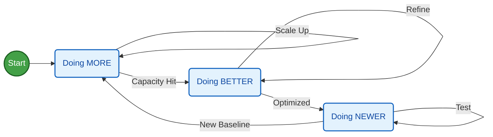

**Tl;DR**

From code to video with Remotion.

*Not just animations, racing charts are coming*

**Intro**

A video is just a function of **images over time**.

Some time ago I got to know about remotion:



But lately, I have been doing a come back to mechanisms.

Matplotlib impressed me last year, but being able to use ThreeJS to create even nicer augmented reality simulators is fantastic.

Also, for D&A we have D3js to bring cool data driven graphs alive

We also have blender for the renders...

But what if you just want a pure video?

Does it need to be that complex?

React can describe UI's that change overtime.

We already saw how to create presentations and CV's with React...

...even invoices with React!

<!-- open-source-curriculum
create-ppt-with-code -->

So... WHY NOT using **React to create videos**?

## The Remotion Project

Remotion is a framework for creating **videos programmatically** using React.

Because you know, video is one of th emany things that you can make as a code.

* https://github.com/remotion-dev/remotion

> 🎥 Make videos programmatically with React

If we can use web tech to make presentations or CVs...

How come the same tech would not be able to make `mp4` videos.

* https://www.remotion.dev/docs
* https://www.npmjs.com/package/remotion

* https://www.remotion.dev/templates

[](https://star-history.com/remotion-dev/remotion&Date)

Wonder what has happened to get that spike in stars?

### How to Setup Remotion Project

I have been wondering around RemotionJS for some posts already:

But so far, what it worked best for me to create animations was Matplotlib.

Which kind?

```sh
#git clone /DataInMotion
#uv run animate_sequential_compare_price_evolution_flex_custom.py MC.PA RMS.PA 2010-01-01 10 short
```

How about actually getting started with RemotionJS?

```sh
npm init video
```

There are **Examples**:

* https://github.com/wcandillon/remotion-fireship
    * https://www.youtube.com/watch?v=deg8bOoziaE&t=58s


### RemotionJS x Claude Code

But Im not going to use pre-made examples.

Neither to care about reading the docs: https://www.remotion.dev/docs/ai/claude-code

Im going to use CC for this, as im paying the PRO sub right now.

<!-- https://www.youtube.com/watch?v=y-pxNV0IyTY -->



Just that this old repo that I tried in Q42024...

```sh
git clone https://github.com/JAlcocerT/VideoEditingRemotion
cd remotion-cc
```

Is going to have a new friend.

Claude skills...its just about `SKILL.md` and the remotion team has put one together at `claude-code-remotion`

* https://www.remotion.dev/docs/ai/skills
* https://github.com/vercel-labs/skills

```sh
npx create-video@latest
npx skills add remotion-dev/skills
#npx skills list 
```

The magic happens at `.claude/skills/remotion-best-practices`

**The remotion App**: will help you make edits via UI if you'd want to.

```sh
#npx create-video@latest .
npm i
npm run dev
```

Go to `localhost:3000`

When you are done with it...you render it

```sh
time npx remotion render GoldPrice gold-price.mp4 #just 20seconds
```

Going from [this skeleton video](https://youtu.be/xqtzYbHIrMo), to something way more pro:

<!--
https://youtu.be/hTz2J4EgNOs
-->
 



#### YFinance x RemotionJS


How about...

<!-- https://www.youtube.com/watch?v=NTfXwQ85suw -->


  



```sh
#git clone https://github.com/JAlcocerT/DataInMotion.git
#cd DataInMotion && branch libreportfolio
uv run tests/plot_historical_gweiss.py mc.pa --start 2000-01-01 --brand "@LibrePortfolio" --warmup-days 400
```



After this one, you learn [about **compositions**](https://www.remotion.dev/docs/the-fundamentals#compositions):

```sh
#npx remotion compositions
uv init
uv add yfinance
#python scripts/fetch_ticker.py --ticker BTC-USD --name btc --start 2015-01-01                                                                                                                                                        
uv run scripts/fetch_ticker.py --ticker BTC-USD --name btc --start 2015-01-01

python scripts/generate_ts_data.py --name btc                                                                                                                                                                                               
# → creates src/btcData.ts with BTC_ANNUAL, KEY_EVENTS, COMMENTARY      
# → then create src/BtcComposition.tsx (copy GoldComposition, swap imports + props)                                           
# → add <Series.Sequence> in MarketRecapComposition.tsx                
# Render only bitcoin (once added)
npx remotion render Bitcoin bitcoin.mp4

# Render the full sequential reel
npx remotion render MarketRecap market-recap.mp4
```

<!-- 
https://youtu.be/VMuCkckE5fw 
-->



And then...you just bring whatever matplotlib logic you had for the magic to happen:


```sh
npx remotion render AdpGweiss adp_gweiss.mp4 
                                                                      
# Add another ticker (e.g. Coca-Cola)                     
#python3 scripts/compute_gweiss.py --ticker KO --name ko --start 1990-01-01
```

<!-- https://youtu.be/JkDwY4onep4 -->




Oh, Yep, its happenning.



Also that.

My videos are not so horrible.

But I mean...

```sh
npx remotion render SoftwareDrawdown software-drawdown.mp4
```

<!-- https://youtu.be/MZTt8ICeF0Y -->



how could you think that making this kind of ~~video as a ~~code so cheap had no deflationary consecuencies?

PS: price is not current earnings, but current + estimated discounted cash flows

Will the future hold so stable?


```sh
#npx remotion render DividendRace renders/dividend-race.mp4 
#make help
make render-dividend-race
#make data-marketcap-race 
#make render-marketcap-race-short
make data-sector-race # re-fetch                                              
make render-sector-race-short   # full render (~55 s) 
```
<!-- 
https://youtu.be/OL5UQaZc97E -->



The big insight: entry price matters as much as dividend growth

O and TROW were cheap in 2000 and bought many more shares

which amplified every subsequent dividend raise :)


<!-- https://youtube.com/shorts/G7u_KuvKK24 -->

#### F1 Data x RemotionJS

By any chance can this formula 1 videos/shorts get more traction?

Oh, the racing data charts are already in the yfinance section above

```sh
#make render-divrace-growth-race
#make render-total-return-race-short
#make render-gdp-race
#make render-population-race
#make render-gdppc-race
#ake render-purchasing-power-short
  #make data-ticker-invest          Fetch MCD from 2000 (default) via yfinance
#make render-ticker-invest-short  Render single-ticker invest reveal Short (~28 s)
  #Custom: python3 scripts/compute_ticker_invest.py --ticker AAPL --start 2005-01-01
#To use a different stock:
  #python3 scripts/compute_ticker_invest.py --ticker AAPL --start 2005-01-01 --label "Apple" --color "#3b82f6"
  #npx remotion render TickerInvest renders/ticker-invest-short.mp4
#make render-yield-curve
#make render-inflation-fedrate
```




But this is...**racing** as in...going fast through circuits around the world:


  


```sh
#git clone https://github.com/JAlcocerT/eda-f1
#cd eda-f1
make help
```

Or so it was...until 2026 cars are [clipping so hard](https://jalcocert.github.io/JAlcocerT/f1-data-animated/#conclusions).

In China between 6-9% of the lap:

```sh
#make clipping_detector
make clipping_detector ARGS="2026 2 ANT"
make clipping_detector ARGS="2026 2 ALO"
```


  
  


Why are my [amazing F1 shorts](https://jalcocert.github.io/JAlcocerT/f1-data-animated/) not getting *the hate* they deserve?

```sh
uv run f1_deep_analysis.py #

mpv deep_analysis_2026_2_ANT_hud.mp4
mpv deep_analysis_2025_2_PIA_hud.mp4 

#printf "file 'deep_analysis_2026_1_RUS_hud.mp4'\nfile 'deep_analysis_2025_1_1_hud.mp4'" > concat_list.txt && ffmpeg -f concat -safe 0 -i concat_list.txt -c copy deep_analysis_joined.mp4
uv run f1_session_summary.py
printf "file 'deep_analysis_2026_1_RUS_hud.mp4'\nfile 'outro_2026.mp4'\nfile 'deep_analysis_2025_1_NOR_hud.mp4'\nfile 'outro_2025.mp4'" > cinematic_review_list.txt
ffmpeg -f concat -safe 0 -i cinematic_review_list.txt -c copy f1_cinematic_review.mp4
```

The Chinese GP was not so bad for this new gen cars: *,just' 1:30:641 vs 1:32:064*: more time full throtle, but not there is clipping and more time to load batteries.

```md
========================================
📊 PERFORMANCE SUMMARY: ANT @ Chinese Grand Prix 2026
========================================
🟢 Full Throttle:  52.9%
🔴 Braking:       22.5%
🟡 Coasting:      3.0%
🔵 DRS Active:    0.0%
⚡ Max G-Force:   5.00 G
🛑 Max De-accel: -5.00 G
========================================

========================================
📊 PERFORMANCE SUMMARY: PIA @ Chinese Grand Prix 2025
========================================
🟢 Full Throttle:  39.7%
🔴 Braking:       16.3%
🟡 Coasting:      7.6%
🔵 DRS Active:    18.5%
⚡ Max G-Force:   2.41 G
🛑 Max De-accel: -5.00 G
========================================
```

Lets have a look whats going on at **Suzuka**: *and compare it with last year, just to trol a litte bit*

```sh
#uv run f1_deep_analysis.py #china
#make deep_analysis ARGS="2026 2 ANT 2 y"
#uv run f1_deep_analysis.py 2026 2 ANT 2 y
make deep_analysis ARGS="2026 3 RUS 2 n" #ANT telemetry has some anomaly that tells is breaking where its not :)
make deep_analysis ARGS="2026 3 ALO 2 n"
make clipping_detector ARGS="2026 3 RUS" #this is for qualifying
```


Now clipping...goes from 11.4% to 14.4%, all 130R :(

```md
========================================
📊 CLIPPING SUMMARY: RUS
========================================
🟣 Clipping Detected:    11.4% of lap
⚡ Max Speed Reached:   329.0 km/h
📉 Longest Clipping:    22 samples
========================================

========================================
📊 PERFORMANCE SUMMARY: ALO @ Japanese Grand Prix
========================================
🟢 Full Throttle:  56.4%
🔴 Braking:       13.8%
🟡 Coasting:      7.1%
🔵 DRS Active:    0.0%
⚡ Max G-Force:   5.00 G
🛑 Max De-accel: -4.84 G
========================================
```

I could not resist to add a remotion folder to this `eda-f1` project:

```sh
#cd remotion-f1 #but the magic happens at VideoEditingRemotion/remotion-cc anyways
pip install fastf1 pandas
#make render-f1-telemetry
# Fetch Alonso's Suzuka 2026 qualifying lap                                                                        
make data-f1-telemetry F1_YEAR=2026 F1_ROUND=3 F1_DRIVER=ALO                                                       
# Render it → renders/f1-telemetry-2026-r3-ALO-Q.mp4                                                               
make render-f1-telemetry F1_YEAR=2026 F1_ROUND=3 F1_DRIVER=ALO #generated in ~1min 20s
```

<!-- https://youtu.be/QiTwSpgumwQ -->



Crazy [how far from mercedes](https://youtu.be/KVzzp4NHR50) they are.

Or a race lap instead of qualifying:

```sh
make data-f1-telemetry F1_YEAR=2024 F1_ROUND=8 F1_DRIVER=LEC F1_SESSION=R                                          
make render-f1-telemetry F1_YEAR=2024 F1_ROUND=8 F1_DRIVER=LEC F1_SESSION=R
# → renders/f1-telemetry-2024-r8-LEC-R.mp4 
```

Its surprising that the rendering goes faster than the original matplotlib one!




```sh
# Monaco tends to be interesting — tight circuit, lots of ERS deployment zones                                     
make data-f1-clipping F1_YEAR=2024 F1_ROUND=8                                 
make render-f1-clipping-short F1_YEAR=2024 F1_ROUND=8                                                              
# → renders/f1-clipping-2024-r8-Q.mp4  
```



```sh
make data-f1-championship && make render-f1-championship 
```




```sh
# F1-D: Sector delta duel                                                                                          
make data-f1-delta F1_YEAR=2024 F1_ROUND=1 F1_D1=VER F1_D2=NOR                                                   
make render-f1-delta-short F1_YEAR=2024 F1_ROUND=1 F1_D1=VER F1_D2=NOR                                             

# F1-D: Sector delta duel                                                                                          
make data-f1-delta F1_YEAR=2026 F1_ROUND=3 F1_D1=ANT F1_D2=RUS && make render-f1-delta-short F1_YEAR=2026 F1_ROUND=3 F1_D1=ANT F1_D2=RUS 
make data-f1-delta F1_YEAR=2026 F1_ROUND=3 F1_D1=RUS  F1_D2=ALO && make render-f1-delta-short F1_YEAR=2026 F1_ROUND=3 F1_D1=RUS  F1_D2=ALO 
```



```sh
make data-f1-delta F1_YEAR=2021 F1_ROUND=22 F1_D1=VER F1_D2=HAM
make render-f1-delta-short F1_YEAR=2021 F1_ROUND=22 F1_D1=VER F1_D2=HAM                                            
# → renders/f1-delta-2021-r22-VER-HAM-Q.mp4                                                                      
                                                                                                                     
# FastF1 has full telemetry back to 2018. First run will fetch 2021 Abu Dhabi Q from the API (may take a minute),    
# subsequent runs use cache.                                                                                         
                                                                                                                     
#You could also do the race lap instead of qualifying — that weekend's race is the iconic one where HAM led most of 
#  the race before the safety car controversy in the final laps:
                                                                                                                     
make data-f1-delta F1_YEAR=2021 F1_ROUND=22 F1_D1=VER F1_D2=HAM F1_SESSION=R                                     
make render-f1-delta-short F1_YEAR=2021 F1_ROUND=22 F1_D1=VER F1_D2=HAM F1_SESSION=R                               
# → renders/f1-delta-2021-r22-VER-HAM-R.mp4                                                                                           
```

##### Kart Overlays?


As long as you have your video at `./public`, remotion can do the trick

```sh
make data-gopro        # re-extract (already done) 
make render-gopro      # → renders/gopro-hud-GH030417.mp4                                                                                                                                                                                   
# Different video:                                                                                                                                                                                                                          
make data-gopro GOPRO_VIDEO=public/GH020417.MP4 GOPRO_LAP_START=49.5
make render-gopro GOPRO_VIDEO=public/GX010001.MP4  
```

Not bad for being a copy of the matplotlib (not the Go desktop one):

<!-- https://youtu.be/it1D1qqWMfA -->




> PS: Im in love with the **deceleration zones** idea

it's a resource configuration problem. Here's the full picture:                                                                                                                                                                                                                  
Why it failed by default: 
- Remotion spawns 8 Chrome instances in parallel (concurrency=8)  
- Each Chrome instance decodes the 4K video frame-by-frame into a raw pixel buffer                                                                                                       
- 4K frame = 3840×2160×3 bytes = ~25 MB per frame in RAM 
- 8 instances × multiple buffered frames = Chrome exhausting available memory mid-render                                                                   
How to use 4K natively with Remotion:

  1. Reduce concurrency — --concurrency=1 or --concurrency=2 keeps RAM usage manageable:                                                                                                                                                      
  npx remotion render GoProHud out.mp4 --concurrency=1                                                                                                                                                                                        
  1. Works fine, just slower (8–10× slower than the default).                                                                                                                                                                                 
  2. More RAM — If your machine had 32+ GB RAM, concurrency=8 with 4K would work. At 14 GB with 8 GB already used, you were left with ~6 GB free, which isn't enough for 8 concurrent 4K decoders.                                            
  3. Render at native 4K composition size — Set width={3840} height={2160} in Root.tsx, keep concurrency=1. Remotion handles it; Chrome just needs the RAM headroom.                                                                          
                                                                                                                                                                                                                                              
  The pre-transcode approach we used is actually the right choice for this specific case:                                                                                                                                                     
  - The HUD canvas is 1920×1080 — rendering a 4K background into a 1080p output gives you zero visual benefit                                                                                                                                 
  - The transcoded clip also encodes faster and produces a smaller output file                                                                                                                                                                
                                                                                                                                                                                                                                            
  TL;DR: 4K + Remotion works, but requires either --concurrency=1 or enough RAM (32 GB+) for parallel instances. For a 1920×1080 HUD composition, downscaling to 1080p before rendering is the right call regardless. 

```sh
npx remotion render GoProHudB renders/gopro-hud-GH020417.mp4 --concurrency=2                                                                                                                                                           
#GOPRO_VIDEO=public/GX010001.MP4 GOPRO_LAP_START=8.0
#npx remotion render GoProHud out.mp4 --concurrency=2
```


  
  


#### Mechanisms x RemotionJS

Having the Python + [CadQuery](https://jalcocert.github.io/JAlcocerT/cad-design-mbsd/) + [Blender](https://jalcocert.github.io/JAlcocerT/using-blender-with-ai/) way is amazing.

But maybe...


  
  


is there a better way to just create videos about mechanisms?

```sh
make render-mech-a
# → renders/mech-a-slider_crank-10rpm.mp4 
mpv renders/mech-a-slider_crank-10rpm.mp4

#Or at a faster crank speed:                               
make data-mech-a MECH_RPM=30                            
make render-mech-a MECH_RPM=30                            
# → renders/mech-a-slider_crank-30rpm.mp4 

#git clone https://github.com/JAlcocerT/mbsd
#cd mbsd/
```

```sh       
make render-mech-b  
# → renders/mech-b-slider_crank-10rpm.mp4                                                                                                                                                                                                   
# Or regenerate data + render both in one go:                              
#make data-mech-a && make render-mech-a && make render-mech-b
make render-mech-c
make render-mech-d
```

Phase 1 — full run through the simulation with velocity arrows only (Mech-B style: cyan→orange→red), link gradients keyed to speed                                                                                                          
                                                                                                                                                                                                                                              
Transition card (1.5 s) — dark overlay with "PHASE 1: VELOCITY → PHASE 2: ACCELERATION" label showing both color palettes                                                                                                                   
                                                            
Phase 2 — runs through the simulation again with both layers simultaneously:                                                                                                                                                                
- Velocity arrows fade to 40% opacity (still visible, dimmed)
- Acceleration arrows fade in at full brightness with stronger glow indigo→violet→amber)                                                                                                                                                   
- Link gradients switch to the acceleration palette                                      
- Trail colour flips to acceleration                                                                                                                                                                                                        
- HUD shows both m/s and m/s² readouts per tracked point       

```sh
#sudo apt update && sudo apt install ffmpeg
ls *.mp4 | sed "s/^/file '/; s/$/'/" > file_list.txt #add .mp4 of current folder to a list
ffmpeg -f concat -safe 0 -i file_list.txt -c copy output_video.mp4 #original audio
#ffmpeg -f concat -safe 0 -i file_list.txt -c:v copy -an silenced_output_video.mp4 #silenced video
```

<!-- https://youtu.be/cFHyobRjcK0 -->




Remotion has integration with https://www.remotion.dev/docs/videos/as-threejs-texture

Which I have been convering recently for the [2D simulator](https://jalcocert.github.io/JAlcocerT/2d-mbsd/).

And also...

React Three Fiber ~ Three JS?

* https://r3f.docs.pmnd.rs/getting-started/introduction
* https://r3f.docs.pmnd.rs/getting-started/examples

You can also add: https://www.remotion.dev/docs/captions/displaying

And add video sequences: https://www.remotion.dev/docs/videos/

##### Websites to...RemotionJS?

We said that remotionJS uses react.

Like...that [quick **Vite+FastAPI** stack](https://github.com/JAlcocerT/btc-powerlaw/blob/master/tech-stack.md) that generates this [btc power law thingy](https://jalcocert.github.io/JAlcocerT/ideas-to-execution-with-dao/#for-vibe-coders) you can create to test a [gemini prompt](https://github.com/JAlcocerT/btc-powerlaw/blob/master/GEMINI.md)

Can it be static?

```md
this has been amazing and im impressed about the UI/X im just questioning if we really need this FE and BE, as the data is a snapshot. So could we do a folder that makes the static-website with same look and feel just that CSR? we should not touch current functionality
```

```sh
cd static-app
#npm run preview
make static-build
make static-deploy #npx wrangler@latest pages deploy static-app/dist/ --project-name btc-powerlaw
```

And...here it goes: `http://btc-powerlaw.pages.dev/`

Yep, Vite+React nice look and feel thanks to this prompt and [the power law idea](https://jalcocert.github.io/JAlcocerT/powerlaw-and-series-with-python/).

Even beter, can it generate a video with remotion out of it as it used react?

```sh
#cd ../remotion-promo-video
#make data-btc-powerlaw                                                                                             
make render-btc-powerlaw
```

Does that mean that if your website already uses React then Claude Code has a much easier job to undertand your branding?

```sh
#git clone /slider-crank #this is exactly what im talking about
```

This is resonating a lot for me to promote all those `realestate.`, `webaudit.` etc etc etc services :)


You can make quick promo videos or showcase of the web/apps you ~~create~~ vibe code.

does this mean...that in one year we have gone from repository to docs...

to a repository to explanatory video with the look and feel plugged in?

ok...we are done then :)

---

## Conclusions


Now you have three options: [everything as a code](https://jalcocert.github.io/JAlcocerT/things-as-a-code/).

1. [Keep matplotlib](https://jalcocert.github.io/JAlcocerT/ai-scripts-and-animated-data/) with certain cool custom logic
2. Go the [python - blender](https://jalcocert.github.io/JAlcocerT/using-blender-with-ai/) route
3. NEW: Use...remotion to create videos as a code based on your existing code base!

Now clear yet on the how to?


  


Its all about having the right SKILLS~~.md~~

<!-- 
https://www.youtube.com/watch?v=BC4xJzNqutc 
-->




You dont have to run anywhere to make your dream project.


You can get it done:


  
  


Or just keep reading to get more ideas :)


---

## FAQ


### Adding AI Generated Audio to RemotionJS Videos

Because a video without a nice audio is half a video.


### What's Motion Desing?

No, nothing to do with mechanisms and blender




But...



<!-- 
https://www.youtube.com/watch?v=MAhkbZHcbLA
 -->

### My Fav ways to create video animations

1. Matplotlib ~~plotly~~ - Because its more custom and quicker than you thought

2. The Python cadquery and then blender flow

3. Now...apparently remotionJS!