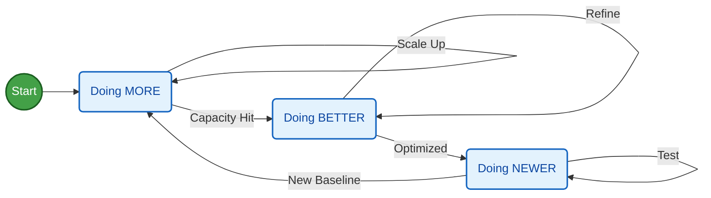

**Tl;DR**

From code to video with Remotion.

*Not just animations, racing charts are coming*

**Intro**

A video is just a function of **images over time**.

Some time ago I got to know about remotion:



But lately, I have been doing a come back to mechanisms.

Matplotlib impressed me last year, but being able to use ThreeJS to create even nicer augmented reality simulators is fantastic.

Also, for D&A we have D3js to bring cool data driven graphs alive

We also have blender for the renders...

But what if you just want a pure video?

Does it need to be that complex?

React can describe UI's that change overtime.

We already saw how to create presentations and CV's with React...

...even invoices with React!

<!-- open-source-curriculum
create-ppt-with-code -->

So... WHY NOT using **React to create videos**?

## The Remotion Project

Remotion is a framework for creating **videos programmatically** using React.

Because you know, video is one of th emany things that you can make as a code.

* https://github.com/remotion-dev/remotion

> 🎥 Make videos programmatically with React

If we can use web tech to make presentations or CVs...

How come the same tech would not be able to make `mp4` videos.

* https://www.remotion.dev/docs
* https://www.npmjs.com/package/remotion

* https://www.remotion.dev/templates

[](https://star-history.com/remotion-dev/remotion&Date)

Wonder what has happened to get that spike in stars?

### How to Setup Remotion Project

I have been wondering around RemotionJS for some posts already:

But so far, what it worked best for me to create animations was Matplotlib.

Which kind?

```sh
#git clone /DataInMotion
#uv run animate_sequential_compare_price_evolution_flex_custom.py MC.PA RMS.PA 2010-01-01 10 short
```

How about actually getting started with RemotionJS?

```sh
npm init video
```

There are **Examples**:

* https://github.com/wcandillon/remotion-fireship
    * https://www.youtube.com/watch?v=deg8bOoziaE&t=58s


### RemotionJS x Claude Code

But Im not going to use pre-made examples.

Neither to care about reading the docs: https://www.remotion.dev/docs/ai/claude-code

Im going to use CC for this, as im paying the PRO sub right now.

<!-- https://www.youtube.com/watch?v=y-pxNV0IyTY -->



Just that this old repo that I tried in Q42024...

```sh
git clone https://github.com/JAlcocerT/VideoEditingRemotion
cd remotion-cc
```

Is going to have a new friend.

Claude skills...its just about `SKILL.md` and the remotion team has put one together at `claude-code-remotion`

* https://www.remotion.dev/docs/ai/skills
* https://github.com/vercel-labs/skills

```sh
npx create-video@latest
npx skills add remotion-dev/skills
#npx skills list
```

The magic happens at `.claude/skills/remotion-best-practices`

**The remotion App**: will help you make edits via UI if you'd want to.

```sh
#npx create-video@latest .
npm i
npm run dev
```

Go to `localhost:3000`

When you are done with it...you render it

```sh
time npx remotion render GoldPrice gold-price.mp4 #just 20seconds
```

Going from [this skeleton video](https://youtu.be/xqtzYbHIrMo), to something way more pro:

<!--
https://youtu.be/hTz2J4EgNOs
-->
 



#### YFinance x RemotionJS


How about...

<!-- https://www.youtube.com/watch?v=NTfXwQ85suw -->


  



```sh
#git clone https://github.com/JAlcocerT/DataInMotion.git
#cd DataInMotion && branch libreportfolio
uv run tests/plot_historical_gweiss.py mc.pa --start 2000-01-01 --brand "@LibrePortfolio" --warmup-days 400
```



After this one, you learn [about **compositions**](https://www.remotion.dev/docs/the-fundamentals#compositions):

```sh
#npx remotion compositions
uv init
uv add yfinance
#python scripts/fetch_ticker.py --ticker BTC-USD --name btc --start 2015-01-01                                                                                                                                                        
uv run scripts/fetch_ticker.py --ticker BTC-USD --name btc --start 2015-01-01

python scripts/generate_ts_data.py --name btc                                                                                                                                                                                               
# → creates src/btcData.ts with BTC_ANNUAL, KEY_EVENTS, COMMENTARY      
# → then create src/BtcComposition.tsx (copy GoldComposition, swap imports + props)                                           
# → add <Series.Sequence> in MarketRecapComposition.tsx                
# Render only bitcoin (once added)
npx remotion render Bitcoin bitcoin.mp4

# Render the full sequential reel
npx remotion render MarketRecap market-recap.mp4
```

<!-- 
https://youtu.be/VMuCkckE5fw 
-->



And then...you just bring whatever matplotlib logic you had for the magic to happen:


```sh
npx remotion render AdpGweiss adp_gweiss.mp4 
                                                                      
# Add another ticker (e.g. Coca-Cola)                     
#python3 scripts/compute_gweiss.py --ticker KO --name ko --start 1990-01-01
```

<!-- https://youtu.be/JkDwY4onep4 -->




Oh, Yep, its happenning.



Also that.

My videos are not so horrible.

But I mean...

```sh
npx remotion render SoftwareDrawdown software-drawdown.mp4
```

<!-- https://youtu.be/MZTt8ICeF0Y -->



how could you think that making this kind of ~~video as a ~~code so cheap had no deflationary consecuencies?

PS: price is not current earnings, but current + estimated discounted cash flows

Will the future hold so stable?


```sh
#npx remotion render DividendRace renders/dividend-race.mp4 
#make help
make render-dividend-race
#make data-marketcap-race 
#make render-marketcap-race-short
make data-sector-race # re-fetch                                              
make render-sector-race-short   # full render (~55 s) 
```
<!-- 
https://youtu.be/OL5UQaZc97E -->



The big insight: entry price matters as much as dividend growth

O and TROW were cheap in 2000 and bought many more shares, which amplified every subsequent dividend raise :)


<!-- https://youtube.com/shorts/G7u_KuvKK24 -->

#### F1 Data x RemotionJS

By any chance can this formula 1 videos/shorts get more traction?

Oh, the racing data charts are already in the yfinance section above

```sh
#make render-divrace-growth-race
#make render-total-return-race-short
#make render-gdp-race
#make render-population-race
#make render-gdppc-race
#ake render-purchasing-power-short
  #make data-ticker-invest          Fetch MCD from 2000 (default) via yfinance
#make render-ticker-invest-short  Render single-ticker invest reveal Short (~28 s)
  #Custom: python3 scripts/compute_ticker_invest.py --ticker AAPL --start 2005-01-01
#To use a different stock:
  #python3 scripts/compute_ticker_invest.py --ticker AAPL --start 2005-01-01 --label "Apple" --color "#3b82f6"
  #npx remotion render TickerInvest renders/ticker-invest-short.mp4
#make render-yield-curve
#make render-inflation-fedrate
```




But this is...**racing** as in...going fast through circuits around the world:


  



Or so it was...until 2026 cars are [clipping so hard](https://jalcocert.github.io/JAlcocerT/f1-data-animated/#conclusions).


  
  


Why are my F1 shorts not getting *the hate* they deserve?

Lets have a look whats going on at Suzuka:

```sh
#git clone https://github.com/JAlcocerT/eda-f1
#cd eda-f1
uv run f1_q3_short.py #Interactive Q3 animation video (15s Short)
```

I could not resist to add a remotion folder to this project:

```sh
cd remotion-f1

```


#### Mechanisms x RemotionJS

Having the Python + [CadQuery](https://jalcocert.github.io/JAlcocerT/cad-design-mbsd/) + [Blender](https://jalcocert.github.io/JAlcocerT/using-blender-with-ai/) way is amazing.

But maybe...


  
  


is there a better way to just create videos about mechanisms?

```sh
git clone https://github.com/JAlcocerT/mbsd
cd mbsd/
```

Remotion has integration with https://www.remotion.dev/docs/videos/as-threejs-texture

Which I have been convering recently

And...


React Three Fiber ~ Three JS?

* https://r3f.docs.pmnd.rs/getting-started/introduction
* https://r3f.docs.pmnd.rs/getting-started/examples

You can also add: https://www.remotion.dev/docs/captions/displaying

And add video sequences: https://www.remotion.dev/docs/videos/

##### Websites to...RemotionJS?

We said that remotionJS uses react.

Like...that quick Vite+FastAPI quick btc power law thingy you can create to test a gemini prompt

Can it be static?

```md
this has been amazing and im impressed about the UI/X im just questioning if we really need this FE and BE, as the data is a snapshot. So could we do a folder that makes the static-website with same look and feel just that CSR? we should not touch current functionality
```

```sh
cd static-app
#npm run preview
make static-build
make static-deploy #npx wrangler@latest pages deploy static-app/dist/ --project-name btc-powerlaw
```

And...here it goes: `http://btc-powerlaw.pages.dev/`

Yep, Vite+React nice look and feel thanks to this prompt and the power law idea.

Even beter, can it generate a video with remotion out of it as it used react?


Does that mean that if your website already uses React then Claude Code has a much easier job to undertand your branding?

This is resonating a lot for me to promote all those `realestate.`, `webaudit.` etc etc etc services :)


You can make quick promo videos or showcase of the web/apps you ~~create~~ vibe code:

```sh
#git clone slider-crank
```


---

## Conclusions


Now you have three options: all as a code.

1. Keep matplotlib with cool custom logic
2. Go the python - blender route
3. NEW: Use...remotion to create videos as a code!

Now clear yet on the how to?

You dont have to run to make your dream project.


You can get it done:


  
  



---

## FAQ


### Adding AI Generated Audio to RemotionJS Videos

Because a video without a nice audio is half a video.


### What's Motion Desing?

No, nothing to do with mechanisms and blender




But...



<!-- 
https://www.youtube.com/watch?v=MAhkbZHcbLA
 -->

### My Fav ways to create video animations

1. Matplotlib ~~plotly~~ - Because its more custom and quicker than you thought

2. 