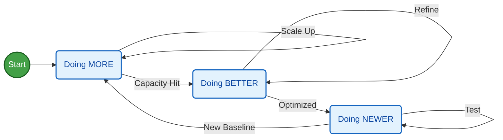

**TL;DR**

What is learning?

**Intro**

Innovate, imitate or stay incompetent?

---

## Conclusions

Not been eager to learn today feels like:

### Attract Convert Deliver

#### Attracting Clients

To attract, you can use tools like `https://www.clay.com/`

follows the *full stack business formula* from top line, to net profit:

$$
P \times V \times GM \times OM \times IF \times T
$$

If you dont like crazy speed, most likely operations *most likely* wont be for you.

Forget about marketing, SCM, DataOps...

To deliver solid products/services, you better start learning/doing agentic delivery.

Because the speed is coming there as well.

#### Converting

Tools that will help you convert:

1. Emails + Newsletters
2. Lean DRIP email campaigns
3. 

#### Delivering

The moment of truth.

If you are delivering services, you better be excellent at them.


  


---

## FAQ

### Back Propagation vs Human Brain

With gradient descent we can do cool stuff.

What in particular?

Figuring out a model to get the best route for karting

> Mind the hypothesis!