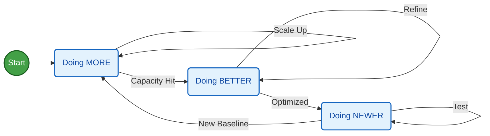

**TL;DR**

What is learning?

**Intro**

Context windows and context rotting is a thing.

* https://github.com/simon125
* https://github.com/snarktank/ralph
* https://github.com/trailofbits/claude-code-devcontainer

> MIT | Ralph is an autonomous AI agent loop that runs repeatedly until all PRD items are complete.

PRDs? where have I heard about thos?

* https://www.atlassian.com/agile/product-management/requirements
* PRD/BRD/FRD

Innovate, imitate or... stay incompetent?

---

## Conclusions

Not been eager to learn today feels like:

### Attract Convert Deliver

#### Attracting Clients

To attract, you can use tools like `https://www.clay.com/`

follows the *full stack business formula* from top line, to net profit:

$$
P \times V \times GM \times OM \times IF \times T
$$

If you dont like crazy speed, most likely operations *most likely* wont be for you.

Forget about marketing, SCM, DataOps...

To deliver solid products/services, you better start learning/doing agentic delivery.

Because the speed is coming there as well.

#### Converting

Tools that will help you convert:

1. Emails + Newsletters
2. Lean DRIP email campaigns
3. 

#### Delivering

The moment of truth.

If you are delivering services, you better be excellent at them.


  


---

## FAQ

### Back Propagation vs Human Brain

With gradient descent we can do cool stuff.

What in particular?

Figuring out a model to get the best route for karting

> Mind the hypothesis!

### Questions

The ultimate answer is a possitive money signal.

If you are trying to build without such signals because you are not so pro for people to pay you to just join a waiting list

At least be good at asking questions / prepare good forms: *DISqualifying ideas/clients is the goal*

#### Dashboarding Requirements Gathering

When gathering **requirements for a dashboard**, your goal is to deeply understand *what decisions the dashboard must support*, *who will use it*, and *what data is available*.

Below is a practical, structured approach PLUS a list of **must‑ask questions** you can use in any requirements workshop.

✅ **How to Take Dashboard Requirements (Step-by-Step)**

**1. Start With the “Why”**

Before discussing charts or KPIs, understand the *purpose* of the dashboard.

Ask:

*   What problem are we trying to solve?
*   What decisions should this dashboard help you make?
*   What actions should users take based on this dashboard?

This ensures the dashboard actually supports business value.

**2. Identify the Audience**

Different users → different needs.

Clarify:

*   Who will use the dashboard (roles, experience level)?
*   What are their goals?
*   How data‑savvy are they?
*   How often will they use it (daily, weekly, monthly)?

This influences layout, complexity, and visualization type.

**3. Define Key Metrics & KPIs**

Once the purpose is clear, identify what needs to be measured.

Ask:

*   What are the **primary KPIs**?
*   Are there **supporting metrics** required to explain the KPIs?
*   What does success look like?
*   How should each KPI be calculated? (definitions matter!)

**4. Understand the Data**

Ensures the metrics are actually feasible.

Ask:

*   What data sources are available?
*   Who owns the data?
*   How clean and reliable is the data?
*   What are the data refresh requirements? (real-time, daily, weekly)
*   Are there any data quality or data governance constraints?

**5. Explore the Desired User Experience (UX)**

What users *see* and *interact with*.

Ask:

*   What are the must‑have visualizations? (tables, charts, maps, trends)
*   Do users prefer high‑level KPIs first (executive view) or detail first (analyst view)?
*   Should filters be available? (date, regions, teams)
*   What devices will be used? (desktop, mobile, wall monitor)
*   Should users export data/reports?

**6. Identify Security & Access Requirements**

Important in most organizations.

Ask:

*   Who should have access?
*   Are there role‑based visibility differences?
*   Should any data be restricted or anonymized?

**7. Establish Technical & Operational Requirements**

Ask:

*   What platform will the dashboard run on? (Power BI, Tableau, etc.)
*   How often should the dashboard update?
*   Performance expectations? (load time, max data volume)
*   Do we need versioning or audit logs?

**8. Validate with Examples**

Ask the stakeholder:

*   Do you have screenshots or examples of dashboards you like?
*   What dashboards do you currently use, and what do you like/dislike about them?

This speeds up alignment.

⭐ **Must‑Ask Questions (Cheat Sheet)**

**Business & Purpose**

1.  What business problem should this dashboard solve?
2.  What decisions will this dashboard help you make?
3.  Who will use it, and what are their goals?

**Metrics & KPIs**

4.  What are the key metrics/KPIs you need to track?
5.  What are the definitions and formulas for these metrics?
6.  What time periods matter? (daily, weekly, YTD, custom ranges)

**Data & Feasibility**

7.  Where does the data come from?
8.  How often must it refresh?
9.  Are there known data quality issues?
10. Any data security or privacy constraints?

**User Experience & Interaction**

11. What visualizations do you prefer? (bar, line, tables…)
12. What filters or drill-downs are needed?
13. Which devices do users work on?
14. Do users need to export or share results?

**Access & Roles**

15. Who needs access?
16. Should some users see different data?

**Delivery & Maintenance**

17. When is the dashboard needed?
18. Who maintains it after delivery?
19. How often will requirements change?

***

# Want me to create a **requirements checklist**, **interview script**, or a **dashboard requirements document template** for you?
