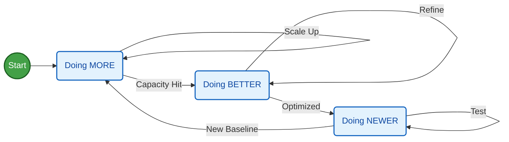

**TL;DR**

What is learning? 

[How do we learn](#back-propagation-vs-human-brain)?

* https://app.fireflies.ai/perks
* Perplexity and commet (from W11 only on the desktop) 

**Intro**

Context windows and context rotting is a thing.

* https://github.com/thedotmack/claude-mem
* https://github.com/simon125
* https://github.com/snarktank/ralph
* https://github.com/trailofbits/claude-code-devcontainer

> MIT | Ralph is an autonomous AI agent loop that runs repeatedly until all PRD items are complete.

PRDs? where have I heard about thos?

* https://www.atlassian.com/agile/product-management/requirements
* PRD/BRD/FRD

Innovate, imitate or... stay incompetent?

Are you one of those that choses stay incompotent, because learning and doing is just getting easier?

Like, I could have skipped doing all those astro clones and directly vibe coded with [this cool UI prompt](https://jalcocert.github.io/JAlcocerT/ideas-to-execution-with-dao/#for-vibe-coders)

But...have you ever tried?

How much deflation is enough?

---

## Conclusions

Not been eager to learn today feels like:



```mermaid
flowchart LR
    %% Styles
    classDef state fill:#E3F2FD,stroke:#1565C0,stroke-width:2px,color:#0D47A1;
    classDef start fill:#43A047,stroke:#1B5E20,stroke-width:2px,color:white;

    %% Nodes
    Start((Start)):::start --> More
    More(Doing MORE):::state
    Better(Doing BETTER):::state
    Newer(Doing NEWER):::state

    %% Internal Feedback Loops (The Grind)
    More -- "Scale Up" --> More
    Better -- "Refine" --> Better
    Newer -- "Test" --> Newer

    %% The Progression Journey
    More -- "Capacity Hit" --> Better
    Better -- "Optimized" --> Newer
    
    %% The Upward Spiral
    Newer -- "New Baseline" --> More
```


### Attract Convert Deliver

Domain expertise and stickiness of core products/services will be key in the world is coming up.

How do we measure productivity and value now?

Reality have changed, so should KPIs and...teams

Maybe, innovation teams are coming for faster GTM?

How about [forward deploy engineers](https://www.youtube.com/watch?v=Iu80Io2cNYw)?

Yea, including if you do [BI dashboard](#dashboarding-requirements-gathering)

```sh
git clone https://github.com/JAlcocerT/PBi
cd Sample...
#curl -fsSL https://claude.ai/install.sh | bash
claude #https://claude.ai/recents
#/terminal-setup
#claude --continue or claude --resume to resume a conversation  
/model

  From the terminal:                                                                                                   - claude --continue / claude -c — resumes your most recent conversation
  - claude --resume / claude -r — opens an interactive picker to browse and select past sessions                     

From inside an active session:
  - /resume — opens the session picker to switch to a different conversation
#/init

```

> The vscode extension is also very cool!

> > Consider that [some are depricating all UIs](https://ampcode.com/news/the-coding-agent-is-dead), as the aim is for agents to use these and UI are just dragging them
Do you feel **tech deflation** coming?

```md
could you create a unambigous-tasks.md with the step by step guidance on how to create those?
from data modelling if required, to where to drag and drop the elements in the UI as if a 15 year old had to build it  
```

I do.

Will [AGI come in the next 36m](https://www.youtube.com/watch?v=zeHTTXAWDUA)?

If so, none of this will probably matter :)

 Wiki Structure

Audience: VP/CTO, Portfolio Leads, Steerco
Reading time: 5–7 minutes for the front page
Tone: Outcome‑first, sourced, low jargon 

One‑liner: “Sourced answers in ≤3s, proactive alerts in ≤15m, and actionable ‘what to change’ guidance—reducing time‑to‑detect by 50% and time‑to‑explain to ≤30s.”
Status: 🟢 Discovery | 🟡 Build | 🔵 Pilot | 🔴 Blocked
Owner / Contact: Product Owner, Tech Lead
Last updated: {auto-populated}

FAQ (Exec‑friendly)
Can it be wrong? Yes—so every answer shows sources, last refresh, and confidence.
Who sees what? Access is scoped to your portfolio; raw rows aren’t exposed across divisions.
Will this replace dashboards? No. Dashboards remain the system of record; the agent accelerates discovery and explanation.
When do we get automation? After trust is established (Phase 3) and with human approvals.

Problem. Leaders see what is off-track but not why or what to change.
Approach. Agent layer that answers portfolio questions with sources (≤3s), pushes anomaly alerts (≤15m), and recommends peer‑proven actions.
Outcomes (90 days). Time‑to‑detect ↓50%; time‑to‑explain ≤30s; ≥95% sourced accuracy.
Decision needed. Approve Phase 1 pilot.

#### Attracting Clients

To attract, you can use tools like `https://www.clay.com/`

just brings eyes to your landing page.

be aware of the value equation:

and follow the *full stack business formula* from top line, to net profit of your business idea:

$$
P \times V \times GM \times OM \times IF \times T
$$

If you dont like crazy speed, most likely operations *most likely* wont be for you.

Forget about marketing, SCM, DataOps...

To deliver solid products/services, you better start learning/doing agentic delivery.

Because the speed is coming there as well.

#### Converting

Tools that will help you convert:

1. Emails + Newsletters
2. Lean DRIP email campaigns

#### Delivering

The moment of truth.

If you are delivering services, you better be excellent at them.

You can become excepcionally good by bringing knowledge from the future, to today:


  


---

## FAQ

### Back Propagation vs Human Brain

With gradient descent we can do cool stuff.

What in particular?



Like...Figuring out a model to get the best route for karting tracks

> Mind the hypothesis!

But...what is gradient descent?



And how do we learn?

<!-- 
https://www.youtube.com/watch?v=l-OLgbdZ3kk 
-->




### Questions

The ultimate answer is a possitive money signal.

If you are trying to build without such signals because you are not so pro for people to pay you to just join a waiting list

At least be good at asking questions / prepare good forms: *DISqualifying ideas/clients is the goal*

> There are some technical/structural questions, others are business & operational

🟢 What the Wiki replies to PROPERLY
Your current documentation is excellent at answering technical and structural questions:

How is it built? (PBIP format, Canvas size, Visual IDs).

What is the logic? (DAX formulas for KPIs).

Where is the data? (MySQL, APIs...).

How do I use it? (Slicers, Sync groups, and Bookmark toggles).

What are the rules? (for filters...).

🟡 What could be BETTER (or is currently unresolved)
There are a few "Business & Operational" gaps that the technical summary doesn't quite hit yet:

The "So What?" Factor: While you define the metrics, the Wiki doesn't explicitly state the action a user should take if a metric is Red.

Data Latency: You list the sources, but not the refresh schedule. Users will ask if the data is "Live" or "Yesterday's."

Exception Edge Cases: You mention "Exception Management" in your definitions, but the Power BI Wiki doesn't show how those exceptions are reflected in the data (e.g., does an approved exception turn a Red "R" into a Gray "N/A"?).

Historical Context: Does the report keep 2 years of data or only the "Last 6 Months" mentioned in the slicer?

🔵 Should you include the "Requirements Gathering" section?
Yes, but with a twist. Don't just list the questions; list the Answers specifically for this dashboard.

In Confluence, I recommend adding a section called "Project Context & Design Intent" using your requirements framework. Here is how it would look specifically for your Sample-DevSecOps report:

Section: Design Intent (The "Why")
Primary Decision Supported: Identifying which applications are "Wave-ready" and which are failing security guardrails.

Target Audience: CTOs (High-level summary) and App Leads (Table drill-down).

Refresh Requirement: Daily sync at 06:00 AM to support morning stand-ups.

Security: RLS is applied based on the Division field to ensure managers only see their own portfolio.

Refresh Frequency: 4x Daily (06:00, 10:00, 14:00, 18:00 EST)

RLS Status: Active (Filtered by Division)

Data Retention: 24 Months rolling

Point of Contact: [Your Name/Team Alias]

You have successfully bridged the gap between technical implementation (DAX/SQL) and business logic.

#### Dashboarding Requirements Gathering

When gathering **requirements for a dashboard**, your goal is to deeply understand *what decisions the dashboard must support*, *who will use it*, and *what data is available*.

Below is a practical, structured approach PLUS a list of **must‑ask questions** you can use in any requirements workshop.

✅ **How to Take Dashboard Requirements (Step-by-Step)**

**1. Start With the “Why”**

Before discussing charts or KPIs, understand the *purpose* of the dashboard.

Ask:

*   What problem are we trying to solve?
*   What decisions should this dashboard help you make?
*   What actions should users take based on this dashboard?

This ensures the dashboard actually supports business value.

**2. Identify the Audience**

Different users → different needs.

Clarify:

*   Who will use the dashboard (roles, experience level)?
*   What are their goals?
*   How data‑savvy are they?
*   How often will they use it (daily, weekly, monthly)?

This influences layout, complexity, and visualization type.

**3. Define Key Metrics & KPIs**

Once the purpose is clear, identify what needs to be measured.

Ask:

*   What are the **primary KPIs**?
*   Are there **supporting metrics** required to explain the KPIs?
*   What does success look like?
*   How should each KPI be calculated? (definitions matter!)

**4. Understand the Data**

Ensures the metrics are actually feasible.

Ask:

*   What data sources are available?
*   Who owns the data?
*   How clean and reliable is the data?
*   What are the data refresh requirements? (real-time, daily, weekly)
*   Are there any data quality or data governance constraints?

**5. Explore the Desired User Experience (UX)**

What users *see* and *interact with*.

Ask:

*   What are the must‑have visualizations? (tables, charts, maps, trends)
*   Do users prefer high‑level KPIs first (executive view) or detail first (analyst view)?
*   Should filters be available? (date, regions, teams)
*   What devices will be used? (desktop, mobile, wall monitor)
*   Should users export data/reports?

**6. Identify Security & Access Requirements**

Important in most organizations.

Ask:

*   Who should have access?
*   Are there role‑based visibility differences?
*   Should any data be restricted or anonymized?

**7. Establish Technical & Operational Requirements**

Ask:

*   What platform will the dashboard run on? (Power BI, Tableau, etc.)
*   How often should the dashboard update?
*   Performance expectations? (load time, max data volume)
*   Do we need versioning or audit logs?

**8. Validate with Examples**

Ask the stakeholder:

*   Do you have screenshots or examples of dashboards you like?
*   What dashboards do you currently use, and what do you like/dislike about them?

This speeds up alignment.

⭐ **Must‑Ask Questions (Cheat Sheet)**

**Business & Purpose**

1.  What business problem should this dashboard solve?
2.  What decisions will this dashboard help you make?
3.  Who will use it, and what are their goals?

**Metrics & KPIs**

4.  What are the key metrics/KPIs you need to track?
5.  What are the definitions and formulas for these metrics?
6.  What time periods matter? (daily, weekly, YTD, custom ranges)

**Data & Feasibility**

7.  Where does the data come from?
8.  How often must it refresh?
9.  Are there known data quality issues?
10. Any data security or privacy constraints?

**User Experience & Interaction**

11. What visualizations do you prefer? (bar, line, tables…)
12. What filters or drill-downs are needed?
13. Which devices do users work on?
14. Do users need to export or share results?

**Access & Roles**

15. Who needs access?
16. Should some users see different data?

**Delivery & Maintenance**

17. When is the dashboard needed?
18. Who maintains it after delivery?
19. How often will requirements change?

# Want me to create a **requirements checklist**, **interview script**, or a **dashboard requirements document template** for you?