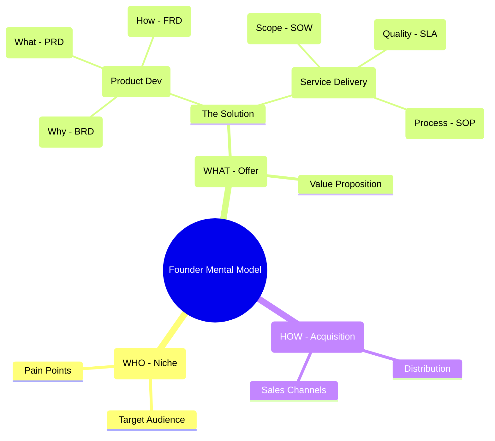
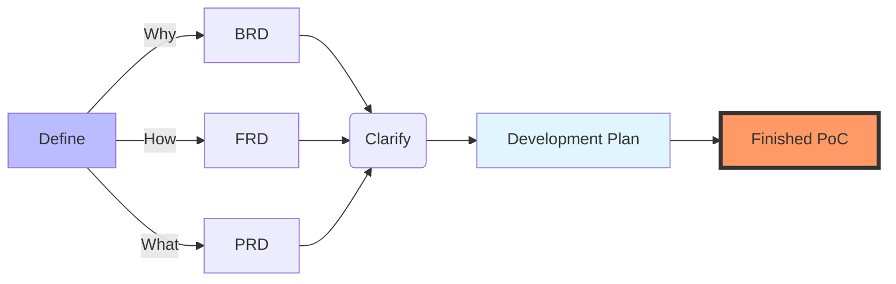

**Tl;DR**

* https://app.fireflies.ai/perks
* Perplexity and commet (from W11 only on the desktop) 

Will code been cheap increase the demand for code from businesses?

+++ [Jevons](#about-jevons)

**Intro**

Every business game, follows the *full stack business formula* from top line, to net profit:

$$
P \times V \times GM \times OM \times IF \times T
$$

Yes, we come from the ~ unit economics [105 post](https://jalcocert.github.io/JAlcocerT/ideas-to-execution/) and the psyc.

In case that you come from a physics and engineering world, this can be your new F=ma for businesses.

Something so simple, yet so powerful.

And if you are stilled confused with **EBITDA**

Just call it "Earnings **BEFORE SUBTRACTING** Interest, Taxes, Depreciation, and Amortization."

Exactly! **EBIT** (Operating Profit) is the number used to calculate the **Operating Margin**.

The formula is:

$$\text{Operating Margin \%} = \frac{\text{EBIT (Operating Profit)}}{\text{Revenue}} \times 100$$

Why this is the "Golden Ratio"

Investors prefer this margin over the EBITDA margin because it tells the truth about **efficiency**.

* **EBITDA Margin:** "How much cash do we generate from sales?" (Good for paying debt).
* **Operating Margin (EBIT):** "How profitable is our actual business model *after* accounting for the cost of maintaining our products?" (Good for long-term health).

Yes, that is **100% correct**. You have perfectly reconstructed the formula for Operating Margin.

$$\frac{(\text{EBITDA} - \text{Depreciation} - \text{Amortization})}{\text{Revenue}} = \text{Operating Margin \%}$$

By taking **EBITDA** and subtracting **D&A** (Depreciation & Amortization), you are converting "Raw Cash Flow" into "True Accounting Profit" (EBIT).

Yes, that is exactly right. You have perfectly summarized the fundamental difference between **OpEx** and **CapEx**.

Here is the "Cheat Sheet" to keep them straight:

. OpEx (Operating Expenditure) = "The Burn Rate"

* **What it is:** Money spent on day-to-day operations.
* **Examples:** Salaries, rent, cloud server bills, marketing ads, travel.
* **Accounting Treatment:** **Immediate Expense.**
* If you pay a salary in March, it subtracts from March's profit *immediately*.
* *Effect:* It hits the **EBITDA** and **Operating Profit** lines instantly.


2. CapEx (Capital Expenditure) = "The Investment"

* **What it is:** Money spent on buying or creating assets that will last for more than one year.
* **Examples:** Buying a building, purchasing trucks, or **paying developers to write code** (for software companies).
* **Accounting Treatment:** **Deferred Expense (Capitalized).**
* If you spend $1M on software code in March, the profit in March does *not* drop by $1M.
* Instead, the cost sits on the **Balance Sheet** as an asset.
* *Effect:* It slowly "leaks" onto the Profit & Loss statement over 3–5 years as **Amortization** (for software) or **Depreciation** (for physical stuff).

Why this matters for your Formula

* **High OpEx** (like a service business with lots of staff) hurts your **Operating Margin (OM)** *today*.
* **High CapEx** (like a factory or software startup) hurts your **Cash Flow** today, but only hurts your **Operating Margin** *tomorrow* (via Depreciation).

So, when you look at a company's **Operating Margin**, remember: **It includes the "ghosts" of CapEx past (Depreciation), plus the reality of OpEx present.**





We come from this section: https://jalcocert.github.io/JAlcocerT/ideas-to-execution/#creating-with-ai

Product vs. Service Frameworks

| Aspect | Product Development (BRD / PRD / FRD) | Service Delivery (SOW / SLA / SOP) |
| --- | --- | --- |
| **The "Why"** | **BRD:** Justifies the investment and business goal (e.g., "Build a CRM to increase sales"). | **SOW:** Defines the purpose of the engagement (e.g., "Provide 24/7 IT support to ensure uptime"). |
| **The "What"** | **PRD:** Lists features and user stories (e.g., "Must have a login screen and a dashboard"). | **SLA:** Defines the quality and performance levels (e.g., "Must respond to tickets within 30 minutes"). |
| **The "How"** | **FRD:** Details the system logic and data flows (e.g., "If user clicks X, then database does Y"). | **SOP:** Step-by-step manual for humans (e.g., "Step 1: Greet customer; Step 2: Open ticket in Jira"). |




---

## Conclusions

### Evaluating Business Ideas

How can we measure how good an existing idea is?

People say ratios and discounted FCF.

For ratios you have many flavours.

For Discounted FCF you need a cristal ball to imagine the future and also to be right with the discounted rate.

Others go with the *gweiss* method: *and just look at trends / thresholds*

It seems that due to SDLC changing, software driven companies are having headwinds on their valuations.

The cristal balls dont see that much revenue coming up in the future, or at least, there are more uncertainties.

```sh
#git clone https://github.com/JAlcocerT/DataInMotion.git
cd DataInMotion && git checkout libreportfolio #git branch -a
#git branch --show-current

curl -LsSf https://astral.sh/uv/install.sh | sh

#uv run tests/plot_historical_yield.py CAT --start 2000-01-01 --brand "@LibrePortfolio" --monthly
uv run tests/plot_historical_gweiss.py ADP --start 2000-01-01 --brand "@LibrePortfolio" --warmup-days 400
#ticker = yf.Ticker("WKL.AS")
```

<!-- 
https://www.youtube.com/shorts/7VHE6kNgRUU 
-->



Other companies have explosive PER ~300 that in theory say that people expect massive growth of earnings.

Companies which P*V is selling software seems to have a lot of moat.

The ones that are helping others to do software / digital transformation, some of it (but not as heavily for now)

Again, all based on hypothesis that only time will put to test.

Do you think its time to go and create a micro-SaaS? 

Or better to level up and catch the wave to max out that active income?


## FAQ

### About Jevons

The Jevons paradox describes how technological improvements in resource efficiency can lead to increased, rather than decreased, overall consumption of that resource.

Named after economist William Stanley Jevons, who observed this with 19th-century coal-powered steam engines, it shows that cheaper effective costs spur greater demand, often outweighing per-unit savings.


Jevons noted in 1865 that James Watt's more efficient steam engines expanded coal's industrial use across sectors, boosting total coal consumption despite lower fuel per task. 

He argued efficiency gains inherently widen a resource's applications, countering expectations of conservation. 

Mechanism

Efficiency lowers a resource's effective price, making demand more elastic; if rebound exceeds 100%, total use rises (Jevons paradox) versus partial offsets (rebound effect under 100%). 

Macro effects include boosted economic growth and incomes, amplifying economy-wide demand. [bonpote](https://bonpote.com/en/jevons-paradox-and-rebound-effect/)


### About BDD

Behaviour driven development - Gherkins 

Given -> When -> Then

### The magic business formula

Imagine arrive somewhere, creating a mindmap and saying after:

```md
perfect, now id like to to what each division does, what are their external and internal clients, what are their main products and how does they fit individually the net profit formula with detail stages: P*V*GM*OM*Financial*tax
```

### Coding in the Cloud

Some time ago I was interested at making work: How to use VSCode from Android?

* https://dev.to/dotnetdreamer/using-android-phone-as-a-development-machine-3f39

The thing is that now we ar ejust sending requests to agents to do the code for us in the cloud and push the changes to our repositories automatically.

Crazy.