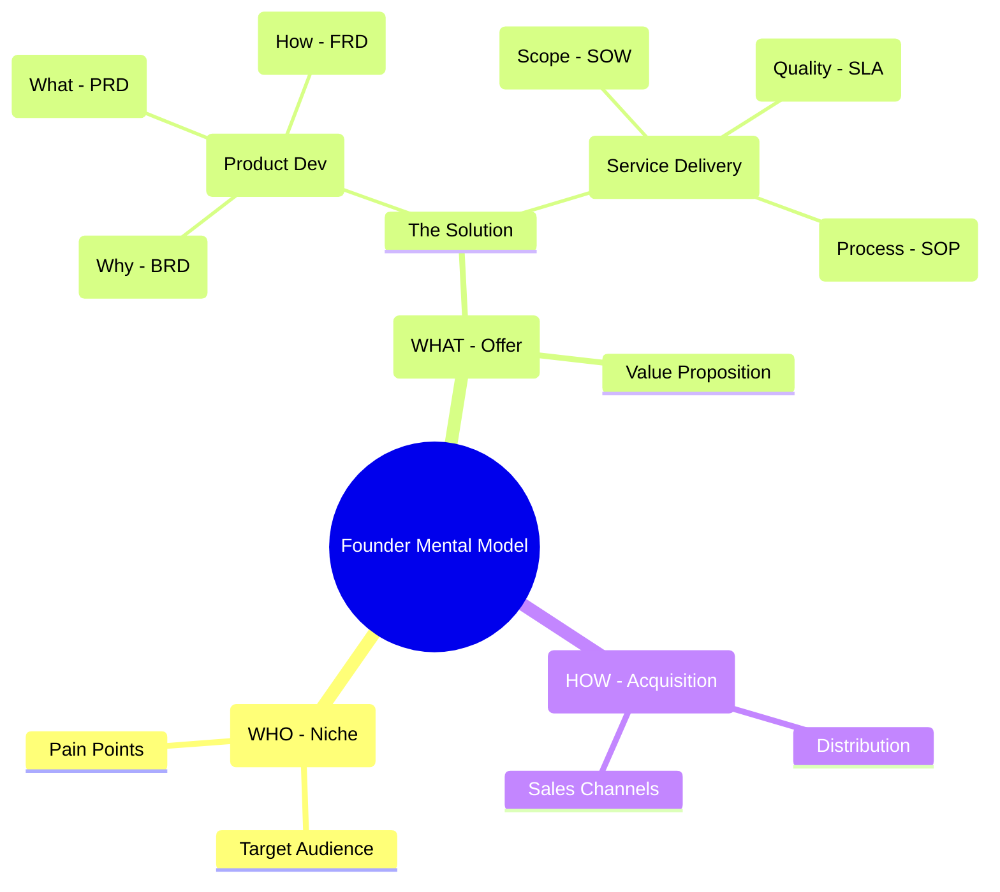
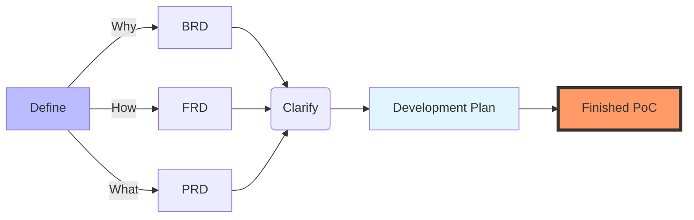

**Tl;DR**

* https://app.fireflies.ai/perks

Will code been cheap increase the demand for code from businesses?

+++ [Jevons](#about-jevons)

**Intro**

Every business game, follows the *full stack business formula* from top line, to net profit:

$$
P \times V \times GM \times OM \times IF \times T
$$





We come from this section: https://jalcocert.github.io/JAlcocerT/ideas-to-execution/#creating-with-ai

Product vs. Service Frameworks

| Aspect | Product Development (BRD / PRD / FRD) | Service Delivery (SOW / SLA / SOP) |
| --- | --- | --- |
| **The "Why"** | **BRD:** Justifies the investment and business goal (e.g., "Build a CRM to increase sales"). | **SOW:** Defines the purpose of the engagement (e.g., "Provide 24/7 IT support to ensure uptime"). |
| **The "What"** | **PRD:** Lists features and user stories (e.g., "Must have a login screen and a dashboard"). | **SLA:** Defines the quality and performance levels (e.g., "Must respond to tickets within 30 minutes"). |
| **The "How"** | **FRD:** Details the system logic and data flows (e.g., "If user clicks X, then database does Y"). | **SOP:** Step-by-step manual for humans (e.g., "Step 1: Greet customer; Step 2: Open ticket in Jira"). |




---

## Conclusions

### Evaluating Business Ideas

How can we measure how good an existing idea is?

People say ratios and discounted FCF.

For ratios you have many flavours.

For Discounted FCF you need a cristal ball to imagine the future and also to be right with the discounted rate.

Others go with the *gweiss* method: *and just look at trends / thresholds*

It seems that due to SDLC changing, software driven companies are having headwinds on their valuations.

The cristal balls dont see that much revenue coming up in the future, or at least, there are more uncertainties.

```sh
#git clone https://github.com/JAlcocerT/DataInMotion.git
#cd DataInMotion && branch libreportfolio
#uv run tests/plot_historical_yield.py CAT --start 2005-01-01 --brand "@LibrePortfolio" --monthly
uv run tests/plot_historical_gweiss.py ADP --start 2005-01-01 --brand "@LibrePortfolio" --warmup-days 400
```

Other companies have explosive PER ~300 that in theory say that people expect massive growth of earnings.

Again, all based on hypothesis that only time will put to test.

Do you think its time to go and create a micro-SaaS? 

Or better to level up and catch the wave to max out that active income?


## FAQ

### About Jevons

The Jevons paradox describes how technological improvements in resource efficiency can lead to increased, rather than decreased, overall consumption of that resource. Named after economist William Stanley Jevons, who observed this with 19th-century coal-powered steam engines, it shows that cheaper effective costs spur greater demand, often outweighing per-unit savings. [en.wikipedia](https://en.wikipedia.org/wiki/Jevons_paradox)

Jevons noted in 1865 that James Watt's more efficient steam engines expanded coal's industrial use across sectors, boosting total coal consumption despite lower fuel per task. He argued efficiency gains inherently widen a resource's applications, countering expectations of conservation. [sciencedirect](https://www.sciencedirect.com/science/article/pii/S0921800905001084)

Mechanism

Efficiency lowers a resource's effective price, making demand more elastic; if rebound exceeds 100%, total use rises (Jevons paradox) versus partial offsets (rebound effect under 100%). Macro effects include boosted economic growth and incomes, amplifying economy-wide demand. [bonpote](https://bonpote.com/en/jevons-paradox-and-rebound-effect/)


### About BDD

Behaviour driven development - Gherkins 

Given -> When -> Then

### The magic business formula

Imagine arrive somewhere, creating a mindmap and saying after:

```md
perfect, now id like to to what each division does, what are their external and internal clients, what are their main products and how does they fit individually the net profit formula with detail stages: P*V*GM*OM*Financial*tax
```

### Coding in the Cloud

Some time ago I was interested at making work: How to use VSCode from Android?

* https://dev.to/dotnetdreamer/using-android-phone-as-a-development-machine-3f39

The thing is that now we ar ejust sending requests to agents to do the code for us in the cloud and push the changes to our repositories automatically.

Crazy.