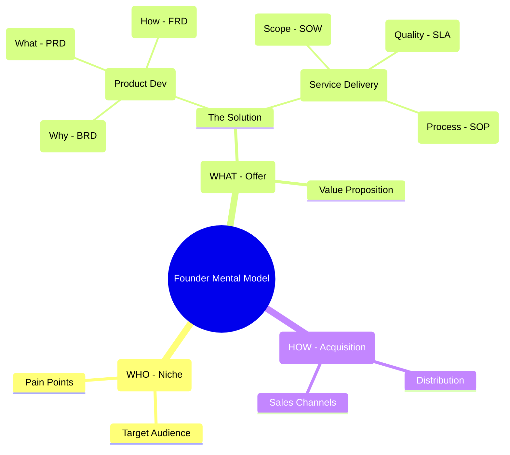

**Tl;DR**

Will code been cheap increase the demand for code from businesses?

**Intro**

```mermaid
mindmap
  root((Founder Mental Model))
    Niche (WHO - Niche)
      Target Audience
      Pain Points
    Offer (WHAT - Offer)
      The Solution
        Product Development (Product Dev)
          BRD (Why - BRD)
          PRD (What - PRD)
          FRD (How - FRD)
        Service Delivery (Service Delivery)
          SOW (Scope - SOW)
          SLA (Quality - SLA)
          SOP (Process - SOP)
      Value Proposition
    Leads (HOW - Acquisition)
      Distribution
      Sales Channels
```

---

## Conclusions

## FAQ