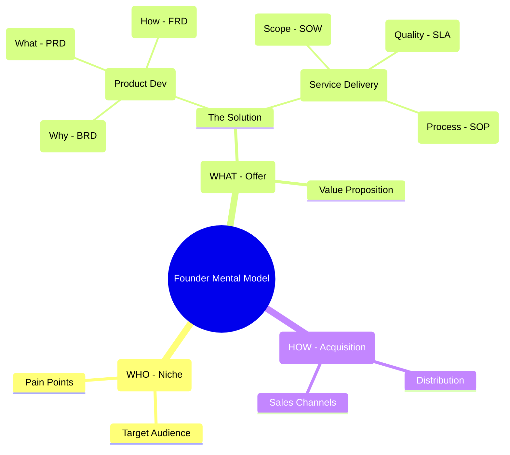
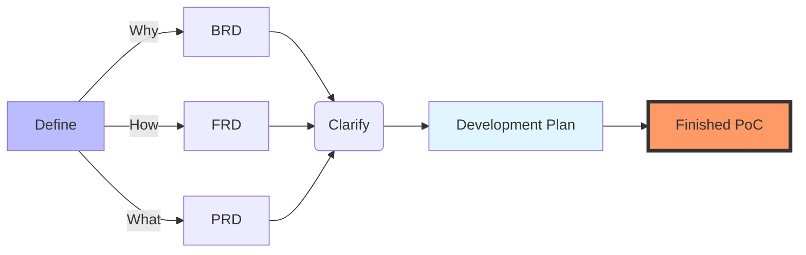

**Tl;DR**

Will code been cheap increase the demand for code from businesses?

+++ [Jevons](#about-jevons)

**Intro**

Every game, follows the *full stack business formula* from top line, to net profit:

$$
P \times V \times GM \times OM \times IF \times T
$$

https://jalcocert.github.io/JAlcocerT/ideas-to-execution/#creating-with-ai

Product vs. Service Frameworks

| Aspect | Product Development (BRD / PRD / FRD) | Service Delivery (SOW / SLA / SOP) |
| --- | --- | --- |
| **The "Why"** | **BRD:** Justifies the investment and business goal (e.g., "Build a CRM to increase sales"). | **SOW:** Defines the purpose of the engagement (e.g., "Provide 24/7 IT support to ensure uptime"). |
| **The "What"** | **PRD:** Lists features and user stories (e.g., "Must have a login screen and a dashboard"). | **SLA:** Defines the quality and performance levels (e.g., "Must respond to tickets within 30 minutes"). |
| **The "How"** | **FRD:** Details the system logic and data flows (e.g., "If user clicks X, then database does Y"). | **SOP:** Step-by-step manual for humans (e.g., "Step 1: Greet customer; Step 2: Open ticket in Jira"). |

---

## Conclusions

## FAQ

### About Jevons

The Jevons paradox describes how technological improvements in resource efficiency can lead to increased, rather than decreased, overall consumption of that resource. Named after economist William Stanley Jevons, who observed this with 19th-century coal-powered steam engines, it shows that cheaper effective costs spur greater demand, often outweighing per-unit savings. [en.wikipedia](https://en.wikipedia.org/wiki/Jevons_paradox)

Jevons noted in 1865 that James Watt's more efficient steam engines expanded coal's industrial use across sectors, boosting total coal consumption despite lower fuel per task. He argued efficiency gains inherently widen a resource's applications, countering expectations of conservation. [sciencedirect](https://www.sciencedirect.com/science/article/pii/S0921800905001084)

Mechanism

Efficiency lowers a resource's effective price, making demand more elastic; if rebound exceeds 100%, total use rises (Jevons paradox) versus partial offsets (rebound effect under 100%). Macro effects include boosted economic growth and incomes, amplifying economy-wide demand. [bonpote](https://bonpote.com/en/jevons-paradox-and-rebound-effect/)

