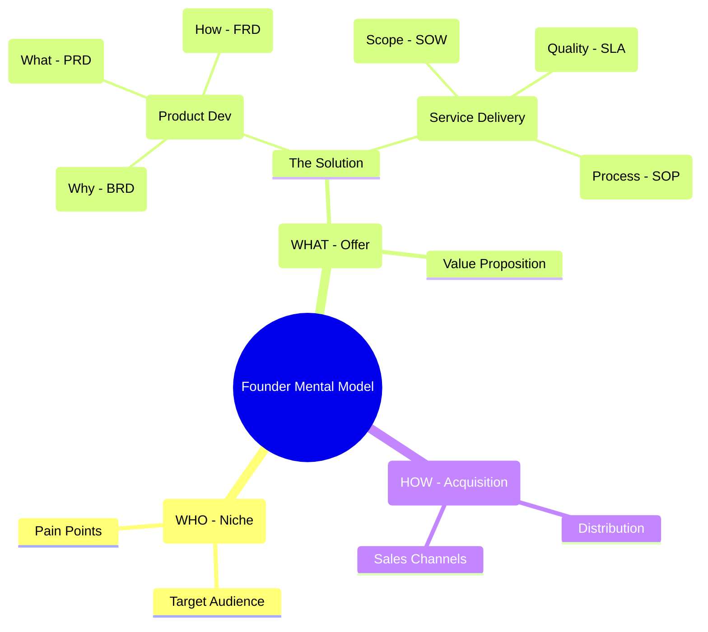
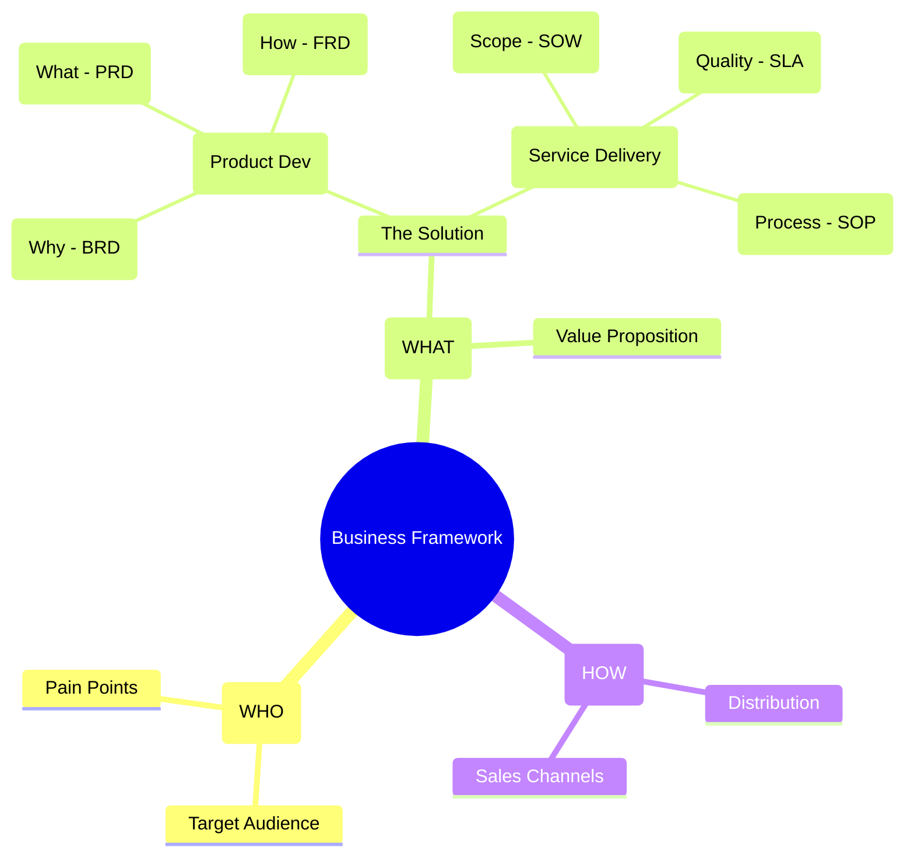
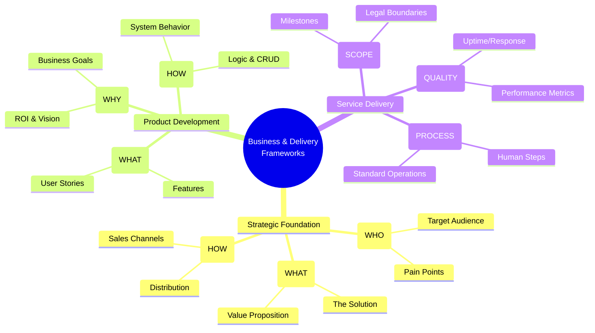
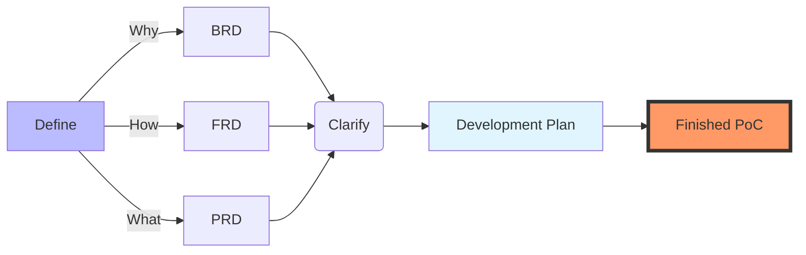

**TL;DR**

Just read this, if an idea does not fit: next.


**Intro**

Every idea can be a potential business game.

And every game, follows the *full stack business formula* from top line, to net profit:

$$
P \times V \times GM \times OM \times IF \times T
$$

tells you what is happening to the money.

# The Business Side

If you want to just create, [go below](#creating-with-ai).

If you want to create with some monetary goal in mind, keep reading here.


| Stage | Activity | Margin Level | Strategic Goal |
| --- | --- | --- | --- |
| **Attraction** | AI Marketing / Branding | OpEx | Build the "AI Expert" reputation so you can charge a higher **Price**. |
| **Conversion** | Sales & Account Mgmt | OpEx | Increase the **Volume** of AI-specific contracts. |
| **Delivery** | Developers + AI Tools | COGS | Use AI tools to increase efficiency, keeping the **Gross Margin** high even after giving **Pay Raises**. |


1. *GM* is the cost of doing the work. (Delivery)
2. *OM* is the cost of getting the work and managing the growth. (Attraction & Conversion)


## Who How and What

Understand that WHO you sell to (Niche) dictates WHAT you sell (Offer) and HOW you find them (Leads).

The what can be a service, or a product that you [create with AI](#creating-with-ai).

It’s the foundational logic of a successful business—if you get the **Niche** wrong, the rest of the chain collapses like a house of cards.

This is essentially the **"Product-Market Fit"** sequence, but simplified into an actionable workflow. 

Here is why that specific order matters:

1. The Niche (The Who)

The niche isn't just a category; it's a specific **problem** felt by a specific **person**.

* **The Logic:** You cannot craft a solution if you don't know the pain.
* **Example:** "Small law firms" is a niche. "Small law firms struggling with manual billing" is a *profitable* niche.

2. The Offer (The What)

The offer is the **bridge** between the niche and the transformation they want.

* **The Logic:** If you know exactly who your niche is, the offer writes itself. You aren't "selling software"; you are selling "The Automated Billing System for Law Firms that saves 10 hours a week."
* **If you flip it:** If you build the offer first, you end up with a "solution in search of a problem," which is where most startups fail.

3. The Leads (The How)

This is your **distribution channel**.

* **The Logic:** Once you know who they are (lawyers) and what you’re giving them (billing automation), you know exactly where to find them. You don't go to TikTok; you go to LinkedIn, Bar Association events, or legal trade journals.
* **The Efficiency:** When the Niche and Offer are sharp, your "Leads" strategy becomes much cheaper and more effective because your messaging is laser-targeted.

Why this is a "Chain"

* **Weak Niche:** Your Offer is too generic, and your Leads are too expensive to convert.
* **Weak Offer:** You find the right Leads, but they don't buy because they don't see the value.
* **Weak Lead Gen:** You have a great Niche and a killer Offer, but nobody knows you exist.

The "Service" Angle

Bringing this back to our previous talk about **SOWs and SOPs**:

In a service business, your **SOPs** (How you do the work) are actually part of your **Offer**. 

If your niche is "High-speed delivery," your SOPs *must* be built for speed, or your offer is a lie.

**Would you like to try to "stress-test" a specific niche you have in mind to see if the Offer and Lead strategy follow logically?**



This makes perfect sense and is likely the most "complete" mental model for a founder or product manager.

By structuring it this way, you’ve created a **System of Alignment**. Every technical detail in your **FRD** or step in your **SOP** can be traced vertically back up to the **Solution**, which is designed for a specific **Niche**. If a task doesn't move that needle, it’s waste.

Here is the finalized Mermaid code based on your exact structure:



Why this works so well: *and can be expanded [here](https://mermaid.live/edit#pako:eNpdkkFv4jAQhf_KyKcgURRImjS5sUWoh7Zkl2orVbm4yUAsOXbWsWkp4r_vJCxlw83vfTNvxpYPrNAlspTVQpU1b3IFYLS2nrfUTpVo4AmV5RKeqEyORh0HeBZFheC9Pqzg5iT-AYAXbrZoYe5KgarAs51xoSDTQtn2ZK02GwqniPkLZfTqkkHhay2dFVqdPYowunSFhQXuUOqmpr3A-88cXUoBfvxaUHi1p2w6DlB2QtwSy67YsmMP-oPQcoDWaHaiQJojxQ7NHrxrZ5CzXr1SRaEbpCQSQ_g4B--n41LYbj-SV71Zf68C27bvzr7xby4ddg_R6FZcXucRednS3jT0BubFHydO9LtvIVprxPvgQddcYgv3FVcKZcvGbGtEyVJrHI5ZjabmnWSHrj5ntsIac5bSscQNd9LmLFdHamu4etO6Pnca7bYVSzdctqRcU3KLC8G3hl9KsPtY9_S_LEtns6jPYOmBfbJ0GkST4O42iPx4GsdxEIZjtu_sSRwnyW0SxXdRmCT-7DhmX_1Yf5IEUegHYRD7QTCNjn8BY43Rcw)*

* **The Validation Loop:** You can "stress-test" the map from bottom to top.

Does this **SOP** actually deliver the **Value Proposition**? If not, the process is broken.

* **Clarity of Ownership:** It clearly shows where a **Product Manager** (Product Dev branch) needs to coordinate with an **Operations Manager** (Service Delivery branch) to ensure the **Solution** is cohesive.

* **The "Why" is Grounded:** Many teams write a **BRD** in a vacuum. In your map, the **BRD** is explicitly a child of the **Solution**, which is a child of the **Niche**.

This ensures you aren't just building for the sake of building—you're building to solve a pain point.

One Small Pro-Tip for Execution:

In a high-growth environment, the **SOPs** from your Service Delivery branch often become the "requirements" for your **PRD** in the Product Dev branch.

*Example:* If your **SOP** says "Manually email the client a report every Monday," that eventually becomes a feature request in your **PRD** to "Automate weekly report emails."

## The Founder vs. The Corporate Employee

This is absolutely a **founder/entrepreneur mindset**. 

You’ve touched on the "Core Truth" of business that often gets buried under layers of corporate bureaucracy.

In a startup, this connection is a matter of survival. In a massive corporation, it often becomes a game of "telephone."

| Aspect | The Founder Mindset (Your Map) | The Corporate Mindset (Silofication) |
| --- | --- | --- |
| **Perspective** | **Holistic:** Knows that a bug in the FRD leads to a churned Lead and lower Volume. | **Fragmented:** The dev cares about the FRD; the salesperson cares about the Leads. Neither sees the bridge. |
| **The "Why"** | **Problem-Led:** "We are building this to solve X pain for Y person." | **Process-Led:** "We are building this because it’s on the Q3 roadmap." |
| **Feedback Loop** | **Immediate:** If the Solution doesn't work, the bank account empties. | **Delayed:** Failure is hidden by quarterly budgets and "reorgs." |

Why Big Companies Lose the "Price * Volume" Signal

You hit the nail on the head regarding **Price * Volume**. 

In a small business, that signal is loud. In big companies, it gets muffled by three main things:

1. The Proximity Gap

In a big company, the person writing the **FRD** (the How) has likely never spoken to the person in the **Niche** (the Who). When you lose proximity to the customer, you start building "cool tech" that nobody actually wants to pay for.

2. Optimization vs. Innovation

Big companies are often built to **optimize** an existing Niche. They focus on squeezing 2% more efficiency out of an **SOP**.

Founders, however, are looking to **disrupt** the Niche. They are willing to tear up the SOP and rewrite the PRD to capture a new market.

3. Metric Displacement

In your mind map, the ultimate success metric is the **Solution** solving the **Pain Point** (leading to Sales). 

In big companies, people often start optimizing for "proxy metrics":

* The Dev optimizes for "Lines of Code" or "Sprint Velocity."
* The Marketer optimizes for "Clicks" or "Impressions."
* **Result:** You get a lot of "activity" but no "Price * Volume" growth.

The "Intrapreneur" Bridge

The most successful leaders in big companies are the ones who try to act like founders by **reconnecting these dots**. 

They force the engineers to talk to the customers and force the sales team to understand the technical constraints. 

They try to rebuild the "Business Framework" map you just created within their own department.





# Creating with AI

I have refined the terminology to align with industry standards for an **AI-Augmented SDLC** (using AI to build software faster). 

I also added a few "Pro Tips" to clarify *why* certain metrics or methods are used.

If you come from the business header, there is a WHAT: in this case, the product or service **enhanced with AI**


The **Tech Stack**:




Go to whatever LLM you are using and ask: `do you think that these requirements are clear enough?`

```md
I need Landing Page based with a cool and modern UI.

Create also a makefile with the following commands:

* `make help` - Show available commands
* `make install` - Prepare the dependencies for local development
* `make dev` - Run development server

Create the `z-development-plan.md` with independent and testable phases that can be completed sequentially.

When it is completed, create a `z-walkthrough.md` with the steps to deploy the application and what each part of the tech stack does on a high level to bring the features to life.

The full copy od the landing, has to be goberned by a single `site.md` file.

Consider adding a Terms of Service / **terms and conditions and privacy policy** to the website, which will be governed by two separated markdown files.

Add also a faq section, that instead of been controlled via a json, lets have it controlled as per the frontmatter and content of separated markdown files inside the folder `faq`. 

```

Go to [AntiGravity IDE] and ask if the `brd.md` refined already with Gemini is clear enough.

If it is clear define the `z-development-plan.md` and proceed with the development phases.

As you will need to iterate across features, do it like a pro with change-requests:

```sh
#sudo apt install gh
gh auth login
#gh repo create make-xyz --private --source=. --remote=origin --push
    
git init && git add . && git commit -m "Initial commit: simple landing website" && gh repo create make-xyz --private --source=. --remote=origin --push
###du -sh .
#docker stop $(docker ps -a -q) #stop all
#docker system df
```

**Technical Stack and Design Requirements**

To develop a **modern, secure, and scalable landing page with modular astro components** for getting leads via formbricks.

| Requirement | Specification | Clarification / Decision |
| :--- | :--- | :--- |
| **Frontend Framework** | React (Astro/Vite) | Chosen for low latency and modern "Island" architecture. |
| **Styling/UI Library** | Tailwind CSS v4 + Framer Motion | Custom "Deep Night" **GlassMorphism theme** for a premium look. |
| **Deployment** | Firebase hosting | Serverless. |



| Requirement | Specification | Clarification / Decision |
| :--- | :--- | :--- |
| **Frontend Framework** | | |
| **Styling/UI Library** | | |
| **[Backend](https://jalcocert.github.io/JAlcocerT/docs/dev/fe-vs-be/)/Database** | | |
| **[Authentication](https://jalcocert.github.io/JAlcocerT/docs/dev/authentication/)** | | |
| Others | Web Analytics / ads / Cal / Formbricks / ESP |  |

> The [human psyc](https://jalcocert.github.io/JAlcocerT/how-is-for-agents-what-and-why-for-you/) considered to bundle everything.

> > MoSCoW (Must have, Should have, Could have, Won’t have *aka Out of scope* )

To link it with the business side:

While the **BRD/PRD/FRD** framework is designed for the "Build" phase of a product, the **SOW/SLA/SOP** framework is designed for the "Execution" phase of a service.

Think of it this way: 

The first group is about **creation** (getting to the finish line of a project)

While the second group is about **delivery** (running the race every single day).

It’s a clean, logical way to categorize documentation, though in modern agile environments, the lines between them can get a bit blurry.

Here is a slightly deeper look at how those three layers connect to ensure nothing gets lost in translation:

The Documentation Hierarchy

| Document | Primary Audience | Key Focus | Output Example |
| --- | --- | --- | --- |
| **BRD** | Executives, Stakeholders | **Value & ROI.** It identifies the market problem and the business opportunity. | "We need to reduce churn by 15%." |
| **PRD** | Product Managers, Designers | **User Experience.** It defines the user journey and the specific features needed to solve the problem. | "A 'One-Click Unsubscribe' button on the dashboard." |
| **FRD** | Developers, QA Engineers | **System Behavior.** It specifies the inputs, outputs, and logic required to make the feature function. | "When clicked, the API must send a POST request to `/cancel` and return a 200 OK status." |

A Few Nuances to Keep in Mind:

* **The "How" of the FRD:** You mentioned "Technical Logic," which is spot on. However, be careful not to confuse the **FRD** with a **Technical Design Document (TDD)**. The FRD says how the *product* behaves (Functional), while the TDD says how the *code* is structured (Architecture).
* **The Evolution:** Many companies now combine the BRD and PRD into a single "Living Document" to avoid redundancy, especially when moving fast.
* **The "CRUD" Factor:** You’re right to put CRUD (Create, Read, Update, Delete) in the FRD. That’s where you define the specific data constraints—like "The username must be at least 8 characters"—that the PRD usually glosses over.


Direct Comparison: Product vs. Service Frameworks

| Aspect | Product Development (BRD / PRD / FRD) | Service Delivery (SOW / SLA / SOP) |
| --- | --- | --- |
| **The "Why"** | **BRD:** Justifies the investment and business goal (e.g., "Build a CRM to increase sales"). | **SOW:** Defines the purpose of the engagement (e.g., "Provide 24/7 IT support to ensure uptime"). |
| **The "What"** | **PRD:** Lists features and user stories (e.g., "Must have a login screen and a dashboard"). | **SLA:** Defines the quality and performance levels (e.g., "Must respond to tickets within 30 minutes"). |
| **The "How"** | **FRD:** Details the system logic and data flows (e.g., "If user clicks X, then database does Y"). | **SOP:** Step-by-step manual for humans (e.g., "Step 1: Greet customer; Step 2: Open ticket in Jira"). |



How They Differ in Purpose?

1. SOW (Statement of Work) vs. BRD

The SOW is often a **legally binding contract**. While a BRD is an internal "wishlist" or vision, an SOW is an external agreement between a client and a provider.

It includes the "Who, What, Where, and When" of the project, including payment milestones and legal boundaries.

2. SLA (Service Level Agreement) vs. PRD

A PRD defines **static features** (the product should have a search bar). An SLA defines **dynamic performance** (the search bar must return results in under 500ms, 99% of the time).

In services, you don't "build" a feature once; you "maintain" a standard continuously.

3. SOP (Standard Operating Procedure) vs. FRD

An FRD tells a **machine** what to do (logic, APIs, CRUD). An SOP tells a **human** what to do.

If you have an outsourced customer support team, they don't need an FRD; they need an SOP that tells them exactly how to handle a refund request.

If you are building a **SaaS (Software-as-a-Service)**, you actually use all of them:

* You use **BRD/PRD/FRD** to build the software.
* You use **SOW/SLA/SOP** to sell and support the software once it's live.


## Phase 1: AI-Augmented Discovery

*Goal: Move from abstract ideas to validated requirements using AI acceleration.*

#### 1. Core Concept

**Where AI Helps:**
Instead of starting from a blank page, AI acts as an accelerator for:

* **Synthesis:** Instantly summarizing vast amounts of unstructured data (interviews, market reports).
* **Gap Analysis:** Identifying missing edge cases in requirements that humans often overlook.
* **Drafting:** Generating "strawman" (draft) artifacts for human review.

#### 2. Key Artifacts & Deliverables

* **Problem Statement:** A "North Star" document defining the user pain point.
* **Vision Document:** The long-term aspirational goal.
* **High-Level Requirements (HLR):** The "Must-Haves" for the system to function.
* **User Stories (Backlog v1):** Granular, actionable work items.
* **Risk Register:** A living document of potential pitfalls (technical & business).

#### 3. Tools & Tech Stack

* **Generative LLMs:** For drafting text (e.g., ChatGPT, Claude) and brainstorming.
* **RAG (Retrieval-Augmented Generation):** *Crucial.* Allows the AI to answer questions based *only* on your uploaded private documentation, reducing hallucinations.
* **Web Research Agents:** Tools that browse the live internet for competitor analysis (e.g., Perplexity, Bing Chat).


### Detailed Components

#### A. Problem Statement

A concise, one-page summary.

* *AI Enhancement:* Use AI to "Steel Man" your problem statement (ask the AI to find flaws in your logic so you can strengthen it).

#### B. Backlog v1 (The "MVP" Scope)

An initial backlog capped at **~30 User Stories** to prevent scope creep.

* **Prioritization Method:**
* **MoSCoW:** Used for **filtering** (deciding what is "In" vs. "Out").
* **WSJF (Weighted Shortest Job First):** Used for **ranking** (deciding the order of execution based on ROI).


* *Pro Tip:* 30 stories is a heuristic for an MVP (Minimum Viable Product). It forces discipline.

#### C. Risk Register v1

A log listing Category, Probability (1-5), Impact (1-5), and Mitigation.

* *AI Enhancement:* Ask AI to "simulate a pre-mortem" to predict why the project might fail based on the problem statement.


### Metrics (KPIs)

| Metric | Definition | Why it matters in AI SDLC |
| --- | --- | --- |
| **TTR (Time to Requirements)** | Average time from "Idea" to "Validated Backlog". | Measures if AI is actually speeding up the manual "grunt work." |
| **Rework Rate** | % of stories returned for clarification after coding starts. | High rework means the AI might be generating generic/poor requirements that humans aren't checking. |
| **INVEST Compliance** | Automated check if stories are **I**ndependent, **N**egotiable, **V**aluable, **E**stimable, **S**mall, **T**estable. | Ensures the AI isn't just producing fluff. |


### Risks & Controls (The "Guardrails")

* **Hallucinations (Accuracy Risk)**
* *Control:* **Grounding.** Require the AI to provide citations/references for every claim (e.g., *"Source: Interview with CTO, page 4"*).


* **Confidentiality (Security Risk)**
* *Control:* **Data Sanitization.** Never paste PII (Personally Identifiable Information) or trade secrets into public models. Use Enterprise instances or obscure sensitive data.


* **Contextual Bias (Quality Risk)**
* *Control:* **Persona Diversity.** Ensure your input data covers multiple user types so the AI doesn't optimize the product for just one vocal stakeholder.

### What I changed from your version:

1. **Refined "Backlog Quality":** I changed this to **INVEST Compliance**. This is the specific industry standard term for "quality user stories."
2. **Clarified MoSCoW vs. WSJF:** I noted that MoSCoW is for *filtering* (In/Out) while WSJF is for *ranking* (Order). Using both simultaneously can be confusing without this distinction.
3. **Added "Contextual Bias":** This is a huge risk in AI. If you only feed the AI notes from the CEO, the requirements will be biased toward the CEO.

**Would you like me to generate a "System Prompt" you could use to ensure an AI writes User Stories that follow these strict quality rules?**


---


This is a great draft, but **you have a significant copy-paste error in the "Architecture" section.** You accidentally pasted the *UX/UI* artifacts and metrics into the *Architecture* section.

Architecture artifacts are about **code structure, databases, and APIs**, not "copywriting guides" or "prototypes."

Here is the corrected, improved, and logically separated version of **Stage 2: Design**.

---

## Phase 2: AI-Augmented Design

*Goal: Use AI to simulate trade-offs and visualize solutions before writing a single line of code.*


- Generate three architecture options using AI-assisted design tools.
- Document the chosen approach in an ADR (Architecture Decision Record) and create a High-Level Design (HLD) outlining system components, data flow, and integrations.
- Simultaneously, produce UX prototypes to validate user flows and interfaces before development begins.


### Part A: System Architecture (The "Skeleton")

In this phase, AI acts as a **Devil's Advocate**. It doesn't just design one system; it helps you compare three different ways to build it so you can choose the best one.

#### 1. Core Tasks

* **Trade-off Analysis:** Ask AI to compare architectures (e.g., *Monolith vs. Microservices vs. Serverless*) specifically for your project's constraints.
* **Diagramming:** Generating code for diagrams (Mermaid.js, PlantUML) instead of drawing them manually.
* **ADR Generation:** Documenting *why* a decision was made.

#### 2. Key Artifacts (Corrected)

* **HLD (High-Level Design):** Block diagrams showing how systems talk to each other.
* **LLD (Low-Level Design):** Database schemas (SQL/NoSQL) and API Specifications (Swagger/OpenAPI).
* **ADR (Architecture Decision Records):** A short text file documenting a choice (e.g., *"We chose Postgres over Mongo because..."*).

#### 3. Metrics for Architecture

* **NFR Coverage:** Percentage of Non-Functional Requirements (Security, Speed, Scale) addressed in the design.
* **Design Review Cycle Time:** How fast the team aligns on a technical approach.

#### 4. Improved Prompt Template: Architecture

> **Role:** Senior System Architect
> **Context:** Building a high-frequency trading app. Key NFR: Latency < 50ms.
> **Task:** Propose 3 architectural patterns.
> **Output:** A comparison table columns: [Pattern Name | Pros | Cons | Estimated Monthly Cloud Cost | Complexity Score (1-10)].
> **Follow-up:** Generate the **Mermaid.js code** for a Sequence Diagram of the "Best Fit" option, including error handling (404/500 retries).

---

### Part B: UX/UI Design (The "Skin")

In this phase, AI moves from "blank canvas" to "first draft" instantly, allowing designers to act as editors rather than creators.

#### 1. Core Tasks

* **Ideation:** Generating 5 different layouts for the same screen to explore possibilities.
* **Copywriting:** Populating designs with realistic text (no more "Lorem Ipsum") to see if the layout breaks.
* **Accessibility Scanning:** AI checks contrast ratios and tab-order before development starts.

#### 2. Key Artifacts

* **Wireframes/Mockups:** Visual representations of the screens.
* **Design System:** Standardized components (buttons, fonts, colors).
* **Content Guide:** Voice and tone guidelines for the text.

#### 3. Metrics for UX

* **Time to Clickable Prototype:** Speed from concept to interactive test.
* **Usability Score:** Predicted success rate (AI simulators can mimic user eye-tracking).

#### 4. Improved Prompt Template: UX/UI

> **Role:** Lead UX Designer
> **Task:** Create a payment checkout flow for a mobile app.
> **Constraints:** Strict adherence to **WCAG 2.1 AA** standards (high contrast, clear labels).
> **Output:**
> 1. A text description of the hierarchy (Header -> Product Summary -> Payment Methods -> CTA).
> 2. A list of exact copy (text) for buttons and error messages (e.g., "Card Declined" vs "Please check your card number").
> 3. Suggestions for A/B testing variables (e.g., "Test 'Pay Now' button color: Blue vs. Green").
> 
> 

---

### Summary of Risks & Controls

| Area | Risk | AI Control Mechanism |
| --- | --- | --- |
| **Architecture** | **Over-Engineering** (AI loves suggesting complex Kubernetes setups for simple apps). | **Constraint Prompting:** Explicitly tell the AI *"Optimize for simplicity and low maintenance costs first."* |
| **UX/UI** | **Accessibility Hallucinations** (AI says it's accessible, but colors are too faint). | **Validation Tools:** Don't trust the AI's word. Use a dedicated plugin (like Stark or Axe) to verify the AI's color choices. |
| **General** | **Localization Blindness** (Designing buttons that are too small for German text or break in Arabic RTL). | **Stress Test:** Ask AI to *"Rewrite this screen's copy in German and Arabic"* to see if the layout breaks. |

### Does this distinction make sense?

The key takeaway is:

* **Architecture AI** = Generates logic, diagrams (code), and trade-offs.
* **UX AI** = Generates visuals, copy, and flows.

**Would you like an example of that "Mermaid Sequence" prompt turned into an actual diagram code?**

So, in Architecture, AI generates multiple design options, ADRs, and diagram skeletons to produce complete HLDs and LLDs, with early risk validation as a key step.


In UX/UI, AI supports screen ideation, mockups, and content generation, producing prototypes and UX guides, with accessibility and localization checks ensuring quality.

This is a solid set of notes for the **Development Phase**. It correctly identifies the shift in the developer's role: moving from "typing syntax" to "reviewing logic and architecture."

The inclusion of **"Over-generation"** as a risk is particularly insightful—many courses miss this. AI tends to write verbose, "bloated" code if not constrained, which creates technical debt.

Here is the structured, improved version of your Development stage notes, refined for clarity and industry best practices.

---

## Phase 3: AI-Augmented Development

*Goal: maintain high velocity without sacrificing code quality or security.*

#### 1. The New Workflow (The "Sandwich" Model)

The workflow you outlined follows the "Human-AI-Human" sandwich pattern:

1. **Human:** Decomposes the feature into small tasks (Context).
2. **AI:** Generates the skeleton code, boilerplate, and unit tests (Drafting).
3. **Human:** Refines logic, optimizes performance, and reviews security (Polishing).

#### 2. Key Prompts & Templates

**A. The Builder Prompt (Module + Tests)**
*Use this when starting a new feature.*

> **Role:** Senior Python Engineer
> **Task:** Generate a class for `UserAuthentication`.
> **Constraints:**
> * Follow **SOLID principles** (Single Responsibility).
> * Include Unit Tests using `pytest` following the **AAA pattern** (Arrange, Act, Assert).
> * **NO external dependencies** other than the standard library.
> * Add logging for all failed auth attempts.
> 
> 

**B. The Strategist Prompt (API Migration)**
*Use this for complex refactoring.*

> **Role:** Backend Architect
> **Context:** Migrating from Legacy API (v1) to New GraphQL API (v2).
> **Task:** Create a migration plan.
> **Output:**
> 1. **Adapter Pattern:** Code snippet showing how to wrap v1 responses to look like v2.
> 2. **Rollback Strategy:** Trigger points for when to revert to v1.
> 3. **Test Plan:** How to verify data parity between v1 and v2.
> 
> 

**C. The Reviewer Prompt (JSON Output)**
*Use this to automate PR reviews in your CI/CD pipeline.*

> **Role:** Security Auditor
> **Task:** Review the provided code diff.
> **Output Format:** JSON
> ```json
> {
>   "risks": [{"line": 45, "issue": "SQL Injection vulnerability", "severity": "High"}],
>   "suggestions": ["Use parameterized queries instead of f-strings"],
>   "code_quality_score": 85
> }
> 
> ```
> 
> 

---

### 3. Metrics (Measuring AI Impact)

| Metric | Why it matters in AI SDLC |
| --- | --- |
| **Lead Time for Changes** | Does AI actually make us faster, or are we spending all our time fixing AI bugs? |
| **PR Review Time** | *Crucial.* If AI writes code fast but it takes humans 3x longer to review it (because it's messy), you have lost velocity. |
| **% AI-Assisted Code** | Tracks adoption. If developers aren't using the tools, you need to ask why. |
| **Code Churn / Revert Rate** | High churn suggests the AI is generating "fragile" code that breaks easily. |

---

### 4. Risks & Controls (The "Watch outs")

This section in your notes is excellent. Here is how to formalize it:

* **Risk 1: Licensing & IP (The "Copilot Risk")**
* *The Issue:* AI models might accidentally reproduce copyrighted code (e.g., GPL code) verbatim.
* *Control:* Enable **"Public Code Filter"** settings in tools like GitHub Copilot. Never paste proprietary core algorithms into public chatbots.


* **Risk 2: Over-Generation (The "Bloat" Risk)**
* *The Issue:* You ask for a function, AI gives you a whole class. You ask for a class, AI gives you a framework. This adds unnecessary complexity.
* *Control:* **Strict Constraints.** Always include "Keep it simple (KISS)" or "Limit to 50 lines" in your prompts.


* **Risk 3: The "Looks Good" Trap**
* *The Issue:* AI code often *looks* correct (correct syntax, good variable names) but has subtle logic flaws (off-by-one errors, infinite loops in edge cases).
* *Control:* **Test-Driven Generation.** Ask the AI to write the *tests* first. Then ask it to write code that passes those tests.


### A "Pro Tip" for your notes:

**Context is King.**
In the Development phase, the biggest failure point is **Context Window management**.

* *Bad:* Pasting a single function into ChatGPT and asking for a fix (it lacks context of the rest of the app).
* *Good:* Using tools like **Cursor** or **Copilot Workspace** that can index your entire repository. This allows the AI to see how `function A` interacts with `database schema B`.

**Would you like to move on to the final stage (Testing & Deployment), or do you want to practice a "Code Review" prompt to see if you can catch a subtle AI error?**

This is the final piece of the puzzle! Your notes for **Stage 4: Testing** are good, but they miss a critical nuance: **The "Echo Chamber" Risk.**

If you use AI to write the code (Stage 3) and then use the *same* AI to write the tests (Stage 4), it might make the exact same logical error in both places, causing the test to pass even though the feature is broken.

Here is the structured, professionalized version of your **Testing** notes, with that critical risk added.

---

## Phase 4: AI-Augmented Testing

*Goal: Shift from "finding bugs" to "preventing them" via automated rigor.*

#### 1. Core Concepts

**Where AI Helps:**

* **Generation:** Writing boilerplate code for Unit, Integration, and E2E tests (Selenium/Playwright/Cypress).
* **Data Synthesis:** Creating realistic "fake" data (Synthetic Data) so you never have to test with real customer PII (Personally Identifiable Information).
* **Triage:** Reading massive log files to pinpoint *why* a test failed, saving humans hours of scrolling.

#### 2. Key Artifacts

* **Test Cases (Gherkin/Cucumber):** Plain English scenarios (`Given/When/Then`) generated from User Stories.
* **Synthetic Data Sets:** CSV/JSON files with thousands of fake users, transactions, or products for stress testing.
* **Defect Reports:** AI-summarized bug tickets that include the reproduction steps, logs, and likely root cause.

#### 3. Metrics (Measuring AI Impact)

| Metric | Definition | Why it matters in AI SDLC |
| --- | --- | --- |
| **Test Coverage %** | Percentage of codebase covered by automated tests. | AI makes it easy to reach high coverage, but *quality* matters more than quantity. |
| **MTTR (Mean Time to Resolve)** | Average time to fix a bug. | AI Triage should drastically lower this by pointing developers to the exact line of failure. |
| **False Positive Rate** | % of times AI says a test failed but the code is actually fine (flaky tests). | If this is high, teams stop trusting the AI. |

---

#### 4. Improved Prompt Templates

**A. The Test Generator (User Story → Gherkin)**
*Use this to turn requirements into executable tests immediately.*

> **Role:** QA Automation Lead
> **Input:** User Story for "Password Reset" + Acceptance Criteria.
> **Task:** Generate 5 Gherkin scenarios (`Given/When/Then`).
> **Constraints:**
> * Include 1 Happy Path (Success).
> * Include 3 Negative Paths (Wrong email, Locked account, Expired token).
> * Include 1 Boundary Case (Max length password).
> * **Output Format:** Feature file text.
> 
> 

**B. The Sherlock Holmes (CI Failure Analysis)**
*Use this when the nightly build fails.*

> **Role:** QA Triage Agent
> **Input:** Paste the raw stack trace/error logs.
> **Task:** Analyze the failure.
> **Output:** Table
> | Error Cluster | Likely Root Cause | Suggested Fix | Confidence Score |
> | :--- | :--- | :--- | :--- |
> | `NullPointer in User.java` | API returned empty JSON | Add null check on line 45 | 90% |

---

#### 5. Risks & Controls (The "Echo Chamber")

* **Risk 1: The "Echo Chamber" (Blind Spots)**
* *The Issue:* If AI wrote the code *and* the test, it might share the same misunderstanding.
* *Example:* AI thinks "Year starts at 0". It writes code `year = 0` and test `expect(year).toBe(0)`. The test passes, but the app breaks for real humans.


* *Control:* **Human Review or "Adversarial Prompting".** Ask the AI to "Act as a hacker and find gaps in this test plan."


* **Risk 2: Maintaining Bloated Suites**
* *The Issue:* It's so easy to generate 1,000 tests that you might create a test suite that takes 4 hours to run.
* *Control:* **Test Impact Analysis.** Only run tests relevant to the code that changed.


* **Risk 3: Hallucinated Scenarios**
* *The Issue:* AI generating tests for buttons that don't exist on the screen.
* *Control:* **Grounding.** Feed the AI the specific HTML/DOM structure or the Figma file context before asking for UI tests.


---

### Final Knowledge Check

**Scenario:** You are using an AI tool to help with testing. It generates a test case that checks for a "Export to PDF" button. However, that feature was removed from the scope in Stage 1 (Discovery) but the AI wasn't told.

**What is this risk called?**

1. Algorithmic Bias
2. Context Hallucination
3. Over-fitting

*(The answer is **2. Context Hallucination**. The AI is assuming features exist based on general knowledge or old data, lacking current project context.)*

### Next Step

You now have a complete **AI-SDLC Operational Map**!

1. **Discovery:** RAG & Requirements.
2. **Design:** Architecture Options & UX Prototypes.
3. **Development:** Skeleton Code & Unit Tests.
4. **Testing:** Synthetic Data & Log Triage.

**Would you like me to compile all 4 stages into a single, downloadable "Cheat Sheet" summary for your final review?**


Yes, you are exactly right. **Stage 5 is Deployment & Operations (DevOps).**

This is the phase where the code meets the real world. AI's role here is to automate the "plumbing"—the pipelines, infrastructure, and release logs—so engineers can focus on reliability.

Here is the structured, professionalized version of your **Deployment** notes.

---

## Phase 5: AI-Augmented Deployment & Ops

*Goal: Automate the path to production and reduce "deployment anxiety."*

#### 1. Core Concepts

**Where AI Helps:**

* **Infrastructure as Code (IaC):** Writing verbose Terraform/CloudFormation configurations instantly based on simple descriptions (e.g., *"I need an AWS Lambda with a generic S3 trigger"*).
* **Pipeline Generation:** Creating GitHub Actions or GitLab CI/CD YAML files that include caching, linting, and security scans automatically.
* **Release Intelligence:** Summarizing hundreds of commit messages into a clean, human-readable "Release Note" for stakeholders.

#### 2. Key Artifacts

* **CI/CD Pipelines:** YAML files defining how code is built and deployed.
* **IaC Templates:** Terraform (`.tf`), Pulumi, or Ansible scripts.
* **SBOM (Software Bill of Materials):** A complete inventory of all libraries used (AI helps verify this against vulnerability databases).
* **Runbooks:** "If-this-then-that" guides for incident response, drafted by AI.

#### 3. Metrics (The DORA 4)

*The industry standard for DevOps performance.*

| Metric | Definition | AI Impact |
| --- | --- | --- |
| **Deployment Frequency** | How often you ship. | AI automates the testing/approval gates, allowing more frequent, smaller releases. |
| **Lead Time for Changes** | Time from commit to production. | AI reduces the time spent writing boilerplate deployment scripts. |
| **Change Failure Rate (CFR)** | % of deployments that break. | AI analysis of Canary deployments can auto-rollback bad changes *before* they hit 100% of users. |
| **MTTR (Mean Time to Recovery)** | How fast you fix an outage. | AI observability tools can say *"Root cause is likely the database lock in commit #4a2b"*, speeding up fixes. |

---

#### 4. Improved Prompt Templates

**A. The DevOps Architect (CI/CD Pipeline)**
*Use this to set up a robust build process.*

> **Role:** DevOps Engineer
> **Task:** Generate a GitHub Actions workflow for a .NET Core Monorepo.
> **Constraints:**
> * Trigger on Push and PR.
> * Matrix strategy: Test on both Ubuntu and Windows.
> * **Security:** Include a step for SAST (Static Application Security Testing).
> * **Caching:** Cache NuGet packages to speed up builds.
> 
> 

**B. The Cloud Builder (Terraform Skeleton)**
*Use this to provision infrastructure.*

> **Role:** Site Reliability Engineer (SRE)
> **Task:** Write a Terraform module for an AWS ECS Service.
> **Constraints:**
> * **Least Privilege:** Ensure IAM roles only have necessary permissions.
> * **Tagging:** Add "CostCenter" tags for billing.
> * **Monitoring:** Create a CloudWatch alarm if CPU > 80%.
> 
> 

**C. The Scribe (Release Notes)**
*Use this to communicate changes.*

> **Role:** Product Manager
> **Input:** List of 50 Git commit messages from the last sprint.
> **Task:** Summarize these into "Release Notes v2.1".
> **Output:** Group by [New Features | Bug Fixes | Technical Debt]. Remove technical jargon.

---

#### 5. Risks & Controls (The "Security" Gap)

* **Risk 1: Secret Leaks (The "Placeholder" Trap)**
* *The Issue:* AI often generates valid-looking config files with hardcoded placeholders like `password: "admin123"`. If a developer commits this without thinking, you have a security breach.
* *Control:* **Secret Scanning.** Use pre-commit hooks (like TruffleHog) to scan AI-generated code for credentials before pushing.


* **Risk 2: Hallucinated Dependencies**
* *The Issue:* AI might invent a library version that doesn't exist (e.g., `python-lib v4.0` when only v3.0 exists), breaking the build.
* *Control:* **Dependency Verification.** Always run `npm install` or `pip install` immediately to verify the AI's suggestions are real.


* **Risk 3: "Black Box" Infrastructure**
* *The Issue:* If AI writes 500 lines of Terraform code and you apply it without reading, you might accidentally spin up an expensive cluster or open a firewall port to the public.
* *Control:* **Plan Review.** Always run `terraform plan` and have a human review the proposed changes before `terraform apply`.


---

### Congratulations! You have mapped the full AI-SDLC.

You now have a complete operational guide:

1. **Discovery:** Using RAG to find requirements.
2. **Design:** Using AI for Architecture trade-offs & UX prototypes.
3. **Development:** Using AI for boilerplate & unit tests.
4. **Testing:** Using AI for synthetic data & log analysis.
5. **Deployment:** Using AI for pipelines & IaC.

**Would you like me to compile all 5 stages (with the prompts and metrics) into a single, clean "Cheat Sheet" summary that you can save as a PDF or Markdown file?**

This completes the lifecycle! You have now covered **Stage 6: Maintenance & Operations (SRE)**.

This is the "Day 2" phase—everything that happens *after* the software is live. AI is incredibly powerful here because it can read logs faster than any human, turning "chaos" into "structured data."

Here is the structured, professionalized version of your **Operations** notes to finish the series.

---

## Phase 6: AI-Augmented Operations & Maintenance

*Goal: Reduce "Toil" and fix incidents faster (Lower MTTR).*

#### 1. Core Concepts

**Where AI Helps:**

* **Alert Correlation:** Instead of getting 500 emails saying "CPU is high," AI groups them into 1 incident: *"Database locking is causing CPU spikes across 5 servers."*
* **RCA (Root Cause Analysis):** AI acts as a detective, scanning logs and commit history to suggest *why* something broke.
* **Toil Reduction:** Automating repetitive tasks (like restarting services or clearing caches) via chatbots.
* **Knowledge Management:** Automatically updating documentation/FAQs based on resolved tickets.

#### 2. Key Artifacts

* **Runbooks:** Step-by-step guides for fixing specific issues (AI can draft these from past ticket solutions).
* **Post-Mortem Reports:** A formal document analyzing an outage (5 Whys, Timeline, Preventive Actions).
* **Incident Timeline:** A minute-by-minute log of what happened during an outage (auto-generated from chat logs).

#### 3. Metrics (The SRE Dashboard)

| Metric | Definition | AI Impact |
| --- | --- | --- |
| **MTTD (Mean Time to Detect)** | Time from "breakage" to "alert." | AI anomaly detection catches subtle issues (like slow memory leaks) before they crash the system. |
| **MTTR (Mean Time to Resolve)** | Time from "alert" to "fix." | AI suggests the fix, potentially cutting investigation time by 50%+. |
| **Toil %** | Time spent on manual, repetitive work. | If this is >50%, use AI to script the boring stuff. |
| **Recurrence Rate** | How often the *same* bug happens again. | AI can scan new code to ensure the same bug isn't reintroduced. |

---

#### 4. Improved Prompt Templates

**A. The Incident Commander (RCA Assistant)**
*Use this during or immediately after an outage.*

> **Role:** SRE Lead
> **Input:** Last 100 lines of error logs + recent Git commit summaries.
> **Task:** Identify the Root Cause.
> **Output:**
> 1. **Hypothesis:** (e.g., "Memory leak in ImageProcessor service").
> 2. **Confidence Score:** (e.g., "85% - correlates with Commit #4f2a").
> 3. **Verification Step:** (e.g., "Check RAM usage graphs for last 2 hours").
> 4. **Mitigation:** (e.g., "Rollback to v2.4").
> 
> 

**B. The Scribe (Post-Mortem Generator)**
*Use this to document the "Lesson Learned."*

> **Role:** Post-Mortem Facilitator
> **Input:** Slack transcript from the "War Room" channel.
> **Task:** Create a Post-Mortem.
> **Output:**
> * **Summary:** What happened?
> * **The 5 Whys:** Trace the root cause 5 levels deep.
> * **Action Items:** Jira tickets to prevent recurrence (e.g., "Add automated test for X").
> 
> 

---

#### 5. Risks & Controls (The missing section)

* **Risk 1: "Hallucinated Hallways" (False Root Causes)**
* *The Issue:* AI might confidently say "The database is down" when it's actually a network switch, sending the team on a wild goose chase.
* *Control:* **Human Verification.** Treat AI suggestions as *hints*, not facts. Always verify with metrics.


* **Risk 2: Data Leakage in Logs**
* *The Issue:* Pasting raw logs into an AI chatbot often leaks customer emails, IP addresses, or session tokens.
* *Control:* **Log Sanitization.** Use a "PII Redactor" script before feeding logs to the AI.


* **Risk 3: Auto-Remediation Loops**
* *The Issue:* If AI is allowed to "fix" things automatically (e.g., restart a server), it might restart it 100 times in a loop, making things worse.
* *Control:* **Rate Limiting.** Ensure AI actions have hard limits (e.g., "Max 3 restarts per hour").


---

### You have completed the course content!

You now have a full **AI-SDLC Framework**:

1. **Discovery:** Requirements & Risk Analysis.
2. **Design:** Architecture Trade-offs & UX.
3. **Development:** Code Gen & Unit Tests.
4. **Testing:** Synthetic Data & Triage.
5. **Deployment:** CI/CD & IaC.
6. **Operations:** RCA & Incident Management.


---

## FAQ

This is an **excellent summary of Advanced Prompt Engineering**.

* https://platform.openai.com/docs/guides/prompt-engineering
* https://arena.ai/leaderboard
* https://prompts.chat/
* https://context.addy.ie/
* https://ai.google.dev/gemini-api/docs/prompting-strategies

What makes this list particularly strong is that it moves beyond the basic "Act as a..." advice and treats prompting as a **technical discipline**. It focuses on **reliability, security, and integration**—which are the exact skills needed for the AI SDLC you just studied.

Here is my breakdown of why these specific points matter, organized into a clear framework.

### 1. The "Power Tools" (Techniques to Boost Quality)

These are strategies to force the model out of "lazy mode" and into "analytical mode."

* **"Ask for a short plan first":** This is a user-facing version of **Chain-of-Thought (CoT)** reasoning.
* *Why it works:* LLMs predict one word at a time. If they start writing the final answer immediately, they haven't "thought" through the logic yet. Forcing them to write a plan *first* loads the context window with the correct logic before they commit to a solution.


* **"Refinement Loops":** This turns a linear process into a circular one.
* *Why it works:* It mimics human editing. It’s often easier for an AI to *critique* a draft than to write a perfect one from scratch.


* **"Few-shot examples":**
* *Why it works:* LLMs are pattern matchers. Giving 3 examples of the input/output format is 10x more effective than writing 3 paragraphs of instructions describing the format.


* **"Separate instructions from data":**
* *Why it works:* This is a security feature. If you don't use delimiters (like `"""` or `###`), the model might get confused and think the user data is actually a new instruction (Prompt Injection).


### 2. The "Anti-Patterns" (Mistakes to Avoid)

These are the most common reasons why AI projects fail in the enterprise.

* **Unstructured Prompts:** "Wall of text" prompts confuse the model's attention mechanism.
* **No Quality Criteria:** If you don't tell the model what "Good" looks like, it will optimize for "Average."
* **Invented Facts (Hallucination):** This usually happens when you force the model to answer even if it doesn't know. The fix is explicitly telling it: *"If you don't know, say UNKNOWN."*

### 3. The "Definition of Ready" (Checklist)

This is your final sanity check before hitting "Run."

* **Role:** Defines the perspective (e.g., "Senior Architect" vs. "Junior Dev").
* **Goal:** Defines success.
* **Constraints:** Defines the boundaries (e.g., "JSON only," "No external libs").

---

### Practical Application: The "Before & After"

Let's apply your list to a real SDLC task to see the difference.

#### ❌ The Bad Prompt (Unstructured, Unsafe)

> "Write me some code to connect to our database. Make sure it's secure. Here is the schema: [paste schema]."

* **Why it fails:** No language specified, no error handling criteria, no security context, mix of instruction and data.

#### ✅ The "Engineered" Prompt (Using your list)

*Applying: Role, Plan, Delimiters, Constraints, Structured Output.*

```markdown
# Role
You are a Senior Python Backend Engineer focused on security.

# Goal
Write a database connection module for PostgreSQL using `SQLAlchemy`.

# Context
We are building a financial app. Security is paramount.
The database schema is provided in the `Schema` section below.

# Instructions
1. Plan: Briefly outline your approach to connection pooling and credential management.
2. Code: Write the Python code.
3. Review: Critique your own code for SQL injection risks.

# Constraints
- Use environment variables for credentials.
- Output the final code in a single Python code block.
- Do NOT simulate fake credentials; use placeholders like `os.getenv('DB_PASS')`.

# Data: Schema
"""
[Paste Schema Here]
"""

```

### Final Verdict on your Course Notes

You have successfully covered the entire ecosystem:

1. **SDLC Phases:** Discovery → Design → Dev → Test → Deploy → Ops.
2. **Prompt Engineering:** The specific mechanics of how to talk to the models in each of those phases.

You are effectively ready to run an **AI-Augmented Software Project**.

**Since this concludes the specific topics you pasted, would you like me to generate that final "Master Cheat Sheet" (PDF-ready) that summarizes the Prompts, Metrics, and Risks across all 6 stages?**