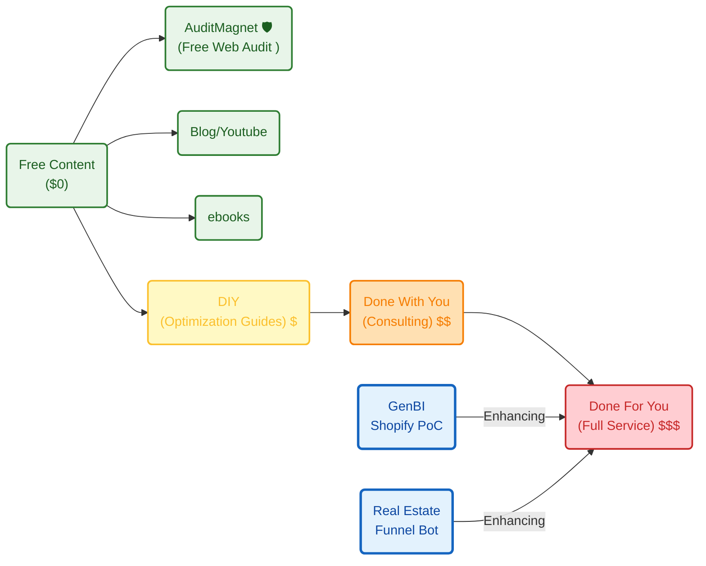

**Tl;DR**

Thoughts after one year of vibe coding.

* https://app.fireflies.ai/perks
* Perplexity and commet (from W11 only on the desktop) 


**Intro**

I stopped copy pasting from Gemini web UI and start using codex CLI, gemini cli and so on around one year ago.

Later I tried windsurf, cursor and finally antigravity.

Lately, Im paying claude PRO and im quite happy with it.

The productivity change [and learnings](#what-i-have-shipped) has been massive.

Who could have guessed, the more repetitions you do, the more architecture you understand and the more predictable things become.


This is when I started moving from streamlit, to pure web apps.


---

## Conclusions


### What I have shipped

Ive shipped and learn many what to do and several NOT to do.

They all plugged into these 2 lovely equations:

$$
P \times V \times GM \times OM \times IF \times T
$$

From where you can create a tier of services with *some sort of sense*: *yea, the [value ladder](https://jalcocert.github.io/JAlcocerT/shopify-business-data-analytics/#how-is-this-been-shaped)!*

```sh

#3bodies OSS

```





Anyways, make sure to go through [the business ideas checklist](https://jalcocert.github.io/JAlcocerT/ideas-and-opportunities-health-check/#business-idea-checklist) and as cheap as code is now, make sure you [ask questions](https://jalcocert.github.io/JAlcocerT/ideas-to-execution-after-learning/#questions) before you start prompting.

For me, lately its all about [this greenfield prompt](https://jalcocert.github.io/JAlcocerT/ideas-to-execution-with-dao/#for-vibe-coders) or this other tech stack.

Combined with the best BRD / PRD / FRD / Project Charter / CRQ practices ever...

You can build your PoC in an afternoon and the [MVP in a week with some sense](https://jalcocert.github.io/JAlcocerT/ideas-and-opportunities-health-check/#building-a-how-with-sense)

When interested on creating with potential financial incentives, focus on prospecting, then define a proper why and what.

If you just care about creating for the sake of it / tinkering, you are good to go with the why and what to get a working how.

In that case, just enjoy dont expect money to flow.

Around those concepts, Ive been playing with:

```sh
whois leadarchitect.org| grep -i -E "(creation|created|registered)"
#nslookup leadarchitect.org
dig slubnechwile.com
dig entreagujaypunto.com
```

Some of which I will let go if they dont kick off before the domain renewal.

The good thing about 'not caring' about people churning, is that you can **white-label solutions** with the expertise you have adquired building [those underpriced solutions](https://jalcocert.github.io/JAlcocerT/white-label-real-estate-solution/#why-this-pricing):

```sh
#https://realestate.jalcocertech.com
#https://genbi.jalcocertech.com
#https://webaudit.jalcocertech.com/
#mbsd...
# f1...
```

Most likely objections are not about pricing, but perceived value.

Make sure to understand that selling is 20% about the thing and [80% about people and psyco](https://jalcocert.github.io/JAlcocerT/how-is-for-agents-what-and-why-for-you/#psyco)

It just the right time to admit that [wrong client selection has consequences](https://jalcocert.github.io/JAlcocerT/ideas-to-execution-after-learning/#the-right-value-prop) and despite *paying with my own pocket* B2C tend to see costs (instead of potential ROI when a problem is solved for B2B) and chances of churning are high.

You should now the drill by now: [attract, convert, deliver](https://jalcocert.github.io/JAlcocerT/ideas-to-execution-after-learning/#attract-convert-deliver).

---

## FAQ

### My favourite prompts

I tried to migrate [eayp from HUGO v1](https://jalcocert.github.io/JAlcocerT/websites-themes-2024/#photo-galleries) to [v2a/b here](https://jalcocert.github.io/JAlcocerT/do-your-instagram/).


  
  



{}


{}

{}


{}

The [web audits](https://jalcocert.github.io/JAlcocerT/do-your-instagram/#web-audits) were fine, but the edits and uploads...not there.

So for the v3...

```sh

```

{}

1. Editor in one subdomain, delivery static if possible and in another

2. For UI Astro and Vite allow really cool features

{}