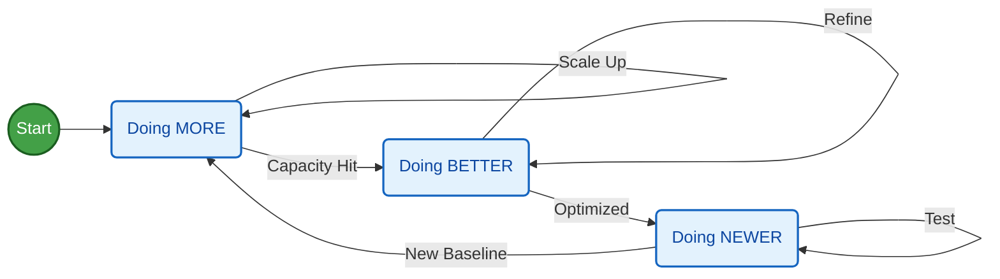
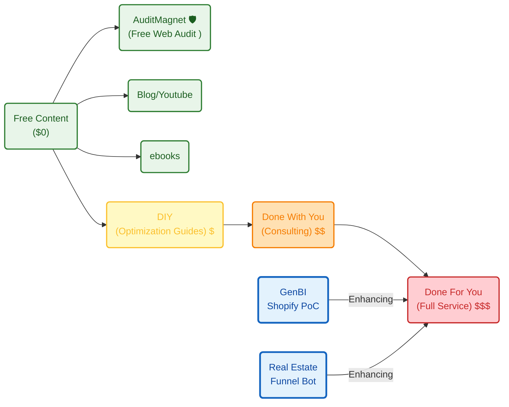

**Tl;DR**

Thoughts after one year of vibe coding.

* https://app.fireflies.ai/perks
* Perplexity and commet (from W11 only on the desktop) 


**Intro**

I stopped copy pasting from Gemini web UI and start using codex CLI, gemini cli and so on around one year ago.

Later I tried windsurf, cursor and finally antigravity.

Lately, Im paying claude PRO and im quite happy with it.

```sh
#
claude install #it recently migrated from npm
```

```md
❯ given the pbip exported files and the data-lineage.md, can you put together a data-sources.md with all the the sources listed one by one, their paths and what data do they contain based on the context you have? some use case would also be great as per the dashboard context 
```

The productivity change [and learnings](#what-i-have-shipped) has been massive.

Who could have guessed, the more repetitions you do, the more architecture you understand and the more predictable things become.


This is when I started moving from streamlit, to pure web apps.


## Key Concepts for solving problems

1. Repetitions.



Because with repetitions you go from a so so vibed coded web/app to other that can impress.

2. 

---

## Conclusions

If you are one and have excuses to create: find another ones.

Come on, Codex is even as [desktop for windows](https://apps.microsoft.com/detail/9plm9xgg6vks).

Now the blockers are in the acceptance of new ideas flowing to main/prod branch.

> How can we trust the AI to write the code and pretend that we will be the ones reviewing?

As illustrated brilliantly by [this article](https://www.latent.space/p/reviews-dead) and: https://background-agents.com/

> The site UI/X and how it makes you go through the story is amazing!

Questions like the ones you can have solved:


  
  



### What I have shipped

Ive shipped and learn many what to do and several NOT to do.

They all plugged into these 2 lovely equations:

$$
P \times V \times GM \times OM \times IF \times T
$$

From where you can create a tier of services with *some sort of sense*: *yea, the [value ladder](https://jalcocert.github.io/JAlcocerT/shopify-business-data-analytics/#how-is-this-been-shaped)!*

```sh

#3bodies OSS
#slider crank OSS / mbsd 
```





Anyways, make sure to go through [the business ideas checklist](https://jalcocert.github.io/JAlcocerT/ideas-and-opportunities-health-check/#business-idea-checklist) and as cheap as code is now, make sure you [ask questions](https://jalcocert.github.io/JAlcocerT/ideas-to-execution-after-learning/#questions) before you start prompting.

For me, lately its all about [this greenfield prompt](https://jalcocert.github.io/JAlcocerT/ideas-to-execution-with-dao/#for-vibe-coders) or this other tech stack.

Combined with the best BRD / PRD / FRD / Project Charter / CRQ practices ever...

You can build your PoC in an afternoon and the [MVP in a week with some sense](https://jalcocert.github.io/JAlcocerT/ideas-and-opportunities-health-check/#building-a-how-with-sense)

When interested on creating with potential financial incentives, focus on prospecting, then define a proper why and what.

If you just care about creating for the sake of it / tinkering, you are good to go with the why and what to get a working how.

In that case, just enjoy dont expect money to flow.

Around those concepts, Ive been playing with:

```sh
whois leadarchitect.org| grep -i -E "(creation|created|registered)"
#nslookup leadarchitect.org
dig slubnechwile.com
dig entreagujaypunto.com
```

Some of which I will let go if they dont kick off before the domain renewal.

The good thing about 'not caring' about people churning, is that you can **white-label solutions** with the expertise you have adquired building [those underpriced solutions](https://jalcocert.github.io/JAlcocerT/white-label-real-estate-solution/#why-this-pricing):

```sh
#https://realestate.jalcocertech.com
#https://genbi.jalcocertech.com
#https://webaudit.jalcocertech.com/
#mbsd...
# f1...
```

Most likely objections are not about pricing, but perceived value.

Make sure to understand that selling is 20% about the thing and [80% about people and psyco](https://jalcocert.github.io/JAlcocerT/how-is-for-agents-what-and-why-for-you/#psyco)

It just the right time to admit that [wrong client selection has consequences](https://jalcocert.github.io/JAlcocerT/ideas-to-execution-after-learning/#the-right-value-prop) and despite *paying with my own pocket* B2C tend to see costs (instead of potential ROI when a problem is solved for B2B) and chances of churning are high.

You should now the drill by now: [attract, convert, deliver](https://jalcocert.github.io/JAlcocerT/ideas-to-execution-after-learning/#attract-convert-deliver).

---

## FAQ

### My favourite prompts

I tried to migrate [eayp from HUGO v1](https://jalcocert.github.io/JAlcocerT/websites-themes-2024/#photo-galleries) to [v2a/b here](https://jalcocert.github.io/JAlcocerT/do-your-instagram/).


  
  



{}


{}

{}


{}

The [web audits](https://jalcocert.github.io/JAlcocerT/do-your-instagram/#web-audits) were fine, but the edits and uploads...not there.

So for the v3...

```sh

```

{}

1. Editor in one subdomain, delivery static if possible and in another

2. For UI Astro and Vite allow really cool features

{}


### Whats Open DevOps?

Ive heard this year about DORA.

Which maps with Lean (via VSM) and DevOps: https://www.atlassian.com/devops/frameworks/dora-metrics

DORA is a **metrics framework** (not a rigid toolset)—a set of four standard KPIs from Google's **DevOps Research and Assessment** team to benchmark software delivery.

> DORA = *how good are companies at shipping software?*

There are two key clusters of data inside DORA: Velocity and Stability.

The DORA framework is focused on keeping them in context with each other, as a whole, rather than as independent variables, making the data more challenging to misinterpret or abuse.

Within **velocity** are two core metrics:

* Deployment Frequency (DF): *Number of successful deployments to production, how rapidly is your team releasing to users?*
* Lead Time for Changes (LTC): *How long does it take from commit to the code running in production? 

This is important, as it reflects how quickly your team can respond to user requirements.

**Stability** is composed of two core metrics:

* Change Failure Rate (Change Success Rate): *How often are your deployments causing a failure?*
* Median Time to Restore Service (MTTR): *How long does it take the team to properly recover from a failure once it is identified?*

However, MTTR is replaced by Failed Deployment Recovery Time from the 2023 DORA report. 

This metric measures the finish time of a deployment to the resolution of the incident caused by the deployment.

https://devlake.apache.org/assets/images/dora-intro-e3847646d8dbe47220e6c8347ab14f7b.png

DevLake: Incubating Apache project for SDLC metrics (e.g., DORA), data ingestion/visualization from dev tools; uses Go, Grafana; no relation to big data storage.

Delta Lake: Open-format (Databricks-led, Apache-compatible via Spark) for ACID transactions, time travel in data lakes; unrelated to engineering metrics.


| Metric                  | What It Measures                  | Elite Benchmark  [atlassian](https://www.atlassian.com/devops/frameworks/dora-metrics) |
|-------------------------|-----------------------------------|----------------------------------|
| **Deployment Frequency** | How often code deploys to prod   | Multiple per day                |
| **Lead Time for Changes**| Commit to deploy time            | <1 day                          |
| **Change Failure Rate**  | % of deploys causing failures    | 0-15%                           |
| **Time to Restore**     | MTTR from failure                | <1 hour                         |

### Argo and Jenkins?

If you care enough about DORA, speed stability, doing more for your clients...

For sure you have heard about CI/CD, particularly jenkins and argo :)

Think of it this way: Jenkins is the **builder**, and Argo CD is the **delivery driver** who makes sure the house stays exactly as the blueprint intended.

**What is Argo CD?**

Argo CD is a **declarative, GitOps continuous delivery (CD) tool** specifically built for Kubernetes.

The core idea is simple: You define what your application environment should look like (the "Desired State") in a Git repository. Argo CD monitors that repository and compares it to what is actually running in your Kubernetes cluster (the "Live State").

* **Syncing:** If you change your code in Git, Argo CD automatically updates Kubernetes to match.
* **Self-Healing:** If someone accidentally deletes a component in Kubernetes, Argo CD notices the "drift" and automatically recreates it to match Git.

Does it relate to **Jenkins?**

Yes, but they aren't competitors; they are usually **teammates**.

While Jenkins is a "do-it-all" automation engine, it wasn't originally built for the cloud-native, containerized world of Kubernetes. Here is how they relate:

1. The Hand-off (The CI/CD Pipeline)

In a typical workflow, Jenkins handles the **Continuous Integration (CI)** and Argo CD handles the **Continuous Delivery (CD)**.

* **Jenkins:** Takes your source code, runs tests, and builds a Docker image. It then pushes that image to a registry and updates a YAML file in your Git repo.
* **Argo CD:** Sees that the YAML file has changed and pulls that new Docker image into your Kubernetes cluster.

2. Push vs. Pull

* **Jenkins (Push Model):** Jenkins usually "reaches out" and tells Kubernetes to run a command. This requires Jenkins to have high-level security credentials for your cluster.
* **Argo CD (Pull Model):** Argo CD sits *inside* your cluster. It watches Git and "pulls" changes in. This is generally considered more secure and stable for Kubernetes environments.

| Feature | Jenkins | Argo CD |
| --- | --- | --- |
| **Primary Goal** | General automation & CI (Building/Testing) | Kubernetes Deployment & CD (Deploying) |
| **Philosophy** | Script-based (Jenkinsfile) | GitOps-based (Declarative YAML) |
| **Environment** | Runs anywhere | Runs on Kubernetes |
| **Best Used For** | Compiling code, running unit tests | Ensuring the cluster matches the Git repo |

> **The Bottom Line:** Use Jenkins to turn your code into an image, and use Argo CD to put that image into production.

> > Both can be helpful for HFAD which relate with DORA metrics!!