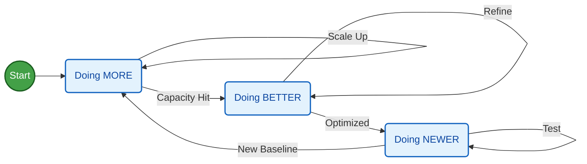
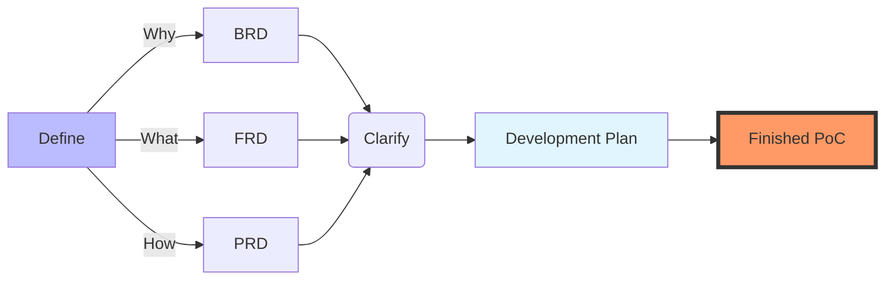
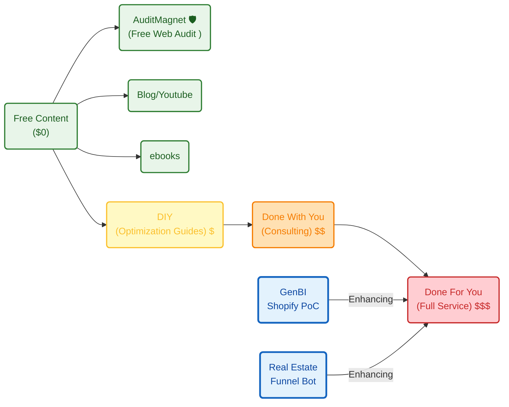
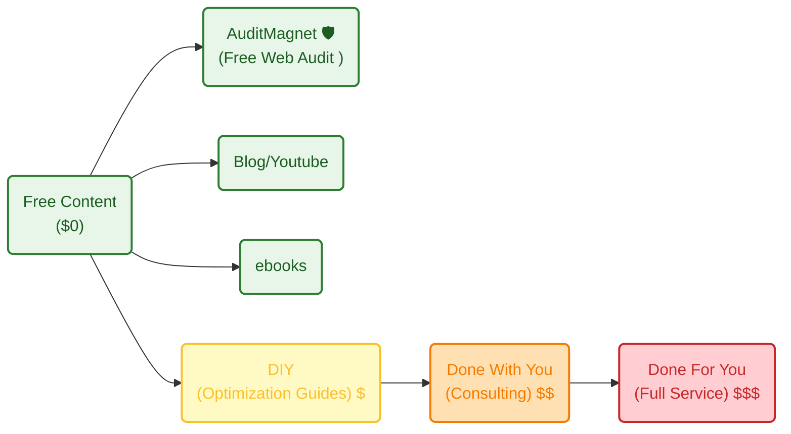

**Tl;DR**

Thoughts after one year of vibe coding.

+++ [EayP v3](#eayp-v3)

* https://app.fireflies.ai/perks
* Perplexity and commet (from W11 only on the desktop) 


https://skills.sh/

https://www.youtube.com/watch?v=qfWpPEgea2A&t=191s

https://www.youtube.com/watch?v=rlLwSr-wIAg&t=431s

https://github.com/martingaido/ai-prompt-engineering-docs/blob/main/gemini-for-google-workspace-prompting-guide-101.pdf

**Intro**

I stopped copy pasting from Gemini web UI and start using codex CLI, gemini cli and so on around one year ago.

Later I tried windsurf, cursor and finally antigravity.

Lately, Im paying claude PRO and im quite happy with the decision.

```sh
#irm https://claude.ai/install.ps1 | iex
claude install #it recently migrated from npm
```

> You arent using this yet to create technical breakdowns and architectural design records?

The key is to think of prompting as a flow:

Goal -> Context -> Instruction -> Contrains -> Output Format

As we say here, its all about [the AI mindset](https://jalcocert.github.io/JAlcocerT/a-diy-boilerplate-to-ship/#the-tech-talk).

```md
given the pbip exported files and the data-lineage.md, can you put together a data-sources.md with all the the sources listed one by one, their paths and what data do they contain based on the context you have? some use case would also be great as per the dashboard context 
```

The productivity change [and learnings](#what-i-have-shipped) has been massive.

Who could have guessed: the more repetitions you do

the more architecture you understand

and the more predictable things become


> This is when I started moving from streamlit, to pure web apps.


## Key Concepts for solving problems

1. Repetitions



Because with repetitions you go from a *so so* [vibed coded web/app](https://jalcocert.github.io/JAlcocerT/learnt-while-building-web-apps) to others that can really impress.

2. Where are you bringing value? 

Net Profit and the value equation

$$
P \times V \times GM \times OM \times IF \times T
$$





> B2C is extremely sensitive to the ,security/guarantees' part


3. Value stream mapping [VSM](https://jalcocert.github.io/JAlcocerT/lean/#vsm) x [Pareto](https://jalcocert.github.io/JAlcocerT/pareto-principle-for-data-analytics/)

Because 80% of what you do is non-sense for your client

Just ship de 20% that matters, for the 20% of clients that value it the most


Yea, avoid the 80% of clients that will give you the most headaches while paying the least.

4. Value is subjective: *for you, your time is not a commodity, your client money is*.

This implies that given a product, client A is as good as client B.

For a fee: you can create a loop to iterate across N clients via ads.

5. Risk avoidance is huge in us.

Particularly for B2C >> B2B (business tend to calculate ROIs and try to assign % somehow...)

> when was the last time that you account for your *human capital* (vital energy as a function of your time alive) getting depleted each day?

Is estability seeking killing our real nature?

what are our real needs?

how would we behave if they'd be satisfied?

https://github.com/JAlcocerT/Slider-Crank/blob/main/prompt-blueprint.md applied also to [threebodies here](https://github.com/JAlcocerT/ThreeBodies/blob/main/ThePoincareLab/z-tech-stack.md) and...around [the power law](https://github.com/JAlcocerT/btc-powerlaw/blob/master/GEMINI.md) :)


Because there are several ways to vibe code, but [some prompts + BRDs are gold](https://jalcocert.github.io/JAlcocerT/ideas-to-execution-with-dao/#for-vibe-coders)

```sh
git clone https://github.com/JAlcocerT/poc
#cd aegis-freedom  #savings+monetary system = partial/total freedom
#this is not the rstocks / retirement facts, but somehow similar :)
```

are we numb?

are we so asleep to be avoiding so hard to put few k$ into ads?

ops, these questions are out of the scope for this post :)

6. 

---

## Conclusions

If you are one and have excuses to create: find another ones.

Specially while ai monthly subs are giving so much inference for the current price.

Come on, Codex is even as [desktop for windows](https://apps.microsoft.com/detail/9plm9xgg6vks).

Now the blockers are in the acceptance of new ideas flowing to main/prod branch.

> How can we trust the AI to write the code and pretend that we will be the ones reviewing?

As illustrated brilliantly by [this article](https://www.latent.space/p/reviews-dead) and: https://background-agents.com/

> The site UI/X and how it makes you go through the story is amazing!

Questions like the ones you can have solved:


  
  



### What I have shipped

Ive shipped and learn many what to do and several NOT to do.




Coming from [last year end review](https://jalcocert.github.io/JAlcocerT/tech-recap-and-more-2025/#for-next-year)

1. Weddings serverless + ads - [WIP](https://jalcocert.github.io/JAlcocerT/bring-eyes-to-your-saas/) ⚙️

8. Get back to mech simulations - *for fun :)* - [MBSD 2D](https://jalcocert.github.io/JAlcocerT/2d-mbsd) ✅

7. Prepare the DIY/DWY/DFY based on the ebooks and blog content ~ *Wiki efforts* - WIP ⚙️

5. Books *from D&A to web and concepts from kindle notes* - WIP ⚙️

3. AIoT *end to end flow from solar panels to dashboarding & langchain*

4. Custom Marketing analytics *from custom high signal content creation to funnels* Matplotlib, [remotion](https://jalcocert.github.io/JAlcocerT/video-creation-with-remotion/) stuff...

6. ~~Scaling PRO Webs creation via PaaS~~ - A better DIY website with free (programmatic) audit - Free web audits [show problems here](https://jalcocert.github.io/JAlcocerT/how-to-perform-free-web-audit/) ✅

* https://webaudit.jalcocertech.com/

2. ~~Real Estate Custom RAG and WebApp via DecapCMS~~ | Cancelled and [whitelabelled](https://jalcocert.github.io/JAlcocerT/white-label-real-estate-solution/) 

* https://realestate.jalcocertech.com/




They all plugged into these **2 lovely equations**:

$$
P \times V \times GM \times OM \times IF \times T
$$

The value equation

> What needs to happen or which % do people assign to some obvious offers? or why do they go for clear non-go ones?

> > Dont explain it from rationallity or you'll be lost. Consider psyc!

From where you can create a tier of services with *some sort of sense*: *yea, the [value ladder](https://jalcocert.github.io/JAlcocerT/shopify-business-data-analytics/#how-is-this-been-shaped)!*

```sh
git clone /slubnechwile
#3bodies OSS
#slider crank OSS / mbsd
#git clone /VideoEditionRemotion
#git clone /poc #with prompts and ctas :)
#git clone /jalcocertech-services #all in one repo :)
#https://webaudit.jalcocertech.com/
#entreagujaypunto eaypv3
```

Some videos...specially after the mech and remotion tinker sessions:

```sh

```

Among all of them, I think that instead of doing mass produced via matplotlib or a remotion one script sizes all...

its better to take the ~~effort~~ tokens and ask claude code for specific comments of what we are visualizing: *like this example with gold*




Let it be CC + nanobanana

<!-- 
https://www.youtube.com/watch?v=TZUTe7s11-I 
-->



Or CC with google stitch 2.0:

<!-- https://www.youtube.com/watch?v=1aI7pAlkz4w -->




**Life is short.**

So is your audience attention.

Dont waste it with the wrong website:




Anyways, make sure to go through [the business ideas checklist](https://jalcocert.github.io/JAlcocerT/ideas-and-opportunities-health-check/#business-idea-checklist) and as cheap as code is now, make sure you [ask questions](https://jalcocert.github.io/JAlcocerT/ideas-to-execution-after-learning/#questions) before you start prompting.

For me, lately its all about [this greenfield prompt](https://jalcocert.github.io/JAlcocerT/ideas-to-execution-with-dao/#for-vibe-coders) or this other tech stack.

Combined with the best BRD / PRD / FRD / Project Charter / CRQ practices ever...

You can build your PoC in an afternoon and the [MVP in a week with some sense](https://jalcocert.github.io/JAlcocerT/ideas-and-opportunities-health-check/#building-a-how-with-sense)

When interested on creating with potential financial incentives, **focus on prospecting**, then define a proper WHY and WHAT.

If you just care about creating for the sake of it / tinkering, you are good to go with the why and what to get a working how.

In that case, just enjoy dont expect money to flow.

Around those concepts, Ive been playing with:

```sh
whois leadarchitect.org| grep -i -E "(creation|created|registered)"
#nslookup leadarchitect.org
dig slubnechwile.com
dig entreagujaypunto.com
```

Some of which I will let go if they dont kick off before the domain renewal.

The good thing about 'not caring' about people churning, is that you can **white-label solutions** with the expertise you have adquired building [those underpriced solutions](https://jalcocert.github.io/JAlcocerT/white-label-real-estate-solution/#why-this-pricing):

```sh
#https://realestate.jalcocertech.com
#https://genbi.jalcocertech.com
#https://webaudit.jalcocertech.com/
#mbsd...
# f1...
```


  
  



```sh
#programmatic uptime kuma monitoring of my services
```

Most likely objections are not about pricing, but perceived value.

Make sure to understand that selling is 20% about the thing and [80% about people and psyco](https://jalcocert.github.io/JAlcocerT/how-is-for-agents-what-and-why-for-you/#psyco)

It just the right time to admit that [wrong client selection has consequences](https://jalcocert.github.io/JAlcocerT/ideas-to-execution-after-learning/#the-right-value-prop) and despite *paying with my own pocket* B2C tend to see costs (instead of potential ROI when a problem is solved for B2B) and chances of churning are high.

You should now the drill by now: [attract, convert, deliver](https://jalcocert.github.io/JAlcocerT/ideas-to-execution-after-learning/#attract-convert-deliver).

If you got here from a technical background: dont overcomplicate

You'll probably know how to deliver

And most likely dont know how to attract and convert.

Thats why some people have 10k ig followers - 2k in a telegram group - and 200 into a smaller tg group ready to buy them a vibe/life mentory which gross delivery is 1k+ $/h (only for 30 lucky selected ppl who can pay 500$ each for 10h, ofc)

Pretty interesting value proposition, ah?

It works, our opinion doesnt really matter.

Curioous about how does my **value ladder** looks like as of today?



### Interesting Articles

* https://knowledge.insead.edu/strategy/who-killed-nokia-nokia-did
  * Old post about N95 vs iphone: `https://forocoches.com/foro/showthread.php?t=995246`
* https://newsletter.pragmaticengineer.com/p/ai-tooling-2026

This all relates with [speed and stability](#whats-open-devops) of the upcoming software.


### Whats left for us?

Coding is gone.

Mech engineering is gone.

Enabling others via showing / teaching / on boarding ?

Simple with markdown and notebookLLM.

Marketing?

All those customer life cycle value, ROIs, hypothesis formation of:

* How each factor affects peformance (conversions)? 
What contributes more to the win?
what are the relatibe contributions? paid ads? promotions? webinars?

* Data exploration: base line & seasonality/holidays, external factors  like salary week,competitor activities or internal activieis like channel distribution, product changes...

All that need to know important variables for the business. Gone.

I mean...you can do them assisted by AI.


---

## FAQ

### My favourite prompts

I tried to migrate [eayp from HUGO v1](https://jalcocert.github.io/JAlcocerT/websites-themes-2024/#photo-galleries) to [v2a/b here](https://jalcocert.github.io/JAlcocerT/do-your-instagram/).


  
  


The World Still Belongs To The Builders.

As im proving with the [eayp v3 at this section](#eayp-v3).


{}


{}

{}


{}

The [web audits](https://jalcocert.github.io/JAlcocerT/do-your-instagram/#web-audits) were fine, but the edits and uploads...not there.

So for the v3...

```sh

```

{}

1. Editor in one subdomain, delivery static if possible and in another

2. For UI Astro and Vite allow really cool features

{}


### Whats Open DevOps?

Ive heard this year about DORA.

Which maps with [Lean](https://jalcocert.github.io/JAlcocerT/lean/) (via VSM) and DevOps: https://www.atlassian.com/devops/frameworks/dora-metrics

DORA is a **metrics framework** (not a rigid toolset)—a set of four standard KPIs from Google's **DevOps Research and Assessment** team to benchmark software delivery.

> DORA = *how good are companies at shipping software?*

There are two key clusters of data inside DORA: Velocity and Stability.

The DORA framework is focused on keeping them in context with each other, as a whole, rather than as independent variables, making the data more challenging to misinterpret or abuse.

Within **velocity** are two core metrics:

* Deployment Frequency (DF): *Number of successful deployments to production, how rapidly is your team releasing to users?*
* Lead Time for Changes (LTC): *How long does it take from commit to the code running in production? 

This is important, as it reflects how quickly your team can respond to user requirements.

**Stability** is composed of two core metrics:

* Change Failure Rate (Change Success Rate): *How often are your deployments causing a failure?*
* Median Time to Restore Service (MTTR): *How long does it take the team to properly recover from a failure once it is identified?*

However, MTTR is replaced by Failed Deployment Recovery Time from the 2023 DORA report. 

This metric measures the finish time of a deployment to the resolution of the incident caused by the deployment.

https://devlake.apache.org/assets/images/dora-intro-e3847646d8dbe47220e6c8347ab14f7b.png

DevLake: Incubating Apache project for SDLC metrics (e.g., DORA), data ingestion/visualization from dev tools; uses Go, Grafana; no relation to big data storage.

Delta Lake: Open-format (Databricks-led, Apache-compatible via Spark) for ACID transactions, time travel in data lakes; unrelated to engineering metrics.


| Metric                  | What It Measures                  | Elite Benchmark  [atlassian](https://www.atlassian.com/devops/frameworks/dora-metrics) |
|-------------------------|-----------------------------------|----------------------------------|
| **Deployment Frequency** | How often code deploys to prod   | Multiple per day                |
| **Lead Time for Changes**| Commit to deploy time            | <1 day                          |
| **Change Failure Rate**  | % of deploys causing failures    | 0-15%                           |
| **Time to Restore**     | MTTR from failure                | <1 hour                         |

### Argo and Jenkins?

If you care enough about DORA, speed stability, doing more for your clients...

For sure you have heard about CI/CD, particularly jenkins and argo :)

Think of it this way: Jenkins is the **builder**, and Argo CD is the **delivery driver** who makes sure the house stays exactly as the blueprint intended.

**What is Argo CD?**

Argo CD is a **declarative, GitOps continuous delivery (CD) tool** specifically built for Kubernetes.

The core idea is simple: You define what your application environment should look like (the "Desired State") in a Git repository. Argo CD monitors that repository and compares it to what is actually running in your Kubernetes cluster (the "Live State").

* **Syncing:** If you change your code in Git, Argo CD automatically updates Kubernetes to match.
* **Self-Healing:** If someone accidentally deletes a component in Kubernetes, Argo CD notices the "drift" and automatically recreates it to match Git.

Does it relate to **Jenkins?**

Yes, but they aren't competitors; they are usually **teammates**.

While Jenkins is a "do-it-all" automation engine, it wasn't originally built for the cloud-native, containerized world of Kubernetes. Here is how they relate:

1. The Hand-off (The CI/CD Pipeline)

In a typical workflow, Jenkins handles the **Continuous Integration (CI)** and Argo CD handles the **Continuous Delivery (CD)**.

* **Jenkins:** Takes your source code, runs tests, and builds a Docker image. It then pushes that image to a registry and updates a YAML file in your Git repo.
* **Argo CD:** Sees that the YAML file has changed and pulls that new Docker image into your Kubernetes cluster.

2. Push vs. Pull

* **Jenkins (Push Model):** Jenkins usually "reaches out" and tells Kubernetes to run a command. This requires Jenkins to have high-level security credentials for your cluster.
* **Argo CD (Pull Model):** Argo CD sits *inside* your cluster. It watches Git and "pulls" changes in. This is generally considered more secure and stable for Kubernetes environments.

| Feature | Jenkins | Argo CD |
| --- | --- | --- |
| **Primary Goal** | General automation & CI (Building/Testing) | Kubernetes Deployment & CD (Deploying) |
| **Philosophy** | Script-based (Jenkinsfile) | GitOps-based (Declarative YAML) |
| **Environment** | Runs anywhere | Runs on Kubernetes |
| **Best Used For** | Compiling code, running unit tests | Ensuring the cluster matches the Git repo |

> **The Bottom Line:** Use Jenkins to turn your code into an image, and use Argo CD to put that image into production.

> > Both can be helpful for HFAD which relate with DORA metrics!!


A great article: You rolled out coding agents. Engineers are faster. PRs flood in.

Yet, cycle time doesn't budge. DORA metrics are flat. The backlog grows.

* https://background-agents.com/
* https://www.latent.space/p/reviews-dead

And an awsome web UI/X that now you can simply clone with google stitch

* https://blog.google/innovation-and-ai/technology/developers-tools/full-stack-vibe-coding-google-ai-studio/
* https://blog.google/innovation-and-ai/models-and-research/google-labs/stitch-ai-ui-design/
* https://stitch.withgoogle.com/ - Figman but better
* https://github.com/pbakaus/impeccable - The design language that makes your AI harness better at design.
* https://aistudio.google.com/app/apps?source=

Just in case you dont want to vibe code in [the *old fashion way* from last month](https://jalcocert.github.io/JAlcocerT/ideas-to-execution-with-dao/#for-vibe-coders).

I guess...Web devs be like:


Well, at least those that dont work for the public sector and [bill 250k for a website](https://www.youtube.com/watch?v=hKFB3pUNefE)

Isnt it this already CONTEXT ENGINEERING?


### EayP v3

Lately I got to know:

```sh
git clone https://github.com/JAlcocerT/foldergram

```

Some people still have my free time to get this kind of things running:


  


How hard would be to make finally a one time editable, cool, **photo gallery** that superseeds eayp HUGO v1 and both v2 failed trials at the end of last year?