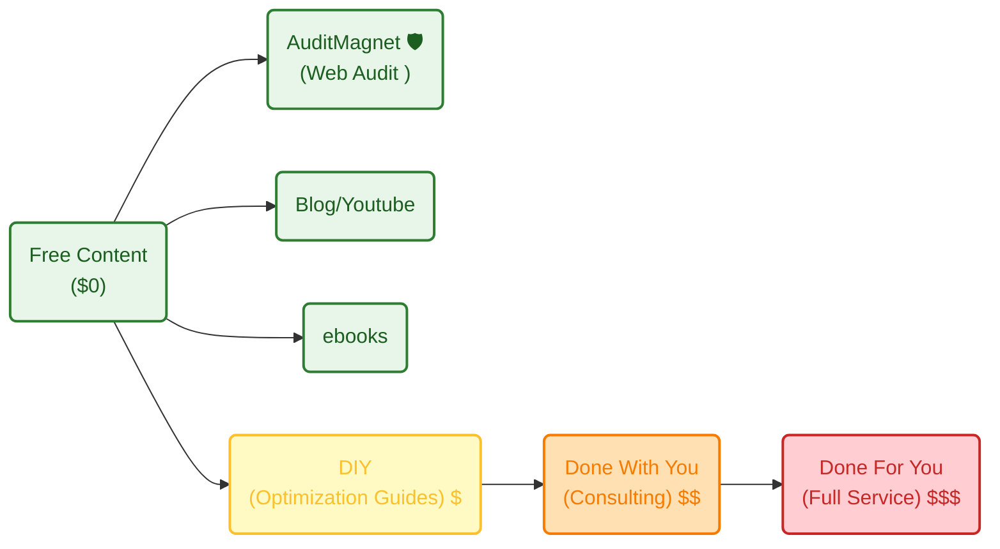

**TL;DR**

Pretending to be a *polymath* and charging you for caring about solving your problems.

**Intro**

When the ideas bucket stops filling up, I got clarity.

Making dividend or market cap race, is no longer a problem.



GoPro overlays? Nah, past




Mechanisms...



Is it time to go back to the real world?

---

## Conclusions

If you have ever thoughts about Ikigai

or tried to understand the psyc under your decision making

you might have done a TOP/BOT 10 actions life to date.

I did that.

And do you know what was surprising?

That the Bottom 10 moments had one thing in common.

They were all: NOT done this/that in this/that situation

Until now you might have [waited for the right moment](#the-market-of-time) to start shipping that project.

You dont need to wait anymore:


  
  


### My Current Value Ladder

Active income >>> ~~passive income~~ delayed active income.

```sh
#git init && git add . && git commit -m "Initial commit: Starting services" && gh repo create jalcocertech-services --private --source=. --remote=origin --push
git clone https://github.com/JAlcocerT/jalcocertech-services
```

How does my **value ladder** looks like as of today?



#### Quick Content Creation?

If you have watched a vidoe like [this one](https://www.youtube.com/watch?v=M4cmrdoUKxI) and tinker with [remotion like I did](https://jalcocert.github.io/JAlcocerT/video-creation-with-remotion/).

You are aware that you are one step away to blow social media with spam videos of what you ship.

```sh
cd ./remotion-content
```

What if promoting your new web app features is already one prompt away?




### Whats next?

~1/3 of the year is gone...

where do i wanted to be?

where am I?

#### Keep Doing

1. Following my roadmap for this year, as planned here.

Yea, im not considering `Side-Quests26` nor `Tech talks`.

Oh, also not the monthly selfhosted/homelab recaps.

2. Monthly Life ~ IKIGAI Checks: *just that not done in onenote, [but in .md](https://github.com/JAlcocerT/my-logseq-notes)*

```sh
git clone 
```

#### Stop Doing

1. Collaborations with people/ideas/projects who dont have a clear*er* (>=) than what I expect before executing my ideas.


{}

For this I dedicated a full post few weeks ago.

The general idea checklist is as follows:


{}

{}


{}

When you have certain volume, this is the kind of thing that you put into a *dis*qualification form.


#### Start Doing

1. 


---

## FAQ

### The market of time

Some people think that two of the most important factors to predict success are:

1. The RISK that you allow yourselv to take
2. The amount of TIME that you can wait without possitive rewards to keep going in a certain direction (~persistency)
3. The number of times that you *ROLL the dice*

The good thing about tracking that daily new action ~~since ~wk40y24~~ for some time is that you can see how non-sense previous things were

Meaning: that those actions were not meant to make yo be closer to where you want to be

This idea might suggest you [open questions](https://jalcocert.github.io/JAlcocerT/tech-recap-and-more-2025/#outro--random)

