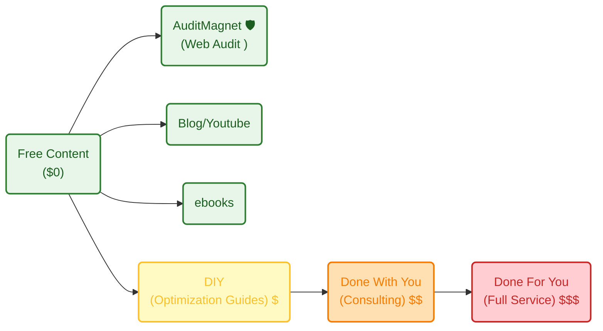

aristotel onassis


**TL;DR**

Pretending to be a *polymath* and charging you for caring about solving your problems.

+++ With [quick content creation](#quick-content-creation).

**Intro**

When the ideas bucket stops filling up, I got clarity.

Making dividend or market cap race, is no longer a problem.



GoPro overlays? Nah, past




Mechanisms...



Is it time to go back to the real world?

Because software PER is going down to 20, being lower than NASDAQ avg for the first time in history.

Does that tell you anything about the market future expectations *also knowing that currently their FCF is also growing?*

---

## Conclusions

If you have ever thoughts about Ikigai

or tried to understand the psyc under your decision making

you might have done a TOP/BOT 10 actions life to date.

I did that.

And do you know what was surprising?

That the Bottom 10 moments had one thing in common.

They were all: NOT done this/that in this/that situation

Until now you might have [waited for the right moment](#the-market-of-time) to start shipping that project.

You dont need to wait anymore:


  
  


### My Current Value Ladder

Active income >>> ~~passive income~~ delayed active income.

```sh
#git init && git add . && git commit -m "Initial commit: Starting services" && gh repo create jalcocertech-services --private --source=. --remote=origin --push
git clone https://github.com/JAlcocerT/jalcocertech-services
```

How does my **value ladder** looks like as of today?



#### Quick Content Creation?

If you have watched a vidoe like [this one](https://www.youtube.com/watch?v=M4cmrdoUKxI) and tinker with [remotion like I did](https://jalcocert.github.io/JAlcocerT/video-creation-with-remotion/).

You are aware that you are one step away to blow social media with spam videos of what you ship.

```sh
cd ./remotion-content #get your core offer well defined, then just create promo videos with your defined UI/X
```

What if promoting your new web app features is already one prompt away?



If code is cheap and you can do videos as a code

Isnt it the math telling you that videos are also cheap now?

The time for courses/watching yt tutorials was 3y ago, now is about building

or...


### Whats next?

~1/3 of the year is gone...

*where did i wanted to be?*

TBD 0426



Coming from [last year end review](https://jalcocert.github.io/JAlcocerT/tech-recap-and-more-2025/#for-next-year)

1. Weddings serverless + ads - [WIP](https://jalcocert.github.io/JAlcocerT/bring-eyes-to-your-saas/) ⚙️

8. Get back to mech simulations - *for fun :)* - [MBSD 2D](https://jalcocert.github.io/JAlcocerT/2d-mbsd) ✅

7. Prepare the DIY/DWY/DFY based on the ebooks and blog content ~ *Wiki efforts* - WIP ⚙️

5. Books *from D&A to web and concepts from kindle notes* - WIP ⚙️

3. AIoT *end to end flow from solar panels to dashboarding & langchain*

4. Custom Marketing analytics *from custom high signal content creation to funnels* Matplotlib, [remotion](https://jalcocert.github.io/JAlcocerT/video-creation-with-remotion/) stuff...

6. ~~Scaling PRO Webs creation via PaaS~~ - A better DIY website with free (programmatic) audit - Free web audits [show problems here](https://jalcocert.github.io/JAlcocerT/how-to-perform-free-web-audit/) ✅

* https://webaudit.jalcocertech.com/

2. ~~Real Estate Custom RAG and WebApp via DecapCMS~~ | Cancelled and [whitelabelled](https://jalcocert.github.io/JAlcocerT/white-label-real-estate-solution/) 

* https://realestate.jalcocertech.com/




*Where am I?*

#### Keep Doing

1. Following my roadmap for this year, as planned here.

Yea, im not considering `Side-Quests26` nor `Tech talks`.

Oh, also not the monthly selfhosted/homelab recaps.

2. Monthly Life ~ IKIGAI Checks: *just that not done in onenote, [but in .md](https://github.com/JAlcocerT/my-logseq-notes)*

```sh
git clone /my-logseq-notes
```

3. Quiiick PoCs: like the recent iperf3

```sh
git clone 
```

3. Generating random data animated videos & rendres: *is probably time to unify these...*


  


```sh
git clone /VideoEditingRemotion
cd remotion-cc #ideas.md is a gold mine

make render-multi-invest-short
#To make a different comparison:                                                                                    
 # Nvidia vs Apple vs S&P ETF from 2015
 #python3 scripts/compute_multi_invest.py --tickers NVDA AAPL SPY --start 2015-01-01                                 
                                                                                                                  
# Dividend kings from 2000                                                                                         
  #python3 scripts/compute_multi_invest.py --tickers KO MCD PEP --start 2000-01-01 \                                  
  #  --labels "Coca-Cola" "McDonald's" "PepsiCo"   
make render-dividend-race-short
mpv renders/dividend-race-short.mp4

#make data-f1-telemetry F1_YEAR=2026 F1_ROUND=3 F1_DRIVER=ANT
#make render-f1-telemetry F1_YEAR=2026 F1_ROUND=3 F1_DRIVER=ANT
make data-f1-telemetry F1_YEAR=2026 F1_ROUND=3 F1_DRIVER=RUS
make render-f1-telemetry F1_YEAR=2026 F1_ROUND=3 F1_DRIVER=RUS
#mpv renders/f1-telemetry-2026-r3-RUS-Q.mp4
```

  Full F1 pipeline summary:                                                                                          
   
  # F1-A: Telemetry HUD                                                                                              
  make data-f1-telemetry F1_YEAR=2024 F1_ROUND=1 F1_DRIVER=VER                                                     
  make render-f1-telemetry F1_YEAR=2024 F1_ROUND=1 F1_DRIVER=VER                                                     
                                                                                                                     
  # F1-B: ERS Clipping grid                                                                                          
  make data-f1-clipping F1_YEAR=2024 F1_ROUND=1                                                                      
  make render-f1-clipping-short F1_YEAR=2024 F1_ROUND=1                                                              
   
  # F1-C: Championship race                                                                                          
  make data-f1-championship F1_CHAMP_YEAR=2025                                                                   
  make render-f1-championship F1_CHAMP_YEAR=2025                                                                       
  # F1-D: Sector delta duel                                                                                          
  make data-f1-delta F1_YEAR=2024 F1_ROUND=1 F1_D1=VER F1_D2=NOR                                                   
  make render-f1-delta-short F1_YEAR=2024 F1_ROUND=1 F1_D1=VER F1_D2=NOR                                             
                                                                                                                     
  All four share F1_YEAR, F1_ROUND, F1_SESSION — so you can point all four at the same race weekend with consistent  
  variables. The entire project now has 26 renderable compositions. Want to continue into the macro ideas (16–22), or
   is there something else you'd like to explore?   

      19      --d1       First driver code        (default: VER)                                                     
      20      --d2       Second driver code       (default: NOR)
      21      --session  Session type             (default: Q)                                                       
      22 +    --lap      Specific lap number      (default: unset → fastest lap)                              
      23      --npts     Interpolation points     (default: 500)
      24      --out      TS variable name prefix  (default: f1Delta)

```sh
#Usage example for Abu Dhabi 2021 last lap:                                                                         
make data-f1-delta F1_YEAR=2021 F1_ROUND=22 F1_D1=HAM F1_D2=VER F1_SESSION=R F1_LAP=44                             
make render-f1-delta-short F1_YEAR=2021 F1_ROUND=22 F1_D1=HAM F1_D2=VER F1_SESSION=R  
```

```sh
make data-f1-delta F1_YEAR=2026 F1_ROUND=3 F1_SESSION=Q F1_D1=LEC F1_D2=HAM && make render-f1-delta-short F1_YEAR=2026 F1_ROUND=3 F1_SESSION=Q F1_D1=LEC F1_D2=HAM

make data-f1-delta F1_YEAR=2026 F1_ROUND=2 F1_SESSION=Q F1_D1=LEC F1_D2=HAM F1_MAP=1 && make render-f1-delta-short F1_YEAR=2026 F1_ROUND=2 F1_SESSION=Q F1_D1=LEC F1_D2=HAM F1_MAP=1

```

One of the [coolest poles](https://www.youtube.com/watch?v=puWsv5-4ELg) in the recent years:

```sh
make data-f1-delta F1_YEAR=2023 F1_ROUND=3 F1_SESSION=Q F1_D1=VER F1_D2=ALO F1_MAP=1 F1_TABLE=1 && make render-f1-delta-short F1_YEAR=2025 F1_ROUND=3 F1_SESSION=Q F1_D1=VER F1_D2=NOR F1_MAP=1 F1_TABLE=1   

make data-f1-delta F1_YEAR=2025 F1_ROUND=3 F1_SESSION=Q F1_D1=VER F1_D2=NOR F1_MAP=1 F1_TABLE=1 && make render-f1-delta-short F1_YEAR=2025 F1_ROUND=3 F1_SESSION=Q F1_D1=VER F1_D2=NOR F1_MAP=1 F1_TABLE=1   
```

With 14km/h of speed gap in T10 that make the magic happen.

```sh
git clone /mbsd

```

```sh
git clone /3Design
```

Yea... its about time:

```sh
/eda-f1
/eda-geospatial
```

#### Stop Doing

1. Collaborations with people around vague ideas/projects, those who dont have a clear*er* (>=) than what I expect before executing my own worthless ideas are to be skipped.

When you have certain volume, this is the kind of thing that you put into a *dis*qualification form.

Have your own [ideas checklist](#ideas-checklist) in place!


#### Start Doing

1. As code is cheap and so are videos...

I need to think about the FOSS/JAlcocerTech yt videos rebump - TBC though

2. Data is no longer a full thing, data product is the end to end

Because nobody will pay you to make a group by and filters any more

As you know, agents are coming to the workspace, that includes pbi, looker and whatever

Why should you restrict yourself to existing dashboarding tools?

not talking about streamlit pocs, but full stack data pocs

```sh
git clone /poc
#claude
#/usage #as long as you have still tokens
```


---

## FAQ

### The market of time

Some people think that two of the most important factors to predict success are:

1. The RISK that you allow yourselv to take
2. The amount of TIME that you can wait without possitive rewards to keep going in a certain direction (~persistency)
3. The number of times that you *ROLL the dice*

The good thing about tracking that daily new action ~~since ~wk40y24~~ for some time is that you can see how non-sense previous things were

Meaning: that those actions were not meant to make yo be closer to where you want to be

This idea might suggest you [open questions](https://jalcocert.github.io/JAlcocerT/tech-recap-and-more-2025/#outro--random)

### Ideas Checklist

https://jalcocert.github.io/JAlcocerT/ideas-to-execution-via-sdlc/#evaluating-business-ideas

https://jalcocert.github.io/JAlcocerT/ideas-and-opportunities-health-check/#business-idea-checklist

This will help you to understand how to disqualify business ideas: https://jalcocert.github.io/JAlcocerT/ideas-to-execution/

{}

For this I dedicated a full post few weeks ago.

The general idea checklist is as follows:


{}

{}


{}

### Still doing PPTs?

You know that im in love with slidevJS for my tech talks.

But i got to know python-pptx.


So for the pocs if you were doing slidev or giving a prompt to notebookllm or copilot:

```sh

```

You are outdated.

Take one branded pptx, tell to write the store with the branded slides and move on :)