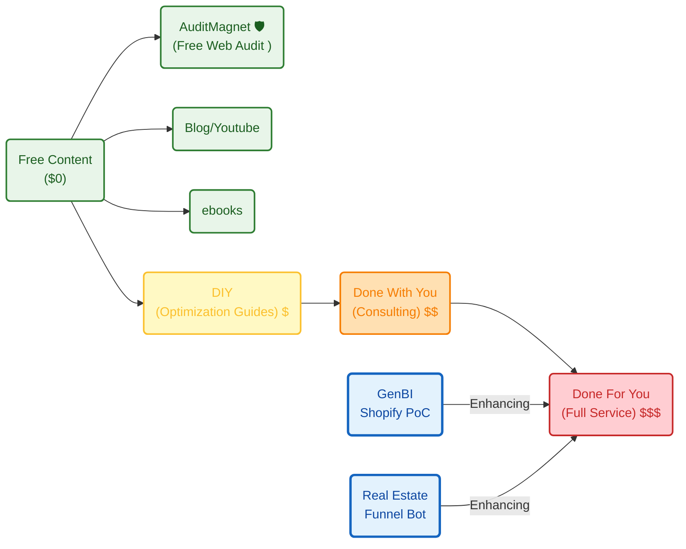

**Tl;DR**

Just create.

It's easier than ever.

**Intro**


{}


### R Shiny

Thanks to a yearly subscription I got to datacamp

and to be very much invested with R language for consumer intelligence application back in the days

I got to know R Shiny for dashboarding and kind of quick web app prototyping

I was not expecting back in the days that in general a full dashboard should involved a team of 5 and that they end up been expansive as f*

the excuse back then had to be that googling and reading stackoverflow is not for everyone

today?

I guess...

well, i dont know whats the excuse

### Python DASH


* How to develop a python dash app inside a running docker container
    * Docker and Docker extension
    * DevContainer extension
    * Attach to running container 

* https://github.com/RamiKrispin/vscode-python
* https://github.com/RamiKrispin/shinylive
* https://www.dataquest.io/blog/install-package-r/

In the meantime, he built this https://github.com/LinkedInLearning/data-pipeline-automation-with-github-actions-4503382

### Streamlit

But streamlit is a big tentation if you are in D&A.

For quick web apps, data centered for PoCs, this is still my go to.

Leave the distraction and super custom things for the MVP stage.

### Full Stack Web Apps

The last ones I have been confortable enought to have Python as BE and keep JS/TS for the FE.

Because its 2026.

And when you do some repetitions with AI

Which basically mean you learn how to aks for things to get done by algorithms consuming energy somewhere in the world

{}

The outcome?

See how this 3 bodies web app looks and this data driven formula one web app feels:


  
  


yea, ive re-bumped the old slider crank repo started here with Codex CLI x Claude

Just that this time im aware of:

1. very cool prompts to impress via my landings
2. CSR can do a lot...


```sh
codex
#3bodies OSS!
git clone https://github.com/JAlcocerT/ThreeBodies/ #root has a DASH version
#cd ThePoincareLab #here there is sth more interesting :)
```

Until that point I got it working here as you can see on [this video](https://www.youtube.com/watch?v=b35XuJI98kI).

But I said about CSR, right?

```sh
cd landing
```

```sh
claude
#slider crank OSS / mbsd 
git clone 
cd landing

npm run build
npx wrangler pages project create #this will install the wrangler CLI package
#npx wrangler pages project list # See the projects you already have

#npm run build #build the file manually

npx wrangler pages deploy dist # normally will be dist, but whatever <BUILD_OUTPUT_DIRECTORY>
ping multibodysystemdynamics.pages.dev
```

> btw, if you pay attention to the repo, there is some sympy and computational mechanics in it


[](https://colab.research.google.com/github/JAlcocerT/Data-Chat/blob/main/LangChain/web/langchain-chroma-repo-readme.ipynb)

Enjoy the static deployment: https://multibodysystemdynamics.pages.dev/

You wont have to trust my selfhosting skills to maintain this service up :)


---

## Conclusions

Creating (supply digital products) is easier than ever.

Distribution is most likely your constrain today - *aka demand for what you create*.

You know...the attract and convert thingy that if you dont get right you wont get $'s.

When I starting the draft for this post, my aim was to focus on a python webapps recap

Like how cool streamlit is for PoCs, maybe consider fastAPI or pocketbase for backend...

Reality: now you have a greenfield full stack web app with one shot prompt that makes the animations way cooler and statically deployed

How will this look in a year?

Im not sure.

What I know is that I will be adding interesting stuff:



Wanna see how good is what you create?


  


You can get things moving:


  
  


If you were lucky, you saw me presenting what I wrote [here](https://jalcocert.github.io/JAlcocerT/a-diy-boilerplate-to-ship/):

```sh
#git clone https://github.com/JAlcocerT/selfhosted-landing
#cd y2026-tech-talks/2- ba-brd-development
#npm run dev 
git clone https://github.com/JAlcocerT/langchain-db-ui
cd langchain-db-ui
#cd langchain-db-ui/Z_PGSQL-GenBI #not foooor now
#make help
#cd langchain-db-ui/Z_PGSQL-GenBI

make install
make demo-db
#duckdb /home/jalcocert/Desktop/langchain-db-ui/backend/demo.duckdb
#./venv/bin/duckdb /home/jalcocert/Desktop/langchain-db-ui/backend/demo.duckdb
#SELECT * FROM customers;
# Then in the prompt:
# SELECT * FROM customers;
make dev #curl http://localhost:8000/docs

```

I showed the **Vite x fast api** one, but there will be more coming [with BAML](https://jalcocert.github.io/JAlcocerT/using-baml-to-query-a-database/) and [PGSQL:)](https://jalcocert.github.io/JAlcocerT/creating-a-generative-bi-solution/)

In the meantime, things are getting interesting:
<!-- 
https://www.youtube.com/watch?v=Ii99RU3mOJM -->




### Collecting cool prompts for BluePrints

As I have been collecting nice BRDs, tech stacks and green field prompts, im placing them all at:

```sh
#git clone

```

---

## FAQ

### What have you created?

Some time [ago](https://jalcocert.github.io/JAlcocerT/R-Stocks/), I made this one [with a friend](https://jalcocert.github.io/JAlcocerT/web-for-phd-researcher/): *my very first published web app with R Shiny*.

How can you contribute?

The code is accesible from [my Github Repository of R/Stocks](https://github.com/JAlcocerT/R_Stocks "R Stocks Github {rel='nofollow'}")

Please feel free to fork the repository and experiment with the code. 

```sh
 fossengineer/rstocks_shiny:latest
 docker run --name stocksubuntu -p 3836:3838 --detach fossengineer/rstocks_rbase2:latest
# you may need log out first `docker logout` ref. https://stackoverflow.com/a/53835882/248616 docker login

docker tag firstimage YOUR_DOCKERHUB_NAME/firstimage

docker push YOUR_DOCKERHUB_NAME/firstimage
docker run --name py_trip_planner --network tunnel -p 8050:8050 --detach py_trip_planner

docker run --name py_trip_planner --network tunnel -p 8050:8050 --detach fossengineer/trip_planner:arm64
MANIFEST: to detect that is arm64 directly -> multi-image (?)
https://hub.docker.com/r/fossengineer/trip_planner:arm64
```

But why contributing to that when you can create your own!

Specially with lovable...cursor...etc etc

All those tools that you might have heard of, but havent really bother to install and try.

### Python use cases

Python and its 288 use cases

This year I have been surprised by Python language (one more time).

And using uv as package manager has been a revelation:

If we are ready...what are those cool use cases?

#### Photo and Video

* https://www.geeksforgeeks.org/python-pillow-creating-a-watermark/


  


For editing video, I prefer to use directly FFMPEG.

TO create videos with Python, for now, I have tried [data driven animations](#animations), which can be exported to `.mp4`

#### Plots

For WebApps, I try to go with Plotly, to get interactivity out of the box.

You can also bring to your Python Apps: ChartJS, ApexCharts...as seen [here](https://github.com/JAlcocerT/Streamlit_PoC)

* https://handhikayp.medium.com/real-time-data-visualizations-using-python-library-plotly-12e0e5b48240

#### QR Generation

To generate [**QR's with logo** thanks to Python](https://github.com/JAlcocerT/JAlcocerT/blob/main/Z_TestingLanguages/Z_Python/QR_generation.ipynb) 

And your QR generator can be embedded into WebApps, as seen [here](https://github.com/JAlcocerT/Streamlit_PoC/blob/main/Utils/QR_Gen.py)

> It can be done as well with Inkscape, or [with QR-Code-Generator](https://github.com/nayuki/QR-Code-generator) or with [emn178](https://emn178.github.io/online-tools/qr-code/generator/)

> > And applied with [slubne](https://jalcocert.github.io/JAlcocerT/building-in-public-wedding-photo-galleries/) :)

[](https://colab.research.google.com/github/JAlcocerT/JAlcocerT/blob/main/Z_TestingLanguages/Z_Python/QR_generation.ipynb)

I got to learn this during [this wedding post](https://jalcocert.github.io/JAlcocerT/software-for-weddings/#what-i-learnt)!


#### Infographics

<!--  -->

Infographics are one of those things can be [done as code](https://jalcocert.github.io/JAlcocerT/things-as-a-code/#infographics-as-a-code): *with python ofc*


  
  



  
  


See this sample script: https://github.com/JAlcocerT/DataInMotion/blob/main/tests/plot_total_return_from_yfinance.py

```sh
#git clone https://github.com/JAlcocerT/DataInMotion.git
#cd DataInMotion && branch libreportfolio
uv run tests/plot_historical_gweiss.py CAT --start 2005-01-01 --brand "@LibrePortfolio" --warmup-days 400
```

But for *not just yfinance* based, I created:


  



#### Animations

I got very much surprised couple of years ago with [the mechanism project](https://github.com/gabemorris12/mechanism).

Which I finally got the change to write about on [this post](https://jalcocert.github.io/JAlcocerT/gabemorris12-mechanism-project-setup/).

The project has a great application of Python animations.

That I could not resist to tinker with some time back

* https://github.com/JAlcocerT/Slider-Crank
* https://github.com/JAlcocerT/mechanism
* https://github.com/JAlcocerT/Streamlit_PoC/tree/main/Animations - Just some **matplotlib animations** for various use cases

