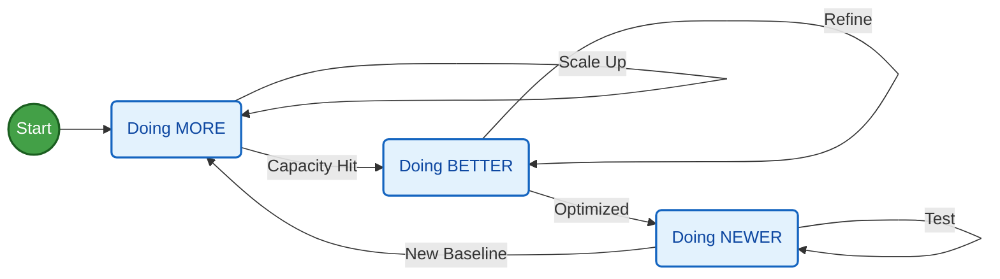
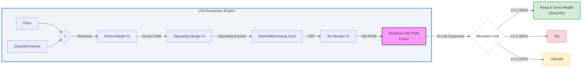
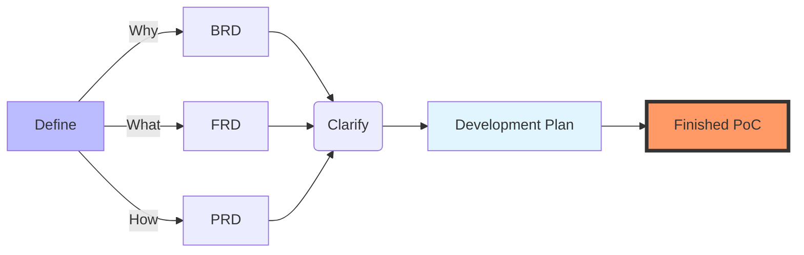

**Tl;DR**

Business are games, with defined rules.

Get to know them *to potentitally win*.

**Intro**

Sometimes things dont work because you need to do more.

More Volume, repetitions, getting unconfortable.

Other times, *its just about...get started*.

But how to assess if you will be starting a non-sense journey to a path that goes nowhere?

Despite the fact that [*The How* is now more for agents and abstracted](#building-a-how-with-sense), why should you loose time?

This all got initiated after going [to the wall several times](#conclusions).

And thanks to asking *unconfortable questions* for which I have no replies [here](https://jalcocert.github.io/JAlcocerT/custom-analytics-for-shopify/#comparison-table-strategic-levers--optimization) and [here](https://jalcocert.github.io/JAlcocerT/custom-analytics-for-shopify/#faq)

## Business Idea Checklist

Dont even dare to start if you dont have these cristal clear.

Someone coming to you for collaborations and partnerships?

Tell them to send you these filled up.

* Is it a new product that needs evangelization?
  * Existing competitors? or Needs PMF test?: *Would recommend to go for No need of PMF, demand validated*.
  * Example: No need of PMF, demand validated.

* Who is your client (buyer persona) and how it will get to know you?
  * The BANT context

* **Value proposition**: *this must be clear for you, also in the landing*
  * The value eqution: How much value you promise x % of happening / ( Time 2 value * Effort to get there ) 

> The ICP focuses on the ideal company or customer segment, the value proposition communicates why the product matters, and the customer avatar embodies the individual persona within the ICP that marketers and sales teams aim to reach.

<!-- **Would you like me to help you refine the "Value Proposition" sentence for the WebApp landing page so it doesn't sound like just "another photo app"?** -->

The **launch strategy**: *aka, focus strategy*

| Element | Decision |
| :--- | :--- |
| **One Avatar** | |
| **One Product** | |
| **One Channel** | |

The **Tier of Service**: *this fits at DIY / DWY / DFY in the value ladder*.

```mermaid
flowchart LR
    %% --- Styles ---
    classDef free fill:#E8F5E9,stroke:#2E7D32,stroke-width:2px,color:#1B5E20;
    classDef low fill:#FFF9C4,stroke:#FBC02D,stroke-width:2px,color:#FBC02D;
    classDef mid fill:#FFE0B2,stroke:#F57C00,stroke-width:2px,color:#F57C00;
    classDef high fill:#FFCDD2,stroke:#C62828,stroke-width:2px,color:#C62828;
    classDef bridge fill:#E3F2FD,stroke:#1565C0,stroke-width:3px,color:#0D47A1;

    %% --- Nodes ---
    L0("Free Content<br/>($0)"):::free
    L1("AuditMagnet 🛡️<br/>(Free Web Audit )"):::free
    L11(" Blog/Youtube"):::free
    L12(" ebooks"):::free
    L2("DIY<br/>(Optimization Guides) $"):::low
    L3("Done With You<br/>(Consulting) $$"):::mid
    L4("Done For You<br/>(Full Service) $$$"):::high
    L44("TBC<br/>New Service"):::bridge

    %% --- Connections ---
    L0 --> L1
    L0 --> L2
    L0 --> L11
    L0 --> L12
    L2 --> L3
    L3 --> L4
    L3 --> L44
```

The **Tier of Service**: *because The value ladder is a thing*

Example: DIY (1b - *leverages on actual tech stack Ive put together - PaaS x (WP/Ghost or SSG+CMS)*)

```mermaid
flowchart LR
    %% --- Styles ---
    classDef free fill:#E8F5E9,stroke:#2E7D32,stroke-width:2px,color:#1B5E20;
    classDef low fill:#FFF9C4,stroke:#FBC02D,stroke-width:2px,color:#FBC02D;
    classDef mid fill:#FFE0B2,stroke:#F57C00,stroke-width:2px,color:#F57C00;
    classDef high fill:#FFCDD2,stroke:#C62828,stroke-width:2px,color:#C62828;

    %% --- Nodes ---
    L0("Free Content<br/>(Blog/YT/Docs $0)"):::free
    L1("AuditMagnet 🛡️<br/>(Free Web Audit $0)"):::free
    L2("DIY<br/>(Optimization Guides) $"):::low
    L3("Done With You<br/>(Consulting) $$"):::mid
    L4("Done For You<br/>(Full Service) $$$"):::high

    %% --- Connections ---
    L0 --> L1
    L1 --> L2
    L2 --> L3
    L3 --> L4
```

**GTM Strategy:** The Master Plan *important if [you bootstrap](https://jalcocert.github.io/JAlcocerT/whats-boostrap/#gtm-vs-marketing)!*

A GTM strategy is a cross-functional roadmap that answers the question: "How will we bring this new product to market successfully?" 

It aligns all key business functions, including:

* **Product:** What are we selling? What problem does it solve?
* **Pricing:** How much will we charge?
* **Distribution/Sales:** How will we get the product into the hands of customers? (e.g., direct sales team, e-commerce, third-party distributors).
* **Marketing:** How will we generate awareness and demand?
* **Customer Success/Support:** How will we onboard and support customers after they buy?

| Aspect | Go-to-Market (GTM) Strategy | Marketing Strategy |
| :--- | :--- | :--- |
| **Purpose** | To successfully launch a **specific** product or enter a **new** market. | To achieve **overall** business and brand goals over the long term. |
| **Scope** | Broader and more tactical. It encompasses sales, marketing, pricing, distribution, and more. | A focused component of the GTM strategy. It is concerned with brand awareness, communication, and demand generation. |
| **Time Horizon** | Short-term and event-driven. It's typically a "sprint" for a specific launch. | Long-term and ongoing. It is continuously evolving to support the brand. |
| **Responsibility** | Owned by the executive team, often led by a Product Marketing Manager (PMM) or a cross-functional GTM team. | Owned by the marketing team. |

A strong GTM strategy ensures that your product is ready for the market, while your marketing strategy ensures that the market is ready for your product.

---

### The Strategic Game Board

Know your sector

*This table identifies the fundamental nature of the business model and its primary bottleneck.*

| Feature | **Guest Photo WebApp** | **Educational Model** | **Fractional Consultant** |
| --- | --- | --- | --- |
| **Business Archetype** | B2C Indie Hacker (SaaS-Lite) | Info-Product / Course | B2B Specialist (Path C) |
| **Primary Lever** | **Volume ()** | **Volume ()** | **Price ()** |
| **Strategic Tag** | **[GROWTH BET]** | **[GROWTH BET]** | **[OPERATIONAL DISCIPLINE]** |
| **Customer Intent** | Emotional (Memories) | Aspirational (Success) | Rational (ROI/Profit) |
| **Execution Risk** | Technical/Server Downtime | Content Obsolescence | Personal Burnout/Time |
| **Main Constraint** | **Demand (Marketing)** | **Demand (Attention)** | **Supply (Expert Hours)** |
| **Macro Winner** | Low-cost luxury (Recession) | Upskilling (Recession) | Interest Rate Neutral |

the Business Model Canvas, which is a globally recognized framework that helps visualize how Attraction (Channels/Customer Relationships), Delivery (Key Activities/Resources), and Conversion (Revenue Streams) work together to create a profitable business.

splitting a business into Attraction, Conversion, and Delivery is an excellent way to view the "Engine" of a company. 

While the profit formula ($P \times V \times GM \times OM \times IF \times T$) tells you what is happening to the money.

This three-part framework tells you how the work is getting done.

[Zoom in](https://mermaid.live/edit#pako:eNqFVGtv2jAU_SuWp06bxCtAWsiHSdCiCqlpacsqbaGq3OQmWE3syHYolPLfd_MAske1fLD8OOc-To69pb4MgDo0Uixdkqu7hSD4nZyQqUgzo8mX-RLIONNcgNZk5Bu-4oaD_loCdfZcMkfGKIanUhDvOH8sUfnnvhjPZeoFDBcR-UzGiomgdj6aPt0jzXijKblU8tUsSbGGaFOhQAQL8UfacylWoHSR9jivhb1nMWivGMko5pFIQJh6Wtcb-b7MhCEuEyyC2vm_El5AzDHLhnj7WS3Y5GHmTZI0lhsA8sDiDMhMybSGuIBV3uAhylzKWP-dDvXPdZ-ICHXPmxRQ6KnL45rYzeY38r6gV8AC3Z7xFAMLWND3mjIlpxxrelXMHxziQOeMmTdT3IfH_yNvvduMCcPNpv0g4yzJOSVrVoBda7velRu31cYe4Fq4QRb0DlYgMqy0OL90n85Z7Hv449FlaBPsm-Q7WcxqPjqIc9Av4AqViTeEJykqoolB2XypDZEhiaQMKsUOhGarbGYShtznIPxN-7vhMX8r8uTNVbXUM1ZbZeVljfhfQ26q8m9c7yYFNGtu7ar6k6rmG7ekHQFT4ctk3_l07E2FAQXatMdSofFzyDl2UPGn45I_Gc8rynzszdkaL6UK4JhnXuGuwfxe3PXMG0tjZEKu0BqPNYvdmw26JaocjguoOyvkcex8CodhQxslX8D51Ov16tiaQ0rs8_OH2IP-JTIIg4-Q17ND5tM6ppo3X3lglk4_XdMGPlo8oI5RGTRoAiph-ZJu83ALik7IVXZwGuC7s6ALsUNOysRPKZM9TcksWlInZLHGVZYG-OJccIaX_QjBiwnqPH8jqDPsFSGos6Vr6jStznDQ6nW7Z3Zv2Dnt2g26oU7XHraGZ_2h1bftztnA6tq7Bn0rklqt_sCyB_Zg2O1aVqc36O1-AbVwvuI).

```mermaid
graph LR
    %% Inputs (The Business Activities)
    subgraph Attraction [Attraction]
        Mkt[Marketing & Brand]
        AI_Strat[AI Growth Strategy]
    end

    subgraph Conversion [Conversion]
        Sales[Sales Alignment]
        AM[Account Management]
    end

    subgraph Delivery [Delivery]
        EVP[Employee Value Prop]
        Dev[AI Delivery Tools]
    end

    %% The Engine Connections
    Attraction --> |"Leads/Pipeline"| Conversion
    
    Conversion --> |"Yields"| P[Price]
    Conversion --> |"Yields"| Q[Quantity/Volume]

    P --> M1{x}
    Q --> M1

    M1 -- "Revenue" --> GM_Calc[Gross Margin Calculation]
    
    %% Delivery directly impacts the cost of goods
    Delivery -.-> |"Efficiency/Utilization"| GM_Calc
    
    GM_Calc -- "Gross Profit" --> OM[Operating Margin %]
    OM -- "Operating Income" --> IB[Interest/Borrowing Cost]
    IB -- "EBT" --> TB[Tax Burden %]
    TB -- "Net Profit" --> NP[Bottom Line]

    %% Styling
    style Attraction fill:#f9f,stroke:#333
    style Conversion fill:#bbf,stroke:#333
    style Delivery fill:#dfd,stroke:#333
    style NP fill:#f96,stroke:#333,stroke-width:4px
```

Operating Margin ($OM$) acts as a "bridge" between today's work and tomorrow's growth.

If we use that logic, we can define the relationship between the two margins as **Execution** vs. **Evolution**.

1. Gross Margin (): The "Today" (Execution)

If OM is the bridge to tomorrow, **GM is the engine running today.** It measures the fundamental "profitability of the task." 

If you are an IT company,  answers the question: *"Can we deliver this AI project for less than we charged the client?"*

* **The "Now" Indicator:** It tells you if your current workforce is skilled enough, if your tools are efficient, and if your pricing is correct.
* **The Limit:**  sets the "ceiling" for your business. No matter how much you cut costs in  (like firing the HR team), your net profit can never be higher than your Gross Margin.
* **The 2026 Strategy:** By focusing on "AI delivery tools," the company is trying to widen the . If they can do the same work in 50 hours that used to take 100, the  expands.

2. Operating Margin (): The "Bridge" (Evolution)

As you noted,  is where the company decides how much of "today’s profit" () to sacrifice for "tomorrow’s growth."

* **The Reinvestment Zone:** This is where you pay for the **Attraction** and **Conversion** we discussed. You take the money made in Delivery () and spend it on Sales, Marketing, and R&D.
* **The Efficiency Test:**  also tests if the company is becoming a "bloated bureaucracy." If  is high but  is low, the company is great at the "work" but terrible at "running the business."
* **The 2026 Strategy:** The company is betting that by investing in the **Employee Value Proposition** (higher pay/training), they are building a stronger bridge. They are spending more in  today to ensure they can capture that 7.5% revenue growth tomorrow.

3. Comparing the Two (The "IT" View)

| Feature | Gross Margin () | Operating Margin () |
| --- | --- | --- |
| **Focus** | **Delivery & Production** | **Strategy & Infrastructure** |
| **Primary Cost** | Billable Labor (Developers) | Non-billable Labor (Sales, HR, CEO) |

**Delivery** is the "production line." In an IT company, this is the act of turning human hours and cloud compute into a finished product for a client.

* **The Lever:** This is driven by **COGS (Cost of Goods Sold)**.
* **Why it’s here:** Because the salaries of the developers and project managers are *variable*—if you have no clients, you (theoretically) don't need these specific delivery hours.
* **The "Health" Metric:** If your  is 40%, it means for every $100 the client pays, it cost you $60 in "Delivery" (salaries and software) to make it.

2. Attraction & Conversion = The  Level (Indirect Costs / OpEx)

**Attraction** and **Conversion** are the "growth machinery." They sit in the OM  because they are **Operating Expenses (OpEx)**.

* **Attraction (Marketing):** This is your **S** in **SG&A** (Selling, General & Administrative). You spend this money to create a brand so that people *want* to work with you.
* **Conversion (Sales/Account Management):** This is also in **SG&A**. These people take the leads from Attraction and turn them into contracts ( and ).
* **Why it’s here:** These costs are usually *fixed* or *semi-fixed*. You pay your Head of Marketing and your Sales VP whether they close 1 deal or 10 deals this month.

If we look at your specific company goals, here is how the "Spending" vs. "Earning" works:

| Stage | Activity | Margin Level | Strategic Goal |
| --- | --- | --- | --- |
| **Attraction** | AI Marketing / Branding | ** (OpEx)** | Build the "AI Expert" reputation so you can charge a higher **Price ()**. |
| **Conversion** | Sales & Account Mgmt | ** (OpEx)** | Increase the **Volume ()** of AI-specific contracts. |
| **Delivery** | Developers + AI Tools | ** (COGS)** | Use AI tools to increase efficiency, keeping the **Gross Margin** high even after giving **Pay Raises**. |

1. *GM* is the cost of doing the work.** (Delivery)
2. *OM* is the cost of getting the work and managing the growth.** (Attraction & Conversion)

### The Unit Economics

The "Full Stack" Multiplicative Formula that works for *all the games*.

The formula for Net Profit (NP) is: NP=(V×P)×GM×OE×IB×TB

If we define: *see what are the profit levers*

* V=Volume (Units Sold)
* P=Price (Average Selling Price)
* GM=Gross Margin Ratio(RevenueGross Profit​)
* OE=Operating Efficiency Ratio(Gross ProfitEBITDA​)
* IB=Interest Burden(EBITPre-tax Income​)
* TB=Tax Burden(Pre-tax IncomeNet Income​)

*Using the formula: . This maps the "Survival Rate" of every dollar earned.*

To get the most granular view, we start with the "Top Line" (Units and Price) and apply each "Survival Rate" (the margins and burdens) until we reach the "Bottom Line."

#### Case Study: The QR Guest Photo App

*Model: High Volume, Automated Execution.*

| Variable | Tag | Value | Logic / The "Drain" |
| --- | --- | --- | --- |
| **Price ()** | **[BET]** | **$49** | One-time "Event Pass." Low  requires high  to cover ads. |
| **Volume ()** | **[BET]** | **High** | Scaling via Pinterest/TikTok virality and "Event Flywheels." |
| **Gross Margin ()** | **[EXECUTION]** | **95%** | **COGS:** S3 Storage/API. Almost zero production cost. |
| **Op. Efficiency ()** | **[DISCIPLINE]** | **50%** | **OpEx:** 50% of revenue "leaks" to Customer Acquisition (Ads). |
| **Solvency (Cash Flow)** | **[STRUCTURE]** | **Instant** | Payment is upfront. Zero "Payback Period" delay. |
| **Net Profit** | **BOTTOM LINE** | **~$23/unit** | High-efficiency digital delivery. |

3. The "Levers" Comparison: You vs. The Giants

*How your 1-person model compares to global industry leaders.*

| Component | **Walmart** | **Microsoft** | **Indie Hacker / Fractional** |
| --- | --- | --- | --- |
| **Main Lever** | **Volume ()** | **Price () & Scale** | **Efficiency ()** |
| **Biggest Cost** | Inventory (COGS) | R&D & Salaries (OpEx) | Marketing (B2C) or Time (B2B) |
| **CapEx Role** | Massive (Physical Assets) | High (Data Centers) | Zero (Intellectual Property) |
| **Inventory Logic** | High Turnover (Flow) | Zero Marginal Cost | **High Unit Value (Filter)** |
| **Strategic Tag** | **[EXECUTION]** | **[BET]** | **[DISCIPLINE]** |

4. The COO's Diagnostic Checklist

*When a specific part of the formula is "broken," use these tags to identify the fix.*

* **If Net Profit is low despite high sales ():** You have a **[DISCIPLINE]** problem (). Your ads are too expensive or your software bloat is too high.
* **If customers are complaining about the product:** You have an **[EXECUTION]** problem (). Your "factory" (code or service quality) is failing.
* **If the market doesn't know you exist:** You have a **[BET]** problem (). You aren't spending enough on the "Awareness Lever."
* **If you are "profitable" but have $0 in the bank:** You have a **[STRUCTURE]** problem (Solvency). You are paying suppliers faster than customers pay you.

Whenever you analyze a new business opportunity, drop it into the "Empty Column" of Table 1. 

If it has a **Supply Constraint**, focus on raising your **Price ()**. 

If it has a **Demand Constraint**, focus on increasing your **Volume ()**

This adds the "Emotional and Tactical" layer to the math. 

It helps you identify where the "friction" will be in your daily life depending on which path you take.

Here is the **Opportunity & Pain Point Matrix** for your reference.

The Reality Check: Focus vs. Friction

| Model | Biggest Focus (Daily Action) | Biggest Opportunity (The "Win") | Biggest Pain Point (The "Squeeze") |
| --- | --- | --- | --- |
| **Guest Photo WebApp** | **Conversion Rate Optimization (CRO).** Making the landing page "buy-worthy" for a 5-second visitor. | **Virality.** Every event guest is a "Free Lead" for the next event. Zero-cost  growth. | **Platform Dependency.** Changes in Meta/TikTok ad costs or Google's SEO algorithm can kill margins overnight. |
| **Educational Model** | **Content Authority.** Building a personal brand that people trust for their future. | **"The Echo Effect."** One recorded lesson can be sold 10,000 times with zero extra effort. | **Support Debt.** As  grows, the "How do I do this?" emails grow, threatening your Operating Efficiency (). |
| **Fractional Consultant** | **High-Level Strategy.** Moving from "Pulling Levers" to "Directing the Machine." | **Arbitrage of Time.** Getting paid for the *outcome* of 2 hours that took everyone else 16 hours. | **Client Acquisition.** High-ticket sales require trust and networking. If you lose one client, you lose 20–30% of revenue. |
| **P&G (FMCG Giant)** | **Market Share.** Defending the "Shelf Space" at Walmart and Target. | **Economies of Scale.** Squeezing a fraction of a cent out of a billion bottles of soap. | **Commoditization.** Generic "Store Brands" stealing  by undercutting the [BET] (Brand). |

#### The 4-Week "Launchpad" Checklist

**Week 1: The Operational Audit (Discipline)**

* **Keep the "Alpha" Job:** Identify which of your two current jobs has the lowest "Meeting-to-Output" ratio. This is your "Corporate VC" funding your life.
* **Time-Boxing:** Since you finish your work in 5 hours (half of your 10-hour efficiency), explicitly block the other 5 hours (e.g., 1 PM – 6 PM) for **WebApp Execution**.
* **Setup the Legal/Tax Structure:** Use a small portion of your $100k to set up a clean legal entity to separate your "Salary" from your "Startup Assets."

**Week 2: The Infrastructure Build (Execution)**

* **The MVP Tech Stack:** Since you are an analyst, don't over-engineer. Use low-code or specialized APIs for the QR generation and S3 for the photo storage.
* **Unit Economic Stress Test:** Plug your actual hosting and API costs into your formula. Ensure your **Gross Margin ()** is at least 90%.
* **Packaging the Upsell:** Hard-code the "Permanent Storage" upsell from Day 1. This is your highest-margin lever.

**Week 3: The Growth Bet (Marketing)**

* **Asset Creation:** Create 5–10 "Aesthetic" videos showing how the QR code looks on a wedding table. (Pinterest and TikTok are your high- levers).
* **The Ad Budget:** Allocate **$2,000** (only 2% of your assets) for a "Learning Phase" on Meta/TikTok ads.
* **Goal:** Find your **Initial CAC** (Customer Acquisition Cost). If you spend $100 and get 2 customers at $49 each, you are at break-even.

**Week 4: The "Solvency" Check & Launch**

* **Launch to a Small Cohort:** Post in wedding forums or local Facebook groups.
* **The Feedback Loop:** Use your analyst skills to track the **Funnel Drop-off**. Where are people leaving the site? (Landing Page -> Upload -> Payment).
* **The Pivot Point:** If the  (Volume) is low, adjust the **Price ()** or the **Growth Bet (Ad Creative)**.

## Building a HOW with Sense

A BRD is what works best for me now to ship fast [as described here](https://jalcocert.github.io/JAlcocerT/a-diy-boilerplate-to-ship/#the-tech-talk).

Take time and define properly they why and what: *including what's out of scope, specially if you are just one person*

*   **BRD (Business Requirements):** Answers **"WHY build this?"** (The Vision & Goals).
*   **PRD (Product Requirements):** Answers **"WHAT are we building?"** (The Features & Roadmap).
*   **FRD (Functional Requirements):** Answers **"HOW does it work?"** (The Technical Logic & CRUDs).

How can be taken care of:

And if you've been clear enough on the vision, you will get it done:

Together with a nice tech stack: *it always helps to know what to ask for*

And the [human psyc](https://jalcocert.github.io/JAlcocerT/how-is-for-agents-what-and-why-for-you/) considered to bundle everything.

The **tech stack**:

| Requirement | Specification | Clarification / Decision |
| :--- | :--- | :--- |
| **Frontend Framework** | | |
| **Styling/UI Library** | | |
| **[Backend](https://jalcocert.github.io/JAlcocerT/docs/dev/fe-vs-be/)/Database** | | |
| **[Authentication](https://jalcocert.github.io/JAlcocerT/docs/dev/authentication/)** | | |
| Others | Web Analytics / ads / Cal / Formbricks / ESP | Yes, via MailTrap |

---

# Conclusions

Now that you have protected your mind and time from your *and other's* non discounted new ideas

Hopefully, that helps you avoid going for ideas like:

1. A SaaS model to aim for V and low P, for a non well defined avatar, when you dont want OpEx and think it will all be GM - *Like Webifyer and all the web/CMS [I tried here](https://jalcocert.github.io/JAlcocerT/tech-recap-and-more-2025/#about-webifyer)*
2. To provide custom D&A services to the wrong avatar (*that also have wrong avatar and pays you less than your opportunity cost*) - *Been there, done that, [here](https://jalcocert.github.io/JAlcocerT/custom-re-rag)*
3. To expect people to consume your DIY/Infoproduct when you dont do ads, neither took the time to built a community. - Hopefully, I havent done that because I made the [1tonebooks here](https://jalcocert.github.io/JAlcocerT/interesting-books-and-diy-offer/#conclusions) just to consolidate my knowledge and help for free.
4. WIP Operational Discipline:  *high-ticket custom services alternative for the ones (to be found) who have great projects*
5. WIP The growth bet: *via the QR photo app + the ads experiment* 

> PS: The price is part of the product/service

All that non sense preassure and expectations of the ideas that are supposed to work, but they wont do from their conception.

It would be great to go to the past with what you know now.

But what you can do is to bring knowledge from the future to the present.

How about: getting things done?


  
  


<!--  -->

---

## FAQ


  
  

