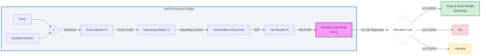

Existing competitors? or Needs PMF test?: No need of PMF, demand validated.

BANT:

Value proposition: *this must be clear in the landing*

The **launch strategy**: *aka, focus strategy*

| Element | Decision |
| :--- | :--- |
| **One Avatar** | |
| **One Product** | |
| **One Channel** | |

The **Tier of Service**: *this fits at DIY / DWY / DFY in the value ladder*.

The **tech stack**:

| Requirement | Specification | Clarification / Decision |
| :--- | :--- | :--- |
| **Frontend Framework** | | |
| **Styling/UI Library** | | |
| **[Backend](https://jalcocert.github.io/JAlcocerT/docs/dev/fe-vs-be/)/Database** | | |
| **[Authentication](https://jalcocert.github.io/JAlcocerT/docs/dev/authentication/)** | | |

Existing competitors? or Needs PMF test?: No need of PMF, demand validated.

The **launch strategy**: *aka, focus strategy*

| Element | Decision |
| :--- | :--- |
| **One Avatar** | |
| **One Product** | |
| **One Channel** | |

The **Tier of Service**: DIY (1b - *leverages on actual tech stack Ive put together - PaaS x (WP/Ghost or SSG+CMS)*)

The **tech stack**:

| Requirement | Specification | Clarification / Decision |
| :--- | :--- | :--- |
| **Frontend Framework** | | |
| **Styling/UI Library** | | |
| **[Backend](https://jalcocert.github.io/JAlcocerT/docs/dev/fe-vs-be/)/Database** | | |
| **[Authentication](https://jalcocert.github.io/JAlcocerT/docs/dev/authentication/)** | | |

To make this a definitive reference, I have polished the tables by integrating the **Strategic Tags** (Bet, Execution, Discipline, Structure), corrected the technical variables, and added the "Path C" (Fractional Consultant) column to show the high-ticket service alternative.

---

## 1. The Strategic Game Board: Sector Comparison

*This table identifies the fundamental nature of the business model and its primary bottleneck.*

| Feature | **Guest Photo WebApp** | **Educational Model** | **Fractional Consultant** |
| --- | --- | --- | --- |
| **Business Archetype** | B2C Indie Hacker (SaaS-Lite) | Info-Product / Course | B2B Specialist (Path C) |
| **Primary Lever** | **Volume ()** | **Volume ()** | **Price ()** |
| **Strategic Tag** | **[GROWTH BET]** | **[GROWTH BET]** | **[OPERATIONAL DISCIPLINE]** |
| **Customer Intent** | Emotional (Memories) | Aspirational (Success) | Rational (ROI/Profit) |
| **Execution Risk** | Technical/Server Downtime | Content Obsolescence | Personal Burnout/Time |
| **Main Constraint** | **Demand (Marketing)** | **Demand (Attention)** | **Supply (Expert Hours)** |
| **Macro Winner** | Low-cost luxury (Recession) | Upskilling (Recession) | Interest Rate Neutral |

---

## 2. The Multiplicative Formula: Unit Economics

*Using the formula: . This maps the "Survival Rate" of every dollar earned.*

To get the most granular view, we start with the "Top Line" (Units and Price) and apply each "Survival Rate" (the margins and burdens) until we reach the "Bottom Line."

The "Full Stack" Multiplicative Formula. The formula for Net Profit (NP) is: NP=(V×P)×GM×OE×IB×TB

If we define:

V=Volume (Units Sold)
P=Price (Average Selling Price)
GM=Gross Margin Ratio(RevenueGross Profit​)
OE=Operating Efficiency Ratio(Gross ProfitEBITDA​)
IB=Interest Burden(EBITPre-tax Income​)
TB=Tax Burden(Pre-tax IncomeNet Income​)

### Case Study: The QR Guest Photo App

*Model: High Volume, Automated Execution.*

| Variable | Tag | Value | Logic / The "Drain" |
| --- | --- | --- | --- |
| **Price ()** | **[BET]** | **$49** | One-time "Event Pass." Low  requires high  to cover ads. |
| **Volume ()** | **[BET]** | **High** | Scaling via Pinterest/TikTok virality and "Event Flywheels." |
| **Gross Margin ()** | **[EXECUTION]** | **95%** | **COGS:** S3 Storage/API. Almost zero production cost. |
| **Op. Efficiency ()** | **[DISCIPLINE]** | **50%** | **OpEx:** 50% of revenue "leaks" to Customer Acquisition (Ads). |
| **Solvency (Cash Flow)** | **[STRUCTURE]** | **Instant** | Payment is upfront. Zero "Payback Period" delay. |
| **Net Profit** | **BOTTOM LINE** | **~$23/unit** | High-efficiency digital delivery. |

3. The "Levers" Comparison: You vs. The Giants

*How your 1-person model compares to global industry leaders.*

| Component | **Walmart** | **Microsoft** | **Indie Hacker / Fractional** |
| --- | --- | --- | --- |
| **Main Lever** | **Volume ()** | **Price () & Scale** | **Efficiency ()** |
| **Biggest Cost** | Inventory (COGS) | R&D & Salaries (OpEx) | Marketing (B2C) or Time (B2B) |
| **CapEx Role** | Massive (Physical Assets) | High (Data Centers) | Zero (Intellectual Property) |
| **Inventory Logic** | High Turnover (Flow) | Zero Marginal Cost | **High Unit Value (Filter)** |
| **Strategic Tag** | **[EXECUTION]** | **[BET]** | **[DISCIPLINE]** |

4. The COO's Diagnostic Checklist

*When a specific part of the formula is "broken," use these tags to identify the fix.*

* **If Net Profit is low despite high sales ():** You have a **[DISCIPLINE]** problem (). Your ads are too expensive or your software bloat is too high.
* **If customers are complaining about the product:** You have an **[EXECUTION]** problem (). Your "factory" (code or service quality) is failing.
* **If the market doesn't know you exist:** You have a **[BET]** problem (). You aren't spending enough on the "Awareness Lever."
* **If you are "profitable" but have $0 in the bank:** You have a **[STRUCTURE]** problem (Solvency). You are paying suppliers faster than customers pay you.

---

### Pro-Tip for your Future Posts:

Whenever you analyze a new business opportunity, drop it into the "Empty Column" of Table 1. 

If it has a **Supply Constraint**, focus on raising your **Price ()**. 

If it has a **Demand Constraint**, focus on increasing your **Volume ()**

This adds the "Emotional and Tactical" layer to the math. It helps you identify where the "friction" will be in your daily life depending on which path you take.

Here is the **Opportunity & Pain Point Matrix** for your reference.

---

### The Reality Check: Focus vs. Friction

| Model | Biggest Focus (Daily Action) | Biggest Opportunity (The "Win") | Biggest Pain Point (The "Squeeze") |
| --- | --- | --- | --- |
| **Guest Photo WebApp** | **Conversion Rate Optimization (CRO).** Making the landing page "buy-worthy" for a 5-second visitor. | **Virality.** Every event guest is a "Free Lead" for the next event. Zero-cost  growth. | **Platform Dependency.** Changes in Meta/TikTok ad costs or Google's SEO algorithm can kill margins overnight. |
| **Educational Model** | **Content Authority.** Building a personal brand that people trust for their future. | **"The Echo Effect."** One recorded lesson can be sold 10,000 times with zero extra effort. | **Support Debt.** As  grows, the "How do I do this?" emails grow, threatening your Operating Efficiency (). |
| **Fractional Consultant** | **High-Level Strategy.** Moving from "Pulling Levers" to "Directing the Machine." | **Arbitrage of Time.** Getting paid for the *outcome* of 2 hours that took everyone else 16 hours. | **Client Acquisition.** High-ticket sales require trust and networking. If you lose one client, you lose 20–30% of revenue. |
| **P&G (FMCG Giant)** | **Market Share.** Defending the "Shelf Space" at Walmart and Target. | **Economies of Scale.** Squeezing a fraction of a cent out of a billion bottles of soap. | **Commoditization.** Generic "Store Brands" stealing  by undercutting the [BET] (Brand). |

### The 4-Week "Launchpad" Checklist

**Week 1: The Operational Audit (Discipline)**

* **Keep the "Alpha" Job:** Identify which of your two current jobs has the lowest "Meeting-to-Output" ratio. This is your "Corporate VC" funding your life.
* **Time-Boxing:** Since you finish your work in 5 hours (half of your 10-hour efficiency), explicitly block the other 5 hours (e.g., 1 PM – 6 PM) for **WebApp Execution**.
* **Setup the Legal/Tax Structure:** Use a small portion of your $100k to set up a clean legal entity to separate your "Salary" from your "Startup Assets."

**Week 2: The Infrastructure Build (Execution)**

* **The MVP Tech Stack:** Since you are an analyst, don't over-engineer. Use low-code or specialized APIs for the QR generation and S3 for the photo storage.
* **Unit Economic Stress Test:** Plug your actual hosting and API costs into your formula. Ensure your **Gross Margin ()** is at least 90%.
* **Packaging the Upsell:** Hard-code the "Permanent Storage" upsell from Day 1. This is your highest-margin lever.

**Week 3: The Growth Bet (Marketing)**

* **Asset Creation:** Create 5–10 "Aesthetic" videos showing how the QR code looks on a wedding table. (Pinterest and TikTok are your high- levers).
* **The Ad Budget:** Allocate **$2,000** (only 2% of your assets) for a "Learning Phase" on Meta/TikTok ads.
* **Goal:** Find your **Initial CAC** (Customer Acquisition Cost). If you spend $100 and get 2 customers at $49 each, you are at break-even.

**Week 4: The "Solvency" Check & Launch**

* **Launch to a Small Cohort:** Post in wedding forums or local Facebook groups.
* **The Feedback Loop:** Use your analyst skills to track the **Funnel Drop-off**. Where are people leaving the site? (Landing Page -> Upload -> Payment).
* **The Pivot Point:** If the  (Volume) is low, adjust the **Price ()** or the **Growth Bet (Ad Creative)**.

---

