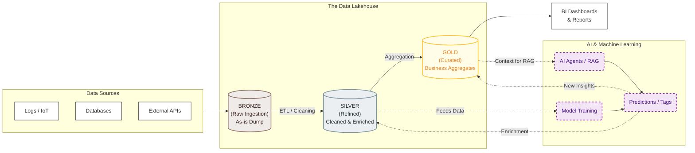

Within your [D&A Career](https://jalcocert.github.io/JAlcocerT/career/), you will find several **BI** Tools.

In the end, its all about: *the goal, not...the tools*

| Step | Phase | Activity |
|------|-------|----------|
| **1** | Discovery | Understand client needs, goals, challenges, and expectations |
| **2** | Data | Gather and analyze relevant data, perform cleaning and exploration |
| **3** | Hypothesis | Develop initial hypotheses based on client needs and data |
| **4** | Method | Select appropriate analytical methods and tools |
| **5** | Analysis | Perform the analysis, document process and results |
| **6** | Insights | Identify key patterns, trends, and findings |
| **7** | Design | Organize insights into a coherent narrative |
| **8** | Iterate | Share with client, gather feedback, refine |
| **9** | Present | Deliver the final data story with clear visuals |
| **10** | Follow-up | Measure success, determine next steps |


Every KPI should follow the SMART framework:

| Criterion | Description | Example |
|-----------|-------------|---------|
| **S**pecific | Clear and well-defined goals | "Develop a KPI dashboard for sales" vs "improve analysis" |
| **M**easurable | Quantifiable metrics or observable outcomes | Track user engagement increase, time saved |
| **A**chievable | Realistic given resources, skills, and time | Challenging but within reach |
| **R**elevant | Aligned with business objectives | Direct impact on key business areas |
| **T**ime-bound | Specific deadline or timeframe | "Complete by Q2" creates urgency |

You will be building KPI across Categories:

| Category | Focus | Examples |
|----------|-------|----------|
| **Financial** | Revenue, profitability | Revenue growth, profit margin, ROI |
| **Customer** | Satisfaction, retention | NPS, churn rate, customer lifetime value |
| **Operational** | Efficiency, quality | Processing time, error rate, throughput |
| **Growth** | Expansion, reach | Market share, new customers, lead conversion |


Most popular within enterprises are: *all of these are paid products*

1. [PowerBI](https://jalcocert.github.io/JAlcocerT/about-powerbi/)
2. [Looker](https://jalcocert.github.io/JAlcocerT/understanding-google-cloud-platform/#what-it-is-looker-modelling-language) 
3. Tableau

Sometimes, the [OSS BI Tools](https://jalcocert.github.io/JAlcocerT/setup-bi-tools-docker/) will come into the picture:

4. Grafana
5. Others, like Metabase, Redash, Superset... 

<!-- 

  
 -->

Normally, these tools go plugged in the **final stage of the data pipelines**: *aka gold*



Depending on your work environment, you could do fully [custom BI](#custom-bi-tools) proposals.

### Custom BI Tools

For a PoC on BI Tools, just go for Streamlit: *data centered plus its speed of iterations around a good data model is unmatched*


  
  



Putting together a project like [Streamlit_PoC](https://github.com/JAlcocerT/Streamlit_PoC/tree/main/Utils) allows you to consolidate the Rendering Plotly, MermaidJS, QR, ChartJS, ApexCharts, PyGWalker with OSM geolocation data...in one place



<!-- 
 -->

To build a BI Tools even more custom: *with certain UI look and feel, you can **try Flask***

<!--  -->


  
  


Or [for stonks](https://jalcocert.github.io/JAlcocerT/py-stonks/#from-data-in-motion-to-pystonks):


To create interactivity, we have the well known plotly, but also **ApexCharts and ChartJS**.

<!--  -->


  



Both can be combined and create some [cool graphs within SSGs](https://jalcocert.github.io/JAlcocerT/buying-car-data-analytics/#the-costs-of-a-car), like in HUGO components and also provide interactivity via CSR.

You can potentially make embedable BI components that work on websites or just get the **full power of web apps** when designing these.


  
  


You could also use these skills when **building funnels** during your [entrepreneurial journey](https://jalcocert.github.io/JAlcocerT/docs/entrepreneur/):

> PS Reflex has very cool funnels: https://reflex.dev/docs/library/graphing/charts/funnelchart/


  
  


<!-- 
 -->

<!-- 
 
-->


  
  


You can also create a quick [mermaidJS sankey of on boarding flows](https://mermaid.live/edit#pako:eNptksFuwjAMhl-l8mlIEUrSNqW5DbggbRIS2mXqJSOmVKMJCum2DvHuS4so07pTYvv__VmJz7C1GkFCYU7KvGNbmCdldGXKaK1KJJuqNNHLkWQp_VN5fAuRNaijh40PiYhNCO9UhbmZ-nNliKD0nhz5-ISwX76gX9U16kp5jNaN2-7VCUmc0nt97uznKQxy4w3xEg-qDZ0HG-vIQ3mEjgf0P8iFNR_ofKeeNy26yXWIEWOsC1QgULpKg_SuQQI1ulp1IZwLE0UF-D3WWIAMV4071Rx8Eb7gEmxHZV6trW9OZ5tyD3KnDgEFzVGHGZeVKp26S9BodAvbGA8y7TuAPMMXSDYT0zxhPE5FEieU8xmBFiSnfEpzNuOcJ3mWCn4h8N0z6VRkucjSlOWJEAmljEB4F2_d83VN-m25_ABw1bbl).



  
    


* Shiny in Python
  * <https://shiny.rstudio.com/py/gallery/>
  * <https://shiny.rstudio.com/py/gallery/>

<!-- 
```mermaid
sankey
Landing Page,Sign Up,750
Landing Page,Abandoned (Stage 1),250

Sign Up,Sign In,600
Sign Up,Abandoned (Stage 2),150

Sign In,Immediate Purchase,350
Sign In,Browsing,250

Browsing,Delayed Purchase,100
Browsing,Abandoned (Stage 3),150

Immediate Purchase,Converted (Buyer),350
Delayed Purchase,Converted (Buyer),100
``` -->