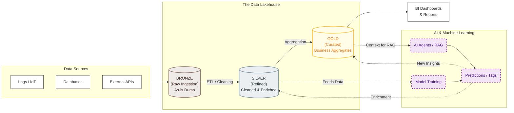

Within your D&A Career, you will find [several **OSS BI** Tools](https://jalcocert.github.io/JAlcocerT/setup-bi-tools-docker/):

Most popular within enterprises are: *all of these are paid products*

1. [PowerBI](https://jalcocert.github.io/JAlcocerT/about-powerbi/)
2. [Looker](https://jalcocert.github.io/JAlcocerT/understanding-google-cloud-platform/#what-it-is-looker-modelling-language) 
3. Tableau

<!-- 

  
 -->

Normally, these tools go plugged in the final stage of the data pipelines:

Depending on your work environment, you could do fully [custom BI](#custom-bi-tools) proposals.

### Custom BI Tools

For a PoC on BI Tools, go for Streamlit:


  
  



Putting together a project like [Streamlit_PoC](https://github.com/JAlcocerT/Streamlit_PoC) allows you to consolidate the Rendering Plotly, MermaidJS, QR, ChartJS, ApexCharts, PyGWalker with OSM geolocation data...in one place


<!-- 
 -->

To build a BI Tools even more custom: *with certain UI look and feel, you can **try Flask***

<!--  -->


  
  


To create interactivity, we have the well known plotly, but also **ApexCharts and ChartJS**.

<!--  -->


  


Both can be combined and create some [cool graphs within SSGs](https://jalcocert.github.io/JAlcocerT/buying-car-data-analytics/#the-costs-of-a-car), like in HUGO components and also provide interactivity via CSR.

You can potentially make embedable BI components that work on websites or just get the **full power of web apps** when designing these.


  
  


You could also use these skills when **building funnels** during your [entrepreneurial journey](https://jalcocert.github.io/JAlcocerT/docs/entrepreneur/):

<!-- 
 
-->


  
