<!-- 
deeper Power BI expertise, particularly in BI semantic model design and self-service analytics. 
-->

<!-- 
MMM marketing analytics 
-->

<!-- * My repository to learn [ML with Python](https://github.com/JAlcocerT/Python_is_awesome/tree/main/ML%20-%20EDA) -->

<!-- # The ML Guide -->
<!-- 
https://playground.tensorflow.org/#activation=tanh&batchSize=10&dataset=circle&regDataset=reg-plane&learningRate=0.03&regularizationRate=0&noise=0&networkShape=4,2&seed=0.18371&showTestData=false&discretize=false&percTrainData=50&x=true&y=true&xTimesY=false&xSquared=false&ySquared=false&cosX=false&sinX=false&cosY=false&sinY=false&collectStats=false&problem=classification&initZero=false&hideText=false -->

<!-- 
Basic understanding of Supervised, Unsupervised and Reinforcement ML.
Basic understanding of Location, Spread, Assymetry, Concentration, Dependence measures.
Basic understanding of Hypothesis testing (confidence interval, Type 1 and Type 2 errors, Null hypothesis, significance level and p-value). 
Basic understanding of Classification, Regression and Clustering tasks in ML. -->
<!-- 
Ability to list use cases for Hypothesis testing.
Ability to list use cases for Classification, Clustering, Regression, their benefits, pros and cons.
Ability to list use cases for Supervised and Unsupervised ML methods, compare them. -->

<!-- 
<https://youtu.be/OwZHNH8EfSU?t=14314> -->

There are many **unknown unknowns** in a career.

As someone said: *we can just trace the dots backwards*.

For the ones that would like to share their experience, [creating and publishing an ebook](https://jalcocert.github.io/JAlcocerT/cool-ebooks/) is quite **simple**.

So is preparing your **CV and your interviews**:


  
  


---

For a career in D&A you will need to be familiar with certain tools.

https://roadmap.sh/

https://jalcocert.github.io/JAlcocerT/guide-python-PySpark/

https://jalcocert.github.io/JAlcocerT/excel-data-analytics-interviews/
https://jalcocert.github.io/JAlcocerT/data-analytics-architecture/
https://jalcocert.github.io/JAlcocerT/data-analytics-concepts/

https://jalcocert.github.io/JAlcocerT/data-basics-for-data-analytics/

https://jalcocert.github.io/JAlcocerT/self-taught-career-guide-for-data-analytics/

* [**Big Data** Tools](https://jalcocert.github.io/JAlcocerT/big-data-tools-for-data-analytics/)
* [**GCP** 101](https://jalcocert.github.io/JAlcocerT/understanding-google-cloud-platform/)

https://jalcocert.github.io/JAlcocerT/brd-vs-frd-for-data-analytics/
https://jalcocert.github.io/JAlcocerT/business-analytics-skills/

https://jalcocert.github.io/JAlcocerT/brd-vs-frd-for-data-analytics/#why-these-are-important

See this [Project Charter](https://github.com/Azure/Azure-TDSP-ProjectTemplate/blob/master/Docs/Project/Charter.md) for Reference

> Hey, if you are a SoloPreneur BiP, you can simplify all of this like so!

https://jalcocert.github.io/JAlcocerT/effective-meetings-data-analytics
https://jalcocert.github.io/JAlcocerT/business-skills-data-analytics/
https://jalcocert.github.io/JAlcocerT/decision-making-data-analytics/

This can concepts get messy, very fast.

That's why I learnt to create ebooks and made one about **Data Analytics**

<!--  -->


  
  


| **Category** | Tools | Description |
| :--- | :--- | :--- |
| **Data Orchestration & Transformation** | **dbt**, **Dataform**, **Airflow** | These tools manage the "T" (Transformation) in ELT/ETL. They define, schedule, and execute data pipelines. Dataform is BigQuery-native, while dbt and Airflow are platform-agnostic. |
| **Cloud Data Warehouses** | **BigQuery**, **Snowflake**, **Redshift**, **Azure Synapse Analytics** | These are highly scalable, serverless, or managed databases designed for analytical workloads over massive datasets. They are the destination for your data and the environment where your transformation tools run. |
| **Business Intelligence (BI)** | **Looker**, **Tableau**, **Power BI** | These are tools used to visualize and analyze data from the data warehouses. They are often the final destination for data, used by business teams to create reports and dashboards. |

**Data Modelling**

* [DA Concepts](https://jalcocert.github.io/JAlcocerT/data-analytics-concepts/)

| Feature | OLTP (Online Transaction Processing) ✍️ | OLAP (Online Analytical Processing) 📊 |
| :--- | :--- | :--- |
| **Primary Use Case** | Handles real-time, day-to-day transactions, like an e-commerce order or a banking withdrawal. | Analyzes historical data for business intelligence and strategic reporting. |
| **Data Model** | **Highly Normalized** (e.g., Third Normal Form - **3NF**). Data is stored with minimal redundancy to ensure data integrity. | **Denormalized**. Data is duplicated and flattened across tables to minimize joins and optimize for reading. |
| **Schema Design** | **3NF**. Tables are broken down into small, related pieces. | **Star Schema** or **Snowflake Schema**. Data is organized into fact tables (metrics) and dimension tables (attributes). |
| **Typical Operations** | High volume of short, atomic transactions (`INSERT`, `UPDATE`, `DELETE`). | High volume of large, complex queries (`SELECT`) with extensive aggregations. |
| **Read vs. Write** | **Write-heavy**. The focus is on fast, reliable data entry. | **Read-heavy**. The focus is on fast data retrieval and analysis. |
| **Query Type** | Simple, predefined queries (e.g., fetching a single customer record by ID). | Complex, ad-hoc queries (e.g., "What was our total revenue per region last quarter?"). |
| **Performance Metric** | Transactions per second (TPS). The goal is to process as many transactions as possible. | Query latency. The goal is to return analytical results as quickly as possible. |
| **Data Volume** | Small records, frequently accessed and updated. | Large volumes of historical data, often loaded in batches. |

**Languages for Data Analytics**: You need to understand which [databases are there](https://jalcocert.github.io/JAlcocerT/setup-databases-docker) with D&A lenses. You can also look to [DBs from BE devs side](https://jalcocert.github.io/JAlcocerT/databases-101/).

* [SQL for Data Analytics](https://jalcocert.github.io/JAlcocerT/sql-data-analytics/)
* [Getting started with Python](https://jalcocert.github.io/JAlcocerT/guide-python/)
* [R language Setup](https://jalcocert.github.io/JAlcocerT/r-language-101/)

**Query Engines**

Query engines are software systems designed to run SQL queries or similar data processing commands. They are the "brains" that execute the logic you write, often over large datasets.

| Name | Type | Key Features | Primary Use Case |
| :--- | :--- | :--- | :--- |
| **Trino (formerly PrestoSQL)** | Distributed SQL Query Engine | Fast, federated queries, open source | Ad-hoc analytics over diverse data sources (data lake, databases) |
| **Apache Spark** | Distributed Data Processing Engine | In-memory processing, supports multiple languages (Python, Scala) | Complex ETL, machine learning, large-scale data processing |
| **Apache Hive** | Data Warehouse Software | SQL-on-Hadoop, converts SQL to MapReduce/Spark jobs | Querying structured data stored in HDFS |
| **Dremio** | Data Lakehouse Platform | SQL engine with a data virtualization layer | Self-service BI and analytics directly on data lakes |
| **BigQuery (as an engine)** | Serverless MPP Engine | Massively Parallel Processing, optimized for analytical queries | High-performance analytics on massive datasets |

* https://it-tools.tech/sql-prettify

> Massively Parallel Processing engine. It's a type of architecture designed to run a single, large query or job across many different computing nodes at the same time



* **Pyspark and Spark:** PySpark is just the Python API for Apache Spark. Spark is a powerful, general-purpose engine. It's not just a query engine; it can run complex code in Python, Scala, and Java. It's often used for intricate ETL jobs and machine learning pipelines.
* **Trino:** Trino is a pure SQL query engine. Its main strength is **federated queries**, meaning it can query data across multiple systems (like an AWS S3 data lake, a MySQL database, and a PostgreSQL database) as if they were all in one place.
* **BigQuery:** While BigQuery is a data warehouse, its underlying engine is a key example of a modern, serverless query engine. It's designed to be incredibly fast and scalable for analytical queries.
* **Hive:** Hive was one of the first SQL-on-Hadoop engines. It's a key part of the older Hadoop ecosystem but is often being replaced by faster engines like Spark and Trino.

You can think of it this way: a tool like **dbt** or **Dataform** generates and submits SQL, and a **query engine** like BigQuery, Spark, or Trino is the one that actually runs it and performs the computation.



**Orchestration Tools**

Data orchestration is the automated management, scheduling, and monitoring of data-related tasks to build a cohesive data pipeline. 

It ensures that complex workflows run in the correct sequence, handle failures, and provide visibility into the entire process.

| Name | Type | Key Features | Ideal For |
| :--- | :--- | :--- | :--- |
| **Apache Airflow** | Open-Source Orchestrator | Written in Python, defines workflows as Directed Acyclic Graphs (DAGs). Large community and extensive ecosystem of operators for integrations. | General-purpose orchestration, complex pipelines with diverse tasks, and custom logic. |
| **Dataform** | Google Cloud Native Service | SQL-native, built specifically for orchestrating transformations within BigQuery. Manages dependencies and version control. | Data teams working exclusively with BigQuery for SQL transformations. |
| **GCP Cloud Composer** | Managed Airflow Service | A fully managed version of Apache Airflow on Google Cloud. Handles infrastructure, upgrades, and scaling automatically. | Teams that want to use Airflow without the overhead of managing the infrastructure. |
| **AWS Step Functions** | Managed AWS Service | State-based workflow orchestration. Defines workflows as a series of steps in a visual editor or JSON. | Orchestrating tasks across different AWS services and building serverless data pipelines. |
| Dagster | Modern Python Orchestrator | Asset-based approach, focusing on the data objects (assets) created by a pipeline. Strong emphasis on observability, testing, and data quality. | Data teams who prioritize data lineage, asset management, and robust testing. |
| Prefect | Modern Python Orchestrator | Dynamic workflows that adapt to data and conditions. Known for its "negative engineering" philosophy, which focuses on handling failures gracefully. | Data teams needing flexible, event-driven pipelines and resilient error handling. |

Azure Data Factory (ADF) is a **cloud-native ETL/ELT service** within the Microsoft Azure ecosystem.

It's a fully managed, serverless platform designed for orchestrating and automating data movement and transformation at scale.

ADF is a key part of the Azure data stack, much like Dataform is for Google Cloud.

Its primary appeal is its visual, low-code interface and deep integration with other Azure services.

| Name | Type | Key Features | Ideal For |
| :--- | :--- | :--- | :--- |
| **Azure Data Factory** | Cloud-native ETL/ELT Service | Serverless, managed, and features a visual, drag-and-drop interface with over 90 built-in connectors. | Teams operating within the Azure ecosystem, particularly those who prefer a graphical interface over writing code for pipeline orchestration. |
| **Apache Airflow** | Open-Source Orchestrator | Written in Python, defines workflows as Directed Acyclic Graphs (DAGs). Large community and extensive ecosystem of operators for integrations. | General-purpose orchestration, complex pipelines with diverse tasks, and custom logic. |
| **Dataform** | Google Cloud Native Service | SQL-native, built specifically for orchestrating transformations within BigQuery. Manages dependencies and and version control. | Data teams working exclusively with BigQuery for SQL transformations. |
| Dagster | Modern Python Orchestrator | Asset-based approach, focusing on the data objects (assets) created by a pipeline. Strong emphasis on observability, testing, and data quality. | Data teams who prioritize data lineage, asset management, and robust testing. |
| Prefect | Modern Python Orchestrator | Dynamic workflows that adapt to data and conditions. Known for its "negative engineering" philosophy, which focuses on handling failures gracefully. | Data teams needing flexible, event-driven pipelines and resilient error handling. |



The choice between a tool like Azure Data Factory and a more code-based tool like Airflow depends on your team's skills and your cloud environment.

* **ADF is great for a more "citizen integrator" or low-code approach**, especially if you're already using Azure. It simplifies many common data integration tasks with its graphical interface.
* **Airflow** provides greater **flexibility and fine-grained control** over your pipelines, but it requires a deeper understanding of Python and more DevOps effort to manage the underlying infrastructure.

Yes, dbt and Dataform are extremely similar; they are both designed for data transformation. Azure Data Factory (ADF), however, is both a transformation and orchestration tool.

**dbt & Dataform: Data Transformation**

dbt and Dataform are specialized tools for the "T" in ELT (Extract, Load, Transform). They enable data engineers to build robust data models and pipelines using a **declarative, SQL-first** approach. They don't handle the data ingestion (the "E" and "L")—they assume the data is already in a data warehouse like BigQuery or Snowflake.

Their primary function is to transform raw, messy data into clean, structured data sets ready for analytics.

* **Dataform** is a native Google Cloud service designed to do this specifically for BigQuery.
* **dbt** is platform-agnostic, meaning it can run these same SQL transformations on various data warehouses, including BigQuery, Snowflake, and Redshift.

**Azure Data Factory: Orchestration and Transformation**

ADF's role is more comprehensive. It's a serverless ETL/ELT service, meaning it can perform all three steps: extraction, transformation, and loading.

* **Orchestration:** This is ADF's core strength. Its primary job is to orchestrate the entire data pipeline. It manages the flow of activities, handles dependencies, and provides monitoring and scheduling. It's like the factory manager who tells different machines what to do and when to do it.

* **Transformation:** ADF also has built-in features for transformation, most notably **Data Flows**. This is a graphical, no-code/low-code interface that allows users to perform complex data transformations (like joins, aggregations, and filters) without writing any code. These transformations run on a scalable Apache Spark cluster managed by Azure.

In practice, a common pattern is to use ADF for both: it **orchestrates** the pipeline by copying data from a source, and it then calls its internal **Data Flow** engine to perform the transformations before loading the data into its final destination.



---

### How to Choose a Tool

The right choice depends on your specific needs:
* If you need a flexible, open-source tool with a huge community, **Airflow** is the industry standard.
* If you're already in Google Cloud and your transformations are primarily SQL, **Dataform** is the simplest, most integrated solution.
* If you need a more modern, asset-centric approach with a focus on data quality, **Dagster** is a great choice.
* If you want a powerful, Pythonic orchestrator with a focus on flexibility and reliability, **Prefect** is a strong contender.

**Storage**

The primary distinction is between **Object Storage** (GCS, AWS S3, Azure Blob, MinIO) and a **Distributed File System** (HDFS).

Object Storage is designed for a flat structure and is typically accessed via an API, while a Distributed File System mimics a traditional file system with a hierarchical directory structure.

| Feature | GCS (Google Cloud Storage) | AWS S3 (Amazon S3) | Azure Blob Storage | MinIO | HDFS (Hadoop) |
| :--- | :--- | :--- | :--- | :--- | :--- |
| **Provider** | Google Cloud | Amazon Web Services (AWS) | Microsoft Azure | MinIO (Open Source) | Apache (Open Source) |
| **Type** | Object Storage | Object Storage | Object Storage | Object Storage | Distributed File System |
| **Main Use Case** | Data lakes, backup, web hosting, media storage | Industry standard for data lakes, backup, static web hosting | Unstructured data storage, data lakes, media | Private/hybrid cloud, S3-compatible on-premise storage | On-premise data lakes, batch processing with Hadoop/Spark |
| **Protocol** | HTTP REST API | HTTP REST API | HTTP REST API | S3-Compatible API | HDFS Protocol |
| **Scalability** | Massively scalable, serverless | Massively scalable, serverless | Massively scalable, serverless | Massively scalable, but self-managed | Scalable, but limited by on-premise cluster size |
| **Pricing** | Pay-as-you-go for storage, network egress, operations | Pay-as-you-go for storage, network egress, operations | Pay-as-you-go for storage, network egress, operations | Free to use, with paid enterprise support | No direct cost, but requires hardware and maintenance |
| **On-Premise** | Yes, via GCS FUSE | Yes, via AWS Outposts | Yes, via Azure Stack | **Primarily On-Premise** or private cloud | **Primarily On-Premise** |

**File formats**

| Format | Category | Use Case | Pros | Cons |
| :--- | :--- | :--- | :--- | :--- |
| **JSON** | Text-Based | Semi-structured data, APIs | Human-readable, schema-flexible | Inefficient for large-scale analytics, requires full file parsing |
| **CSV** | Text-Based | Basic data exchange | Simple, universally supported | No schema, poor compression and query performance on large datasets |
| **Avro** | Row-Based | Streaming, data serialization | Good for streaming data, supports schema evolution | Slower for analytical queries that only read a few columns |
| **Parquet** | Columnar | **Primary for Analytics (OLAP)** | Highly compressed, **very fast for analytical queries** | Slower for writing and for queries that need full rows |
| **ORC** | Columnar | Analytics, Hadoop Ecosystem | Similar to Parquet, excellent compression and performance | More tightly coupled with the Hadoop ecosystem than Parquet |
| **Delta Lake / Iceberg / Hudi** | Table Format | **Data Lakehouses**, ACID Transactions | Brings database features (transactions, time travel, schema enforcement) to a data lake | Adds a layer of complexity and tool dependency |

Make sure to master json and timestamps: *specially when working with [telecom data](https://jalcocert.github.io/JAlcocerT/telecom-concepts-101/)*

* https://it-tools.tech/date-converter
* https://it-tools.tech/json-prettify



* https://github.com/ynqa/jnv

> MIT | Interactive **JSON filter** using jq 

* https://github.com/AykutSarac/jsoncrack.com

> Apache v2 | ✨ Innovative and open-source visualization application that transforms various data formats, such as JSON, YAML, XML, CSV and more, into interactive graphs. 

* https://jsonformatter.org/
* https://github.com/josdejong/jsoneditor



> You can do cool things with [Python+JSON understanding, like reading info from s3](https://jalcocert.github.io/JAlcocerT/aws-s3-python-boto-queries/#json-tools).

**BI Stuff**: Get better at creating visual data stories that anyone can understand.


  
  


You dont need to wait to be on a project to get started. See these:


  


* Shiny in Python
  * <https://shiny.rstudio.com/py/gallery/>
  * <https://shiny.rstudio.com/py/gallery/>

### Cool D&A Architectures

```mermaid
flowchart LR
    %% --- Styles ---
    classDef bronze fill:#EFEBE9,stroke:#8D6E63,stroke-width:3px,color:#3E2723;
    classDef silver fill:#ECEFF1,stroke:#78909C,stroke-width:3px,color:#263238;
    classDef gold fill:#FFFDE7,stroke:#FBC02D,stroke-width:3px,color:#F57F17;
    
    %% Tool Styles
    classDef storage fill:#cfd8dc,stroke:#37474F,stroke-width:2px,color:#37474F;
    classDef format fill:#b2dfdb,stroke:#00695c,stroke-width:2px,color:#004D40;
    classDef quality fill:#ffecb3,stroke:#ff6f00,stroke-width:2px,stroke-dasharray: 5 5,color:#BF360C;
    classDef code fill:#e1bee7,stroke:#4a148c,stroke-width:1px,stroke-dasharray: 2 2,color:#4a148c;

    %% ================= Physical Foundation =================
    subgraph PhysicalLayer [The Physical Foundation]
        S3[("S3 / Minio<br/>(Object Storage)")]:::storage
    end

    %% ================= Table Format & Catalog Layer =================
    %% This layer sits conceptually *between* physical files and the logical layers
    subgraph ManagementLayer [Table Management & Catalog]
        Iceberg("Apache Iceberg<br/>(Table Format / ACID)"):::format
        Nessie("Nessie<br/>(Data Git / Catalog)"):::format
        Iceberg -.->|Managed by| Nessie
        S3 --- Iceberg
    end


    %% ================= Logical Medallion Flow =================
    subgraph Lakehouse [Logical Data Flow]
        direction TB
        
        Source[Raw Data Sources]

        %% --- Ingestion Pipeline ---
        subgraph Ingest [ETL: Ingestion]
            Pydantic1[("Pydantic<br/>(Schema define)")]:::code
        end

        %% --- Bronze Layer ---
        Bronze[("BRONZE Layer<br/>(Raw Iceberg Tables)")]:::bronze

        %% --- Processing Pipeline 1 ---
        subgraph Process1 [ETL: Cleaning]
            GX1[("Great Expectations<br/>(Quality Gate: Null checks, types)")]:::quality
        end

        %% --- Silver Layer ---
        Silver[("SILVER Layer<br/>(Enriched Iceberg Tables)")]:::silver

        %% --- Processing Pipeline 2 ---
        subgraph Process2 [ETL: Aggregation]
            GX2[("Great Expectations<br/>(Quality Gate: Business Rules)")]:::quality
        end

        %% --- Gold Layer ---
        Gold[("GOLD Layer<br/>(Aggregated Iceberg Tables)")]:::gold
        
        %% --- The Connections ---
        Source --> Pydantic1 --> Bronze
        Bronze --> GX1 --> Silver
        Silver --> GX2 --> Gold
    end

    %% Mapping Logical to Physical/Management
    %% The logical layers ARE Iceberg tables sitting on S3
    Bronze -.-> Iceberg
    Silver -.-> Iceberg
    Gold -.-> Iceberg
```

### BA Stuff

Dont become one of those BAs that dont know anything at all from tech.

And dont become those tech people that dont know anything about the business.

> Plot twist, the business performing well is what pays you 🤯

To write effective user stories for your **PRD**, you want to follow a standard industry format.

This ensures that when you switch from "Manager" to "Developer," you know exactly what success looks like.

**Acronyms for BAs:**

1. Scope of Work - SoW
2. BRD,PRD,FRD
3. PoC, MVP
4. SMART and INVEST

### The User Story Skeleton

The most effective structure for a SaaS user story is the **"Role-Action-Benefit"** formula, followed by **Acceptance Criteria (AC)**.

**The Skeleton:**
* **Story:** As a **[Type of User]**, I want to **[Perform an Action]** so that **[Achieve a Value]**.
* **Acceptance Criteria:** A bulleted checklist that defines when the task is "Done."

---

### The Example: User Authentication

You asked for a story that starts with "the user logs into the app."

#### **User Story: Account Access**

> **As a** Registered User,  
> **I want to** log into the application using my email and password  
> **So that** I can access my private dashboard and saved data securely.

#### **Acceptance Criteria (The "Functional" logic):**

* [ ] User is presented with a clean login screen containing Email and Password fields.
* [ ] The "Login" button is disabled if the fields are empty.
* [ ] **Validation:** System checks the database to see if the user exists and the password matches.
* [ ] **Success Path:** If credentials are correct, user is redirected to the `/dashboard`.
* [ ] **Error Path:** If credentials fail, show a generic error: *"Invalid email or password."* (Do not specify which one for security).
* [ ] **State Persistence:** User session is maintained (JWT or Session cookie) so they don't have to re-login on refresh.
* [ ] **Password Masking:** The password field characters must be hidden by default.

### DSc Tools

Remember, There wont be any good data science work if the **data modelling** part is not done right.

And there wont be a good project foundation w/o that clear why/what/how, project charter and RACIs.

AS it can also be w/o each team member getting clear contributions [each week](https://jalcocert.github.io/JAlcocerT/git-recap/#weekly-planning).

Do so for two reasons:

1. For you to build a sucess story when you are looking for a promo
2. To share that blocked/helped needed/discovered/completed before the daily standup and safe a lot of time during a year to everyone


  
  



I also explored [NLP](https://jalcocert.github.io/JAlcocerT/nlp-tools/) and [CV](https://jalcocert.github.io/JAlcocerT/raspberry-pi-camera-setup/#more-software---camera-and-cv)


More **DSc** Stuff

With AI/ML you can do very cool stuff, from **AB Testing** to test new strategies, to sentiment analysis or PII detection:


  
  




**1. Machine Learning/Data Science Tasks**

* **ML Algorithm Selection:**
    * **Example:** You're tasked with building a model to predict customer churn. You'd need to evaluate and compare different algorithms like Logistic Regression, Random Forest, Gradient Boosting, and potentially a simple Neural Network to determine which model performs best on your data.
    * **Python Implementation:**
        * Use Scikit-learn to implement and train different models.
        * Utilize functions like `train_test_split` for data splitting and `cross_val_score` for model evaluation.
        * Compare performance metrics like accuracy, precision, recall, F1-score, AUC-ROC.

* **Feature Engineering:**
    * **Example:** You have a dataset with raw categorical features like "country" and "city". You need to engineer new features to improve model performance. 
    * **Python Implementation:**
        * Use Pandas for data manipulation:
            * One-hot encoding for categorical variables (`pd.get_dummies()`)
            * Creating interaction features (e.g., combining "country" and "city" into a single feature)
            * Handling missing values (imputation techniques)
            * Scaling numerical features (e.g., standardization, normalization)

* **Model Training:**
    * **Example:** Train a deep learning model for image classification using TensorFlow or PyTorch.
    * **Python Implementation:**
        * Define the model architecture (layers, activation functions).
        * Implement the training loop (forward pass, backward pass, optimization).
        * Use tools like TensorBoard for visualizing training progress.

* **Hyperparameter Tuning:**
    * **Example:** Find the optimal hyperparameters for a Support Vector Machine (SVM) model.
    * **Python Implementation:**
        * Use GridSearchCV or RandomizedSearchCV from Scikit-learn to systematically explore different hyperparameter combinations.
        * Evaluate the performance of each combination using cross-validation.

* **Distributed Model Training:**
    * **Example:** Train a large-scale deep learning model on multiple GPUs or across a cluster of machines.
    * **Python Implementation:**
        * Utilize frameworks like TensorFlow or PyTorch with distributed training capabilities (e.g., using `tf.distribute` in TensorFlow).

* **Supervised and Unsupervised Learning:**
    * **Examples:**
        * Supervised: Build a spam classifier (classification), predict house prices (regression).
        * Unsupervised: Perform customer segmentation (clustering), reduce the dimensionality of your data (PCA).
    * **Python Implementation:**
        * Use Scikit-learn for a wide range of supervised and unsupervised learning algorithms.

* **Building Model Pipelines:**
    * **Example:** Create a pipeline for preprocessing data, training a model, and evaluating its performance.
    * **Python Implementation:**
        * Use the `Pipeline` class in Scikit-learn to chain together different steps in your workflow.

**2. Advanced Python Skills**

* **Native Python:**
    * **Data Structures:** Working with lists, dictionaries, sets, and tuples.
    * **Control Flow:** Using loops (for, while), conditional statements (if, elif, else), and functions.
    * **Object-Oriented Programming (OOP):** Understanding classes, objects, inheritance, and polymorphism.

* **Pandas:**
    * **Data Manipulation:** Filtering, sorting, grouping, merging, and joining DataFrames.
    * **Data Cleaning:** Handling missing values, removing duplicates, and transforming data types.
    * **Data Analysis:** Descriptive statistics, aggregations, and data visualization.

* **Scikit-learn:**
    * **Model Selection:** Using various classification, regression, clustering, and dimensionality reduction algorithms.
    * **Model Evaluation:** Calculating and interpreting performance metrics.
    * **Model Tuning:** Implementing techniques like cross-validation and hyperparameter tuning.

* **TensorFlow/PyTorch:**
    * **Building Neural Networks:** Defining and training deep learning models.
    * **Tensor Manipulation:** Working with tensors, gradients, and computational graphs.
    * **Deployment:** Preparing models for deployment in production environments.

* **PyStats:**
    * **Statistical Analysis:** Performing statistical tests, hypothesis testing, and statistical inference.
    * **Data Visualization:** Creating informative and visually appealing plots.




  
  



  
  




**1. Solidify Your Technical Skills**

* **Machine Learning Fundamentals:**
    * **Supervised Learning:** Regression, Classification (Logistic Regression, SVM, Decision Trees, Random Forests)
    * **Unsupervised Learning:** Clustering (K-Means, DBSCAN), Dimensionality Reduction (PCA)
    * **Deep Learning:** Neural Networks, Convolutional Neural Networks (CNNs), Recurrent Neural Networks (RNNs)
    * **Reinforcement Learning:** (Basic understanding)
* **Python Proficiency:**
    * **Data Manipulation:** Pandas (Series, DataFrames, groupby, merge, etc.)
    * **ML Libraries:** Scikit-learn (model implementations, preprocessing, evaluation metrics), TensorFlow/PyTorch (for deep learning), Detoxify
    * **Data Visualization:** Matplotlib, Seaborn (for exploratory data analysis and model interpretation)
* **SQL Expertise:**
    * **Data Retrieval:** Joins, Subqueries, Aggregations
    * **Data Manipulation:** Window functions, Common Table Expressions (CTEs)
    * **Performance Optimization:** Indexing, Query Planning
* **Data Engineering Concepts:**
    * **Feature Engineering:** Techniques like one-hot encoding, scaling, feature selection
    * **Model Pipelines:** Building automated workflows for data processing, model training, and evaluation

**2. Project-Based Preparation**

* **Personal Projects:**
    * **Build a portfolio of projects:** Showcase your skills with a few well-documented projects on GitHub or a similar platform.
    * **Focus on projects related to xyz's business:** If possible, try to find datasets or scenarios related to CCC's industry (e.g., retail, supply chain) and build projects around them. 
    * **Example projects:**
        * **Predicting customer churn:** Using historical data to identify customers likely to leave.
        * **Product recommendation:** Building a recommendation system for CCC products.
        * **Fraud detection:** Developing a model to detect fraudulent transactions.
        * **Supply chain optimization:** Using ML to optimize inventory levels or delivery routes.
* **Kaggle Competitions:** Participate in Kaggle competitions to gain practical experience and improve your skills.

**3. Practice Data Science Interview Questions**

* **Technical Questions:**
    * **Explain the bias-variance tradeoff.**
    * **How do you handle imbalanced datasets?**
    * **What are the different types of cross-validation?**
    * **How do you evaluate the performance of a classification model?**
    * **Explain the concept of overfitting and how to prevent it.**
    * **Walk me through your approach to a specific machine learning problem.**
* **Behavioral Questions:**
    * **Tell me about a time you had to deal with a challenging technical problem.**
    * **Describe your experience working on a team project.**
    * **How do you stay up-to-date with the latest advancements in machine learning?**
    * **Why are you interested in working for xyz?**

**4. Prepare for the xyz-Specific Questions**

* **Research xyz:** Understand their business, values, and recent news/initiatives.
* **Align your skills and experience:** Think about how your skills and experience can contribute to CCC's goals.
* **Prepare questions to ask the interviewer:** This shows your interest and engagement. For example:
    * "What are the biggest challenges in using machine learning at xyz?"
    * "What are the opportunities for professional development within the data science team?"
    * "How does the data science team collaborate with other departments at xyz?"

**5. Communication and Presentation**

* **Practice clear and concise communication:** Explain your technical concepts in a way that is easy for non-technical people to understand.
* **Prepare a data science portfolio or presentation:** This will help you showcase your projects and skills effectively.
* **Mock interviews:** Practice your interview skills with a friend or mentor to get feedback and build confidence.



## Outro

Tired of being an ,IC', aka *individual contributor* or the politics around managerial roles?

Find clients that need your expertise, build with your knowledge and help others on your own way.