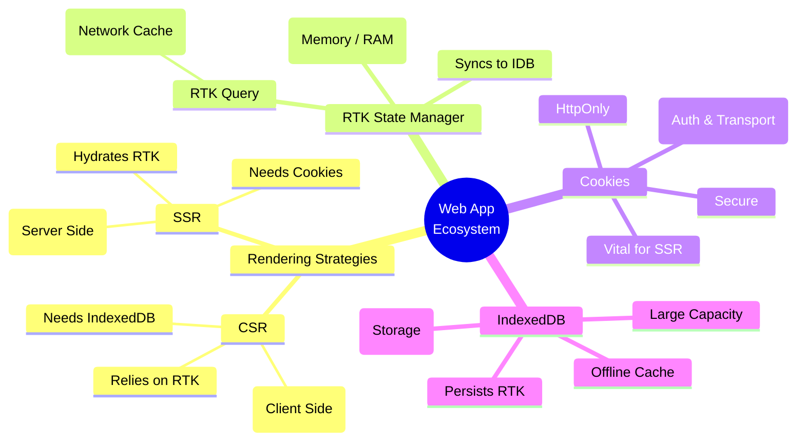

https://roadmap.sh/frontend/frameworks

How much Fe and Be you need to know?

You can discover along the way: bc concepts like rtk / indexDB learnt from the theory can be abstract.

Just keep in mind these as high level overview [while you build](https://jalcocert.github.io/JAlcocerT/docs/entrepreneur/bip/).

A [mindmap](https://mermaid.js.org/syntax/mindmap.html) should help

## FrontEnd

[CSS is all you need](https://jalcocert.github.io/JAlcocerT/blog/dev-web-code-css/) to get started and customize your website UI.

Have a look to [JS](https://jalcocert.github.io/JAlcocerT/javascript-for-static-websites/) and/or [TS](https://jalcocert.github.io/JAlcocerT/whats-typescript/) if you want to dig deeper into web/apps.

Or, if you come from the D&A world, try with Python [Full Stack frameworks](#full-stack).

### CSS & HTML

* TailwindCSS
* Bootstrap
* Bulma
* Material UI - https://mui.com/material-ui/getting-started/templates/
* Shadcn - https://ui.shadcn.com/docs/components

### JS Based

* React
* Vue
* Svelte
    * https://www.sveltethemes.com/



Svelte y Astro son tecnologías frontend que comparten la prioridad por la velocidad y eficiencia, pero no son exactamente alternativas directas, ya que tienen enfoques y casos de uso diferentes.

Svelte es un framework que compila componentes a JavaScript muy optimizado en tiempo de construcción, lo que permite construir aplicaciones web interactivas, reactivas y complejas con alto rendimiento. 

SvelteKit, el framework oficial de Svelte, añade funcionalidades completas para construir aplicaciones con routing, SSR (renderizado servidor) y otras características de apps modernas.

Astro, en cambio, es un framework orientado a sitios web con contenido más estático y enfoque en rendimiento extremo.

Utiliza una arquitectura llamada "Island Architecture" que prerenderiza la mayoría de la página en HTML estático entregando muy poco JavaScript al navegador. 

Astro soporta usar componentes de múltiples frameworks como React, Vue o Svelte dentro de un mismo proyecto, priorizando la carga mínima de scripts.

En resumen:
- Svelte (con SvelteKit) es más adecuado para aplicaciones web interactivas y complejas.
- Astro es ideal para sitios de contenido estático donde la optimización de carga y SEO es crítica.
- Astro puede incluir componentes Svelte para partes interactivas, híbrido que aprovecha ambos.

Por tanto, Svelte no es una alternativa directa a Astro; más bien, Astro puede usar Svelte como parte de su stack, y SvelteKit compite con marcos orientados a SPAs y aplicaciones completas, mientras que Astro destaca en sitios estáticos y multi-framework.



### SSGs

* [VitePress and VuePress](https://jalcocert.github.io/JAlcocerT/trying-nuxt-themes/#andvitepress-ssg) (Vue)
* [Hugo](https://jalcocert.github.io/JAlcocerT/create-your-website-hugo-ssg/)
* [Jekyll](https://jalcocert.github.io/JAlcocerT/raspberrypi-starting-guide/#more-about-jekyll)
* [Gatsby](https://jalcocert.github.io/JAlcocerT/gatsby-ghost-integration/) (React)
* [Astro](https://jalcocert.github.io/JAlcocerT/create-your-website-astro-ssg/)

---

## Backend

### Py Based

* FastAPI
* Flask

Some Python frameworks, like Streamlit, bring an opinionated UI that works out of the box with minimal effort for PoCs:


  
  


### JS Based

* Node.js
* Express.js
* NestJS

---

## Full Stack

* Next.js (React)
* [Nuxt.js (Vue)](https://jalcocert.github.io/JAlcocerT/trying-nuxt-themes/#about-nuxt)
    * https://nuxt.com/templates
* SvelteKit (Svelte)

* DJANGO (Python)
* Streamlit (Python)
* [DASH](https://jalcocert.github.io/JAlcocerT/using-langchain-with-pandas-df/) (Python)
* Shiny - [R Language](https://jalcocert.github.io/JAlcocerT/r-language-101/)
* [Laravel (PHP)](https://jalcocert.github.io/JAlcocerT/backend-alternatives/#laravel-101)

---

## About Web Scrapping

How Scraping Relates to SSG, CSR, and SSR?

Web scraping and modern web rendering techniques like:

Static Site Generation (SSG), Server-Side Rendering (SSR), and Client-Side Rendering (CSR) are fundamentally linked by how they present content.

The rendering method a website uses directly impacts how easy or difficult it is to scrape.

* **Static Site Generation (SSG)**: 📄 SSG creates and serves a fully-formed, static HTML file for each page at **build time**. The content is pre-rendered and doesn't change until the site is rebuilt.
    * **Scraping:** This is the easiest type of site to scrape. A simple scraper can just send an HTTP request to the page and receive all the content in the initial HTML response. You don't need to worry about executing JavaScript.

* **Server-Side Rendering (SSR)**: ⚙️ SSR generates the complete HTML page on the **server** for each user **request**. The server fetches data, compiles the page, and then sends the finished HTML to the browser.
    * **Scraping:** Scraping an SSR site is also relatively easy. Like with SSG, the content is already present in the initial HTML response. The scraper simply needs to parse the received HTML to extract the data.

* **Client-Side Rendering (CSR)**: 💻 CSR delivers a minimal HTML "shell" to the browser. The actual content is loaded and rendered dynamically on the **client-side** using **JavaScript**. This often involves a JavaScript framework like React or Angular making API calls to fetch data after the page has loaded.
    * **Scraping:** This is the most difficult to scrape. A basic scraper that only fetches the initial HTML will get an empty or incomplete page without the content. To get the data, a scraper must be able to execute JavaScript and mimic a browser's behavior.

### Challenges of Scraping Dynamic Content

It's much harder to scrape dynamic content, and your intuition is correct—it's because the scraper must act like a real user. 🕵️‍♀️

With dynamic content (like that found on CSR websites), the data you want isn't in the initial HTML. It's loaded later by JavaScript. This means a standard scraper that just makes a simple HTTP request will fail to see the content.

To overcome this, you need to use a **headless browser**. . A headless browser is a web browser without a graphical user interface (like Chrome or Firefox) that can be controlled programmatically. It can:

1.  **Execute JavaScript:** It runs the JavaScript on the page, just like a real browser would, triggering the API calls that load the dynamic content.
2.  **Wait for Content:** It can be programmed to wait until the content you're looking for appears on the page before trying to scrape it.
3.  **Mimic User Behavior:** More advanced anti-bot systems will detect non-human behavior. Headless browsers can be configured to mimic human actions like random delays, scrolling, and mouse movements to avoid being blocked.

So, while it is hard, it's not impossible. 

The key is to use more sophisticated tools that can render the entire page and interact with it, rather than just downloading and parsing a static HTML file.