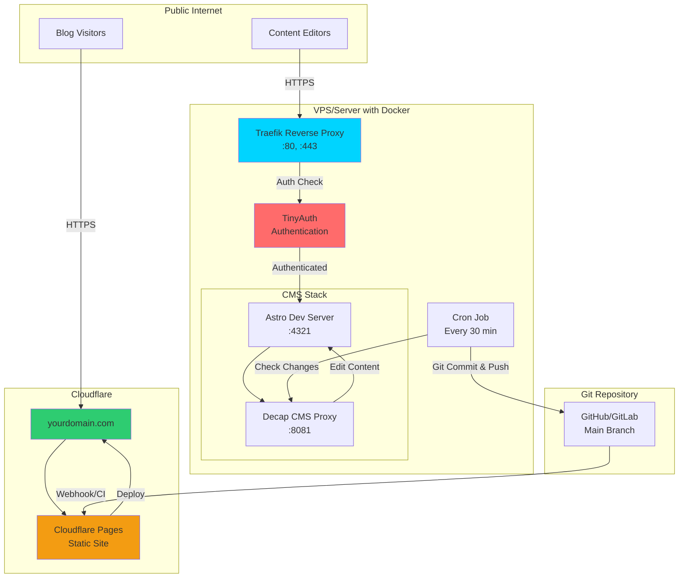

Most likely than not, you heard about these [*,no code required'* CMS's](#websites-without-coding):


  
  


The thing about frontmatter, is that you will still to enjoy writing in markdown.


  
  


If you end up liking .md, you will be able to use it for your website and skip those database setups (and maintainance)

From there, you can either build your own editor on top of astro/hugo themes:


Or use any of these [CMS combined with SSGs](#cool-cms)

As last alternative, you can go check [these no code CMS's](#websites-without-coding)

## Cool CMS

<!--  -->


<!--  -->


**All Git-based CMS are a subset of file-based CMS.**


  
  


### Decap-CMS

I just loved **working with DecapCMS** so far as [seen here](https://jalcocert.github.io/JAlcocerT/open-source-minimalist-websites/#using-decap-cms), thanks to the [twilight theme](https://github.com/JAlcocerT/Twilight)

DecapCMS is **MIT** and I also forked it: https://github.com/decaporg/decap-cms





This architecture provides a **production-ready, secure, and automated** blogging platform that **separates content management from content delivery**, ensuring both security and performance! 🚀


### Strapi 

Headless StrapiCMS Example


How to setup StrapiCMS?

If you are looking from CMS, you can have a look to [this post](https://jalcocert.github.io/JAlcocerT/cms-for-static-websites), where I [setup KeystaticCMS](https://jalcocert.github.io/JAlcocerT/cms-for-static-websites/#keystatic-cms)

* <https://www.opensourcealternative.to/project/Strapi>
    * <https://docs.strapi.io/dev-docs/installation/docker>


Astro JS x Strapi

https://www.youtube.com/watch?v=WI-_gVBoBBg
https://github.com/PaulBratslavsky/pauls-strapi-crashcourse
https://github.com/JAlcocerT/pauls-strapi-crashcourse


https://github.com/strapi/LaunchPad -> https://launch-pad-roan.vercel.app/en

> Official Strapi Demo application



  



https://www.youtube.com/watch?v=Ud9obEHadLI

* https://elest.io/open-source/strapi

* https://strapi.io/blog/how-to-self-host-your-headless-cms-using-docker-compose

* https://hub.docker.com/r/strapi/strapi/tags

* https://docs.strapi.io/cms/installation/docker
* https://docs.strapi.io/cms/quick-start
* https://strapi.io/blog/how-to-self-host-your-headless-cms-using-docker-compose


<!-- ### How to use turbostrapi

STRAPI + NEXTJS MONOREPO STARTER

* https://github.com/sawden/turbostrapi/blob/master/apps/backend/README.md
* https://github.com/sawden/turbostrapi?ref=statichunt.com
https://github.com/sawden/turbostrapi?ref=statichunt.com
https://turbo.build/repo/docs/installing

```sh
yarn install
``` -->

<!-- Build a Blog with Next.js and a Headless CMS (Strapi)
https://www.youtube.com/watch?v=NNWX2flw5mg -->


<!-- 
NEXTJS + Strapi
https://www.youtube.com/watch?v=SlhZvwl9qtI&list=PL7Q0DQYATmvjXSuHfB8CY_n_oUeqZzauZ&index=9 -->

How to Deploy Strapi - Headless CMS


<!-- https://jamstack.org/headless-cms/

https://github.com/mooxl/astroad/tree/main
 -->

Headless CMS based on nodejs

<https://www.youtube.com/watch?v=HsojvBVk6JQ>

<https://www.youtube.com/watch?v=kJ4c9U5JStU>


Consume the API from any client (React, Vue, Angular), mobile apps or even IoT devices, using REST or
GraphQL.


## 1. Payload CMS (The TypeScript/Next.js Favorite)

Payload is a modern, open-source (MIT licensed) platform that functions as a powerful **Headless CMS, Application Backend, and Admin UI.**

It has rapidly gained popularity, especially among developers working with TypeScript and React-based frontends like Next.js.

| Aspect | Payload CMS |
| :--- | :--- |
| **Core Philosophy** | **Schema-as-Code.** You define all content collections, fields, and access rules entirely in **TypeScript/JavaScript** files. |
| **Self-Hosted Experience** | Excellent. Since the entire app is built on **Node.js/Next.js**, it can be deployed anywhere you can run a Node app (Docker, Vercel, AWS). |
| **Developer Experience** | **Exceptional.** Offers strong type safety, great IDE auto-completion, and deep integration with React for custom components. |
| **Content Modeling** | Uses **Blocks** (like Strapi's Dynamic Zones) and full control over fields to build complex content structures. |
| **Target User** | Development teams who want their CMS config to be version-controlled, highly customized, and fully integrated with a TypeScript monorepo. |

---

## 2. PocketBase (The All-in-One Powerhouse)


Yes, there are several other notable self-hosted CMS alternatives, and the answer to whether PocketBase can be used as a CMS is a qualified **Yes**.

PocketBase is a single, compact, open-source application that combines **an embedded SQLite database, a real-time API (REST/GraphQL), file storage, and an Admin UI** into one easy-to-deploy Go executable.

| Aspect | PocketBase as a CMS |
| :--- | :--- |
| **Core Philosophy** | **Backend-in-a-File.** A lightweight backend-as-a-service (BaaS) that's designed for simplicity and speed. |
| **CMS Suitability** | **Yes, for small to medium projects.** It can define collections (content types), relationships, and manage content via a built-in admin panel, which are the core functions of a CMS. |
| **Self-Hosted Experience** | **Unmatched Simplicity.** It's a single binary file. You run it, and you have your entire backend and CMS interface. |
| **Limitations (Scalability)** | Its use of **SQLite** means it is restricted in how large and complex a dataset it can handle, making it less suitable for high-traffic, massive enterprise-level applications compared to Strapi or Directus running on PostgreSQL. |
| **Target User** | Developers building MVPs (Minimum Viable Products), prototypes, hobby projects, or small-to-medium static websites where **speed and ease of deployment** are the highest priority. |

### Directus

Headless DirectusCMS Example

* https://astro.build/themes/details/directus-cms-template/
* https://github.com/directus-labs/starters/tree/main/cms/astro

Directus and Strapi are two of the most popular open-source, **self-hosted headless CMS platforms**, but they operate with fundamentally different philosophies.

The choice often comes down to whether you prefer a **Database-First** approach (Directus) or a **Code-First** approach (Strapi).

---

## 🆚 Directus vs. Strapi: A Key Comparison

| Feature | Directus (The "Data Engine") | Strapi (The "Code-First CMS") |
| :--- | :--- | :--- |
| **Core Philosophy** | **Database-First.** It wraps a SQL database (Postgres, MySQL, SQLite, etc.) and provides a CMS and API layer on top. | **Code-First.** You define content models in code/JSON, and Strapi manages the database schema for you. |
| **Database Control** | **Full Control.** You can use an **existing** database schema. Directus reflects your raw database tables instantly. | **Schema Manager.** Strapi creates and manages the schema. You typically start a new, empty database. |
| **Admin UI** | Built with **Vue.js**. Generally considered more customizable and **data-centric** (e.g., custom data views, conditional fields). | Built with **React**. Has a clean, user-friendly interface that feels very **content-centric**. |
| **Open Source Model** | **Truly Open-Source Core (Apache 2.0).** Virtually all core features (RBAC, API, Versioning) are free to self-host. | **Freemium Core (MIT License).** Key enterprise features like Content Versioning, and advanced RBAC limits are often restricted to paid plans. |
| **Access Control (RBAC)** | **More Granular in Free Tier.** Offers unlimited roles, fine-grained field-level permissions, and row-level data filtering out-of-the-box. | **Limited in Free Tier.** The Community Edition limits you to only **3 roles**. |
| **Development** | Relies on **Flows** (a no-code visual automation builder) and **Hooks** to add custom logic close to the data layer. | Relies heavily on **Plugins** and **custom controllers/middleware** written in JavaScript/Node.js. |
| **High-Level Use Case** | Best for **Data-Driven Applications** or when you need a CMS on top of a legacy or pre-existing relational database (e.g., internal tools, IoT data, product catalogs). | Best for **Content-Driven Applications** and development teams fully invested in the Node.js/JavaScript ecosystem (e.g., blogs, marketing sites, rapid prototyping). |

### When to Choose Which CMS

| Choose **Directus** When... | Choose **Strapi** When... |
| :--- | :--- |
| **You already have data** in a SQL database that you need a CMS/API for. | **You are starting a project fresh** and prefer defining your data model in code. |
| You need **advanced, custom Role-Based Access Control (RBAC)** without paying for an enterprise plan. | You want a **larger plugin ecosystem** with hundreds of ready-to-use community extensions. |
| You want your entire application, including the content administration, to feel very **data-centric and flexible.** | You prefer a **code-first workflow** and want a larger community of developers familiar with the platform. |

Would you like to explore the specifics of **Directus Flows** or find out more about **Strapi's plugin ecosystem**?

## BCMS


### Key Features of BCMS:

- It supports over 10 input types for diverse content needs.
- Detailed permission controls for user and client management.
- Omnichannel publishing capabilities for distributing content across multiple platforms.
- Internationalization support for global content delivery.
- Advanced media management with folder structures, support for videos, images, audio, documents, and real-time image processing.
- Extensibility with functions, cron jobs, and webhooks to automate workflows.
- Designed for programmatic SEO, job boards, eCommerce sites, and large enterprise-level projects.

### Technical Architecture:

BCMS is an API-first, decoupled system where content storage and management are separated from presentation. 

This enables developers to build flexible user interfaces independent of the backend system, ensuring content can be delivered via REST or GraphQL APIs to websites, mobile apps, or other digital platforms.[5]

### Use Cases and Benefits:

- Ideal for scaling content management across various channels.
- Supports fast development by decoupling front-end and back-end.
- Global CDN ensures fast content delivery worldwide.
- Suitable for enterprises needing complex workflows and thousands of pages.[2][3]

BCMS combines developer-friendly capabilities with client usability, letting non-technical users manage content intuitively while enabling teams to build advanced, scalable web experiences.[1]

It can be used self-hosted or in the cloud, with free starter projects and integrations to jumpstart usage quickly.[6]

[1](https://thebcms.com)
[2](https://thebcms.com/headless-cms)


### TinaCMS

* https://jalcocert.github.io/JAlcocerT/gabemorris12-mechanism-project-setup/


Besides Directus, Strapi, Payload, and PocketBase, the self-hosted landscape includes:

* **TinaCMS:** A Git-based CMS that allows for in-context, visual editing directly on the frontend (like a page builder experience), but with the content stored in local Markdown/MDX/JSON files within a Git repository.
* **KeystoneJS:** An open-source CMS built with Node.js and GraphQL. It is highly flexible and developer-focused, using code to define schemas and fields.

---

## Websites without Coding

Im sure that you are wondering what [about wordpress or ghost](https://jalcocert.github.io/JAlcocerT/no-code-websites/).


  
  


I will be adding here more drag and drop, **no code content management** systems.

Particularly ones that are OSS and that you can use freely within your HomeLab/VPS.


  



  
  


<!--  -->


> PS: You can use these via PaaS Solutions like Dokploy.

> > This can enable your users to have a better **DIY** experience if they wont go for the [DWY / DFY offer](https://jalcocert.github.io/JAlcocerT/docs/entrepreneur/#offers)

<!-- 
 -->


{}

1. [Wordpress](https://fossengineer.com/selfhosting-wordpress-docker/) or [Ghost](https://fossengineer.com/selfhosting-ghost-docker/)

2. [Instant Land](https://instant-land.cybrarist.com/installation/portainer.html)

> GPL3.o | Create, Copy, Modify landing pages for all your needs 

3. [Writefreely](https://github.com/writefreely/writefreely) (but does not provide a docker container for a quick spin)

> aGPL3 | A clean, Markdown-based publishing platform made for writers. Write together and build a community. Does NOT provide a clear container for SelfHost.

4. **Other ways to get a personal blog**
  * [btw](https://github.com/btw-so/btw)
  * [Grav](https://fossengineer.com/selfhosting-grav-docker/)

{}

{}

* https://github.com/DeepanshKhurana/ode

> MIT |  A minimal, open-source, writing platform for writers who care about the craft 

{}


If you like to build, you can also create webapps that wraps HUGO/Astro/Any SSG:


### Conclusion on WYSIWYG Markdown:

1.  **For Best Out-of-the-Box Experience:** **Payload CMS** is considered the most modern, offering a powerful, type-safe Rich Text editor (Lexical) that provides a great visual experience while storing structured content (JSON).
2.  **For Pure Markdown with Preview:** **Directus** offers a dedicated `Markdown` interface that is often the most direct choice if you need to guarantee the output is clean Markdown.
3.  **For Extensibility:** **Strapi** and **Payload** both shine, allowing you to easily swap in popular third-party editors (CKEditor, TinyMCE) if the default isn't sufficient.


### 📝 Rich Text / Markdown Editor Comparison

| CMS | Default Editor Type | WYSIWYG/Visual Editing? | Markdown Support |
| :--- | :--- | :--- | :--- |
| **Payload CMS** | **Rich Text Field (Lexical/Slate)** | **Yes (Full WYSIWYG).** Its modern editor (defaulting to Lexical) provides a powerful, highly customizable visual editing experience. | The editor is primarily structured **JSON**, but it has deep support for converting the content to HTML, or rendering it to Markdown via custom converters. |
| **Directus** | **Markdown** and **WYSIWYG (separate fields)** | **Yes, via separate "Interfaces."** You can choose a field interface: **`WYSIWYG`** (a full HTML editor) or **`Markdown`** (a dedicated Markdown editor, often with live preview). | It supports a dedicated **`Markdown`** interface for pure Markdown input and a separate **`WYSIWYG`** (HTML) editor. |
| **Strapi** | **Rich Text Editor (Default)** | **Yes.** Strapi's built-in editor offers a visual experience. Historically, it has used a basic Markdown editor, but it is typically replaced with or functions like a WYSIWYG for a better editor experience (often using plugins like CKEditor or TinyMCE). | It is highly common to use **plugins** to replace the default editor with a fully-featured WYSIWYG (like CKEditor 5) that outputs structured content or enhanced HTML/Markdown. |
| **PocketBase** | **Textarea (Simple)** | **Limited / None.** The basic built-in Admin UI provides a simple `textarea` field for content. | To get a proper WYSIWYG or Markdown editor, you would need to **build and host your own custom Admin UI** that uses a third-party editor (like TinyMCE or Tiptap) and connects to PocketBase's API. |

