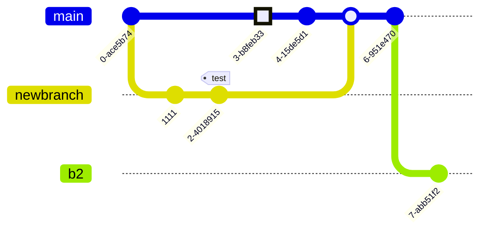

0. [Containers!](#containers)
1. CI/CD and [Github Actions](#what-it-is-cicd)
2. How to [Code on the go](#coding-on-the-go)
3. [More](#other-concepts): [Microservices](#what-are-microservices), [WebHooks](#what-are-web-hooks), [API Calls](#what-are-api-calls)...


  
  


## Containers

They allow us to **package applications** completely.

> To use what others created easily in your homelab or to package your projects for others to do the same.

> > They kind of relate to [virtualization](https://jalcocert.github.io/JAlcocerT/testing-nix-os/)

[Containers](https://jalcocert.github.io/JAlcocerT/why-i-love-containers/) make the deploy process on other computers/homelabs/[servers](https://jalcocert.github.io/JAlcocerT/where-to-deploy/) kind of *copy and paste*.

## What it is CI/CD?

We can say that CI/CD is a development paradigm...kind of.

And building containers whenever we ship a new feature in the code is a part of the [DevOPS philosophy](https://jalcocert.github.io/JAlcocerT/dev-ops-for-non-devops/).

The idea is that the final code for the app will be available for users packaged properly and w/o interruptions of the service.

**Testing GH Actions Workflows locally**

* Check the project: https://github.com/nektos/act

> Run your GitHub Actions locally 🚀

## Git Concepts

Make sure to follow [**git** best](https://jalcocert.github.io/JAlcocerT/git-recap/) practices:


  


Always, Specially if you are building with AI.


  
  


Git is what help us to maintain a clear **history of our code**:



**Github Authentication**

```sh
sudo apt update
sudo apt install gh #https://docs.github.com/en/get-started/getting-started-with-git/about-remote-repositories#cloning-with-https-urls
gh auth login #you can use HTTPs
#https://github.com/login/device and paste the Code the CLI will give you
```

---

## Other Concepts

<!--  -->


  
  



Test those `http request` nodes and their Get/Post/... has been https://webhook.site/


### What are Web-Hooks?

A webhook is like a doorbell.

When certain events happen in one system (like a new post on a blog or a new commit in a repository), it automatically sends a notification to another system.

> We have used those in few places, like here with n8n.

It's a way for apps to provide other applications with real-time information.



* How It Works: A webhook delivers data to other applications as it happens, meaning you get data immediately. 

You set up a webhook by providing a URL to the system you want to receive the notifications. 

When an event occurs, the system makes an HTTP request (usually POST) to the URL you provided.

* Use Case Example: A common use of webhooks is in Continuous Integration/Continuous Deployment (CI/CD) pipelines.

For example, GitHub can use a webhook to notify a CI server like Jenkins to start a new build whenever code is pushed to a repository.



### What are API calls?

An [API call](https://jalcocert.github.io/JAlcocerT/interesting-apis/) is like making a phone call to a specific service. 

You request the information or service you need, and the system responds back.

> It's a way for applications to interact and request data from each other.



* How It Works: An API call is a manual process; you have to make the request to get the data. It’s like asking, "Do you have any new data?" The request is usually made via HTTP (GET, POST, PUT, DELETE), and the server processes the request and sends back a response.

* Use Case Example: If you have an application that needs to get the latest weather data, it can make an API call to a weather service. The application sends a request, and the weather service responds with the latest weather information.






* Initiation:
  * Webhook: Automatically initiated by the source system when an event occurs.
  * API Call: Manually initiated by the requesting system.

* Purpose:
  * Webhook: Used for real-time notifications.
  * API Call: Used for requesting or sending data on demand.

* Direction:
  * Webhook: One-way from the source to the receiver.
  * API Call: Two-way communication between the requester and the server.



### What are Microservices?

**Microservices** are a way of structuring an application as a collection of small, independent, and loosely coupled services. 

Each service is built around a specific business capability, can be developed by a small team, and is deployed independently. 

They communicate with each other over well-defined APIs.

> This contrasts with a **monolithic architecture**, where all the application's functions are combined into a single, indivisible unit.