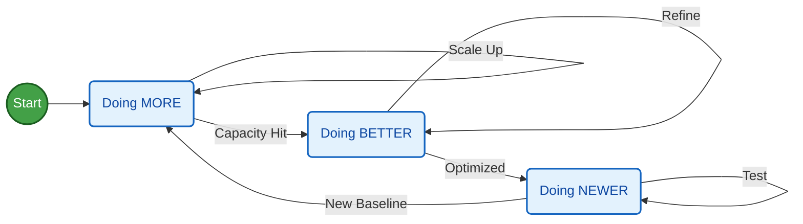
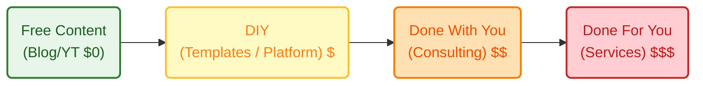
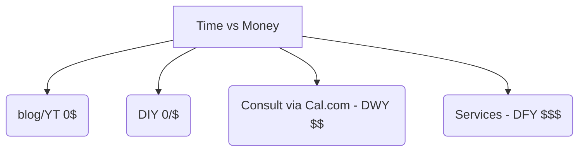
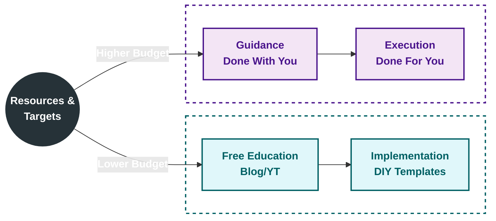

[Boostrapping](https://jalcocert.github.io/JAlcocerT/whats-boostrap/) is not straight forward.

It's a journey of *doing more, better, newer* - all of the time surounded with unknowns.



For anyone who has [cycled](https://jalcocert.github.io/JAlcocerT/buying-bicycle-through-data-analytics/) 100km+, you know that half of the way are the last 10km of [the journey](https://jalcocert.github.io/JAlcocerT/tech-for-a-trip/).

But these are some tools that make getting returns from [what you build](https://jalcocert.github.io/JAlcocerT/docs/entrepreneur/bip/) more likely:

1. [Automation](https://jalcocert.github.io/JAlcocerT/docs/entrepreneur/automation/):
2. [Bots](https://jalcocert.github.io/JAlcocerT/docs/entrepreneur/bots/):
3. [Marketing](https://jalcocert.github.io/JAlcocerT/docs/entrepreneur/marketing/):
4. [Product](#product) and [Offers](#offers)!  

## Product

You can also get help from [some product tools](https://jalcocert.github.io/JAlcocerT/product-tools/)


A SaaS be like:


### Formbricks

It's all about this fantastic Service: `https://app.formbricks.com/auth/login`






<!--  -->


  



Formbricks can be integrated into your websites, [same as cal](https://jalcocert.github.io/JAlcocerT/docs/entrepreneur/marketing/#calendar):



Formbricks wont validate the emails, but you can even [verify emails](https://jalcocert.github.io/JAlcocerT/docs/dev/authentication/#email-verification) before they flow into your sales pipelines.


  
  


Designing **proper forms** is key to get the right data from your leads.

{}

The good thing about designing your landing pages so that the full content is available in just one markdown/json file, is that is very easy to create forms or get feedback on them via agents.

```md

```

{}

See couple examples projects Ive built that are using formbricks


  
  


### PostHog

Posthog is [one of the product tools](https://jalcocert.github.io/JAlcocerT/product-tools/) you can use surveys.

Also to bring [session recording](https://jalcocert.github.io/JAlcocerT/how-to-record-web-sessions/) for your apps.

Thats a killer feature to bring to your PoCs, specially when you have a low marketing budget and are very interested to see how leads go through your funnel.


  
  


You can see how users behave and validate your assumptions on your value equation:

Also see how the offer and pricing make users flow through your full stack funnel: 

P*V*GM*OM*F*T=Net_Profit


## Offers

With a clear product defined, the package of that into an **compeling offer** is key.

Info is...free. 

Implementation is not: *justa matter of the value ladder, a trade-off between time/money invested*

And building a proper offer is not all [about Pricing](#pricing).



Your Agency [Pricing](#pricing) Model can be tricky.



Most people will NOT buy from you. 

But they will judge you by the quality of your free give aways.

Like FREE content, templates, audits...

Then...How to sell? 

*Aka, convince that you can solve problems*

You need to gain authority and show enough parts *of your Trikini: attraction, conversion, delivery*.

It's all about how valuable your clients perceive their time is compared to how good your offer is to solve their problems.

You can frame this in a trol yet simple CSR bar to help them decide: *how much is their time worth to them?*


<!--  -->


  


> Mind the increased Chances of people who never helped others for free calling you evil :)

Also, some people will get problems understanding that this is a self-valuation of THEIR time.

Not me putting a price to their time, neither me valueing their time.

Additionally, people will just buy (VOLUNTARELY) if they perceive that by buying I can provide much more value than that.

Anyways, people that dont pass that (simple - *do I have very high expectations?* ) bar will not buy anything from you.

Aka, they dont qualify to get to be one of your clients 🔴

The world keeps spinning as it was - everyone is happy.

> If you are a big trol or just want to make a small social experiment - you can add a Form free option to name the last time that xyz user have helped someone for free and the outcome of that so that they are considered for a 100% free consultation.

> > PS for those readers who feel entitled to sth - life owes you nothing, get over it

You can direct them to your DIY FREE tier in the meantime to get inspired:


  
  


Aaaand enough loosing time.

Important parts of every offer that you want to consider:

1. [Pricing](#pricing)
2. Value, Risk and Experience

{}

When creating a SaaS offer for users, the price is just one component.

The most important elements revolve around **Value, Risk, and Experience**.

🚀 The Value Proposition (What They Get)

This is the core of the offer. It's not the features; it's the **outcomes** the features deliver.

* **The Problem/Solution Fit (Core Value):**
    * What **specific, tangible problem** does your SaaS solve? The offer must clearly articulate the pain point (e.g., "lost time on manual reporting") and the immediate, powerful solution (e.g., "automate all weekly reports in 5 minutes").
    * *The Value is often measured in:* **Time Saved**, **Money Saved/Earned**, or **Risk Reduced**.
* **Feature Packaging:**
    * This is how the product is broken down across different tiers (Starter, Pro, Enterprise). It ensures the user feels they are only paying for what they need.
    * **The Value Metric:** The key item you charge for. It must align with the customer's success. Is it per **User** (for collaboration tools), per **Usage** (for APIs/data), or per **Feature Set** (for different functionality)?
* **Scalability & Integrations:**
    * The promise that the software will grow with the user's business. Users need to know it won't crash when they double their traffic or their team.
    * Clear documentation of **API access** and seamless **integrations** with the other tools they already use (CRM, payment processors, etc.).

🛡️ Risk Reversal (Why They Should Trust You)

In SaaS, switching costs are high, so reducing the perceived risk of starting is essential.

* **Free Trial / Freemium Model:**
    * **Free Trial:** A time-bound offer (e.g., 14 days) with access to a full or nearly-full feature set. The offer needs to clearly state what happens *after* the trial expires.
    * **Freemium:** A permanent free tier with restricted features. The offer is based on a clear "upgrade path" (the value is limited by user count, usage, or core features).
* **Guarantees & Money-Back Policy:**
    * Offering a **30-day money-back guarantee, no questions asked,** is a powerful risk reversal strategy, especially for annual commitments.
* **Security and Compliance:**
    * Transparency about how their data is secured (encryption, multi-factor authentication) and compliance with industry standards (GDPR, HIPAA, etc.). This builds trust, especially in B2B SaaS.
* **Cancellation Terms:**
    * Clarity on how easy it is to cancel the subscription and whether any unused portion of a prepaid term will be refunded.

🤝 Experience and Support (How They Will Be Treated)

A great product can fail with poor support. This often differentiates a good offer from a great one.

* **Onboarding & Time-to-Value (TTV):**
    * What resources are included to ensure a user is successful **immediately**?
    * This includes: **Live personalized onboarding sessions**, **detailed knowledge base/tutorials**, and **in-app guidance** (walkthroughs).
* **Customer Support Level:**
    * The **SLA (Service Level Agreement):** The promised response time (e.g., 1-hour response for critical issues).
    * **Access Channels:** Is it email, chat, phone support, or a dedicated Customer Success Manager (CSM)? This is a key differentiator across pricing tiers.
* **Social Proof and Testimonials:**
    * The offer gains credibility by including **case studies** demonstrating quantifiable results or **customer logos** from well-known brands.

In short, a powerful SaaS offer is about maximizing **Perceived Value** and minimizing **Perceived Risk** for the customer.

Would you like to explore which of these elements would be most effective for your specific target user (e.g., B2B vs. B2C, small business vs. enterprise)?

{}

Its very important to present the right offer to the right person (budget, authority etc in place)


The best elements of a SaaS offer change dramatically depending on the customer segment because their **buying motivation, budget, and risk tolerance** are completely different.

| Category | B2C (Consumer) | Small Business (SMB) | B2B (Enterprise) |
| :--- | :--- | :--- | :--- |
| **Primary Motivation** | **Convenience, Entertainment, Personal Productivity** (Emotional, Impulse) | **Cost-Efficiency, Immediate ROI, Time Saving** (Pragmatic, Budget-Conscious) | **Risk Reduction, Security, Scalability, Deep Integration** (Rational, Committee-Driven) |
| **Best Pricing Model** | **Freemium** or **Low-Cost Tiered** (e.g., Basic, Premium, Family). | **Per-User/Seat** (predictable cost) or **Feature-Based Tiered** (Good/Better/Best). | **Usage-Based Hybrid** (Base fee + Pay-as-you-go) or **Custom/Negotiated Contracts**. |
| **Key Value Metric** | **Feature Unlocks,** Ad Removal, **Storage Limit**. | **Number of Users,** Automation Limits, **Basic Reporting**. | **API Calls,** Data Volume, **Transaction Value,** Number of Teams/Departments. |
| **Risk Reversal** | **Quick, Frictionless Cancellation.** Money-Back Guarantee (short-term). | **No-Credit-Card Free Trial.** Annual Discount (incentive to commit). | **Service Level Agreements (SLAs)** guaranteeing uptime. **SOC 2/ISO Certification**. |
| **Support Model** | **Self-Serve:** Extensive Help Docs, Community Forums, Chatbots. | **Reactive:** Email/Chat Support with a guaranteed **Response Time**. | **Proactive:** Dedicated **Customer Success Manager (CSM)**, 24/7 Phone Support, shared Slack channels. |
| **Sales Motion** | **Product-Led Growth (PLG):** Self-sign-up and conversion. | **Hybrid:** Self-serve up to a price point, then a light touch from Sales. | **Sales-Led:** Demos, custom quotes, long negotiation cycle involving legal/procurement. |



1. B2C (Business-to-Consumer)

The B2C offer is designed for **speed and simplicity**. The purchase is often an individual decision, driven by an immediate need or emotional impulse.

* **Best Offer Element:** **A highly generous and easy-to-use Freemium tier.** The core function must be available for free to maximize sign-ups and demonstrate value, with the paid tier unlocking a significant feature or removing a major friction point (like ads or limits).
* **Key Focus:** **Zero friction** in sign-up, payment, and cancellation.

2. Small Business (SMB)

SMBs are looking for **maximum return on minimal investment**. They are extremely budget-conscious and need to see the value immediately.

* **Best Offer Element:** **A clear, "Good/Better/Best" tiered structure** with the pricing tied to user count. The **"Better" (middle) plan should be highlighted** as the ideal choice, packaging essential features like collaboration and integration.
* **Key Focus:** **Predictable pricing** and a guarantee of **time saved** or **revenue generated**.

3. B2B (Enterprise)

Enterprises buy to **solve mission-critical problems** at scale, where failure can cost millions. Their buying decision involves multiple stakeholders (IT, Finance, Legal, Users).

* **Best Offer Element:** **Robust Security/Compliance Guarantees and a Dedicated Support Model.** The contract is often more important than the price sheet. They need a **Service Level Agreement (SLA)** that guarantees uptime, data privacy, and a fast resolution to any issue.
* **Key Focus:** **Risk mitigation,** **customization** (SSO, granular permissions), and a **long-term relationship** (CSM).

That's absolutely correct. The previous breakdown was a segmentation of the **SaaS offer** based on **customer segmentation**.

You are essentially segmenting your *pricing, features, support, and sales motion* to align with the unique needs and budgets of different customer groups.

🤝 Customer Segmentation Terminology

The distinction you're referring to—B2C, SMB, and B2B/Enterprise—is primarily categorized by the **Target Customer Type** and the **Size/Scale** of the business.

Here's how those distinctions are typically referred to:

1. By Business Relationship: B2C vs. B2B

The foundational distinction is based on **who the end buyer is**:

* **B2C (Business-to-Consumer):** Your company sells directly to an **individual consumer** for personal use.
    * *Examples:* Netflix, Spotify, Grammarly (individual subscription), personal finance apps.
    * *Best Offer Focus:* **Individual experience, affordability, ease of use.**

* **B2B (Business-to-Business):** Your company sells to **another organization** for operational use.
    * *Examples:* Salesforce, Slack, AWS, enterprise HR software.
    * *Best Offer Focus:* **ROI, scale, security, and integration.**

2. By Business Size: SMB vs. Enterprise

Within the B2B category, the segmentation is often refined based on the size and complexity of the buying organization:

* **SMB (Small and Midsize Business):** This covers the smaller, more agile end of the business spectrum.
    * *Distinguishing Factor:* They usually have **fewer employees** (e.g., 1 to 500) and **smaller budgets**. Purchasing decisions are often made by one person or a small management team.
    * *Best Offer Focus:* **Self-service, low-touch sales, immediate value, transparent pricing.**

* **Enterprise:** This refers to very large, complex organizations.
    * *Distinguishing Factor:* They have **thousands of employees**, require advanced security and customization, and have **long, formal sales cycles** involving multiple departments (procurement, legal, IT).
    * *Best Offer Focus:* **Custom contracts, dedicated support (CSM), compliance, and robust integration into existing infrastructure.**

Specifically, when a SaaS company targets all three groups—B2C, SMB, and Enterprise—they are often described as having a **Multi-Segment Strategy** or targeting the **full market spectrum**, tailoring their **Go-to-Market (GTM) Strategy** for each.

Would you like to drill down into the **sales pipeline and motion** that works best for one of these specific segments (e.g., how the Enterprise sales process differs from SMB)?




Tip: not scalable yet and/or not enough resources? 

Forget about B2C and focus on getting the right SMBs.

A customer's **segment** (e.g., B2B Enterprise, SMB, B2C Millennial) is indeed a crucial, high-level **feature** of their avatar or persona, as it frames the entire profile.

When you define a customer avatar (also known as a buyer persona), you're essentially creating a single, fictional representation of your ideal customer, with features broken down into three main categories: **Demographics, Psychographics, and Behavioral/Contextual**.



👤 Features of a Complete Customer Avatar

1. Demographics (The "Who")

These are the statistical and verifiable facts about the person or business (for B2B).

| B2C Avatar Features | B2B Avatar Features |
| :--- | :--- |
| **Age** (e.g., 25-35, Gen Z) | **Job Title** (e.g., Head of Marketing, IT Director) |
| **Gender** (e.g., Male, Female, Non-Binary) | **Industry** (e.g., FinTech, SaaS, Healthcare) |
| **Location** (e.g., Urban, Suburban; specific country/region) | **Company Size** (e.g., 50-200 employees, Fortune 500) |
| **Income/Education Level** | **Annual Revenue/Budget** (e.g., Marketing budget of $500k) |
| **Family Status** (e.g., Single, Married with children) | **Role in Decision** (e.g., Recommender, Decision Maker, Approver) |

2. Psychographics (The "Why")

This is the psychological data that drives the customer's decisions, beliefs, and values. This is often the most important category for marketing messaging.

* **Goals & Aspirations:** What does the avatar want to achieve professionally or personally? (e.g., Get a promotion, save 10 hours a week, feel healthier, be seen as an innovator).
* **Values & Beliefs:** What core principles guide their choices? (e.g., Prioritizes quality over price, values environmental sustainability, seeks efficiency, distrusts large corporations).
* **Challenges & Pain Points:** What problems, frustrations, or obstacles are they currently facing that your product can solve? (e.g., Reporting takes too long, current software is too complex, they feel overwhelmed, lack of reliable data).
* **Fears & Objections:** What prevents them from buying or what is their worst-case scenario? (e.g., Fear of wasting budget, fear of implementing a tool that users won't adopt, fear of looking foolish to their boss).

3. Behavioral & Contextual (The "How and Where")

This defines how the avatar interacts with the world and how they will interact with your product and content.

* **Information Sources:** Where do they go for information and advice? (e.g., Industry podcasts, LinkedIn, specific trade blogs, Reddit forums, peer recommendations, analyst reports).
* **Content Preferences:** What format do they prefer? (e.g., Quick video tutorials, long-form detailed guides/white papers, interactive webinars).
* **Buying Behavior:** How do they prefer to purchase? (e.g., Self-service online, require a consultation/demo, buy only on a referral).
* **Technology Fluency:** How comfortable are they with new technology? (e.g., Early adopter, resistant to change, only uses mobile apps).
* **"Before" State vs. "After" State:** A narrative description of their situation before using your product (the pain) and their desired outcome after using it (the solution/transformation).

By fleshing out these three feature categories, you turn a broad segment into a believable, human-like profile that every team (Product, Marketing, Sales) can use to make decisions.



### Pricing

Believe it 100% or not - Controversion alert:

Stating that **value is subjective** is not a bad [starting point for a Pricing strategy](https://jalcocert.github.io/JAlcocerT/real-estate-website/#pricing-strategy).

Get clarity on this (*your mission!*): Who are you helping (vs) who are you serving?

