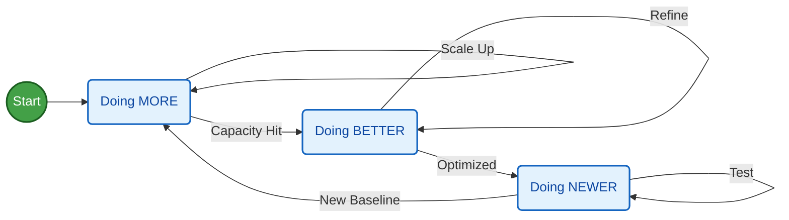
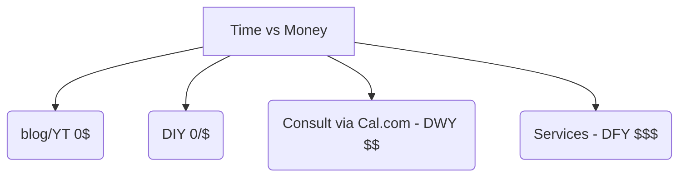
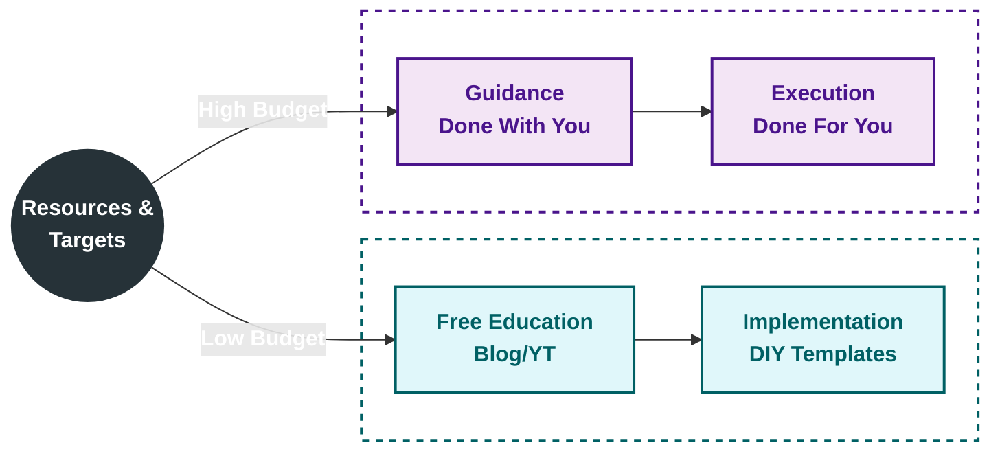

[Boostrapping](https://jalcocert.github.io/JAlcocerT/whats-boostrap/) is not straight forward.

It's a journey of *doing more, better, newer* - all of the time surounded with unknowns.

For anyone who has [cycled](https://jalcocert.github.io/JAlcocerT/buying-bicycle-through-data-analytics/) 100km+, you know that half of the way are the last 10km of [the journey](https://jalcocert.github.io/JAlcocerT/tech-for-a-trip/).

But these are some tools that make getting returns from [what you build](https://jalcocert.github.io/JAlcocerT/docs/entrepreneur/bip/) more likely:

1. [Automation](https://jalcocert.github.io/JAlcocerT/docs/entrepreneur/automation/):
2. [Bots](https://jalcocert.github.io/JAlcocerT/docs/entrepreneur/bots/):
3. [Marketing](https://jalcocert.github.io/JAlcocerT/docs/entrepreneur/marketing/):
4. [Product](#product) and [Offers](#offers)!  

## Product

You can also get help from [some product tools](https://jalcocert.github.io/JAlcocerT/product-tools/)

### Formbricks

<!--  -->


  


Formbricks can be integrated into your websites, [same as cal](https://jalcocert.github.io/JAlcocerT/docs/entrepreneur/marketing/#calendar):



Formbricks wont validate the emails, but you can even [verify emails](https://jalcocert.github.io/JAlcocerT/docs/dev/authentication/#email-verification) before they flow into your sales pipelines.


  
  


### PostHog

Posthog is [one of the product tools](https://jalcocert.github.io/JAlcocerT/product-tools/) you can use surveys.

Also to bring [session recording](https://jalcocert.github.io/JAlcocerT/how-to-record-web-sessions/) for your apps.

## Offers

With a clear product defined, the package of that into an **compeling offer** is key.

Info is...free. 

Implementation is not: *justa matter of the value ladder, a trade-off between time/money invested*

Your Agency [Pricing](#pricing) Model can be tricky.

Most people wont buy from you. 

But they will judge you by the quality of your free give aways.

How to sell? *Aka, convince that you can solve problems*

It's all about how valuable your clients perceive their time is compared to how good your offer is to solve their problems.

You can frame this in a trol yet simple CSR bar to help them decide:

https://jalcocert.github.io/JAlcocerT/selling-with-a-landing-website/#vibe-coding-an-astro-ssr-landing-page

png

> Mind the increased Chances of people who never helped others for free calling you evil :)

### Pricing

https://jalcocert.github.io/JAlcocerT/real-estate-website/#pricing-strategy

Get clarity on this (*your mission!*): Who are you helping (vs) who are you serving?

