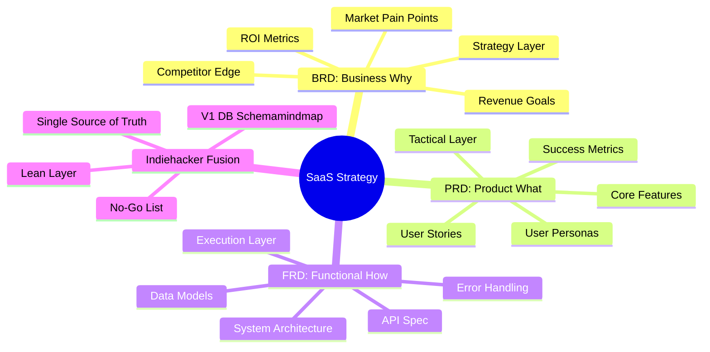
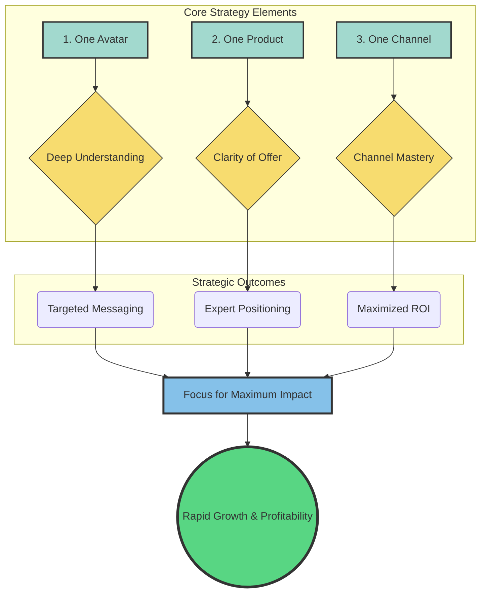

For the ones who like to **B**uild **i**n **P**ublic.

Think about BiP as a way to get *,free ($)'* impressions on what your product does.

But before building, you need to articulate your ideas.

Got a clear WHY, WHAT and how?

| Document | **Core Question** | Focus | Responsibility |
| :--- | :--- | :--- | :--- |
| **BRD** (Business) | **WHY** are we doing this? | Business goals, ROI, market opportunity, and problem statements. | Entrepreneur / CEO / Stakeholders |
| **PRD** (Product) | **WHAT** are we building? | Features, user experience, personas, and success metrics. | Product Manager / Founder |
| **FRD** (Functional) | **HOW** will it work technically? | System behavior, logic, API calls, and technical specifications. | Tech Lead / Developers |

Dont worry, [this will become a curated BiP ebook](https://github.com/JAlcocerT/JAlcocerT/blob/main/Z_ebooks/bip-ebook.md) at some point.

<!-- 
there will be an ebook out of this - https://github.com/JAlcocerT/JAlcocerT/blob/main/Z_ebooks/bip-ebook.md -->

<!-- hat [BRD PRD FRD](https://jalcocert.github.io/JAlcocerT/brd-vs-frd-for-data-analytics/) are the WHY / what / how of a product you are building. -->

Making a living from software as an indiehacker is something more than just coding.

You need to wrap the product within a successful a good business model:
 

Are you also clearn on The "One Avatar, One Product, One Channel" strategy: *Do you know who are you building it for?*

| Element | Description | Core Logic/Benefit |
| :--- | :--- | :--- |
| **One Avatar** | A single, detailed profile of your ideal customer. | Achieves **Deep Understanding** for highly effective, targeted messaging. |
| **One Product** | A single, core solution or offer you sell. | Ensures **Clarity of Offer** and positions you as the undisputed expert. |
| **One Channel** | The single distribution platform (e.g., Facebook Ads, TikTok, Email) where you focus your marketing efforts. | Allows for **Mastery** of one platform, maximizing ROI and resource efficiency. |

This is you **focus strategy**:

**Start building then!**

## AI

If you are one of those entrepreneurs who has managed to learn how to code.

Chances are that you are using AI [models](https://jalcocert.github.io/JAlcocerT/docs/entrepreneur/bots/#hosted-models)/vibe coding techniques to build your next product.

And you might have troubles getting the agents to understand what you want.

The good news is: that it doesnt have to be that hard, *if you get [a good start](#initial-prompts-for-success)*

### Initial Prompts for Success

If you are by yourself, I recommend you to brainstorm with your LLMs about your ideas.

The outcome should be a clear goals (like a [BRD](https://jalcocert.github.io/JAlcocerT/brd-vs-frd-for-data-analytics/)) and execution plan for the agents to code for you.

If you plug [human psyc to your tech stech](https://jalcocert.github.io/JAlcocerT/how-is-for-agents-what-and-why-for-you/) from the beginning, you are increasing your chances to succeed.

<!-- 
 -->

Dont forget to add into every SaaS the `Terms and Conditions` and `Privacy Policy`: *you can do so markdown based and keep track of changes per date*


  


### Shipping Like a Pro

Got the code ready?

Now you need to ship it.

That's why you need a server *aka VPS* or a homelab *aka some wood PC*.


  
  


Configure that server, see the DIY ways to get Https, then need to *deploy* your app.

For that, [containers](https://jalcocert.github.io/JAlcocerT/dev-ops-for-non-devops/#containers) are your friends.

## BiP Examples

With all that clear, how about some examples?

Even [a simple waiting list](https://github.com/JAlcocerT/simple-waiting-list) counts:  
<!-- 
 -->


  
  



  
  


Bringing leads towards your product / sales pipeline is one of the crucial steps to succeed as an entrepreneur.

Even the agentic IDE that you use to code your business, is probably using Stripe to bill you.

This is all about the right answer to the right questions.

And the best way to know if someone values what you do, is if they are willing to pay for it (and how much)

<!--  -->


  
  


## SaaS KPIs

CAC, LTV, and Churn are the fundamental pillars of SaaS financial health

But they are all **lagging indicators** (they tell you what already happened).

When defining a customer avatar, you need **leading indicators** (metrics that predict future success) that align with their journey and behavior.

The essential KPIs for a SaaS business can be organized into three buckets: **Financial, Acquisition, and Retention/Engagement**.

### I. Financial (The Core Health Metrics)

These are the metrics that measure revenue and profitability. You mentioned the big three, but here's what else matters:

| KPI | What It Measures | Why It Matters for the Avatar |
| :--- | :--- | :--- |
| **Monthly Recurring Revenue (MRR)** | Total predictable recurring revenue generated in a given month. | Your avatar's *willingness to pay* and your business's ability to create a consistent revenue stream. |
| **Annual Recurring Revenue (ARR)** | MRR multiplied by 12 (used primarily for companies with annual contracts or large B2B deals). | Essential for long-term planning and investment/valuation discussions. |
| **Net Revenue Retention (NRR)** | Revenue retained from existing customers, including expansion, minus churn and contraction. | **The Gold Standard.** NRR > 100% means you are growing *even if you acquire no new customers*. A low NRR indicates your avatar is not finding sustained value. |
| **LTV:CAC Ratio** | Compares the total value of a customer to the cost of acquiring them. | This is the final check on your **acquisition efficiency**. A healthy ratio is typically **3:1 or higher**. |

<!-- | **Average Revenue Per Account (ARPA) / User (ARPU)** | The average amount of revenue you get from a single paying customer or account. | Helps you track if your **avatar segmentation** is working. Is your Enterprise ARPA higher than your SMB ARPA, as intended? | -->

### II. Acquisition & Conversion (The Avatar's Journey)

These metrics map directly to the avatar's journey from prospect to paying customer.

| KPI | What It Measures | Why It Matters for the Avatar |
| :--- | :--- | :--- |
| **Lead Velocity Rate (LVR)** | The month-over-month growth rate of qualified leads entering your pipeline. | A **leading indicator** of future revenue. It shows whether your marketing is attracting enough of the *right* avatars. |
| **Conversion Rate (CR)** | The percentage of users moving from one stage to the next (e.g., Visitor to Sign-up, or Trial to Paid Customer). | Directly tests the effectiveness of your **offer structure** and your **onboarding experience**. A low Trial-to-Paid CR means the avatar isn't seeing the value fast enough. |
| **Time to Recover CAC (Payback Period)** | The number of months it takes to earn back the cost of acquiring a customer. | Measures **cash flow efficiency**. Investors love a short payback period (ideally under 12 months for Enterprise, under 6 for SMB/B2C). |
| **Sales Cycle Length** | The average time it takes to close a deal (from lead to contract). | Essential for **B2B/Enterprise avatars**. A long sales cycle (e.g., 6-12 months) requires different cash flow planning than a self-service SMB model (e.g., minutes/days). |

### III. Retention & Engagement (The Avatar's Happiness)

These are crucial product and customer success metrics that tie directly to the avatar's **Pain Points** and **Goals**.

| KPI | What It Measures | Why It Matters for the Avatar |
| :--- | :--- | :--- |
| **Daily/Monthly Active Users (DAU/MAU)** | The number of unique users who actively engage with the product in a day or month. | Measures **product stickiness**. If your avatar doesn't use the product frequently, they will eventually churn. |
| **Feature Adoption Rate** | The percentage of users who use a *core feature* necessary for success. | Measures if the avatar is achieving their **Time-to-Value (TTV)**. If they pay for a feature but don't use it, you have a problem. |
| **Net Promoter Score (NPS)** | Customer loyalty and willingness to recommend (based on a 0-10 score). | Measures the emotional satisfaction and likelihood of the avatar generating **word-of-mouth referrals** (low-cost CAC). |
| **Customer Health Score (CHS)** | A composite score (e.g., 1-100) combining usage, support tickets, and satisfaction data. | **The ultimate predictive indicator of churn.** It flags at-risk avatars *before* they cancel, allowing your success team to intervene. |
| **Time to Value (TTV)** | How quickly a new customer realizes the promised benefit or achieves their first "win" with the product. | A shorter TTV is critical for all segments and is directly impacted by a smooth onboarding process. |

Focusing on these metrics alongside your avatar definition ensures you are not just defining *who* your customer is, but measuring *how successfully* your product and business model serve them.

You have hit on the most critical challenge in SaaS finance: the difference between **long-term profitability (LTV:CAC)** and **short-term cash flow (capital efficiency)**.

A 3:1 LTV:CAC ratio means your business model is *theoretically* sound, but if it takes too long to collect that revenue, you will still run out of money.

### Cash Flow vs High CAC Payback Period

The primary issue that could be hiding behind a healthy LTV:CAC is the **CAC Payback Period**, also known as **Months to Recover CAC**.

1. The Issue Explained

The formula for LTV is based on the *gross profit* generated over the *entire estimated customer lifetime*. If that lifetime is 5 years, the 3:1 ratio looks great, but you need to wait 5 years to realize that $3.

**The Cash Flow Problem:**
* You spend **$1,000** today to acquire a customer (CAC).
* That customer pays **$100/month** (MRR) and has a **gross margin of 80%** (so $80/month in profit).
* **CAC Payback Period:** $\$1000 / \$80 = 12.5$ months.

You have to fund that $1,000 for **12.5 months** before the customer pays it back. If you are a high-growth startup acquiring 100 new customers per month, you are spending **$100,000 per month** in the red, just to acquire customers whose payback is over a year away. This rapidly depletes your cash reserves, forcing you to constantly seek external funding, even if your LTV:CAC is 10:1!

2. Other Underlying Cash Flow Issues

While the Payback Period is the main culprit, other issues can compound the problem:

* **Low Gross Margins:** If your cost of goods sold (COGS)—like hosting, support, and integration costs—is very high, your gross profit per customer is low. This means your payback period lengthens dramatically.
* **High Burn Rate:** If your fixed operating expenses (salaries, rent, software tools) are growing faster than your MRR, your **Net Burn** (expenses - revenue) will remain high. The LTV:CAC only focuses on acquisition efficiency, not overall operational efficiency.
* **Churning Before Payback:** If your average customer leaves after 9 months, but your payback period is 12 months, you are losing money on every customer, regardless of what your *projected* LTV suggests.

### 🧭 Leading Indicators for Cash Flow & Viability

Leading indicators are what you track today to predict the financial and operational outcomes 6-12 months from now. 

They are crucial for cash flow because they help you adjust your spending *before* you run out of money.

Here are the most important leading indicators in SaaS:

| Leading Indicator | What It Predicts | How It Impacts Cash Flow |
| :--- | :--- | :--- |
| **CAC Payback Period** | Future cash flow and capital efficiency. | **Shorter is better.** The faster you recoup CAC (ideally $\le 12$ months), the faster you can redeploy that capital to acquire the next customer. |
| **Lead Velocity Rate (LVR)** | Future revenue (MRR/ARR growth). | **Growth is a cash drain.** A high LVR signals you need to budget more for Sales/Marketing next quarter to convert those leads, impacting the Burn Rate. |
| **Time to Value (TTV)** | Future retention and expansion MRR. | **Shorter is better.** The faster a customer uses the core features and sees ROI, the lower the risk of early churn (which ruins your payback). |
| **Net Revenue Retention (NRR)** | Future LTV and business health. | **NRR > 100% is the goal.** This shows your existing customers are growing faster than your revenue lost to churn. This revenue costs nothing to acquire, directly improving your cash position. |
| **Activation Rate** | Future churn rate. | The percentage of users who complete key setup steps. A low rate predicts **high churn** and wasted CAC. Improving this is a direct way to shorten the Payback Period. |
| **Bookings Growth** | Future ARR/MRR. | The total dollar value of new contracts signed (even if the cash hasn't been recognized as revenue yet). This is a strong, immediate signal of sales team performance and future cash stability. |

To manage cash flow, you must obsess over keeping your **CAC Payback Period** short - *gurus tend to say < 1 month*

And driving your **NRR** above 100%.