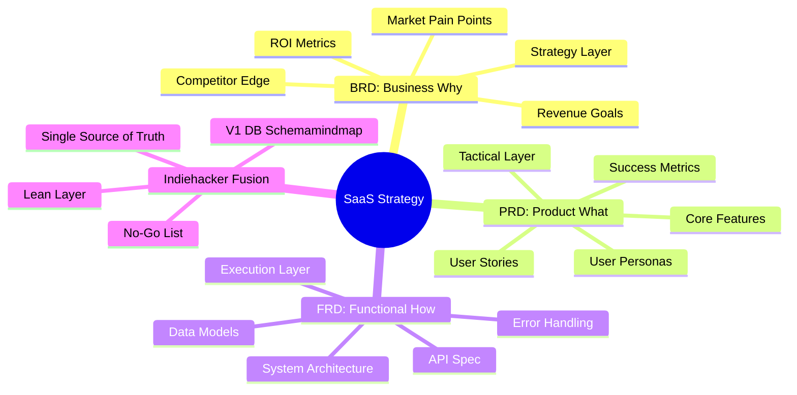

For the ones who like to **B**uild **i**n **P**ublic.

Got a clear WHY, WHAT and how?

| Document | **Core Question** | Focus | Responsibility |
| :--- | :--- | :--- | :--- |
| **BRD** (Business) | **WHY** are we doing this? | Business goals, ROI, market opportunity, and problem statements. | Entrepreneur / CEO / Stakeholders |
| **PRD** (Product) | **WHAT** are we building? | Features, user experience, personas, and success metrics. | Product Manager / Founder |
| **FRD** (Functional) | **HOW** will it work technically? | System behavior, logic, API calls, and technical specifications. | Tech Lead / Developers |

[This will become a curated ebook](https://github.com/JAlcocerT/JAlcocerT/blob/main/Z_ebooks/bip-ebook.md) at some point.

Start building then!

<!-- 
there will be an ebook out of this - https://github.com/JAlcocerT/JAlcocerT/blob/main/Z_ebooks/bip-ebook.md -->

<!-- hat [BRD PRD FRD](https://jalcocert.github.io/JAlcocerT/brd-vs-frd-for-data-analytics/) are the WHY / what / how of a product you are building. -->




## AI

If you are one of those entrepreneurs who has managed to learn how to code.





* Groq - https://console.groq.com/keys
* OpenAI - https://platform.openai.com/account/api-keys
* Anthropic - https://console.anthropic.com/api-keys


```sh
source .env
#export OPENAI_API_KEY=sk-proj-...
#
```



Chances are that you are using AI/vibe coding techniques to build your next product.


<!-- 
* https://github.com/JAlcocerT/openai-chatbot
* https://platform.openai.com/api-keys
* https://platform.openai.com/docs/models
    * https://platform.openai.com/chat/edit?models=o1
* Groq - 
    * https://console.groq.com/keys
* Gemini (Google)
  * https://ai.google.dev/gemini-api/docs
* Mixtral - **Open Models**, you can use their API
    * https://docs.mistral.ai/api/
* Anthropic (Claude) - https://www.anthropic.com/api
  * https://console.anthropic.com
  * https://console.anthropic.com/settings/keys
* Open AI - GPT APIs https://platform.openai.com/api-keys
* Grok (Twitter)
* Azure

* https://platform.openai.com/docs/models/
* https://platform.openai.com/docs/models/gpt-4o -->

### Initial Prompts for Success

If you are by yourself, I recommend you to brainstorm with your LLMs about your ideas.

The outcome should be a clear goals (like a [BRD](https://jalcocert.github.io/JAlcocerT/brd-vs-frd-for-data-analytics/)) and execution plan for the agents to code for you.



Go to whatever LLM you are using and ask: `do you think that these requirements are clear enough?`

```md
Create a sth sth sth like... a Landing Page based on NextJS with a cool and modern UI

Include a `dockerfile` and `docker-compose.yml` that will control the title, description, open-graph image, favicon location and other global website variables via environment variables.

Create also a makefile with the following commands:

* `make help` - Show available commands
* `make install` - Prepare the dependencies for local development
* `make dev` - Run development server
* `make container` - Build and Run in Docker container

Create the `z-development-plan.md` with independent and testable phases that can be completed sequentially.

When it is completed, create a `z-walkthrough.md` with the steps to deploy the application and what each part of the tech stack does on a high level to bring the features to life.

Consider adding a **terms and conditions and privacy policy** to the website, which will be governed by two separated markdown files.

Consider adding **Umami web analytics capabilities** to the WebApp when using the container, by adding the possibility to feed the PUBLIC_UMAMI_SCRIPT_URL and PUBLIC_UMAMI_WEBSITE_ID to be used via <script defer src="" data-website-id=""></script>
```

Then go to [AntiGravity IDE](#antigravity-ide) and ask if the `brd.md` refined already with Gemini is clear enough.

If it is clear define the `z-development-plan.md` and proceed with the development phases.

As you will need to iterate across features, do it like a pro with change-requests:

```md

```

```sh
# git init
# git branch -m main
# git config user.name
# git config --global user.name "JAlcocerT"
# git config --global user.name
# git add .
# git commit -m "Initial commit: Starting simple make xyz platform"
```

```sh
#sudo apt install gh
gh auth login
#gh repo create make-xyz --private --source=. --remote=origin --push
    
git init && git add . && git commit -m "Initial commit: simple landing website" && gh repo create make-xyz --private --source=. --remote=origin --push
###du -sh .
#docker stop $(docker ps -a -q) #stop all
#docker system df
```

**Technical Stack and Design Requirements**

To develop a **modern, secure, and scalable web platform** for hosting and streaming a single-user podcast.

The platform must offer a seamless, content-driven user interface and a flexible content management system supporting both web uploads and direct file system access.



Before starting any project, you should have clarity on:

| Requirement | Specification | Clarification / Decision |
| :--- | :--- | :--- |
| **Frontend Framework** | | |
| **Styling/UI Library** | | |
| **[Backend](https://jalcocert.github.io/JAlcocerT/docs/dev/fe-vs-be/)/Database** | | |
| **[Authentication](https://jalcocert.github.io/JAlcocerT/docs/dev/authentication/)** | | |


<!-- 
 -->


  


## BiP Examples

With all that clear, how about some examples?

Even [a simple waiting list](https://github.com/JAlcocerT/simple-waiting-list) counts:  



  


Bringing leads towards your sales pipeline is one of the crucial steps to succeed as an entrepreneur:


  
  


Even your agentic IDE that you use to code your business, are using Stripe to bill you.

This is all about the right answer to the right questions.

And the best way to know if someone values what you do, is if they are willing to pay for it (and how much)

<!--  -->


  
  



## SaaS KPIs