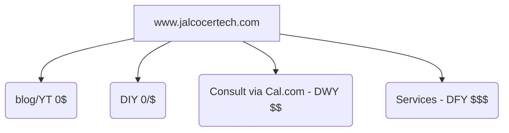

https://docs.dittofeed.com/introduction

https://github.com/dittofeed/dittofeed

> MIT |  Open-source customer engagement. Automate transactional and marketing messages across email, SMS, mobile push, WhatsApp, Slack, and more 📨 

Messaging Automation for All - Omni-channel marketing automation & transactional messaging. Embeddable, self-hostable, & infinitely flexible.

https://docs.dittofeed.com/deployment/self-hosted/docker-compose

Dittofeed: Free Open Source Automated Communication Platform


<!-- https://www.youtube.com/watch?v=ycs53MFoW4E -->



## Newsletters

#### MailerLite

https://jalcocert.github.io/JAlcocerT/mailerlite-for-saas/#mailerlite-api

#### RSS

Some websites bring a **RSS feed**, so that you can subscribe with tools like FreshRSS:


  



```sh
# Test RSS feed locally
curl -s http://localhost:4321/rss.xml | head -10
# Count episodes
curl -s http://localhost:4321/rss.xml | grep -c "<item>"
# Get episode titles
curl -s http://localhost:4321/rss.xml | grep -o "<title>.*</title>"

# Check headers
curl -I http://localhost:4321/rss.xml
# Test on production (once deployed)
curl -s https://podcast.jalcocertech.com/rss.xml | head -10
```

<!-- https://www.youtube.com/watch?v=mDMGtMOx-Fk -->



Youtube is one of the sites providing RSS feeds for the channels:

So we can pull the last video of a channel like: *just take the ChannelID*


  


<!-- 
https://studio.youtube.com/channel/UCPPMA8ZEusAe5dVH6PbjZFA/videos/ -->

```sh
curl -s "https://www.youtube.com/feeds/videos.xml?channel_id=UCPPMA8ZEusAe5dVH6PbjZFA"
#curl -s "https://www.youtube.com/feeds/videos.xml?channel_id=UCPPMA8ZEusAe5dVH6PbjZFA" | grep -oP '(?<=<title>).*?(?=</title>)' | head -5
```

### Emails

### Calendar

Among [all the things that can be embedded](https://jalcocert.github.io/JAlcocerT/embed-that/) into a website, we have not only bots, but also cool calendars.


  



